# Architektur-Dokument: WLAN-Optimizer

> **Phase 5 Deliverable** | **Version:** 1.0 | **Datum:** 2026-02-27 | **Status:** Abgeschlossen
>
> Dieses Dokument ist die verbindliche Architektur-Referenz fuer Phase 8 (Autonome Entwicklung).
> Alle Entscheidungen basieren auf den 19 bestaetigten Entscheidungen aus `docs/architecture/Entscheidungen.md`
> und den Recherche-Ergebnissen aus Phase 3.

---

## Inhaltsverzeichnis

1. [Systemuebersicht](#1-systemuebersicht)
2. [Frontend-Architektur (Svelte 5 + Konva.js)](#2-frontend-architektur-svelte-5--konvajs)
3. [Backend-Architektur (Tauri 2 + Rust)](#3-backend-architektur-tauri-2--rust)
4. [Verzeichnisstruktur](#4-verzeichnisstruktur)
5. [Datenfluss-Diagramme](#5-datenfluss-diagramme)
6. [IPC-API Design](#6-ipc-api-design)
7. [Fehlerbehandlung & Sicherheit](#7-fehlerbehandlung--sicherheit)
8. [Erweiterbarkeit](#8-erweiterbarkeit)

---

## 1. Systemuebersicht

### 1.1 Kontextdiagramm (C4 Level 1)

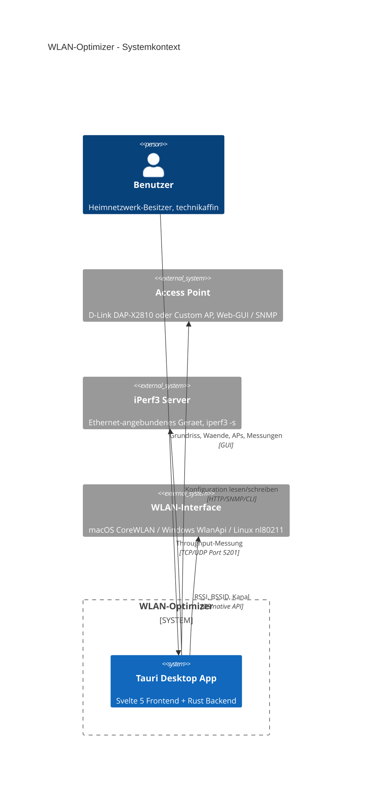

### 1.2 Container-Diagramm (C4 Level 2)

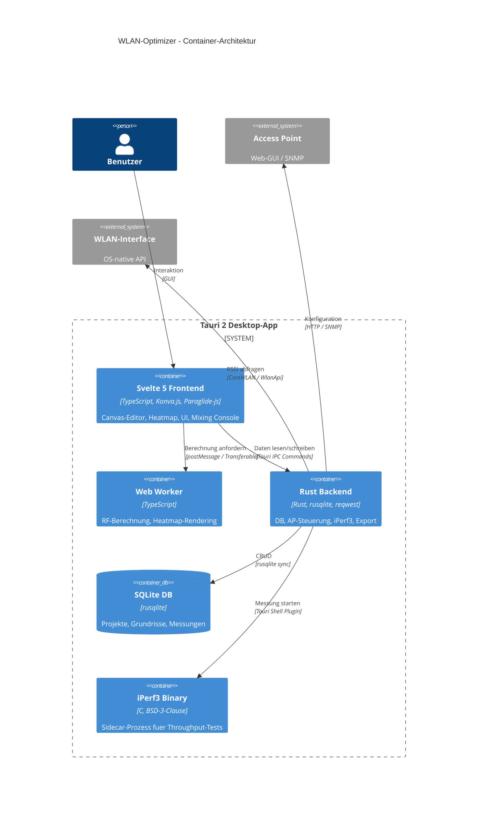

### 1.3 Designprinzipien

| Prinzip | Beschreibung |
|---------|-------------|
| **Lokal-First** | Alle Daten bleiben auf dem Geraet. Keine Cloud, keine Telemetrie. |
| **Konservativ-Prinzip** | RF-Modell nutzt immer den pessimistischeren Wert. Lieber zu pessimistisch als zu optimistisch. |
| **Plattform-Abstraktion** | Traits/Interfaces fuer alles Plattformspezifische (RSSI, AP-Steuerung). |
| **Frontend-First Berechnung** | Heatmap-Berechnung im Web Worker (kein IPC-Overhead). |
| **Progressive Enhancement** | MVP = Forecast + Assist-Mode. Auto-Mode kommt spaeter. |
| **Erweiterbarkeit** | Plugin-artige Adapter fuer neue AP-Hersteller. |
| **Zweisprachigkeit** | Code in Englisch, Dokumentation in Deutsch, UI in EN + DE. |

---

## 2. Frontend-Architektur (Svelte 5 + Konva.js)

### 2.1 Komponentenhierarchie

```mermaid
graph TD
    App["App.svelte"]
    Layout["Layout.svelte"]
    Sidebar["Sidebar.svelte"]
    Toolbar["Toolbar.svelte"]
    StatusBar["StatusBar.svelte"]

    ProjectSetup["ProjectSetupView.svelte"]
    FloorPlanEditor["FloorPlanEditorView.svelte"]
    MeasurementWizard["MeasurementWizardView.svelte"]
    MixingConsole["MixingConsoleView.svelte"]
    ResultsDashboard["ResultsDashboardView.svelte"]
    Settings["SettingsView.svelte"]

    CanvasEditor["CanvasEditor.svelte"]
    WallTool["WallDrawingTool.svelte"]
    APMarker["AccessPointMarker.svelte"]
    HeatmapOverlay["HeatmapOverlay.svelte"]
    ScaleIndicator["ScaleIndicator.svelte"]
    MeasurementPoints["MeasurementPoints.svelte"]
    BackgroundImage["BackgroundImage.svelte"]
    GridOverlay["GridOverlay.svelte"]

    MaterialPicker["MaterialPicker.svelte"]
    APLibrary["APLibraryPanel.svelte"]
    HeatmapControls["HeatmapControls.svelte"]
    MixingSliders["MixingSliders.svelte"]
    RunOverview["RunOverview.svelte"]
    ComparisonChart["ComparisonChart.svelte"]
    ServerSetup["ServerSetupWizard.svelte"]

    App --> Layout
    Layout --> Sidebar
    Layout --> Toolbar
    Layout --> StatusBar

    Layout --> ProjectSetup
    Layout --> FloorPlanEditor
    Layout --> MeasurementWizard
    Layout --> MixingConsole
    Layout --> ResultsDashboard
    Layout --> Settings

    FloorPlanEditor --> CanvasEditor
    FloorPlanEditor --> MaterialPicker
    FloorPlanEditor --> APLibrary
    FloorPlanEditor --> HeatmapControls

    CanvasEditor --> BackgroundImage
    CanvasEditor --> GridOverlay
    CanvasEditor --> WallTool
    CanvasEditor --> APMarker
    CanvasEditor --> HeatmapOverlay
    CanvasEditor --> ScaleIndicator
    CanvasEditor --> MeasurementPoints

    MeasurementWizard --> CanvasEditor
    MeasurementWizard --> RunOverview
    MeasurementWizard --> ServerSetup

    MixingConsole --> CanvasEditor
    MixingConsole --> MixingSliders

    ResultsDashboard --> ComparisonChart
```

### 2.2 Hauptansichten (Views)

| View | Beschreibung | Hauptkomponenten |
|------|-------------|------------------|
| **ProjectSetupView** | Projekt erstellen/laden, Grundriss importieren, Massstab setzen | Projektliste, Import-Dialog, Referenzlinie |
| **FloorPlanEditorView** | Waende zeichnen, APs platzieren, Heatmap anzeigen | CanvasEditor, MaterialPicker, APLibrary |
| **MeasurementWizardView** | Gefuehrte Messlaeufe (Run 1, 2, 3) | Messpunkt-Canvas, iPerf-Setup, Fortschritt |
| **MixingConsoleView** | TX-Power, Kanal, Kanalbreite per Slider | Slider-Panel, Forecast-Heatmap, Aenderungsliste |
| **ResultsDashboardView** | Vorher/Nachher-Vergleich, Export | Vergleichs-Heatmaps, Charts, PDF-Export |
| **SettingsView** | Sprache, Materialeditor, AP-Modelle, iPerf-Server | Formulare, Tabellen |

### 2.3 State Management mit Svelte 5 Runes

Die Applikation nutzt Svelte 5 Runes als zentrales Reaktivitaetssystem. Kein externer State Manager noetig.

**Globale Stores** (`src/lib/stores/`):

```typescript
// projectStore.svelte.ts - Zentraler Projekt-State
class ProjectStore {
  // Reaktive Felder
  currentProject = $state<Project | null>(null);
  floors = $state<Floor[]>([]);
  activeFloorId = $state<string | null>(null);
  isDirty = $state(false);

  // Abgeleitete Werte
  activeFloor = $derived(
    this.floors.find(f => f.id === this.activeFloorId) ?? null
  );

  // Methoden
  async loadProject(id: string): Promise<void> {
    const project = await invoke('get_project', { id });
    this.currentProject = project;
    this.floors = await invoke('get_floors', { projectId: id });
    this.activeFloorId = this.floors[0]?.id ?? null;
    this.isDirty = false;
  }

  markDirty(): void {
    this.isDirty = true;
  }
}

export const projectStore = new ProjectStore();
```

```typescript
// canvasStore.svelte.ts - Canvas-Zustand
class CanvasStore {
  walls = $state<Wall[]>([]);
  accessPoints = $state<AccessPoint[]>([]);
  measurementPoints = $state<MeasurementPoint[]>([]);

  // Zeichenwerkzeug
  activeTool = $state<'select' | 'wall' | 'ap' | 'measure' | 'eraser'>('select');
  selectedMaterial = $state<WallMaterial>('brick');
  selectedWallId = $state<string | null>(null);
  selectedAPId = $state<string | null>(null);

  // Zoom/Pan
  scale = $state(1);
  offsetX = $state(0);
  offsetY = $state(0);

  // Heatmap
  heatmapVisible = $state(true);
  heatmapOpacity = $state(0.65);
  heatmapBand = $state<'2.4ghz' | '5ghz'>('5ghz');
  heatmapColorScheme = $state<'viridis' | 'jet' | 'inferno'>('viridis');

  // Abgeleitet
  zoomPercent = $derived(Math.round(this.scale * 100));
  wallCount = $derived(this.walls.length);
  apCount = $derived(this.accessPoints.length);
}

export const canvasStore = new CanvasStore();
```

```typescript
// measurementStore.svelte.ts - Mess-Zustand
class MeasurementStore {
  currentRun = $state<1 | 2 | 3>(1);
  runStatus = $state<Record<number, RunStatus>>({
    1: { status: 'pending', pointsCompleted: 0, pointsTotal: 0 },
    2: { status: 'pending', pointsCompleted: 0, pointsTotal: 0 },
    3: { status: 'pending', pointsCompleted: 0, pointsTotal: 0 },
  });

  iperfServerIp = $state('');
  iperfServerReachable = $state(false);
  wlanConnected = $state(false);
  currentRSSI = $state<number | null>(null);
  isMeasuring = $state(false);
  measurementProgress = $state(0);

  // Kalibrierung
  calibratedN = $state(3.5);
  calibrationRMSE = $state<number | null>(null);
  calibrationConfidence = $state<'high' | 'medium' | 'low' | null>(null);
}

export const measurementStore = new MeasurementStore();
```

```typescript
// mixingStore.svelte.ts - Mixing Console State
class MixingStore {
  // Pro AP: Aktuelle und angepasste Werte
  apConfigs = $state<MixingAPConfig[]>([]);
  changeList = $state<ParameterChange[]>([]);
  forecastMode = $state(true); // true = nur Forecast, false = Apply

  hasChanges = $derived(this.changeList.length > 0);

  applyChange(apId: string, param: string, value: number): void {
    // Slider-Aenderung registrieren
    const existing = this.changeList.findIndex(
      c => c.apId === apId && c.param === param
    );
    if (existing >= 0) {
      this.changeList[existing].newValue = value;
    } else {
      this.changeList = [...this.changeList, { apId, param, newValue: value }];
    }
  }

  resetAll(): void {
    this.changeList = [];
    // APs auf Original-Werte zuruecksetzen
  }
}

export const mixingStore = new MixingStore();
```

### 2.4 Canvas-Layer-Architektur (Konva.js)

Das Canvas besteht aus einer Konva `Stage` mit mehreren `Layer`-Objekten. Jede Layer ist ein separates HTML5-Canvas-Element, das unabhaengig gezeichnet wird.

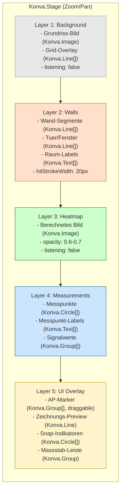

**Layer-Regeln:**

| Layer | `listening` | `cache()` | Update-Trigger |
|-------|------------|-----------|----------------|
| Background | false | nach Bild-Laden | Bild-Import, Zoom |
| Walls | true (Hit Detection) | nach Wand-Aenderung | Wand hinzufuegen/aendern/loeschen |
| Heatmap | false | nach jeder Berechnung | AP-Aenderung, Wand-Aenderung, Band-Toggle |
| Measurements | true | nein | Messpunkt hinzufuegen/aktualisieren |
| UI Overlay | true | nein | Immer (Drag, Zeichnung, Cursor) |

### 2.5 Web Worker Integration (Heatmap-Berechnung)

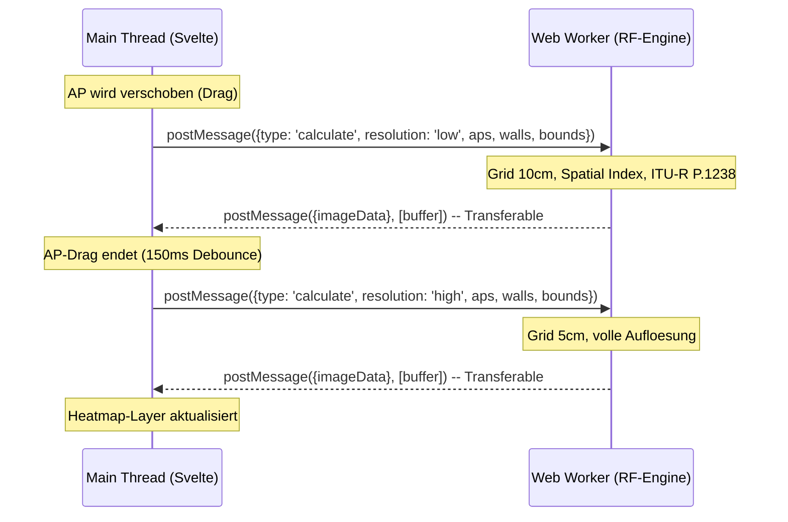

**Worker-Architektur:**

```typescript
// heatmap-worker.ts - Kernstruktur
interface CalculateRequest {
  type: 'calculate';
  id: number;
  aps: APConfig[];
  walls: WallData[];
  bounds: FloorBounds;
  gridStep: number;       // Meter (0.05 oder 0.10)
  outputWidth: number;    // Pixel
  outputHeight: number;
  band: '2.4ghz' | '5ghz';
  colorScheme: 'viridis' | 'jet' | 'inferno';
  calibratedN?: number;   // Kalibrierter Path-Loss-Exponent
}

interface CalculateResponse {
  type: 'result';
  id: number;
  buffer: ArrayBuffer;    // RGBA ImageData (Transferable)
  width: number;
  height: number;
  stats: {
    minRSSI: number;
    maxRSSI: number;
    avgRSSI: number;
    calcTimeMs: number;
  };
}
```

### 2.6 Progressive Rendering Strategie

| Phase | Grid-Schritt | Trigger | Erwartete Dauer |
|-------|-------------|---------|-----------------|
| **Waehrend Drag** | 20 cm (LOD niedrig) | `onDragMove` sofort | < 15 ms |
| **Drag-Ende** | 10 cm (LOD normal) | 150 ms Debounce | < 50 ms |
| **Idle / Fein** | 5 cm (LOD hoch) | 300 ms nach letzter Aenderung | < 200 ms |
| **Maximale Qualitaet** | 2.5 cm | Manuell / Export | < 500 ms |

Die LOD-Stufe passt sich zusaetzlich an den Zoom-Level an (siehe Abschnitt 4 der Canvas-Heatmap-Recherche).

### 2.7 Farbschemata

Drei Farbschemata (D-17), schaltbar ueber die Toolbar:

| Schema | Beschreibung | Einsatzzweck |
|--------|-------------|--------------|
| **Viridis** (Default) | Blau-Gruen-Gelb, farbenblind-freundlich | Standard, barrierefreie Darstellung |
| **Jet** | Blau-Cyan-Gruen-Gelb-Rot, klassisch | Gewohnter WLAN-Heatmap-Look |
| **Inferno** | Schwarz-Violett-Orange-Gelb | Hoher Kontrast, gut fuer Praesentationen |

Jedes Schema wird als `Uint32Array[256]` Lookup-Table vorberechnet und im Worker gehalten.

---

## 3. Backend-Architektur (Tauri 2 + Rust)

### 3.1 Rust-Modulstruktur

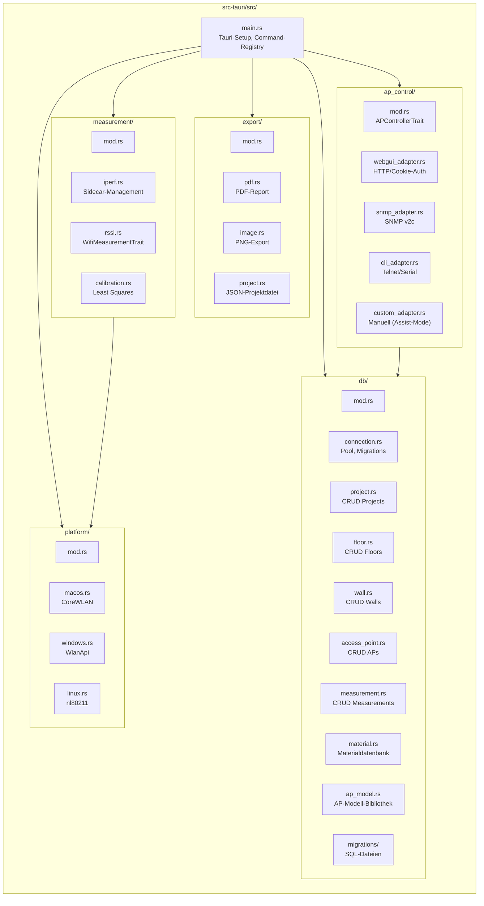

### 3.2 Tauri IPC Command Design

Alle Frontend-Backend-Kommunikation laeuft ueber Tauri IPC Commands. Commands sind gruppiert nach Domaene.

**Rust-seitige Signatur-Konvention:**

```rust
#[tauri::command]
async fn command_name(
    state: tauri::State<'_, AppState>,
    param1: Type1,
    param2: Type2,
) -> Result<ReturnType, AppError> {
    // ...
}
```

**TypeScript-seitige Aufruf-Konvention:**

```typescript
import { invoke } from '@tauri-apps/api/core';

const result = await invoke<ReturnType>('command_name', {
  param1: value1,
  param2: value2,
});
```

### 3.3 AP-Steuerung: Adapter-Pattern

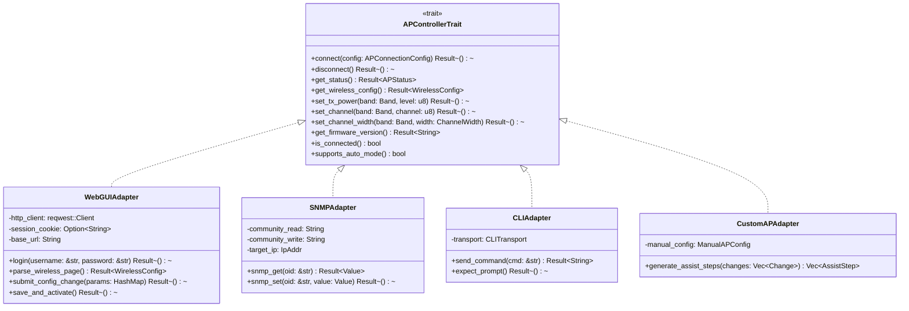

**Adapter-Nutzung im MVP:**

| AP-Typ | Forecast | Assist-Mode | Auto-Mode |
|--------|----------|-------------|-----------|
| DAP-X2810 (registriert) | WebGUIAdapter | WebGUIAdapter (Assist-Steps) | WebGUIAdapter (nach Verifizierung, Post-MVP) |
| Custom AP | Manuelle Parameter | CustomAPAdapter (generische Steps) | Nicht verfuegbar |

### 3.4 Messung: iPerf3 Sidecar + RSSI

**iPerf3 Sidecar-Management:**

```rust
use tauri_plugin_shell::ShellExt;

pub struct IperfManager {
    app: tauri::AppHandle,
}

impl IperfManager {
    /// TCP-Upload-Test (10s, 4 Streams)
    pub async fn run_tcp_upload(
        &self,
        server_ip: &str,
        duration: u32,
        streams: u32,
    ) -> Result<IperfTcpResult, MeasurementError> {
        let command = self.app.shell().sidecar("iperf3").map_err(/* ... */)?
            .args(["-c", server_ip, "-t", &duration.to_string(),
                   "-P", &streams.to_string(), "-J", "--omit", "2"]);

        let output = command.output().await?;
        let json: serde_json::Value = serde_json::from_str(&output.stdout)?;
        Ok(parse_tcp_result(&json)?)
    }

    /// TCP-Download-Test (Reverse Mode)
    pub async fn run_tcp_download(
        &self,
        server_ip: &str,
        duration: u32,
        streams: u32,
    ) -> Result<IperfTcpResult, MeasurementError> {
        let command = self.app.shell().sidecar("iperf3").map_err(/* ... */)?
            .args(["-c", server_ip, "-t", &duration.to_string(),
                   "-P", &streams.to_string(), "-R", "-J", "--omit", "2"]);

        let output = command.output().await?;
        let json: serde_json::Value = serde_json::from_str(&output.stdout)?;
        Ok(parse_tcp_result(&json)?)
    }

    /// UDP-Qualitaetstest (5s, unbegrenzte Bitrate)
    pub async fn run_udp_quality(
        &self,
        server_ip: &str,
        duration: u32,
    ) -> Result<IperfUdpResult, MeasurementError> {
        let command = self.app.shell().sidecar("iperf3").map_err(/* ... */)?
            .args(["-c", server_ip, "-u", "-b", "0",
                   "-t", &duration.to_string(), "-J"]);

        let output = command.output().await?;
        let json: serde_json::Value = serde_json::from_str(&output.stdout)?;
        Ok(parse_udp_result(&json)?)
    }

    /// Server-Erreichbarkeit pruefen
    pub async fn check_server(&self, server_ip: &str) -> Result<bool, MeasurementError> {
        let command = self.app.shell().sidecar("iperf3").map_err(/* ... */)?
            .args(["-c", server_ip, "-t", "1", "-J", "--connect-timeout", "3000"]);

        match command.output().await {
            Ok(output) => Ok(output.status.success()),
            Err(_) => Ok(false),
        }
    }
}
```

**RSSI-Messung (plattformspezifisch):**

```rust
/// Plattform-unabhaengiges Trait fuer WLAN-Messung
pub trait WifiMeasurement: Send + Sync {
    fn get_rssi(&self) -> Result<i32, PlatformError>;
    fn get_noise(&self) -> Result<i32, PlatformError>;
    fn get_ssid(&self) -> Result<String, PlatformError>;
    fn get_bssid(&self) -> Result<String, PlatformError>;
    fn get_tx_rate(&self) -> Result<f64, PlatformError>;
    fn get_frequency(&self) -> Result<u32, PlatformError>;
    fn scan_networks(&self) -> Result<Vec<NetworkInfo>, PlatformError>;
}

// macOS-Implementierung (MVP)
#[cfg(target_os = "macos")]
pub struct MacOSWifi;

#[cfg(target_os = "macos")]
impl WifiMeasurement for MacOSWifi {
    fn get_rssi(&self) -> Result<i32, PlatformError> {
        // CoreWLAN via objc2-core-wlan
        unsafe {
            let client = CWWiFiClient::sharedWiFiClient();
            let interface = client.interface()
                .ok_or(PlatformError::NoWifiInterface)?;
            Ok(interface.rssiValue() as i32)
        }
    }
    // ... weitere Methoden
}
```

### 3.5 Datenbank: rusqlite mit Migrations

**Schema-Uebersicht:**

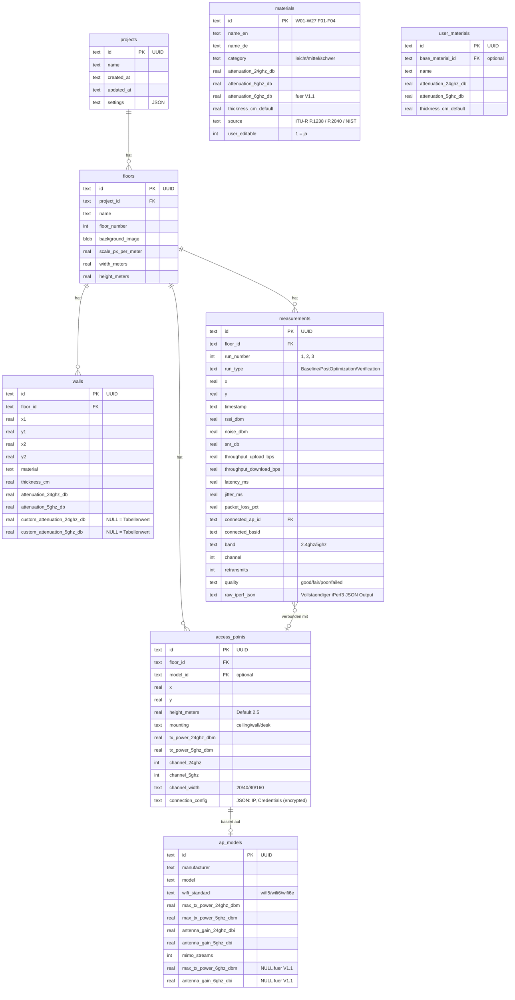

**Migrations-Strategie:**

Migrations werden als nummerierte SQL-Dateien in `src-tauri/src/db/migrations/` verwaltet und beim App-Start automatisch angewendet:

```
migrations/
├── 001_initial_schema.sql
├── 002_materials_seed.sql
├── 003_ap_models_seed.sql
└── 004_user_materials.sql
```

---

## 4. Verzeichnisstruktur

```
wlan-optimizer/
├── src/                        # Svelte 5 Frontend
│   ├── lib/
│   │   ├── components/         # UI-Komponenten
│   │   │   ├── layout/         # Layout, Sidebar, Toolbar, StatusBar
│   │   │   ├── project/        # Projektliste, Import-Dialog
│   │   │   ├── editor/         # MaterialPicker, APLibrary, HeatmapControls
│   │   │   ├── measurement/    # RunOverview, ServerSetup, ProgressBar
│   │   │   ├── mixing/         # MixingSliders, ChangeList, AssistSteps
│   │   │   ├── results/        # ComparisonChart, ExportDialog
│   │   │   └── common/         # Button, Dialog, Toast, Slider, Input
│   │   │
│   │   ├── canvas/             # Konva.js Canvas-Komponenten
│   │   │   ├── CanvasEditor.svelte
│   │   │   ├── BackgroundImage.svelte
│   │   │   ├── GridOverlay.svelte
│   │   │   ├── WallDrawingTool.svelte
│   │   │   ├── AccessPointMarker.svelte
│   │   │   ├── HeatmapOverlay.svelte
│   │   │   ├── MeasurementPoints.svelte
│   │   │   └── ScaleIndicator.svelte
│   │   │
│   │   ├── heatmap/            # Heatmap-Berechnung
│   │   │   ├── heatmap-worker.ts       # Web Worker Entry
│   │   │   ├── rf-engine.ts            # ITU-R P.1238 Modell
│   │   │   ├── spatial-grid.ts         # Uniform Grid fuer Wand-Lookup
│   │   │   ├── color-schemes.ts        # Viridis, Jet, Inferno LUTs
│   │   │   ├── interpolation.ts        # Bilineare Interpolation
│   │   │   └── types.ts               # Worker Message Types
│   │   │
│   │   ├── stores/             # Svelte 5 Runes Stores
│   │   │   ├── projectStore.svelte.ts
│   │   │   ├── canvasStore.svelte.ts
│   │   │   ├── measurementStore.svelte.ts
│   │   │   ├── mixingStore.svelte.ts
│   │   │   └── settingsStore.svelte.ts
│   │   │
│   │   ├── models/             # TypeScript Interfaces / Types
│   │   │   ├── project.ts
│   │   │   ├── floor.ts
│   │   │   ├── wall.ts
│   │   │   ├── access-point.ts
│   │   │   ├── measurement.ts
│   │   │   ├── material.ts
│   │   │   ├── heatmap.ts
│   │   │   └── mixing.ts
│   │   │
│   │   ├── i18n/               # Paraglide-js
│   │   │   └── messages/
│   │   │       ├── en.json
│   │   │       └── de.json
│   │   │
│   │   ├── utils/              # Hilfsfunktionen
│   │   │   ├── geometry.ts     # Punkt-/Linien-Berechnungen
│   │   │   ├── units.ts        # Pixel/Meter-Umrechnung
│   │   │   ├── validation.ts   # Input-Validierung
│   │   │   ├── debounce.ts
│   │   │   └── format.ts       # Zahlen-/Einheiten-Formatierung
│   │   │
│   │   └── api/                # Tauri IPC Wrapper
│   │       ├── project.ts
│   │       ├── floor.ts
│   │       ├── wall.ts
│   │       ├── accessPoint.ts
│   │       ├── measurement.ts
│   │       ├── apControl.ts
│   │       ├── export.ts
│   │       └── settings.ts
│   │
│   ├── routes/                 # SvelteKit Seiten
│   │   ├── +layout.svelte
│   │   ├── +page.svelte                # Startseite / Projektliste
│   │   ├── project/
│   │   │   ├── [id]/
│   │   │   │   ├── +layout.svelte      # Projekt-Layout
│   │   │   │   ├── +page.svelte        # Redirect zu Editor
│   │   │   │   ├── editor/+page.svelte
│   │   │   │   ├── measure/+page.svelte
│   │   │   │   ├── mixing/+page.svelte
│   │   │   │   └── results/+page.svelte
│   │   │   └── new/+page.svelte
│   │   └── settings/+page.svelte
│   │
│   └── app.html
│
├── src-tauri/                  # Rust Backend
│   ├── src/
│   │   ├── main.rs             # Tauri Setup, Command-Registry, Plugin-Init
│   │   ├── state.rs            # AppState (DB-Connection, Config)
│   │   ├── error.rs            # AppError Enum, Serialisierung
│   │   │
│   │   ├── db/
│   │   │   ├── mod.rs
│   │   │   ├── connection.rs   # DB-Initialisierung, Migration-Runner
│   │   │   ├── project.rs      # Project CRUD
│   │   │   ├── floor.rs        # Floor CRUD + Bild-Handling
│   │   │   ├── wall.rs         # Wall CRUD
│   │   │   ├── access_point.rs # AP CRUD
│   │   │   ├── measurement.rs  # Measurement CRUD + Aggregation
│   │   │   ├── material.rs     # Material-Katalog
│   │   │   ├── ap_model.rs     # AP-Modell-Katalog
│   │   │   └── migrations/     # SQL-Dateien
│   │   │       ├── 001_initial_schema.sql
│   │   │       ├── 002_materials_seed.sql
│   │   │       └── 003_ap_models_seed.sql
│   │   │
│   │   ├── ap_control/
│   │   │   ├── mod.rs          # APControllerTrait + Factory
│   │   │   ├── webgui_adapter.rs
│   │   │   ├── snmp_adapter.rs
│   │   │   ├── cli_adapter.rs
│   │   │   └── custom_adapter.rs
│   │   │
│   │   ├── measurement/
│   │   │   ├── mod.rs
│   │   │   ├── iperf.rs        # IperfManager (Sidecar)
│   │   │   ├── rssi.rs         # WifiMeasurementTrait + Dispatch
│   │   │   └── calibration.rs  # Least-Squares Kalibrierung
│   │   │
│   │   ├── export/
│   │   │   ├── mod.rs
│   │   │   ├── pdf.rs          # PDF-Report-Generierung
│   │   │   ├── image.rs        # PNG/JPEG Heatmap-Export
│   │   │   └── project.rs      # JSON-Projektexport
│   │   │
│   │   └── platform/
│   │       ├── mod.rs          # Plattform-Detection + Dispatch
│   │       ├── macos.rs        # CoreWLAN via objc2-core-wlan
│   │       ├── windows.rs      # WlanApi (V1.1)
│   │       └── linux.rs        # nl80211 (V1.2)
│   │
│   ├── binaries/               # iPerf3 Sidecar-Binaries
│   │   ├── iperf3-aarch64-apple-darwin
│   │   ├── iperf3-x86_64-apple-darwin
│   │   ├── iperf3-x86_64-pc-windows-msvc.exe
│   │   └── iperf3-x86_64-unknown-linux-gnu
│   │
│   ├── capabilities/
│   │   └── default.json        # Tauri Permissions
│   │
│   ├── Cargo.toml
│   └── tauri.conf.json
│
├── tests/
│   ├── unit/                   # Vitest Unit Tests
│   │   ├── rf-engine.test.ts
│   │   ├── spatial-grid.test.ts
│   │   ├── interpolation.test.ts
│   │   ├── color-schemes.test.ts
│   │   └── geometry.test.ts
│   │
│   ├── component/              # @testing-library/svelte
│   │   ├── WallDrawingTool.test.ts
│   │   ├── MaterialPicker.test.ts
│   │   └── MixingSliders.test.ts
│   │
│   └── e2e/                    # WebdriverIO + tauri-driver
│       ├── create-project.test.ts
│       ├── draw-walls.test.ts
│       ├── heatmap-render.test.ts
│       └── measurement-flow.test.ts
│
├── docs/                       # Dokumentation (Deutsch)
│   ├── prd/
│   ├── research/
│   ├── architecture/
│   ├── plans/
│   └── archive/
│
├── .claude/                    # Claude Code Konfiguration
│   └── rules/
│
├── biome.json                  # Biome Lint + Format
├── vite.config.ts
├── svelte.config.js
├── tsconfig.json
├── package.json
└── README.md
```

---

## 5. Datenfluss-Diagramme

### 5.1 Grundriss erstellen + Waende zeichnen

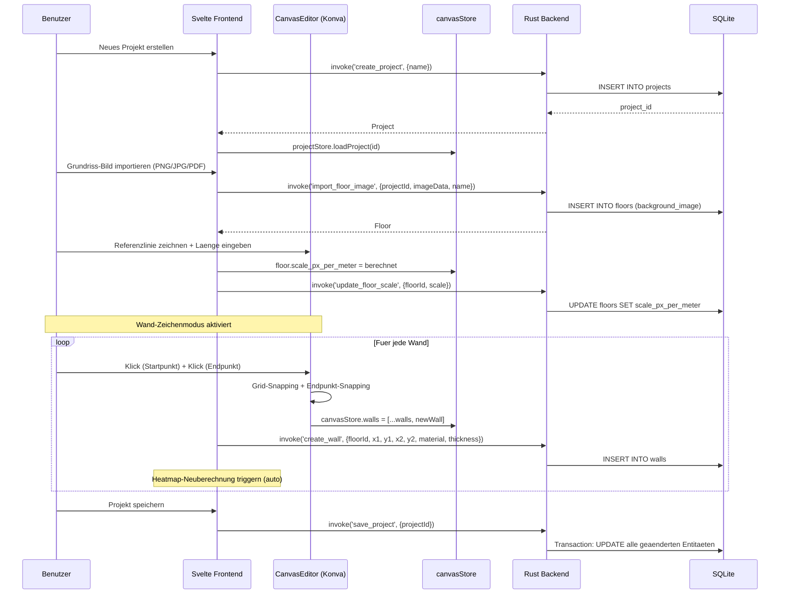

### 5.2 Heatmap berechnen (Frontend Worker)

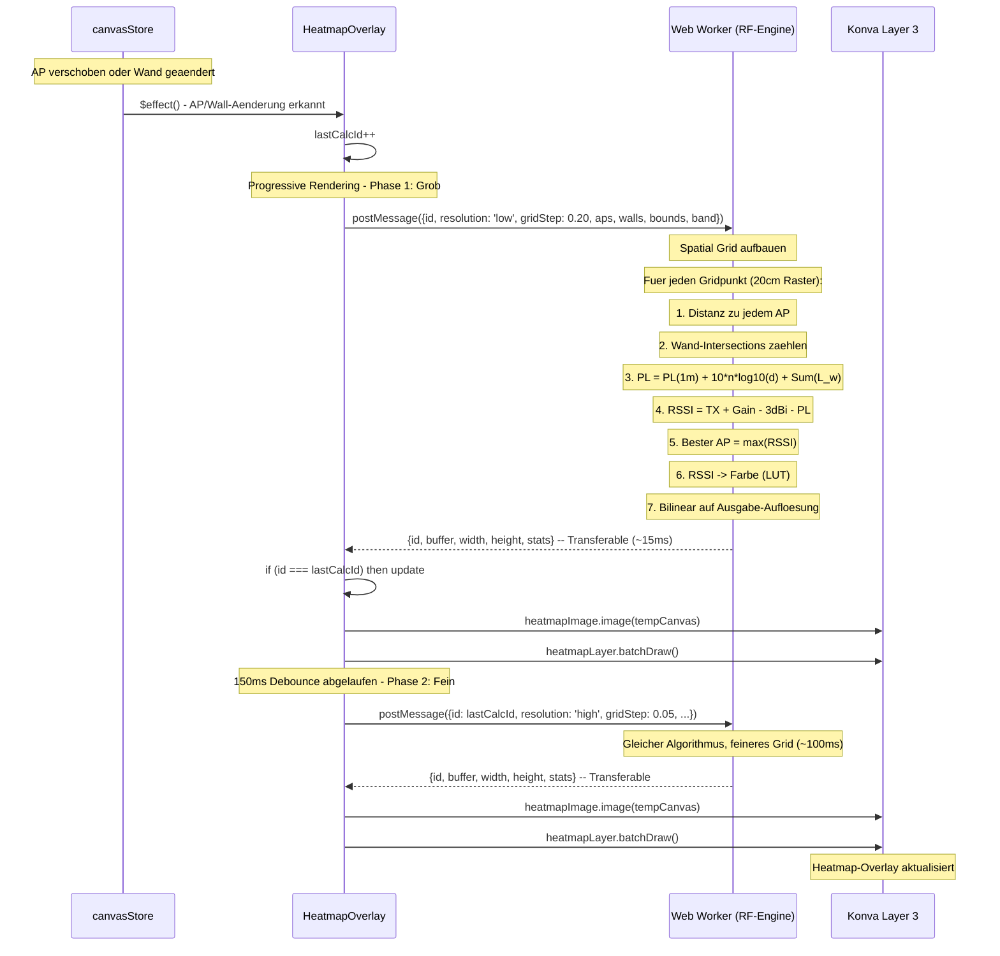

### 5.3 Messung durchfuehren (3 Runs)

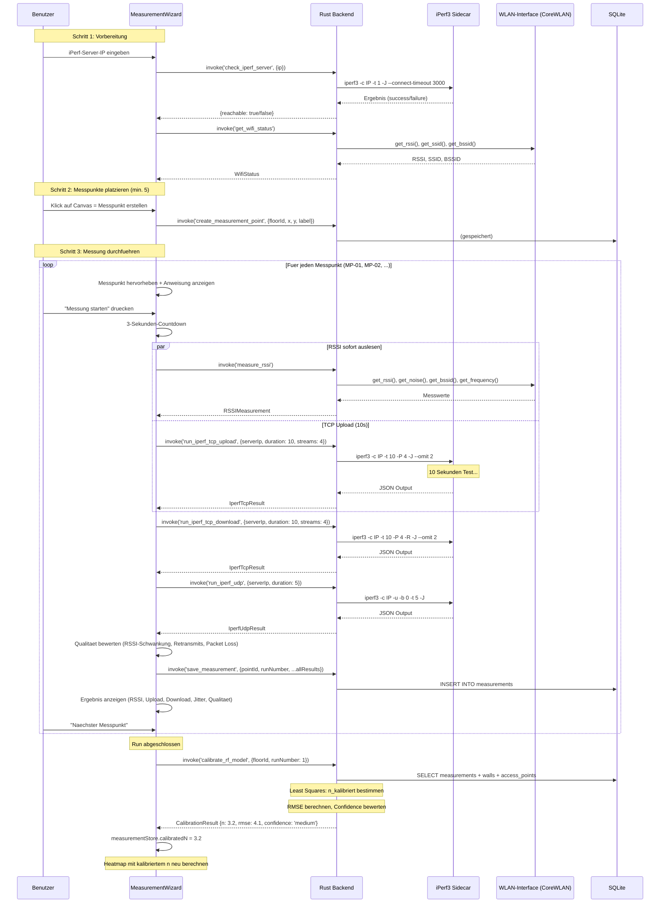

### 5.4 Mixing Console: Forecast + Apply (Assist-Mode)

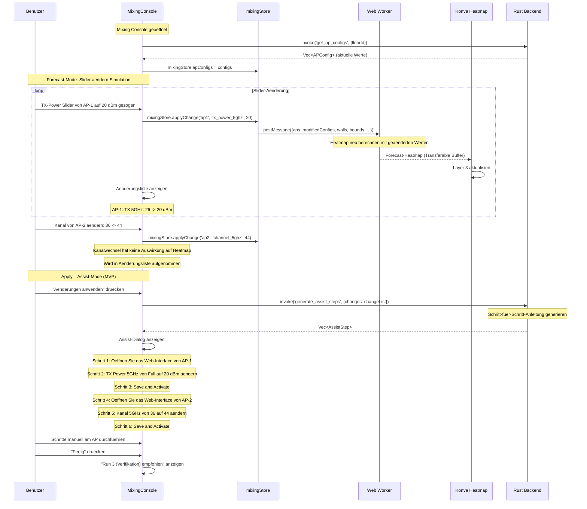

---

## 6. IPC-API Design

### 6.1 Projekt-Commands

```typescript
// TypeScript (Frontend)
interface ProjectAPI {
  create_project(params: { name: string }): Promise<Project>;
  get_project(params: { id: string }): Promise<Project>;
  list_projects(): Promise<Project[]>;
  delete_project(params: { id: string }): Promise<void>;
  save_project(params: { id: string }): Promise<void>;
  export_project(params: { id: string; path: string }): Promise<void>;
  import_project(params: { path: string }): Promise<Project>;
}
```

```rust
// Rust (Backend)
#[tauri::command]
async fn create_project(
    state: tauri::State<'_, AppState>,
    name: String,
) -> Result<Project, AppError>;

#[tauri::command]
async fn get_project(
    state: tauri::State<'_, AppState>,
    id: String,
) -> Result<Project, AppError>;

#[tauri::command]
async fn list_projects(
    state: tauri::State<'_, AppState>,
) -> Result<Vec<Project>, AppError>;

#[tauri::command]
async fn delete_project(
    state: tauri::State<'_, AppState>,
    id: String,
) -> Result<(), AppError>;

#[tauri::command]
async fn save_project(
    state: tauri::State<'_, AppState>,
    id: String,
) -> Result<(), AppError>;

#[tauri::command]
async fn export_project(
    state: tauri::State<'_, AppState>,
    id: String,
    path: String,
) -> Result<(), AppError>;

#[tauri::command]
async fn import_project(
    state: tauri::State<'_, AppState>,
    path: String,
) -> Result<Project, AppError>;
```

### 6.2 Floor-Commands

```typescript
interface FloorAPI {
  create_floor(params: { projectId: string; name: string; floorNumber: number }): Promise<Floor>;
  get_floors(params: { projectId: string }): Promise<Floor[]>;
  import_floor_image(params: { floorId: string; imageData: number[]; mimeType: string }): Promise<void>;
  update_floor_scale(params: { floorId: string; scalePxPerMeter: number; widthMeters: number; heightMeters: number }): Promise<void>;
  delete_floor(params: { floorId: string }): Promise<void>;
}
```

```rust
#[tauri::command]
async fn create_floor(
    state: tauri::State<'_, AppState>,
    project_id: String,
    name: String,
    floor_number: i32,
) -> Result<Floor, AppError>;

#[tauri::command]
async fn get_floors(
    state: tauri::State<'_, AppState>,
    project_id: String,
) -> Result<Vec<Floor>, AppError>;

#[tauri::command]
async fn import_floor_image(
    state: tauri::State<'_, AppState>,
    floor_id: String,
    image_data: Vec<u8>,
    mime_type: String,
) -> Result<(), AppError>;

#[tauri::command]
async fn update_floor_scale(
    state: tauri::State<'_, AppState>,
    floor_id: String,
    scale_px_per_meter: f64,
    width_meters: f64,
    height_meters: f64,
) -> Result<(), AppError>;

#[tauri::command]
async fn delete_floor(
    state: tauri::State<'_, AppState>,
    floor_id: String,
) -> Result<(), AppError>;
```

### 6.3 Wall-Commands

```typescript
interface WallAPI {
  create_wall(params: {
    floorId: string; x1: number; y1: number; x2: number; y2: number;
    material: string; thicknessCm: number;
    customAttenuation24ghz?: number; customAttenuation5ghz?: number;
  }): Promise<Wall>;
  get_walls(params: { floorId: string }): Promise<Wall[]>;
  update_wall(params: { wallId: string; material?: string; thicknessCm?: number;
    customAttenuation24ghz?: number; customAttenuation5ghz?: number }): Promise<Wall>;
  delete_wall(params: { wallId: string }): Promise<void>;
  batch_create_walls(params: { walls: CreateWallParams[] }): Promise<Wall[]>;
}
```

```rust
#[tauri::command]
async fn create_wall(
    state: tauri::State<'_, AppState>,
    floor_id: String,
    x1: f64, y1: f64, x2: f64, y2: f64,
    material: String,
    thickness_cm: f64,
    custom_attenuation_24ghz: Option<f64>,
    custom_attenuation_5ghz: Option<f64>,
) -> Result<Wall, AppError>;

#[tauri::command]
async fn get_walls(
    state: tauri::State<'_, AppState>,
    floor_id: String,
) -> Result<Vec<Wall>, AppError>;

#[tauri::command]
async fn update_wall(
    state: tauri::State<'_, AppState>,
    wall_id: String,
    material: Option<String>,
    thickness_cm: Option<f64>,
    custom_attenuation_24ghz: Option<f64>,
    custom_attenuation_5ghz: Option<f64>,
) -> Result<Wall, AppError>;

#[tauri::command]
async fn delete_wall(
    state: tauri::State<'_, AppState>,
    wall_id: String,
) -> Result<(), AppError>;

#[tauri::command]
async fn batch_create_walls(
    state: tauri::State<'_, AppState>,
    walls: Vec<CreateWallParams>,
) -> Result<Vec<Wall>, AppError>;
```

### 6.4 Access Point Commands

```typescript
interface AccessPointAPI {
  create_access_point(params: {
    floorId: string; x: number; y: number;
    modelId?: string; heightMeters?: number; mounting?: string;
    txPower24ghz?: number; txPower5ghz?: number;
    channel24ghz?: number; channel5ghz?: number; channelWidth?: string;
  }): Promise<AccessPoint>;
  get_access_points(params: { floorId: string }): Promise<AccessPoint[]>;
  update_access_point(params: { apId: string; [key: string]: any }): Promise<AccessPoint>;
  delete_access_point(params: { apId: string }): Promise<void>;
  get_ap_models(): Promise<APModel[]>;
  create_custom_ap_model(params: {
    manufacturer: string; model: string; wifiStandard: string;
    maxTxPower24ghz: number; maxTxPower5ghz: number;
    antennaGain24ghz: number; antennaGain5ghz: number; mimoStreams: number;
  }): Promise<APModel>;
}
```

```rust
#[tauri::command]
async fn create_access_point(
    state: tauri::State<'_, AppState>,
    floor_id: String,
    x: f64, y: f64,
    model_id: Option<String>,
    height_meters: Option<f64>,
    mounting: Option<String>,
    tx_power_24ghz: Option<f64>,
    tx_power_5ghz: Option<f64>,
    channel_24ghz: Option<i32>,
    channel_5ghz: Option<i32>,
    channel_width: Option<String>,
) -> Result<AccessPoint, AppError>;

#[tauri::command]
async fn get_access_points(
    state: tauri::State<'_, AppState>,
    floor_id: String,
) -> Result<Vec<AccessPoint>, AppError>;

#[tauri::command]
async fn update_access_point(
    state: tauri::State<'_, AppState>,
    ap_id: String,
    x: Option<f64>, y: Option<f64>,
    tx_power_24ghz: Option<f64>, tx_power_5ghz: Option<f64>,
    channel_24ghz: Option<i32>, channel_5ghz: Option<i32>,
    channel_width: Option<String>,
    height_meters: Option<f64>, mounting: Option<String>,
) -> Result<AccessPoint, AppError>;

#[tauri::command]
async fn delete_access_point(
    state: tauri::State<'_, AppState>,
    ap_id: String,
) -> Result<(), AppError>;

#[tauri::command]
async fn get_ap_models(
    state: tauri::State<'_, AppState>,
) -> Result<Vec<APModel>, AppError>;
```

### 6.5 Measurement Commands

```typescript
interface MeasurementAPI {
  // iPerf3
  check_iperf_server(params: { ip: string; port?: number }): Promise<{ reachable: boolean }>;
  run_iperf_tcp_upload(params: { serverIp: string; duration: number; streams: number }): Promise<IperfTcpResult>;
  run_iperf_tcp_download(params: { serverIp: string; duration: number; streams: number }): Promise<IperfTcpResult>;
  run_iperf_udp(params: { serverIp: string; duration: number }): Promise<IperfUdpResult>;

  // RSSI
  get_wifi_status(): Promise<WifiStatus>;
  measure_rssi(): Promise<RSSIMeasurement>;

  // Messdaten
  create_measurement_point(params: { floorId: string; x: number; y: number; label: string }): Promise<MeasurementPoint>;
  save_measurement(params: {
    pointId: string; runNumber: number; runType: string;
    rssiDbm: number; noiseDbm?: number; connectedBssid: string;
    band: string; channel: number;
    iperfTcpUpload?: IperfTcpResult; iperfTcpDownload?: IperfTcpResult;
    iperfUdp?: IperfUdpResult;
  }): Promise<Measurement>;
  get_measurements(params: { floorId: string; runNumber?: number }): Promise<Measurement[]>;

  // Kalibrierung
  calibrate_rf_model(params: { floorId: string; runNumber: number }): Promise<CalibrationResult>;
}
```

```rust
#[tauri::command]
async fn check_iperf_server(
    state: tauri::State<'_, AppState>,
    ip: String,
    port: Option<u16>,
) -> Result<CheckResult, AppError>;

#[tauri::command]
async fn run_iperf_tcp_upload(
    app: tauri::AppHandle,
    server_ip: String,
    duration: u32,
    streams: u32,
) -> Result<IperfTcpResult, AppError>;

#[tauri::command]
async fn run_iperf_tcp_download(
    app: tauri::AppHandle,
    server_ip: String,
    duration: u32,
    streams: u32,
) -> Result<IperfTcpResult, AppError>;

#[tauri::command]
async fn run_iperf_udp(
    app: tauri::AppHandle,
    server_ip: String,
    duration: u32,
) -> Result<IperfUdpResult, AppError>;

#[tauri::command]
async fn get_wifi_status(
    state: tauri::State<'_, AppState>,
) -> Result<WifiStatus, AppError>;

#[tauri::command]
async fn measure_rssi(
    state: tauri::State<'_, AppState>,
) -> Result<RSSIMeasurement, AppError>;

#[tauri::command]
async fn calibrate_rf_model(
    state: tauri::State<'_, AppState>,
    floor_id: String,
    run_number: i32,
) -> Result<CalibrationResult, AppError>;
```

### 6.6 Optimization / Mixing Console Commands

```typescript
interface OptimizationAPI {
  generate_recommendations(params: { floorId: string }): Promise<Recommendation[]>;
  generate_assist_steps(params: { changes: ParameterChange[] }): Promise<AssistStep[]>;

  // AP-Steuerung (nur fuer registrierte APs mit Verbindungsdaten)
  connect_ap(params: { apId: string; ip: string; username: string; password: string }): Promise<APConnectionResult>;
  get_ap_live_config(params: { apId: string }): Promise<WirelessConfig>;
  verify_ap_capabilities(params: { apId: string }): Promise<APVerificationResult>;
}
```

```rust
#[tauri::command]
async fn generate_recommendations(
    state: tauri::State<'_, AppState>,
    floor_id: String,
) -> Result<Vec<Recommendation>, AppError>;

#[tauri::command]
async fn generate_assist_steps(
    state: tauri::State<'_, AppState>,
    changes: Vec<ParameterChange>,
) -> Result<Vec<AssistStep>, AppError>;

#[tauri::command]
async fn connect_ap(
    state: tauri::State<'_, AppState>,
    ap_id: String,
    ip: String,
    username: String,
    password: String,
) -> Result<APConnectionResult, AppError>;

#[tauri::command]
async fn get_ap_live_config(
    state: tauri::State<'_, AppState>,
    ap_id: String,
) -> Result<WirelessConfig, AppError>;

#[tauri::command]
async fn verify_ap_capabilities(
    state: tauri::State<'_, AppState>,
    ap_id: String,
) -> Result<APVerificationResult, AppError>;
```

### 6.7 Settings Commands

```typescript
interface SettingsAPI {
  get_settings(): Promise<AppSettings>;
  update_settings(params: { settings: Partial<AppSettings> }): Promise<AppSettings>;
  get_materials(): Promise<Material[]>;
  update_material(params: { materialId: string; attenuation24ghz?: number; attenuation5ghz?: number }): Promise<Material>;
  reset_material(params: { materialId: string }): Promise<Material>;
  create_user_material(params: { name: string; attenuation24ghz: number; attenuation5ghz: number; thicknessCm: number }): Promise<Material>;
  get_system_language(): Promise<string>;
}
```

```rust
#[tauri::command]
async fn get_settings(
    state: tauri::State<'_, AppState>,
) -> Result<AppSettings, AppError>;

#[tauri::command]
async fn update_settings(
    state: tauri::State<'_, AppState>,
    settings: AppSettings,
) -> Result<AppSettings, AppError>;

#[tauri::command]
async fn get_materials(
    state: tauri::State<'_, AppState>,
) -> Result<Vec<Material>, AppError>;

#[tauri::command]
async fn update_material(
    state: tauri::State<'_, AppState>,
    material_id: String,
    attenuation_24ghz: Option<f64>,
    attenuation_5ghz: Option<f64>,
) -> Result<Material, AppError>;

#[tauri::command]
async fn reset_material(
    state: tauri::State<'_, AppState>,
    material_id: String,
) -> Result<Material, AppError>;

#[tauri::command]
async fn get_system_language() -> Result<String, AppError>;
```

---

## 7. Fehlerbehandlung & Sicherheit

### 7.1 Tauri Capability-Modell (Restriktive Permissions)

Die App fordert nur die minimal benoetigten Berechtigungen an. Die Capability-Datei definiert, welche Tauri-APIs und Sidecar-Aufrufe erlaubt sind.

```json
{
  "$schema": "../gen/schemas/desktop-schema.json",
  "identifier": "default",
  "description": "WLAN-Optimizer Default Capabilities",
  "windows": ["main"],
  "permissions": [
    "core:default",
    "core:window:allow-close",
    "core:window:allow-minimize",
    "core:window:allow-maximize",

    {
      "identifier": "shell:allow-spawn",
      "allow": [
        {
          "name": "binaries/iperf3",
          "sidecar": true,
          "args": [
            "-c", { "validator": "\\S+" },
            "-t", { "validator": "\\d+" },
            "-P", { "validator": "\\d+" },
            "-J",
            "-R",
            "-u",
            "-b", { "validator": "\\d+" },
            "--omit", { "validator": "\\d+" },
            "--connect-timeout", { "validator": "\\d+" }
          ]
        }
      ]
    },

    "dialog:allow-open",
    "dialog:allow-save",

    {
      "identifier": "fs:allow-read",
      "allow": [
        { "path": "$APPDATA/**" },
        { "path": "$DOCUMENT/**" }
      ]
    },
    {
      "identifier": "fs:allow-write",
      "allow": [
        { "path": "$APPDATA/**" }
      ]
    },

    "http:default",
    "network:default"
  ]
}
```

**Eingeschraenkte Permissions:**

| Bereich | Erlaubt | Nicht erlaubt |
|---------|---------|---------------|
| **Filesystem** | AppData lesen/schreiben, Documents lesen | Zugriff auf System-Verzeichnisse |
| **Shell** | Nur iPerf3-Sidecar mit validierten Argumenten | Beliebige Shell-Befehle |
| **Netzwerk** | HTTP/HTTPS Requests (fuer AP Web-GUI) | Beliebige Socket-Verbindungen |
| **Dialog** | Datei-Oeffnen/Speichern Dialoge | Benachrichtigungen, Tray |

### 7.2 Input-Validierung an der IPC-Grenze

Jede IPC-Command validiert ihre Parameter, bevor sie verarbeitet werden:

```rust
use serde::Deserialize;

#[derive(Deserialize)]
struct CreateWallParams {
    floor_id: String,
    x1: f64, y1: f64,
    x2: f64, y2: f64,
    material: String,
    thickness_cm: f64,
}

impl CreateWallParams {
    fn validate(&self) -> Result<(), AppError> {
        // UUID-Format pruefen
        uuid::Uuid::parse_str(&self.floor_id)
            .map_err(|_| AppError::Validation("Invalid floor_id format".into()))?;

        // Koordinaten muessen endlich sein
        if !self.x1.is_finite() || !self.y1.is_finite()
            || !self.x2.is_finite() || !self.y2.is_finite() {
            return Err(AppError::Validation("Coordinates must be finite".into()));
        }

        // Material muss bekannt sein
        if !KNOWN_MATERIALS.contains(&self.material.as_str()) {
            return Err(AppError::Validation(
                format!("Unknown material: {}", self.material)
            ));
        }

        // Dicke muss positiv und sinnvoll sein
        if self.thickness_cm <= 0.0 || self.thickness_cm > 200.0 {
            return Err(AppError::Validation("Wall thickness out of range".into()));
        }

        // Wand darf nicht null-Laenge haben
        let length = ((self.x2 - self.x1).powi(2) + (self.y2 - self.y1).powi(2)).sqrt();
        if length < 0.01 {
            return Err(AppError::Validation("Wall too short".into()));
        }

        Ok(())
    }
}
```

### 7.3 Fehler-Propagation: Rust Result -> Tauri -> Frontend

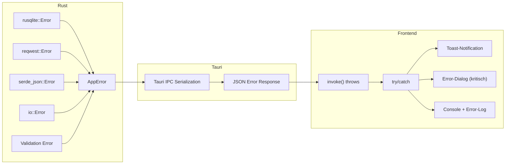

**Rust-seitiger Fehler-Typ:**

```rust
use serde::Serialize;
use thiserror::Error;

#[derive(Error, Debug, Serialize)]
pub enum AppError {
    #[error("Database error: {0}")]
    Database(String),

    #[error("Validation error: {0}")]
    Validation(String),

    #[error("Network error: {0}")]
    Network(String),

    #[error("AP connection error: {0}")]
    APConnection(String),

    #[error("Measurement error: {0}")]
    Measurement(String),

    #[error("iPerf3 error: {0}")]
    IPerf(String),

    #[error("Platform error: {0}")]
    Platform(String),

    #[error("Export error: {0}")]
    Export(String),

    #[error("File I/O error: {0}")]
    FileIO(String),

    #[error("Not found: {0}")]
    NotFound(String),
}

// Automatische Konvertierung
impl From<rusqlite::Error> for AppError {
    fn from(e: rusqlite::Error) -> Self {
        AppError::Database(e.to_string())
    }
}

impl From<reqwest::Error> for AppError {
    fn from(e: reqwest::Error) -> Self {
        AppError::Network(e.to_string())
    }
}
```

**Frontend-seitige Fehlerbehandlung:**

```typescript
// api/helpers.ts
import { invoke } from '@tauri-apps/api/core';
import { addToast } from '$lib/stores/toastStore.svelte';

export async function safeInvoke<T>(
  command: string,
  params?: Record<string, unknown>,
): Promise<T> {
  try {
    return await invoke<T>(command, params);
  } catch (error: unknown) {
    const message = typeof error === 'string' ? error : 'Unknown error';

    // Benutzerfreundliche Fehlermeldung anzeigen
    addToast({
      type: 'error',
      title: getErrorTitle(command),
      message: translateError(message),
    });

    throw error; // Re-throw fuer Caller
  }
}
```

### 7.4 AP-Credentials: Verschluesselte Speicherung

AP-Zugangsdaten (IP, Benutzername, Passwort) werden nicht im Klartext in der SQLite-Datenbank gespeichert.

**Strategie:**

1. **Betriebssystem-Keychain** (bevorzugt):
   - macOS: Keychain via `security` CLI oder `keychain-services` Crate
   - Windows: Windows Credential Manager
   - Linux: Secret Service API (GNOME Keyring / KDE Wallet)

2. **Fallback - Verschluesselung in SQLite:**
   - AES-256-GCM Verschluesselung
   - Schluessel aus Geraete-spezifischem Seed abgeleitet
   - Passwort-Feld in `access_points.connection_config` als JSON-Blob mit verschluesseltem Wert

```rust
// Konzept: Credential-Management
pub trait CredentialStore: Send + Sync {
    fn store(&self, key: &str, username: &str, password: &str) -> Result<(), AppError>;
    fn retrieve(&self, key: &str) -> Result<(String, String), AppError>;
    fn delete(&self, key: &str) -> Result<(), AppError>;
}

#[cfg(target_os = "macos")]
pub struct KeychainStore;

#[cfg(target_os = "macos")]
impl CredentialStore for KeychainStore {
    fn store(&self, key: &str, username: &str, password: &str) -> Result<(), AppError> {
        // keychain-services Crate
        // Service: "com.wlan-optimizer.ap-credentials"
        // Account: key (z.B. "ap-192.168.1.10")
        todo!()
    }
    // ...
}
```

---

## 8. Erweiterbarkeit

### 8.1 Plugin-artige AP-Adapter (neue Hersteller)

Das Adapter-Pattern (Abschnitt 3.3) ermoeglicht das Hinzufuegen neuer AP-Hersteller ohne Aenderung des Kerns:

```rust
// Neuen Adapter registrieren
pub fn create_adapter(ap: &AccessPoint) -> Box<dyn APControllerTrait> {
    match ap.model.manufacturer.as_str() {
        "D-Link" => Box::new(DLinkWebGUIAdapter::new(ap)),
        "Ubiquiti" => Box::new(UnifiAdapter::new(ap)),     // Community
        "TP-Link" => Box::new(TPLinkAdapter::new(ap)),     // Community
        _ => Box::new(CustomAPAdapter::new(ap)),            // Generisch
    }
}
```

**Neue Adapter implementieren:**

1. Neues Rust-Modul in `src-tauri/src/ap_control/` anlegen
2. `APControllerTrait` implementieren
3. In der Factory-Funktion registrieren
4. AP-Modell in der Datenbank hinterlegen

### 8.2 Material-Editor (benutzerdefinierbar)

Materialwerte sind user-editierbar (D-07):

- **Global**: Standardwerte in `materials`-Tabelle koennen vom Benutzer ueberschrieben werden
- **Pro Wand**: Einzelne Waende koennen individuelle Daempfungswerte haben (`custom_attenuation_*` Felder)
- **Benutzerdefinierte Materialien**: Neue Materialien in `user_materials`-Tabelle
- **Reset**: Jeder Wert kann auf den Tabellenwert zurueckgesetzt werden

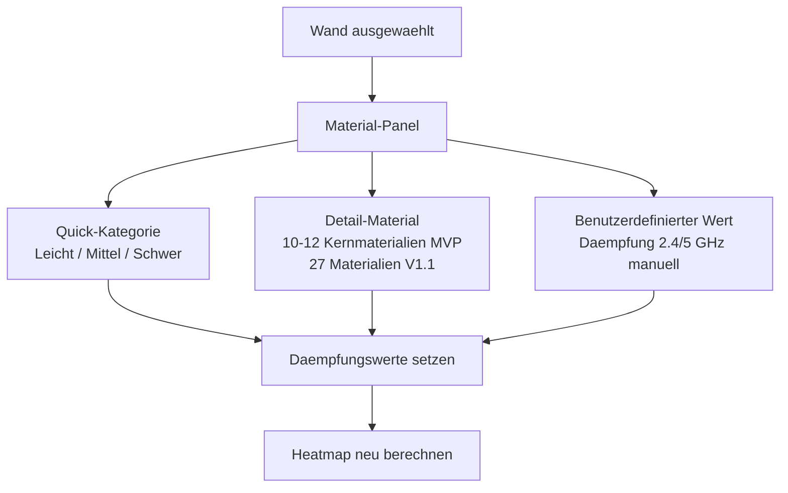

### 8.3 Multi-Floor (Datenmodell bereit, UI V1.1)

Das Datenmodell ist Multi-Floor-faehig (D-08):

- `floors`-Tabelle mit `floor_number` und `project_id` Foreign Key
- Waende, APs, Messungen referenzieren `floor_id`
- **MVP**: UI zeigt nur ein Stockwerk, nur eine Floor-Zeile pro Projekt
- **V1.1**: Stockwerk-Tabs, Decken-Daempfung zwischen Stockwerken (F01-F04 Materialien)
- **Datenmodell-Erweiterung V1.1**: `floor_connections`-Tabelle fuer vertikale Signal-Pfade

### 8.4 6 GHz Band (Datenmodell bereit, UI spaeter)

Das Datenmodell hat Felder fuer 6 GHz (D-09):

- `ap_models`: `max_tx_power_6ghz_dbm`, `antenna_gain_6ghz_dbi` (aktuell NULL)
- `materials`: `attenuation_6ghz_db` (Werte bereits recherchiert in RF-Materialien.md)
- **MVP**: UI zeigt nur 2.4 GHz + 5 GHz Toggle
- **Spaeter**: 6 GHz freischalten sobald ein Wi-Fi 6E AP zum Testen verfuegbar ist
- **RF-Modell**: PL(1m) bei 6 GHz = 49.34 dB (berechnet: 20*log10(4*PI*6e9/c))

### 8.5 WASM-Migrationspfad fuer Heatmap

Die Heatmap-Berechnung ist im MVP als TypeScript Web Worker implementiert (D-06). Eine spaetere Migration auf WebAssembly ist moeglich ohne UI-Aenderung:

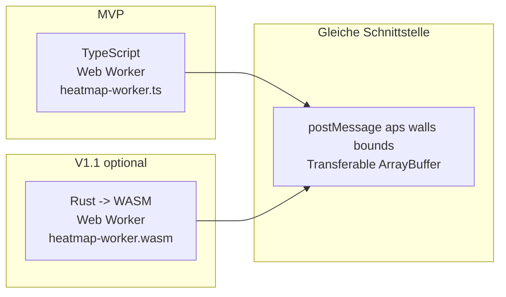

**Migrationsschritte:**

1. RF-Engine in Rust implementieren (kann mit `cargo test` getestet werden)
2. Via `wasm-pack` als WebAssembly kompilieren
3. Worker austauschen: statt TypeScript-Datei die `.wasm`-Datei laden
4. Gleiche `postMessage`/`onmessage`-Schnittstelle beibehalten
5. Erwarteter Performance-Gewinn: 2-5x schneller (besonders bei grossen Grundrissen)

### 8.6 Weitere geplante Erweiterungen

| Feature | Version | Datenmodell-Bereit | UI-Bereit |
|---------|---------|-------------------|-----------|
| SVG-Import fuer Grundrisse | V1.1 | - | Nein |
| Auto-Mode (AP live steuern) | V1.1 | Ja (Adapter-Pattern) | Nein |
| Run 2 (gemeinsame SSID, Roaming) | V1.1 | Ja (run_number = 2) | Nein |
| Greedy-Optimierung | V1.1 | - | Nein |
| 27 Materialien (statt 10-12) | V1.1 | Ja (materials-Tabelle) | Nein |
| Multi-Floor UI | V1.1 | Ja (floors-Tabelle) | Nein |
| Windows-Plattform (RSSI) | V1.1 | Ja (WifiMeasurement Trait) | Nein |
| Linux-Plattform (RSSI) | V1.2 | Ja (WifiMeasurement Trait) | Nein |
| 6 GHz Band | Wenn Test-AP vorhanden | Ja (DB-Felder) | Nein |
| Code-Signing (macOS) | V1.0 Release | - | - |
| DXF-Import | V1.2+ | - | Nein |
| Bayesian Kalibrierung | V1.2+ | - | Nein |

---

## Anhang A: Referenz-AP Parameter (D-Link DAP-X2810)

| Parameter | 2.4 GHz | 5 GHz |
|-----------|---------|-------|
| Max. TX Power | 23 dBm | 26 dBm |
| Antennengewinn | 3.2 dBi | 4.3 dBi |
| MIMO | 2x2 | 2x2 |
| Wi-Fi Standard | 802.11ax (Wi-Fi 6) | 802.11ax (Wi-Fi 6) |
| Max. Datenrate | 574 Mbps | 1200 Mbps |
| EIRP | 26.2 dBm | 30.3 dBm |

## Anhang B: Signal-Schwellen (Default)

| Bewertung | RSSI-Bereich | UI-Farbe | Typische Nutzung |
|-----------|-------------|----------|------------------|
| Excellent | > -50 dBm | Dunkelgruen | HD-Streaming, VoIP, Gaming |
| Good | -50 bis -65 dBm | Hellgruen | Standard-Nutzung |
| Fair | -65 bis -75 dBm | Gelb | Web-Browsing, E-Mail |
| Poor | -75 bis -85 dBm | Orange | Verbindungsprobleme moeglich |
| No Signal | < -85 dBm | Rot | Keine zuverlaessige Verbindung |

## Anhang C: Kernmaterialien (MVP - 10 Stueck)

| ID | Material | Daempfung 2.4 GHz | Daempfung 5 GHz | Kategorie |
|----|----------|-------------------|-----------------|-----------|
| W01 | Gipskarton / Rigips | 4 dB | 6 dB | Leicht |
| W02 | Holz (duenn) | 4 dB | 6 dB | Leicht |
| W04 | Innentuer (Holz) | 4 dB | 6 dB | Leicht |
| W06 | Poroton / Mauerwerk (17cm) | 10 dB | 18 dB | Mittel |
| W07 | Poroton / Mauerwerk (36cm) | 15 dB | 25 dB | Mittel |
| W09 | Beton (15cm) | 12 dB | 20 dB | Mittel |
| W10 | Stahlbeton (20cm+) | 25 dB | 45 dB | Schwer |
| W12 | Normales Glas | 3 dB | 5 dB | Leicht |
| W13 | Low-E Isolierglas | 22 dB | 28 dB | Schwer |
| W15 | Metalltuer | 12 dB | 18 dB | Mittel |

## Anhang D: Abhaengigkeiten (Dependencies)

### Frontend (npm)

| Paket | Version | Lizenz | Zweck |
|-------|---------|--------|-------|
| svelte | ^5.x | MIT | Frontend-Framework |
| @sveltejs/kit | ^2.x | MIT | Meta-Framework |
| konva | ^10.x | MIT | Canvas-Library |
| svelte-konva | ^1.x | MIT | Svelte-Konva-Bindings |
| @inlang/paraglide-js | latest | MIT | i18n (compile-time) |
| @flatten-js/core | ^1.6.x | MIT | Geometrie, Intersections |
| @tauri-apps/api | ^2.x | MIT | Tauri Frontend-API |
| @tauri-apps/plugin-shell | ^2.x | MIT | Sidecar-Aufrufe |
| @tauri-apps/plugin-dialog | ^2.x | MIT | Datei-Dialoge |

### Backend (Cargo.toml)

| Crate | Version | Lizenz | Zweck |
|-------|---------|--------|-------|
| tauri | 2.x | MIT | Desktop-Framework |
| tauri-plugin-shell | 2.x | MIT | Sidecar (iPerf3) |
| tauri-plugin-dialog | 2.x | MIT | Datei-Dialoge |
| tauri-plugin-http | 2.x | MIT | HTTP-Requests |
| rusqlite | 0.32.x | MIT | SQLite-Zugriff |
| serde | 1.x | MIT/Apache-2.0 | Serialisierung |
| serde_json | 1.x | MIT/Apache-2.0 | JSON-Parsing |
| uuid | 1.x | MIT/Apache-2.0 | UUID-Generierung |
| thiserror | 2.x | MIT/Apache-2.0 | Error-Handling |
| reqwest | 0.12.x | MIT/Apache-2.0 | HTTP-Client (AP Web-GUI) |
| rasn-snmp | 0.28.x | MIT/Apache-2.0 | SNMP (AP-Steuerung) |
| objc2-core-wlan | latest | MIT | macOS WLAN-API |

### Entwicklung

| Tool | Version | Zweck |
|------|---------|-------|
| Vite | 6.x | Bundler |
| Vitest | latest | Unit-Tests |
| @testing-library/svelte | latest | Component-Tests |
| WebdriverIO | latest | E2E-Tests |
| Biome | latest | Linting + Formatting |
| eslint-plugin-svelte | latest | Svelte-spezifische Lint-Regeln |

---

## Anhang E: Entscheidungsreferenz

Dieses Dokument basiert auf folgenden bestaetigten Entscheidungen (vollstaendige Details in `docs/architecture/Entscheidungen.md`):

| ID | Titel | Kern |
|----|-------|------|
| D-01 | Direkter AP-Zugriff | Kein Nuclias Connect, Adapter-Pattern |
| D-02 | Mixing Console MVP | Forecast-Only + Assist-Mode |
| D-03 | Kein Paywall | Alle Features sofort, gestuftes Onboarding |
| D-04 | Tech-Stack | Svelte 5 + Tauri 2 + Konva.js + rusqlite |
| D-05 | macOS-First | Volle Funktionalitaet zuerst auf macOS |
| D-06 | Heatmap im Frontend | TypeScript Web Worker, WASM spaeter |
| D-07 | Kernmaterialien + Quick-Kategorien | 10-12 MVP, user-editierbar |
| D-08 | Multi-Floor vorbereiten | Datenstruktur ready, UI V1.1 |
| D-09 | 6 GHz vorbereiten | Datenfelder ready, UI spaeter |
| D-10 | Herstellerunabhaengigkeit | Custom AP-Profil, Community-Adapter |
| D-11 | AP-Verifizierung als PoC | Nicht blockierend fuer MVP |
| D-12 | iPerf3-Server | Kabelgebundenes Ziel, Same-Host-Fallback |
| D-13 | iPerf3 als Sidecar | BSD-3-Clause, ~2 MB pro Plattform |
| D-14 | Regelbasierter Optimierungsalgorithmus | Heuristiken, Mixing Console anpassbar |
| D-15 | Messpunkte empfehlen | Adaptive Empfehlung, kein Zwang |
| D-16 | Grundriss-Import | PNG, JPG, PDF (MVP), SVG (V1.1) |
| D-17 | 3 Heatmap-Farbschemata | Viridis, Jet, Inferno |
| D-18 | System-Sprache erkennen | Auto-Detection, Fallback-Dialog |
| D-19 | Code-Signing spaeter | MVP unsigned, V1.0 Apple Dev Account |

---

## Anhang F: Terminologie

| Begriff | Definition |
|---------|-----------|
| **Mixing Console** | Interaktive Slider-Oberflaeche zur Anpassung von AP-Parametern |
| **Forecast-Mode** | Slider aendern nur die berechnete Heatmap (Simulation) |
| **Assist-Mode** | Erzeugt Schritt-fuer-Schritt-Anleitung fuer manuelle AP-Aenderungen (MVP) |
| **Auto-Mode** | Sendet Aenderungen direkt an den AP (Post-MVP, nach Verifizierung) |
| **Run 1 (Baseline)** | Erste Messung vor Optimierung |
| **Run 2 (Post-Optimierung)** | Messung nach angewendeten Aenderungen |
| **Run 3 (Verifikation)** | Abschliessende Verifikations-Messung |
| **Confidence** | Vertrauensniveau der Vorhersage (UI-Begriff) |
| **RMSE** | Root Mean Square Error der Kalibrierung (technischer Begriff) |
| **Path Loss Exponent (n)** | Daempfungsfaktor im RF-Modell (Default: 3.5) |
| **Sidecar** | Externe Binaerdatei (iPerf3), die mit der App gebundelt wird |
| **Custom AP** | Benutzerdefinierter AP ohne registrierten Adapter |

---

> **Dieses Dokument ist die verbindliche Referenz fuer die Implementierung in Phase 8.**
> Aenderungen muessen als ADR (Architecture Decision Record) dokumentiert werden.
