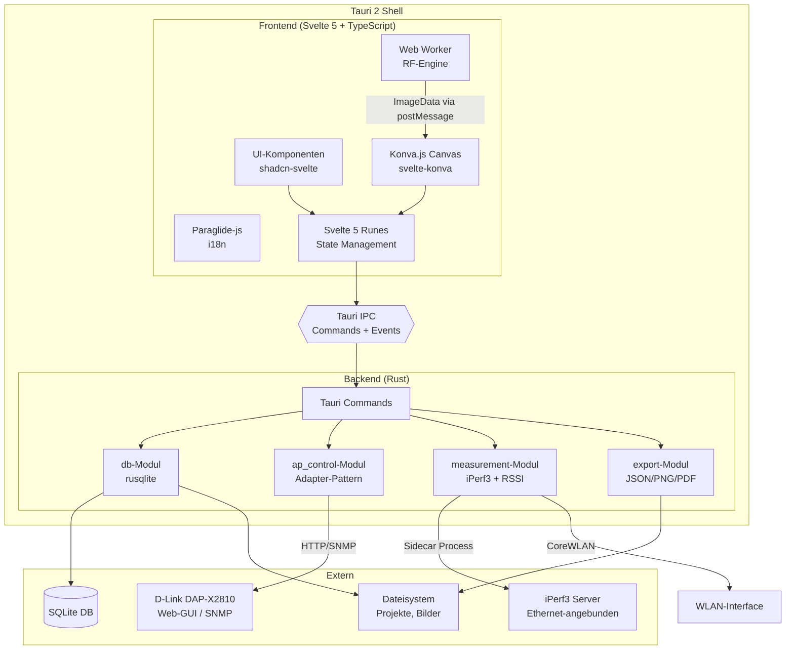
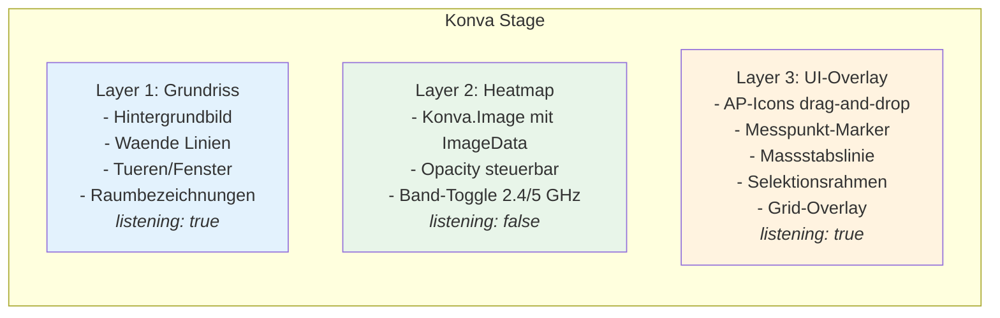
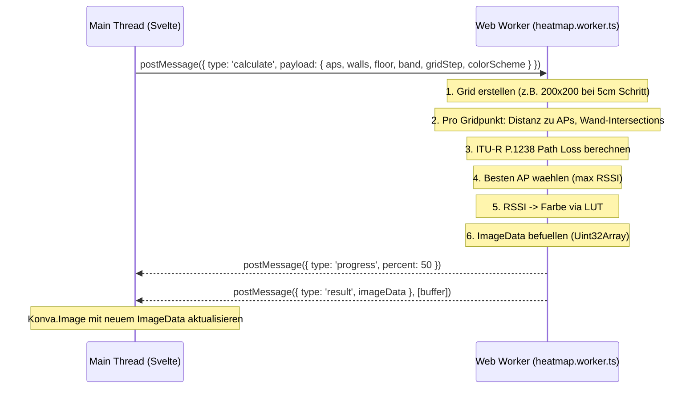
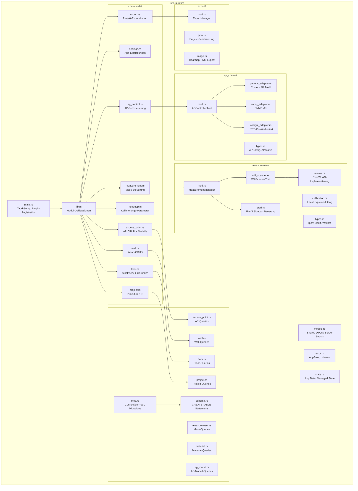
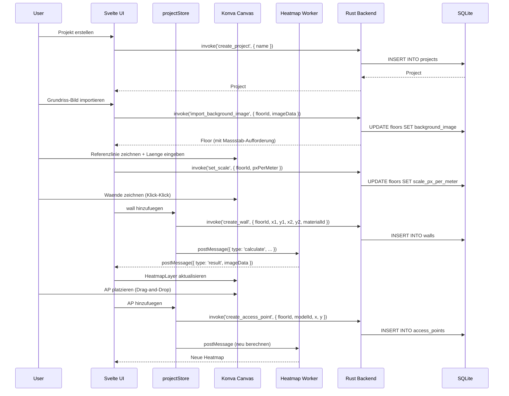
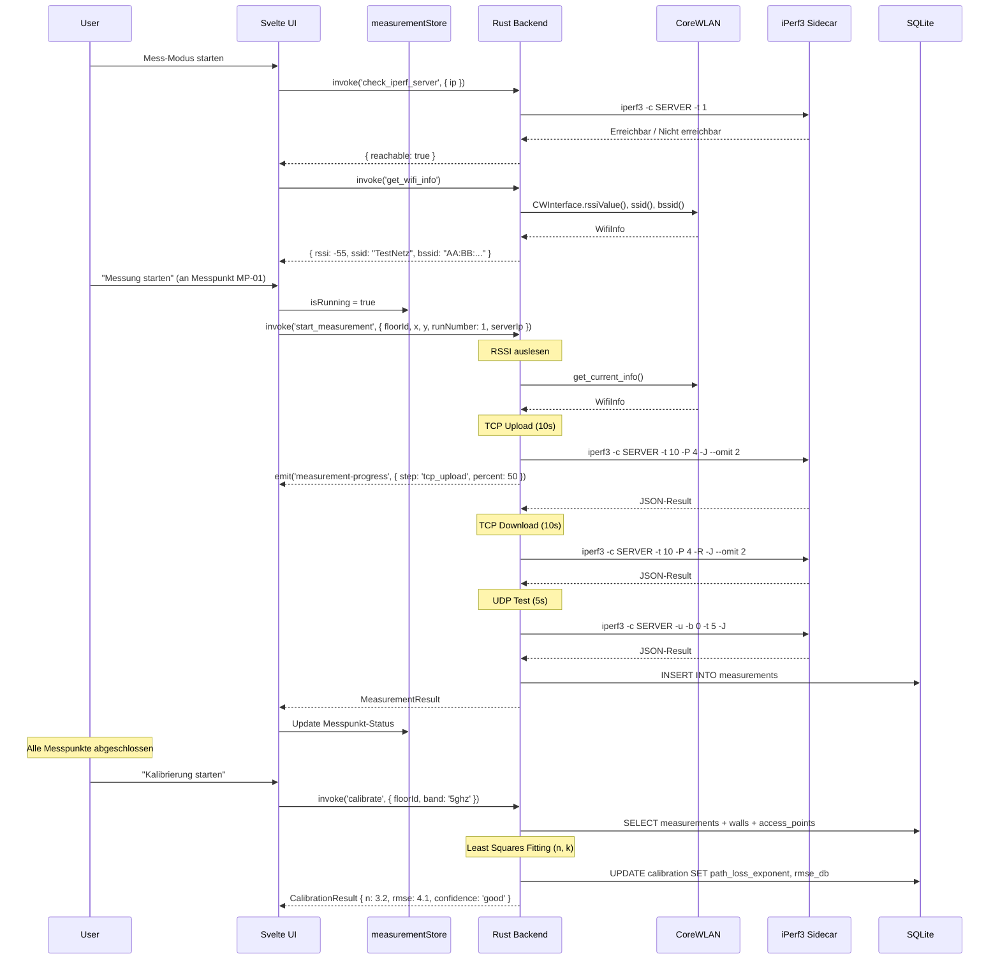
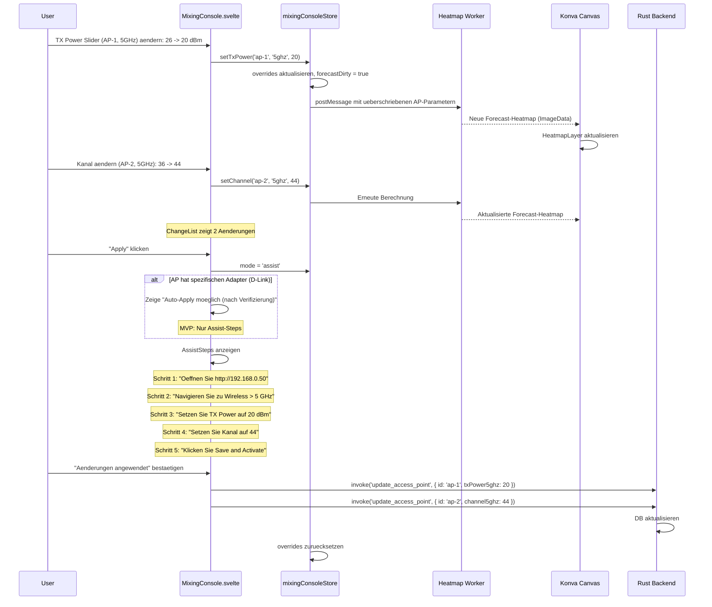
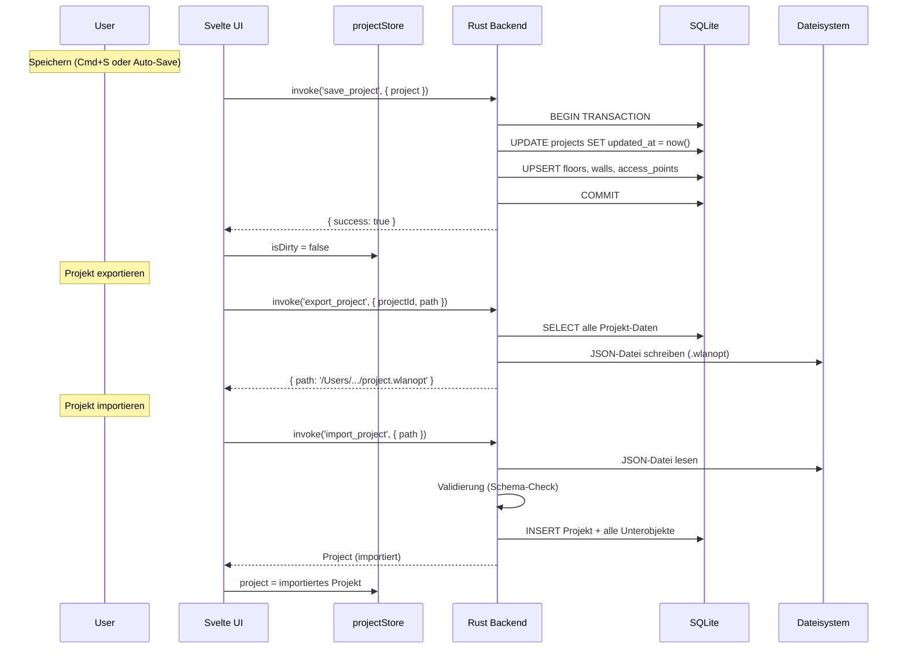

# Komponentenarchitektur: WLAN-Optimizer

> **Phase 5 Deliverable** | **Datum:** 2026-02-27 | **Status:** Entwurf
>
> Basierend auf: Entscheidungen D-01 bis D-19, Tech-Stack-Evaluation, Canvas-Heatmap-Recherche,
> AP-Steuerung-Recherche, Messung-Kalibrierung-Recherche, PRD und Funktionsliste.

---

## Inhaltsverzeichnis

1. [System-Ueberblick](#1-system-ueberblick)
2. [Frontend-Architektur](#2-frontend-architektur)
3. [Backend-Architektur (Rust/Tauri)](#3-backend-architektur-rusttauri)
4. [Verzeichnisstruktur](#4-verzeichnisstruktur)
5. [Datenfluss-Diagramme](#5-datenfluss-diagramme)
6. [IPC-API Design](#6-ipc-api-design)
7. [Fehlerbehandlung](#7-fehlerbehandlung)
8. [Sicherheit](#8-sicherheit)

---

## 1. System-Ueberblick

### 1.1 High-Level-Architektur



### 1.2 Technologie-Zuordnung

| Schicht | Technologie | Verantwortung |
|---------|------------|---------------|
| **UI-Rendering** | Svelte 5 (Runes) + shadcn-svelte | Reaktive UI-Komponenten, Layouts, Dialoge |
| **Canvas** | Konva.js via svelte-konva | Grundriss-Editor, AP-Platzierung, Heatmap-Overlay |
| **Heatmap-Berechnung** | TypeScript Web Worker | RF-Modell (ITU-R P.1238), Pixel-Rendering |
| **i18n** | Paraglide-js | Compilierte, typsichere Uebersetzungen (DE/EN) |
| **IPC** | Tauri 2 Commands + Events | Frontend-Backend-Kommunikation |
| **Datenhaltung** | rusqlite (synchron) | Projekte, Grundrisse, APs, Messungen, Materialien |
| **AP-Steuerung** | reqwest (HTTP), rasn-snmp (SNMP) | Web-GUI-Scraping, SNMP-Befehle |
| **Messung** | Tauri Shell Plugin (Sidecar) | iPerf3-Steuerung als Child-Process |
| **RSSI** | objc2-core-wlan (macOS) | Signalstaerke, Noise, BSSID |
| **Build** | Vite 6 + Cargo | Frontend-Bundling + Rust-Kompilierung |
| **Tests** | Vitest + cargo test + WebdriverIO | Unit, Component, Integration, E2E |
| **Linting** | Biome + eslint-plugin-svelte | Formatting + Linting (TS, Svelte) |

---

## 2. Frontend-Architektur

### 2.1 Svelte-Komponenten-Baum

```mermaid
graph TD
    App[App.svelte]
    App --> Layout[Layout.svelte]
    Layout --> Sidebar[Sidebar.svelte]
    Layout --> MainArea[MainArea.svelte]
    Layout --> StatusBar[StatusBar.svelte]

    Sidebar --> ProjectPanel[ProjectPanel.svelte]
    Sidebar --> ToolPanel[ToolPanel.svelte]
    Sidebar --> PropertiesPanel[PropertiesPanel.svelte]

    MainArea --> TabBar[TabBar.svelte]
    MainArea --> CanvasView[CanvasView.svelte]
    MainArea --> MeasurementWizard[MeasurementWizard.svelte]
    MainArea --> MixingConsole[MixingConsole.svelte]
    MainArea --> SettingsView[SettingsView.svelte]

    CanvasView --> KonvaStage[KonvaStage]
    KonvaStage --> FloorplanLayer[FloorplanLayer.svelte]
    KonvaStage --> HeatmapLayer[HeatmapLayer.svelte]
    KonvaStage --> UILayer[UILayer.svelte]

    FloorplanLayer --> BackgroundImage[BackgroundImage.svelte]
    FloorplanLayer --> WallGroup[WallGroup.svelte]
    FloorplanLayer --> DoorGroup[DoorGroup.svelte]

    HeatmapLayer --> HeatmapImage[HeatmapImage.svelte]

    UILayer --> APMarker[APMarker.svelte]
    UILayer --> MeasurementPoint[MeasurementPointMarker.svelte]
    UILayer --> ScaleReference[ScaleReference.svelte]
    UILayer --> GridOverlay[GridOverlay.svelte]
    UILayer --> SelectionRect[SelectionRect.svelte]

    MeasurementWizard --> WizardStep[WizardStep.svelte]
    MeasurementWizard --> MeasurementProgress[MeasurementProgress.svelte]
    MeasurementWizard --> ResultCard[ResultCard.svelte]

    MixingConsole --> APSliderGroup[APSliderGroup.svelte]
    MixingConsole --> ForecastHeatmap[ForecastHeatmap.svelte]
    MixingConsole --> ChangeList[ChangeList.svelte]
    MixingConsole --> AssistSteps[AssistSteps.svelte]

    ToolPanel --> DrawWallTool[DrawWallTool.svelte]
    ToolPanel --> PlaceAPTool[PlaceAPTool.svelte]
    ToolPanel --> MeasureDistTool[MeasureDistTool.svelte]
    ToolPanel --> ScaleTool[ScaleTool.svelte]

    PropertiesPanel --> WallProperties[WallProperties.svelte]
    PropertiesPanel --> APProperties[APProperties.svelte]
    PropertiesPanel --> MaterialSelector[MaterialSelector.svelte]
```



### 2.2 State Management (Svelte 5 Runes)

State wird in `.svelte.ts`-Dateien als reaktive Stores verwaltet. Kein externer State Manager noetig.

**`src/lib/stores/project.svelte.ts`** -- Projekt-State:

```typescript
import type { Project, Floor, Wall, AccessPoint } from '$lib/types';

class ProjectStore {
  project = $state<Project | null>(null);
  activeFloorId = $state<string | null>(null);
  isDirty = $state(false);

  activeFloor = $derived<Floor | undefined>(
    this.project?.floors.find(f => f.id === this.activeFloorId)
  );

  walls = $derived<Wall[]>(
    this.activeFloor?.walls ?? []
  );

  accessPoints = $derived<AccessPoint[]>(
    this.activeFloor?.access_points ?? []
  );

  async load(projectId: string) { /* invoke('get_project', { id: projectId }) */ }
  async save() { /* invoke('save_project', { project: this.project }) */ }
  setDirty() { this.isDirty = true; }
}

export const projectStore = new ProjectStore();
```

**`src/lib/stores/canvas.svelte.ts`** -- Canvas-State:

```typescript
import type { Tool, Selection } from '$lib/types';

class CanvasStore {
  activeTool = $state<Tool>('select');
  zoom = $state(1.0);
  panX = $state(0);
  panY = $state(0);
  selection = $state<Selection | null>(null);
  gridVisible = $state(true);
  heatmapVisible = $state(true);
  heatmapBand = $state<'2.4ghz' | '5ghz'>('5ghz');
  heatmapColorScheme = $state<'viridis' | 'jet' | 'inferno'>('viridis');
  heatmapOpacity = $state(0.7);

  stageWidth = $derived(/* berechnet aus Container-Groesse */);
  stageHeight = $derived(/* berechnet aus Container-Groesse */);
}

export const canvasStore = new CanvasStore();
```

**`src/lib/stores/measurement.svelte.ts`** -- Mess-State:

```typescript
import type { MeasurementRun, MeasurementPointStatus } from '$lib/types';

class MeasurementStore {
  activeRun = $state<MeasurementRun | null>(null);
  currentPointIndex = $state(0);
  isRunning = $state(false);
  progress = $state(0);
  liveRssi = $state<number | null>(null);
  liveThroughput = $state<number | null>(null);
  iperfServerIp = $state('');
  iperfServerReachable = $state(false);
  wifiConnected = $state(false);

  pointStatuses = $derived<MeasurementPointStatus[]>(/* ... */);
  completedCount = $derived(/* ... */);
}

export const measurementStore = new MeasurementStore();
```

**`src/lib/stores/mixing-console.svelte.ts`** -- Mixing-Console-State:

```typescript
import type { APParameterOverride, ChangeEntry } from '$lib/types';

class MixingConsoleStore {
  overrides = $state<Map<string, APParameterOverride>>(new Map());
  changes = $derived<ChangeEntry[]>(/* ... berechnet aus overrides vs. original */);
  mode = $state<'forecast' | 'assist'>('forecast');
  forecastDirty = $state(false);

  setTxPower(apId: string, band: string, value: number) { /* ... */ }
  setChannel(apId: string, band: string, value: number) { /* ... */ }
  setChannelWidth(apId: string, band: string, value: string) { /* ... */ }
  resetAll() { /* ... */ }
  getAssistSteps(): AssistStep[] { /* ... */ }
}

export const mixingConsoleStore = new MixingConsoleStore();
```

### 2.3 Canvas-Layer-Architektur

Konva.js organisiert den Canvas-Editor in drei Layers, die jeweils als eigenes HTML5-Canvas-Element existieren.



**Rendering-Reihenfolge:** L1 (unten) -> L2 (mitte) -> L3 (oben).

**Layer-Optimierungen:**
- Layer 2 (Heatmap): `listening(false)` -- keine Event-Verarbeitung, rein visuell.
- Layer 1: `shape.cache()` fuer statische Grundriss-Elemente nach Aenderung.
- Layer 3: `perfectDrawEnabled(false)` fuer UI-Elemente zur Reduzierung von Render-Overhead.

### 2.4 Web Worker Integration (RF-Berechnung)



**Progressive Render** (D-06):
1. **Schnelle Vorschau** (< 50ms): 10cm Grid, grobe Heatmap waehrend AP-Drag.
2. **Finale Ansicht** (< 500ms): 5cm Grid nach Loslassen.

**Worker-Datei:** `src/workers/heatmap.worker.ts`

```typescript
// Vereinfachte Struktur
interface HeatmapRequest {
  type: 'calculate';
  payload: {
    accessPoints: { x: number; y: number; txPower: number; gain: number; band: string }[];
    walls: { x1: number; y1: number; x2: number; y2: number; attenuation: number }[];
    floorWidth: number;  // Meter
    floorHeight: number; // Meter
    gridStep: number;    // Meter (0.05 oder 0.10)
    colorScheme: 'viridis' | 'jet' | 'inferno';
    canvasWidth: number;
    canvasHeight: number;
  };
}

interface HeatmapResponse {
  type: 'result' | 'progress';
  imageData?: ImageData;
  percent?: number;
}
```

### 2.5 i18n Integration (Paraglide-js)

Paraglide-js erzeugt typsichere Message-Funktionen zur Build-Zeit.

**Verzeichnisstruktur:**

```
src/lib/i18n/
  messages/
    en.json    # { "floorplan.import": "Import Floor Plan", ... }
    de.json    # { "floorplan.import": "Grundriss importieren", ... }
```

**Nutzung in Komponenten:**

```svelte
<script>
  import * as m from '$lib/i18n/messages';
</script>

<button>{m.floorplanImport()}</button>
```

**Spracherkennung (D-18):** System-Sprache via `navigator.language`. Deutsch wenn `de*`, sonst Englisch. Aenderbar ueber Einstellungsmenue.

### 2.6 Routing (Tab-basierte SPA)

Kein URL-basiertes Routing (Tauri-Desktop-App). Stattdessen Tab-basierte Navigation:

```typescript
type AppView = 'floorplan' | 'measurement' | 'mixing-console' | 'settings';
```

Die aktive View wird im `canvasStore` gehalten. Tabs werden in `TabBar.svelte` gerendert. Nur die aktive View wird gemounted (kein lazy-loading noetig bei Desktop-App).

---

## 3. Backend-Architektur (Rust/Tauri)

### 3.1 Modulstruktur



### 3.2 Tauri Managed State

```rust
// src-tauri/src/state.rs

use rusqlite::Connection;
use std::sync::Mutex;

pub struct AppState {
    pub db: Mutex<Connection>,
}

impl AppState {
    pub fn new(db_path: &str) -> Result<Self, crate::error::AppError> {
        let conn = Connection::open(db_path)?;
        conn.execute_batch("PRAGMA journal_mode=WAL; PRAGMA foreign_keys=ON;")?;
        crate::db::run_migrations(&conn)?;
        Ok(Self { db: Mutex::new(conn) })
    }
}
```

Registrierung in `main.rs`:

```rust
fn main() {
    tauri::Builder::default()
        .plugin(tauri_plugin_shell::init())
        .plugin(tauri_plugin_dialog::init())
        .plugin(tauri_plugin_fs::init())
        .manage(AppState::new(&db_path()).unwrap())
        .invoke_handler(tauri::generate_handler![
            // project
            commands::project::create_project,
            commands::project::get_project,
            commands::project::list_projects,
            commands::project::update_project,
            commands::project::delete_project,
            // floor
            commands::floor::create_floor,
            commands::floor::get_floor,
            commands::floor::update_floor,
            commands::floor::delete_floor,
            commands::floor::import_background_image,
            commands::floor::set_scale,
            // wall
            commands::wall::create_wall,
            commands::wall::update_wall,
            commands::wall::delete_wall,
            commands::wall::batch_create_walls,
            // access_point
            commands::access_point::create_access_point,
            commands::access_point::update_access_point,
            commands::access_point::delete_access_point,
            commands::access_point::list_ap_models,
            commands::access_point::get_ap_model,
            // heatmap
            commands::heatmap::get_calibration_params,
            commands::heatmap::update_calibration_params,
            // measurement
            commands::measurement::start_measurement,
            commands::measurement::cancel_measurement,
            commands::measurement::get_measurement_results,
            commands::measurement::check_iperf_server,
            commands::measurement::get_wifi_info,
            commands::measurement::calibrate,
            // ap_control
            commands::ap_control::discover_ap,
            commands::ap_control::get_ap_config,
            commands::ap_control::apply_ap_changes,
            commands::ap_control::verify_ap,
            // settings
            commands::settings::get_settings,
            commands::settings::update_settings,
            commands::settings::get_materials,
            commands::settings::update_material,
            // export
            commands::export::export_project,
            commands::export::import_project,
        ])
        .run(tauri::generate_context!())
        .expect("error while running tauri application");
}
```

### 3.3 AP-Controller Adapter-Pattern (D-01, D-10)

```rust
// src-tauri/src/ap_control/mod.rs

use async_trait::async_trait;
use crate::ap_control::types::{APConfig, APStatus, APChangeSet};
use crate::error::AppError;

#[async_trait]
pub trait APController: Send + Sync {
    /// Aktuelle Konfiguration auslesen
    async fn get_config(&self) -> Result<APConfig, AppError>;

    /// Aktuellen Status auslesen (online, Firmware, Uptime)
    async fn get_status(&self) -> Result<APStatus, AppError>;

    /// Konfigurationsaenderungen anwenden
    async fn apply_changes(&self, changes: &APChangeSet) -> Result<(), AppError>;

    /// Pruefen ob der AP erreichbar und steuerbar ist
    async fn verify(&self) -> Result<APVerificationResult, AppError>;

    /// Unterstuetzte Funktionen abfragen
    fn capabilities(&self) -> APCapabilities;
}

pub struct APCapabilities {
    pub can_set_tx_power: bool,
    pub can_set_channel: bool,
    pub can_set_channel_width: bool,
    pub can_set_ssid: bool,
    pub supports_auto_apply: bool,  // false fuer GenericAdapter
}
```

```rust
// src-tauri/src/ap_control/webgui_adapter.rs

use reqwest::{Client, cookie::Jar};
use scraper::{Html, Selector};

pub struct WebGUIAdapter {
    client: Client,
    base_url: String,
    session_active: bool,
}

impl WebGUIAdapter {
    pub fn new(ip: &str, username: &str, password: &str) -> Self {
        let jar = Jar::default();
        let client = Client::builder()
            .cookie_provider(jar.into())
            .danger_accept_invalid_certs(true) // Self-signed AP Certs
            .timeout(std::time::Duration::from_secs(10))
            .build()
            .unwrap();
        Self { client, base_url: format!("https://{}", ip), session_active: false }
    }

    async fn login(&mut self) -> Result<(), AppError> {
        // POST /cgi-bin/webproc mit obj-action=auth
        todo!()
    }

    async fn parse_wireless_config(&self, html: &str) -> Result<APConfig, AppError> {
        // HTML-Parsing mit scraper Crate
        todo!()
    }
}
```

```rust
// src-tauri/src/ap_control/snmp_adapter.rs

pub struct SNMPAdapter {
    target: String,        // IP:Port
    community_read: String,
    community_write: String,
}

// OIDs fuer IEEE802dot11-MIB
const OID_TX_POWER_LEVEL: &str = "1.2.840.10036.4.3.1.10";
const OID_CURRENT_CHANNEL: &str = "1.2.840.10036.4.5.1.1";
const OID_CURRENT_FREQUENCY: &str = "1.2.840.10036.4.11.1.1";
```

```rust
// src-tauri/src/ap_control/generic_adapter.rs
// Fuer Custom APs ohne spezifischen Treiber: Nur Assist-Steps, kein Auto-Apply

pub struct GenericAdapter {
    ap_profile: CustomAPProfile,
}

impl GenericAdapter {
    // capabilities().supports_auto_apply == false
    // apply_changes() gibt AssistSteps zurueck statt direkt zu aendern
}
```

### 3.4 Measurement-Modul

```rust
// src-tauri/src/measurement/mod.rs

pub struct MeasurementManager {
    iperf_runner: IperfRunner,
    wifi_scanner: Box<dyn WifiScanner>,
}

impl MeasurementManager {
    pub async fn run_measurement_sequence(
        &self,
        server_ip: &str,
        app_handle: &tauri::AppHandle,
    ) -> Result<MeasurementResult, AppError> {
        // 1. RSSI + Noise + BSSID sofort auslesen
        let wifi_info = self.wifi_scanner.get_current_info()?;

        // 2. TCP Upload (10s, 4 Streams, 2s Omit)
        let tcp_upload = self.iperf_runner
            .run_tcp(server_ip, 10, 4, false, app_handle).await?;

        // 3. TCP Download (10s, 4 Streams, Reverse)
        let tcp_download = self.iperf_runner
            .run_tcp(server_ip, 10, 4, true, app_handle).await?;

        // 4. UDP Qualitaetstest (5s)
        let udp_result = self.iperf_runner
            .run_udp(server_ip, 5, app_handle).await?;

        Ok(MeasurementResult {
            wifi_info,
            tcp_upload,
            tcp_download,
            udp_result,
            quality: assess_quality(&tcp_upload, &tcp_download, &udp_result),
        })
    }
}
```

```rust
// src-tauri/src/measurement/iperf.rs

use tauri_plugin_shell::ShellExt;

pub struct IperfRunner;

impl IperfRunner {
    pub async fn run_tcp(
        &self,
        server_ip: &str,
        duration: u32,
        streams: u32,
        reverse: bool,
        app_handle: &tauri::AppHandle,
    ) -> Result<IperfTcpResult, AppError> {
        let mut args = vec![
            "-c".to_string(), server_ip.to_string(),
            "-t".to_string(), duration.to_string(),
            "-P".to_string(), streams.to_string(),
            "-J".to_string(),
            "--omit".to_string(), "2".to_string(),
            "--connect-timeout".to_string(), "5000".to_string(),
        ];
        if reverse { args.push("-R".to_string()); }

        let (mut rx, _child) = app_handle.shell()
            .sidecar("iperf3")?
            .args(&args)
            .spawn()?;

        let mut output = String::new();
        while let Some(event) = rx.recv().await {
            match event {
                tauri_plugin_shell::process::CommandEvent::Stdout(line) => {
                    output.push_str(&String::from_utf8_lossy(&line));
                }
                tauri_plugin_shell::process::CommandEvent::Stderr(line) => {
                    // Log stderr
                }
                _ => {}
            }
        }

        let result: serde_json::Value = serde_json::from_str(&output)?;
        parse_tcp_result(&result)
    }

    pub async fn run_udp(
        &self,
        server_ip: &str,
        duration: u32,
        app_handle: &tauri::AppHandle,
    ) -> Result<IperfUdpResult, AppError> {
        let args = vec![
            "-c".to_string(), server_ip.to_string(),
            "-u".to_string(),
            "-b".to_string(), "0".to_string(),
            "-t".to_string(), duration.to_string(),
            "-J".to_string(),
        ];
        // ... analog zu run_tcp
        todo!()
    }

    pub async fn check_server(
        &self,
        server_ip: &str,
        app_handle: &tauri::AppHandle,
    ) -> Result<bool, AppError> {
        // Kurzer 1s TCP-Test um Erreichbarkeit zu pruefen
        todo!()
    }
}
```

```rust
// src-tauri/src/measurement/wifi_scanner.rs

pub trait WifiScanner: Send + Sync {
    fn get_current_info(&self) -> Result<WifiInfo, AppError>;
    fn scan_networks(&self) -> Result<Vec<NetworkInfo>, AppError>;
}

// src-tauri/src/measurement/macos.rs

#[cfg(target_os = "macos")]
pub struct MacOSWifiScanner;

#[cfg(target_os = "macos")]
impl WifiScanner for MacOSWifiScanner {
    fn get_current_info(&self) -> Result<WifiInfo, AppError> {
        // objc2-core-wlan: CWWiFiClient -> CWInterface
        // rssiValue(), noiseMeasurement(), ssid(), bssid(), transmitRate()
        todo!()
    }

    fn scan_networks(&self) -> Result<Vec<NetworkInfo>, AppError> {
        // scanForNetworksWithName (erfordert Location Services)
        todo!()
    }
}
```

### 3.5 Datenbank-Schema (rusqlite)

Basierend auf der Tech-Stack-Evaluation (Abschnitt 4) mit Erweiterungen fuer D-08 (Multi-Floor) und D-09 (6 GHz).

```sql
-- Migration 001: Initial Schema

PRAGMA journal_mode=WAL;
PRAGMA foreign_keys=ON;

-- Projekte
CREATE TABLE projects (
    id TEXT PRIMARY KEY,
    name TEXT NOT NULL,
    description TEXT,
    created_at TEXT NOT NULL DEFAULT (datetime('now')),
    updated_at TEXT NOT NULL DEFAULT (datetime('now')),
    settings TEXT  -- JSON: { colorScheme, defaultBand, ... }
);

-- Stockwerke (Multi-Floor vorbereitet, MVP: nur 1 Floor)
CREATE TABLE floors (
    id TEXT PRIMARY KEY,
    project_id TEXT NOT NULL REFERENCES projects(id) ON DELETE CASCADE,
    name TEXT NOT NULL DEFAULT 'Erdgeschoss',
    floor_number INTEGER NOT NULL DEFAULT 0,
    background_image BLOB,
    image_mime_type TEXT,  -- 'image/png', 'image/jpeg'
    scale_px_per_meter REAL,
    width_meters REAL,
    height_meters REAL,
    created_at TEXT NOT NULL DEFAULT (datetime('now'))
);

-- Waende
CREATE TABLE walls (
    id TEXT PRIMARY KEY,
    floor_id TEXT NOT NULL REFERENCES floors(id) ON DELETE CASCADE,
    x1 REAL NOT NULL,
    y1 REAL NOT NULL,
    x2 REAL NOT NULL,
    y2 REAL NOT NULL,
    material_id TEXT NOT NULL REFERENCES materials(id),
    thickness_cm REAL NOT NULL DEFAULT 24.0,
    -- Berechnete Werte (aus Material + optionale Ueberschreibung)
    attenuation_24ghz_db REAL,
    attenuation_5ghz_db REAL,
    attenuation_6ghz_db REAL,  -- 6 GHz vorbereitet (D-09)
    -- Optionale per-Wand-Ueberschreibung (D-07)
    custom_attenuation_24ghz_db REAL,
    custom_attenuation_5ghz_db REAL,
    custom_attenuation_6ghz_db REAL
);

-- Materialien (user-editierbar, D-07)
CREATE TABLE materials (
    id TEXT PRIMARY KEY,
    name_en TEXT NOT NULL,
    name_de TEXT NOT NULL,
    category TEXT NOT NULL CHECK(category IN ('light', 'medium', 'heavy')),
    attenuation_24ghz_db REAL NOT NULL,
    attenuation_5ghz_db REAL NOT NULL,
    attenuation_6ghz_db REAL,  -- 6 GHz vorbereitet
    is_default INTEGER NOT NULL DEFAULT 1,  -- System-Material vs. Custom
    sort_order INTEGER NOT NULL DEFAULT 0
);

-- AP-Modell-Bibliothek
CREATE TABLE ap_models (
    id TEXT PRIMARY KEY,
    manufacturer TEXT NOT NULL,
    model TEXT NOT NULL,
    wifi_standard TEXT NOT NULL,  -- 'wifi5', 'wifi6', 'wifi6e'
    max_tx_power_24ghz_dbm REAL NOT NULL,
    max_tx_power_5ghz_dbm REAL NOT NULL,
    max_tx_power_6ghz_dbm REAL,  -- 6 GHz vorbereitet
    antenna_gain_24ghz_dbi REAL NOT NULL,
    antenna_gain_5ghz_dbi REAL NOT NULL,
    antenna_gain_6ghz_dbi REAL,
    mimo_streams INTEGER NOT NULL DEFAULT 2,
    is_default INTEGER NOT NULL DEFAULT 1,  -- System-Modell vs. Custom
    adapter_type TEXT  -- 'dlink_dapx2810', 'generic', NULL
);

-- Access Points (platziert im Grundriss)
CREATE TABLE access_points (
    id TEXT PRIMARY KEY,
    floor_id TEXT NOT NULL REFERENCES floors(id) ON DELETE CASCADE,
    model_id TEXT NOT NULL REFERENCES ap_models(id),
    name TEXT NOT NULL DEFAULT 'AP-1',
    x REAL NOT NULL,
    y REAL NOT NULL,
    height_meters REAL NOT NULL DEFAULT 2.5,
    mounting TEXT NOT NULL DEFAULT 'ceiling'
        CHECK(mounting IN ('ceiling', 'wall', 'desk')),
    -- Aktuelle Konfiguration (kann vom Modell-Maximum abweichen)
    tx_power_24ghz_dbm REAL,
    tx_power_5ghz_dbm REAL,
    tx_power_6ghz_dbm REAL,
    channel_24ghz INTEGER,
    channel_5ghz INTEGER,
    channel_6ghz INTEGER,
    channel_width_24ghz TEXT DEFAULT '20',
    channel_width_5ghz TEXT DEFAULT '80',
    channel_width_6ghz TEXT,
    ssid TEXT,
    ip_address TEXT,
    -- AP-Steuerung
    adapter_config TEXT  -- JSON: { username, ip, snmpCommunity, ... }
);

-- Messungen
CREATE TABLE measurements (
    id TEXT PRIMARY KEY,
    floor_id TEXT NOT NULL REFERENCES floors(id) ON DELETE CASCADE,
    point_label TEXT NOT NULL,  -- 'MP-01', 'MP-02'
    x REAL NOT NULL,
    y REAL NOT NULL,
    run_number INTEGER NOT NULL CHECK(run_number IN (1, 2, 3)),
    run_type TEXT NOT NULL CHECK(run_type IN ('baseline', 'post_optimization', 'verification')),
    timestamp TEXT NOT NULL DEFAULT (datetime('now')),
    -- WLAN-Signalwerte
    rssi_dbm REAL,
    noise_dbm REAL,
    snr_db REAL,
    connected_bssid TEXT,
    connected_ssid TEXT,
    frequency_mhz INTEGER,
    tx_rate_mbps REAL,
    band TEXT CHECK(band IN ('2.4ghz', '5ghz', '6ghz')),
    -- iPerf3-Ergebnisse
    tcp_upload_bps REAL,
    tcp_upload_retransmits INTEGER,
    tcp_download_bps REAL,
    tcp_download_retransmits INTEGER,
    udp_throughput_bps REAL,
    udp_jitter_ms REAL,
    udp_packet_loss_pct REAL,
    -- Qualitaet
    quality TEXT CHECK(quality IN ('good', 'fair', 'poor', 'failed')),
    notes TEXT,
    auto_generated INTEGER NOT NULL DEFAULT 0
);

-- Kalibrierungsparameter (pro Floor + Band)
CREATE TABLE calibration (
    id TEXT PRIMARY KEY,
    floor_id TEXT NOT NULL REFERENCES floors(id) ON DELETE CASCADE,
    band TEXT NOT NULL CHECK(band IN ('2.4ghz', '5ghz', '6ghz')),
    path_loss_exponent REAL NOT NULL DEFAULT 3.5,
    wall_correction_factor REAL NOT NULL DEFAULT 1.0,
    offset_db REAL NOT NULL DEFAULT 0.0,
    rmse_db REAL,
    r_squared REAL,
    num_measurements INTEGER NOT NULL DEFAULT 0,
    calibrated_at TEXT,
    UNIQUE(floor_id, band)
);

-- App-Einstellungen
CREATE TABLE settings (
    key TEXT PRIMARY KEY,
    value TEXT NOT NULL
);
```

**Seed-Daten:** Die 10-12 Kern-Materialien (D-07) und der DAP-X2810 AP-Modell-Eintrag werden bei Erststart via Migration eingefuegt.

### 3.6 Error Handling

```rust
// src-tauri/src/error.rs

use serde::Serialize;
use thiserror::Error;

#[derive(Error, Debug, Serialize)]
#[serde(tag = "kind", content = "message")]
pub enum AppError {
    // Datenbank
    #[error("Datenbankfehler: {0}")]
    Database(String),

    // Projekt
    #[error("Projekt nicht gefunden: {0}")]
    ProjectNotFound(String),

    #[error("Stockwerk nicht gefunden: {0}")]
    FloorNotFound(String),

    // AP-Steuerung
    #[error("AP nicht erreichbar: {0}")]
    APUnreachable(String),

    #[error("AP-Login fehlgeschlagen: {0}")]
    APAuthFailed(String),

    #[error("AP-Konfiguration konnte nicht gelesen werden: {0}")]
    APConfigReadFailed(String),

    #[error("AP-Aenderung fehlgeschlagen: {0}")]
    APApplyFailed(String),

    // Messung
    #[error("iPerf3-Server nicht erreichbar: {0}")]
    IperfServerUnreachable(String),

    #[error("iPerf3-Sidecar nicht gefunden")]
    IperfBinaryMissing,

    #[error("Messung abgebrochen")]
    MeasurementCancelled,

    #[error("WLAN nicht verbunden")]
    WifiDisconnected,

    #[error("RSSI-Messung fehlgeschlagen: {0}")]
    RssiReadFailed(String),

    // Export/Import
    #[error("Export fehlgeschlagen: {0}")]
    ExportFailed(String),

    #[error("Importdatei ungueltig: {0}")]
    ImportInvalid(String),

    // Allgemein
    #[error("Dateizugriff verweigert: {0}")]
    FileAccessDenied(String),

    #[error("Unerwarteter Fehler: {0}")]
    Internal(String),
}

// Konvertierung von rusqlite::Error
impl From<rusqlite::Error> for AppError {
    fn from(e: rusqlite::Error) -> Self {
        AppError::Database(e.to_string())
    }
}

// Konvertierung von serde_json::Error
impl From<serde_json::Error> for AppError {
    fn from(e: serde_json::Error) -> Self {
        AppError::Internal(format!("JSON-Fehler: {}", e))
    }
}

// Tauri erwartet, dass der Error Serialize implementiert.
// thiserror + serde::Serialize reicht aus.
```

---

## 4. Verzeichnisstruktur

```
wlan-optimizer/
├── src/                           # Svelte 5 Frontend
│   ├── app.html                   # HTML-Einstiegspunkt
│   ├── app.css                    # Globale Styles (Tailwind)
│   ├── App.svelte                 # Root-Komponente
│   ├── lib/
│   │   ├── components/
│   │   │   ├── layout/
│   │   │   │   ├── Layout.svelte
│   │   │   │   ├── Sidebar.svelte
│   │   │   │   ├── TabBar.svelte
│   │   │   │   └── StatusBar.svelte
│   │   │   ├── canvas/
│   │   │   │   ├── CanvasView.svelte        # Konva Stage Container
│   │   │   │   ├── FloorplanLayer.svelte    # Layer 1: Grundriss
│   │   │   │   ├── HeatmapLayer.svelte      # Layer 2: Heatmap-Bild
│   │   │   │   ├── UILayer.svelte           # Layer 3: UI-Overlay
│   │   │   │   ├── BackgroundImage.svelte
│   │   │   │   ├── WallGroup.svelte
│   │   │   │   ├── DoorGroup.svelte
│   │   │   │   ├── APMarker.svelte
│   │   │   │   ├── MeasurementPointMarker.svelte
│   │   │   │   ├── ScaleReference.svelte
│   │   │   │   ├── GridOverlay.svelte
│   │   │   │   └── SelectionRect.svelte
│   │   │   ├── panels/
│   │   │   │   ├── ProjectPanel.svelte
│   │   │   │   ├── ToolPanel.svelte
│   │   │   │   ├── PropertiesPanel.svelte
│   │   │   │   ├── WallProperties.svelte
│   │   │   │   ├── APProperties.svelte
│   │   │   │   └── MaterialSelector.svelte
│   │   │   ├── measurement/
│   │   │   │   ├── MeasurementWizard.svelte
│   │   │   │   ├── WizardStep.svelte
│   │   │   │   ├── MeasurementProgress.svelte
│   │   │   │   ├── ResultCard.svelte
│   │   │   │   └── RunOverview.svelte
│   │   │   ├── mixing-console/
│   │   │   │   ├── MixingConsole.svelte
│   │   │   │   ├── APSliderGroup.svelte
│   │   │   │   ├── ForecastHeatmap.svelte
│   │   │   │   ├── ChangeList.svelte
│   │   │   │   └── AssistSteps.svelte
│   │   │   ├── settings/
│   │   │   │   ├── SettingsView.svelte
│   │   │   │   ├── MaterialEditor.svelte
│   │   │   │   └── LanguageSelector.svelte
│   │   │   └── ui/                           # shadcn-svelte Basis
│   │   │       ├── Button.svelte
│   │   │       ├── Slider.svelte
│   │   │       ├── Dialog.svelte
│   │   │       ├── Toast.svelte
│   │   │       ├── Tooltip.svelte
│   │   │       └── ...
│   │   ├── stores/
│   │   │   ├── project.svelte.ts             # Projekt-State
│   │   │   ├── canvas.svelte.ts              # Canvas/Editor-State
│   │   │   ├── measurement.svelte.ts         # Mess-State
│   │   │   ├── mixing-console.svelte.ts      # Mixing-Console-State
│   │   │   └── settings.svelte.ts            # App-Einstellungen
│   │   ├── services/
│   │   │   ├── tauri-commands.ts             # Typisierte invoke() Wrapper
│   │   │   ├── heatmap-service.ts            # Worker-Management
│   │   │   └── canvas-utils.ts               # Zoom, Pan, Koordinaten
│   │   ├── types/
│   │   │   ├── index.ts                      # Re-Exports
│   │   │   ├── project.ts                    # Project, Floor, Wall, AP
│   │   │   ├── measurement.ts                # MeasurementRun, MeasurementResult
│   │   │   ├── mixing-console.ts             # APParameterOverride, ChangeEntry
│   │   │   ├── heatmap.ts                    # HeatmapRequest, HeatmapResponse
│   │   │   ├── ap-control.ts                 # APConfig, APStatus, AssistStep
│   │   │   └── settings.ts                   # AppSettings, Material
│   │   ├── utils/
│   │   │   ├── geometry.ts                   # Linie-Schnitt, Distanz, Polygon
│   │   │   ├── color-schemes.ts              # Viridis, Jet, Inferno LUTs
│   │   │   └── format.ts                     # Einheiten, Zahlen formatieren
│   │   └── i18n/
│   │       └── messages/
│   │           ├── en.json
│   │           └── de.json
│   └── workers/
│       ├── heatmap.worker.ts                 # RF-Berechnung + ImageData
│       └── rf-engine.ts                      # ITU-R P.1238, Wand-Intersection
├── src-tauri/                                # Rust Backend
│   ├── Cargo.toml
│   ├── tauri.conf.json
│   ├── capabilities/
│   │   └── default.json                      # Tauri Permissions
│   ├── binaries/                             # iPerf3 Sidecars
│   │   ├── iperf3-aarch64-apple-darwin
│   │   ├── iperf3-x86_64-apple-darwin
│   │   ├── iperf3-x86_64-pc-windows-msvc.exe
│   │   └── iperf3-x86_64-unknown-linux-gnu
│   ├── icons/
│   ├── src/
│   │   ├── main.rs                           # Tauri-Einstiegspunkt
│   │   ├── lib.rs                            # Modul-Deklarationen
│   │   ├── models.rs                         # Shared DTOs (serde Structs)
│   │   ├── error.rs                          # AppError (thiserror)
│   │   ├── state.rs                          # AppState (Managed State)
│   │   ├── commands/
│   │   │   ├── mod.rs
│   │   │   ├── project.rs
│   │   │   ├── floor.rs
│   │   │   ├── wall.rs
│   │   │   ├── access_point.rs
│   │   │   ├── heatmap.rs
│   │   │   ├── measurement.rs
│   │   │   ├── ap_control.rs
│   │   │   ├── settings.rs
│   │   │   └── export.rs
│   │   ├── db/
│   │   │   ├── mod.rs                        # Connection, Migrations
│   │   │   ├── schema.rs                     # CREATE TABLE SQL
│   │   │   ├── project.rs
│   │   │   ├── floor.rs
│   │   │   ├── wall.rs
│   │   │   ├── access_point.rs
│   │   │   ├── measurement.rs
│   │   │   ├── material.rs
│   │   │   └── ap_model.rs
│   │   ├── ap_control/
│   │   │   ├── mod.rs                        # APControllerTrait
│   │   │   ├── types.rs                      # APConfig, APStatus, APChangeSet
│   │   │   ├── webgui_adapter.rs             # HTTP/Cookie, HTML-Parsing
│   │   │   ├── snmp_adapter.rs               # SNMP v2c
│   │   │   └── generic_adapter.rs            # Custom AP (nur Assist-Steps)
│   │   ├── measurement/
│   │   │   ├── mod.rs                        # MeasurementManager
│   │   │   ├── types.rs                      # IperfResult, WifiInfo
│   │   │   ├── iperf.rs                      # iPerf3 Sidecar-Steuerung
│   │   │   ├── wifi_scanner.rs               # WifiScannerTrait
│   │   │   ├── macos.rs                      # CoreWLAN-Implementierung
│   │   │   └── calibration.rs                # Least-Squares-Fitting
│   │   └── export/
│   │       ├── mod.rs
│   │       ├── json.rs                       # Projekt-Serialisierung
│   │       └── image.rs                      # Heatmap-PNG
│   └── migrations/
│       └── 001_initial_schema.sql
├── tests/
│   ├── unit/                                 # Vitest Unit-Tests
│   │   ├── rf-engine.test.ts
│   │   ├── geometry.test.ts
│   │   ├── color-schemes.test.ts
│   │   └── stores/
│   │       ├── project.test.ts
│   │       └── canvas.test.ts
│   ├── component/                            # @testing-library/svelte
│   │   ├── WallProperties.test.ts
│   │   ├── MaterialSelector.test.ts
│   │   └── APSliderGroup.test.ts
│   └── e2e/                                  # WebdriverIO + tauri-driver
│       ├── wdio.conf.ts
│       ├── floorplan-import.test.ts
│       ├── wall-drawing.test.ts
│       └── measurement-flow.test.ts
├── docs/
│   ├── prd/
│   ├── research/
│   ├── architecture/
│   ├── plans/
│   └── archive/
├── .claude/
│   └── rules/
│       ├── phasenmodell.md
│       └── rf-modell.md
├── CLAUDE.md
├── biome.json
├── eslint.config.js                          # eslint-plugin-svelte
├── vite.config.ts
├── svelte.config.js
├── tsconfig.json
├── package.json
└── README.md
```

---

## 5. Datenfluss-Diagramme

### 5.1 Grundriss erstellen und Heatmap berechnen



### 5.2 Messung durchfuehren und Kalibrierung



### 5.3 Mixing Console: Forecast und Assist-Mode



### 5.4 Projekt speichern und laden



---

## 6. IPC-API Design

Alle Tauri Commands sind gruppiert nach Modul. Jeder Command gibt `Result<T, AppError>` zurueck.

### 6.1 Projekt-Commands

```rust
// src-tauri/src/commands/project.rs

#[tauri::command]
pub fn create_project(
    state: tauri::State<'_, AppState>,
    name: String,
    description: Option<String>,
) -> Result<Project, AppError>;

#[tauri::command]
pub fn get_project(
    state: tauri::State<'_, AppState>,
    id: String,
) -> Result<Project, AppError>;

#[tauri::command]
pub fn list_projects(
    state: tauri::State<'_, AppState>,
) -> Result<Vec<ProjectSummary>, AppError>;
// ProjectSummary: { id, name, updatedAt, floorCount }

#[tauri::command]
pub fn update_project(
    state: tauri::State<'_, AppState>,
    id: String,
    name: Option<String>,
    description: Option<String>,
    settings: Option<String>,  // JSON
) -> Result<Project, AppError>;

#[tauri::command]
pub fn delete_project(
    state: tauri::State<'_, AppState>,
    id: String,
) -> Result<(), AppError>;
```

### 6.2 Floor-Commands

```rust
// src-tauri/src/commands/floor.rs

#[tauri::command]
pub fn create_floor(
    state: tauri::State<'_, AppState>,
    project_id: String,
    name: String,
    floor_number: i32,
) -> Result<Floor, AppError>;

#[tauri::command]
pub fn get_floor(
    state: tauri::State<'_, AppState>,
    id: String,
) -> Result<FloorWithChildren, AppError>;
// FloorWithChildren: Floor + Vec<Wall> + Vec<AccessPoint> + Vec<Measurement>

#[tauri::command]
pub fn update_floor(
    state: tauri::State<'_, AppState>,
    id: String,
    name: Option<String>,
    floor_number: Option<i32>,
    width_meters: Option<f64>,
    height_meters: Option<f64>,
) -> Result<Floor, AppError>;

#[tauri::command]
pub fn delete_floor(
    state: tauri::State<'_, AppState>,
    id: String,
) -> Result<(), AppError>;

#[tauri::command]
pub fn import_background_image(
    state: tauri::State<'_, AppState>,
    floor_id: String,
    image_data: Vec<u8>,      // Raw image bytes
    mime_type: String,         // "image/png" oder "image/jpeg"
) -> Result<Floor, AppError>;

#[tauri::command]
pub fn set_scale(
    state: tauri::State<'_, AppState>,
    floor_id: String,
    px_per_meter: f64,
    width_meters: f64,
    height_meters: f64,
) -> Result<Floor, AppError>;
```

### 6.3 Wall-Commands

```rust
// src-tauri/src/commands/wall.rs

#[tauri::command]
pub fn create_wall(
    state: tauri::State<'_, AppState>,
    floor_id: String,
    x1: f64, y1: f64,
    x2: f64, y2: f64,
    material_id: String,
    thickness_cm: f64,
) -> Result<Wall, AppError>;

#[tauri::command]
pub fn update_wall(
    state: tauri::State<'_, AppState>,
    id: String,
    x1: Option<f64>, y1: Option<f64>,
    x2: Option<f64>, y2: Option<f64>,
    material_id: Option<String>,
    thickness_cm: Option<f64>,
    custom_attenuation_24ghz_db: Option<f64>,
    custom_attenuation_5ghz_db: Option<f64>,
) -> Result<Wall, AppError>;

#[tauri::command]
pub fn delete_wall(
    state: tauri::State<'_, AppState>,
    id: String,
) -> Result<(), AppError>;

#[tauri::command]
pub fn batch_create_walls(
    state: tauri::State<'_, AppState>,
    floor_id: String,
    walls: Vec<WallInput>,
) -> Result<Vec<Wall>, AppError>;
// WallInput: { x1, y1, x2, y2, materialId, thicknessCm }
```

### 6.4 Access-Point-Commands

```rust
// src-tauri/src/commands/access_point.rs

#[tauri::command]
pub fn create_access_point(
    state: tauri::State<'_, AppState>,
    floor_id: String,
    model_id: String,
    name: String,
    x: f64, y: f64,
    height_meters: f64,
    mounting: String,          // "ceiling" | "wall" | "desk"
) -> Result<AccessPoint, AppError>;

#[tauri::command]
pub fn update_access_point(
    state: tauri::State<'_, AppState>,
    id: String,
    name: Option<String>,
    x: Option<f64>, y: Option<f64>,
    height_meters: Option<f64>,
    mounting: Option<String>,
    tx_power_24ghz_dbm: Option<f64>,
    tx_power_5ghz_dbm: Option<f64>,
    channel_24ghz: Option<i32>,
    channel_5ghz: Option<i32>,
    channel_width_24ghz: Option<String>,
    channel_width_5ghz: Option<String>,
    ssid: Option<String>,
    ip_address: Option<String>,
    adapter_config: Option<String>,   // JSON
) -> Result<AccessPoint, AppError>;

#[tauri::command]
pub fn delete_access_point(
    state: tauri::State<'_, AppState>,
    id: String,
) -> Result<(), AppError>;

#[tauri::command]
pub fn list_ap_models(
    state: tauri::State<'_, AppState>,
) -> Result<Vec<APModel>, AppError>;

#[tauri::command]
pub fn get_ap_model(
    state: tauri::State<'_, AppState>,
    id: String,
) -> Result<APModel, AppError>;
```

### 6.5 Heatmap-Commands (Kalibrierungsparameter)

```rust
// src-tauri/src/commands/heatmap.rs

#[tauri::command]
pub fn get_calibration_params(
    state: tauri::State<'_, AppState>,
    floor_id: String,
    band: String,              // "2.4ghz" | "5ghz"
) -> Result<CalibrationParams, AppError>;
// CalibrationParams: { pathLossExponent, wallCorrectionFactor, offsetDb, rmseDb, rSquared }

#[tauri::command]
pub fn update_calibration_params(
    state: tauri::State<'_, AppState>,
    floor_id: String,
    band: String,
    path_loss_exponent: Option<f64>,
    wall_correction_factor: Option<f64>,
    offset_db: Option<f64>,
) -> Result<CalibrationParams, AppError>;
```

### 6.6 Measurement-Commands

```rust
// src-tauri/src/commands/measurement.rs

#[tauri::command]
pub async fn start_measurement(
    state: tauri::State<'_, AppState>,
    app_handle: tauri::AppHandle,
    floor_id: String,
    x: f64, y: f64,
    point_label: String,
    run_number: u8,            // 1, 2 oder 3
    run_type: String,          // "baseline" | "post_optimization" | "verification"
    server_ip: String,
) -> Result<MeasurementResult, AppError>;
// MeasurementResult: { wifiInfo, tcpUpload, tcpDownload, udpResult, quality }
// Waehrend der Messung: Tauri Events emittieren (measurement-progress)

#[tauri::command]
pub fn cancel_measurement(
    state: tauri::State<'_, AppState>,
) -> Result<(), AppError>;

#[tauri::command]
pub fn get_measurement_results(
    state: tauri::State<'_, AppState>,
    floor_id: String,
    run_number: Option<u8>,
) -> Result<Vec<MeasurementResult>, AppError>;

#[tauri::command]
pub async fn check_iperf_server(
    state: tauri::State<'_, AppState>,
    app_handle: tauri::AppHandle,
    server_ip: String,
) -> Result<bool, AppError>;

#[tauri::command]
pub fn get_wifi_info(
    state: tauri::State<'_, AppState>,
) -> Result<WifiInfo, AppError>;
// WifiInfo: { rssiDbm, noiseDbm, ssid, bssid, frequencyMhz, txRateMbps }

#[tauri::command]
pub fn calibrate(
    state: tauri::State<'_, AppState>,
    floor_id: String,
    band: String,
) -> Result<CalibrationResult, AppError>;
// CalibrationResult: { nOriginal, nCalibrated, wallCorrectionFactor, rmseDb, rSquared, confidence }
```

### 6.7 AP-Control-Commands

```rust
// src-tauri/src/commands/ap_control.rs

#[tauri::command]
pub async fn discover_ap(
    state: tauri::State<'_, AppState>,
    ip_address: String,
    username: String,
    password: String,
) -> Result<APDiscoveryResult, AppError>;
// APDiscoveryResult: { reachable, firmwareVersion, modelDetected, snmpAvailable, capabilities }

#[tauri::command]
pub async fn get_ap_config(
    state: tauri::State<'_, AppState>,
    access_point_id: String,
) -> Result<APConfig, AppError>;
// APConfig: { txPower24ghz, txPower5ghz, channel24ghz, channel5ghz, channelWidth, ssids, ... }

#[tauri::command]
pub async fn apply_ap_changes(
    state: tauri::State<'_, AppState>,
    access_point_id: String,
    changes: APChangeSet,
) -> Result<APApplyResult, AppError>;
// APChangeSet: { txPower24ghz?, txPower5ghz?, channel24ghz?, channel5ghz?, ... }
// APApplyResult: { success, assistSteps?: Vec<AssistStep>, errors?: Vec<String> }
// AssistStep: { stepNumber, instruction, url?, screenshot? }

#[tauri::command]
pub async fn verify_ap(
    state: tauri::State<'_, AppState>,
    access_point_id: String,
) -> Result<APVerificationResult, AppError>;
// APVerificationResult: { ipReachable, webUiLogin, snmpAvailable, sshAvailable, firmwareVersion, autoApplyPossible }
```

### 6.8 Settings-Commands

```rust
// src-tauri/src/commands/settings.rs

#[tauri::command]
pub fn get_settings(
    state: tauri::State<'_, AppState>,
) -> Result<AppSettings, AppError>;
// AppSettings: { language, colorScheme, defaultBand, iperfServerIp, gridStep, ... }

#[tauri::command]
pub fn update_settings(
    state: tauri::State<'_, AppState>,
    settings: AppSettings,
) -> Result<AppSettings, AppError>;

#[tauri::command]
pub fn get_materials(
    state: tauri::State<'_, AppState>,
) -> Result<Vec<Material>, AppError>;
// Material: { id, nameEn, nameDe, category, attenuation24ghz, attenuation5ghz, isDefault }

#[tauri::command]
pub fn update_material(
    state: tauri::State<'_, AppState>,
    id: String,
    attenuation_24ghz_db: Option<f64>,
    attenuation_5ghz_db: Option<f64>,
) -> Result<Material, AppError>;
```

### 6.9 Export-Commands

```rust
// src-tauri/src/commands/export.rs

#[tauri::command]
pub fn export_project(
    state: tauri::State<'_, AppState>,
    project_id: String,
    path: String,
    format: String,            // "json" | "json_with_images"
) -> Result<String, AppError>; // Pfad der exportierten Datei

#[tauri::command]
pub fn import_project(
    state: tauri::State<'_, AppState>,
    path: String,
) -> Result<Project, AppError>;
```

### 6.10 Tauri Events (Backend -> Frontend)

Neben den Commands (Request-Response) nutzt die App Tauri Events fuer asynchrone Benachrichtigungen:

```rust
// Emittiert waehrend einer Messung
app_handle.emit("measurement-progress", MeasurementProgress {
    step: "tcp_upload".to_string(),   // "tcp_upload" | "tcp_download" | "udp"
    percent: 50,
    live_throughput_bps: Some(245_000_000.0),
})?;

// Emittiert wenn sich RSSI aendert (Live-Monitoring)
app_handle.emit("wifi-rssi-update", WifiRssiUpdate {
    rssi_dbm: -58,
    noise_dbm: -92,
    bssid: "AA:BB:CC:DD:EE:FF".to_string(),
})?;

// Emittiert bei AP-Steuerung
app_handle.emit("ap-control-progress", APControlProgress {
    step: "applying_changes".to_string(),
    message: "TX Power wird geaendert...".to_string(),
})?;
```

Frontend-Listener:

```typescript
import { listen } from '@tauri-apps/api/event';

const unlisten = await listen<MeasurementProgress>('measurement-progress', (event) => {
    measurementStore.progress = event.payload.percent;
    measurementStore.liveThroughput = event.payload.live_throughput_bps;
});
```

---

## 7. Fehlerbehandlung

### 7.1 Frontend: Error Boundaries und Toast Notifications

**Error Boundary Pattern (Svelte 5):**

```svelte
<!-- src/lib/components/ui/ErrorBoundary.svelte -->
<script>
  import { onMount } from 'svelte';
  let { children } = $props();
  let error = $state(null);

  // Svelte 5: $effect fuer globale Error-Listener
</script>

{#if error}
  <div class="error-panel">
    <p>Ein unerwarteter Fehler ist aufgetreten.</p>
    <button onclick={() => error = null}>Erneut versuchen</button>
  </div>
{:else}
  {@render children()}
{/if}
```

**Toast Notifications fuer IPC-Fehler:**

```typescript
// src/lib/services/tauri-commands.ts
import { invoke } from '@tauri-apps/api/core';
import { toastStore } from '$lib/stores/toast.svelte';
import type { AppError } from '$lib/types';

export async function safeInvoke<T>(command: string, args?: Record<string, unknown>): Promise<T> {
    try {
        return await invoke<T>(command, args);
    } catch (err) {
        const appError = err as AppError;
        toastStore.show({
            kind: 'error',
            title: appError.kind,
            message: appError.message,
        });
        throw err;
    }
}
```

**Fehler-Mapping (Backend-Kind -> Frontend-Aktion):**

| Backend AppError Kind | Frontend-Behandlung |
|----------------------|---------------------|
| `Database` | Toast + Log (Bug-Report-Link) |
| `ProjectNotFound` | Redirect zu Projektliste |
| `APUnreachable` | Toast + Retry-Button |
| `APAuthFailed` | Dialog: Credentials pruefen |
| `IperfServerUnreachable` | Toast + Setup-Hinweis |
| `IperfBinaryMissing` | Kritisch: Reinstall-Hinweis |
| `MeasurementCancelled` | Stille Behandlung (User-Aktion) |
| `WifiDisconnected` | Toast + "WLAN verbinden" Link |
| `ExportFailed` | Toast + Pfad pruefen |
| `ImportInvalid` | Dialog: Datei ungueltig |
| `Internal` | Toast + Log |

### 7.2 Backend: thiserror + serde

Wie in Abschnitt 3.6 definiert. Kernprinzipien:

1. **Alle Fehler sind typisiert** -- kein `String`-basiertes Error-Handling.
2. **Fehler sind serialisierbar** -- `#[derive(Serialize)]` fuer IPC-Transport.
3. **From-Implementierungen** fuer automatische Konvertierung (`rusqlite::Error`, `serde_json::Error`, `reqwest::Error`).
4. **Keine Panics** -- alle `unwrap()` durch `?` oder explizites Error-Handling ersetzen.

### 7.3 IPC-Fehler-Vertrag

Jeder Tauri Command gibt `Result<T, AppError>` zurueck. Das Frontend erhaelt bei Fehler:

```json
{
    "kind": "APUnreachable",
    "message": "AP nicht erreichbar: Connection timeout nach 10s (192.168.0.50)"
}
```

---

## 8. Sicherheit

### 8.1 Tauri Permissions (Capabilities)

```json
// src-tauri/capabilities/default.json
{
    "$schema": "../gen/schemas/desktop-schema.json",
    "identifier": "default",
    "description": "WLAN-Optimizer Default Capabilities",
    "windows": ["main"],
    "permissions": [
        "core:default",
        "dialog:default",
        "dialog:allow-open",
        "dialog:allow-save",
        {
            "identifier": "fs:default",
            "allow": [
                { "path": "$APPDATA/**" },
                { "path": "$DOWNLOAD/**" },
                { "path": "$DOCUMENT/**" }
            ]
        },
        {
            "identifier": "shell:allow-spawn",
            "allow": [
                {
                    "name": "binaries/iperf3",
                    "sidecar": true,
                    "args": [
                        "-c", { "validator": "\\S+" },
                        "-t", { "validator": "\\d+" },
                        "-P", { "validator": "\\d+" },
                        "-J",
                        "-R",
                        "-u",
                        "-b", { "validator": "\\d+" },
                        "--omit", { "validator": "\\d+" },
                        "--connect-timeout", { "validator": "\\d+" }
                    ]
                }
            ]
        },
        "http:default"
    ]
}
```

**Minimale Berechtigungen:**
- **Dateisystem:** Nur `$APPDATA` (DB-Speicherort), `$DOWNLOAD` und `$DOCUMENT` (Export/Import).
- **Shell:** Nur iPerf3-Sidecar mit validierten Argumenten (Regex-Validierung).
- **HTTP:** Fuer AP-Web-GUI-Zugriff (lokales Netzwerk). Kein Internet-Zugriff noetig.
- **Kein `shell:allow-execute`** -- keine beliebigen Befehle ausfuehrbar.
- **Kein `fs:allow-write-all`** -- kein Schreibzugriff ausserhalb der erlaubten Pfade.

### 8.2 Content Security Policy

```json
// In tauri.conf.json
{
    "app": {
        "security": {
            "csp": "default-src 'self'; script-src 'self'; style-src 'self' 'unsafe-inline'; img-src 'self' blob: data:; connect-src 'self' ipc: http://tauri.localhost; worker-src 'self' blob:"
        }
    }
}
```

**Erklaerung:**
- `script-src 'self'` -- Nur eigene Scripts, kein Inline-JS, kein eval().
- `img-src 'self' blob: data:` -- Hintergrundbilder und Heatmaps (als Blob/Data-URL).
- `connect-src` -- Nur lokale IPC und Tauri-localhost.
- `worker-src 'self' blob:` -- Fuer den Heatmap Web Worker.

### 8.3 Datenschutz

1. **Keine Cloud-Verbindung** -- alle Daten bleiben lokal auf dem Rechner.
2. **Keine Telemetrie** -- kein Analytics, kein Crash-Reporting (MVP).
3. **AP-Credentials** -- werden in der lokalen SQLite-DB gespeichert (`adapter_config` JSON-Feld). Keine Verschluesselung im MVP; spaeter: OS-Keychain-Integration moeglich.
4. **Keine Secrets im Frontend** -- AP-Passwort wird nur im Rust-Backend verarbeitet, nie an das Frontend zurueckgegeben.
5. **iPerf3-Daten** -- Netzwerk-Metriken bleiben lokal, werden nie extern gesendet.

### 8.4 Netzwerksicherheit

- **AP-Kommunikation:** HTTPS bevorzugt (Self-Signed-Certs akzeptiert via `danger_accept_invalid_certs`). HTTP als Fallback.
- **SNMP:** Community Strings nur lokal gespeichert. SNMP v2c (kein v3 im MVP -- D-Link DAP-X2810 unterstuetzt kein SNMPv3).
- **iPerf3:** Kommunikation im lokalen Netzwerk. Keine Authentifizierung (iPerf3-Standard). Kein Sicherheitsrisiko bei lokalem Betrieb.

---

## Anhang: Typen-Referenz (Shared DTOs)

### Rust (src-tauri/src/models.rs)

```rust
use serde::{Deserialize, Serialize};

#[derive(Serialize, Deserialize, Clone, Debug)]
pub struct Project {
    pub id: String,
    pub name: String,
    pub description: Option<String>,
    pub created_at: String,
    pub updated_at: String,
    pub settings: Option<String>,
    pub floors: Vec<Floor>,
}

#[derive(Serialize, Deserialize, Clone, Debug)]
pub struct ProjectSummary {
    pub id: String,
    pub name: String,
    pub updated_at: String,
    pub floor_count: u32,
}

#[derive(Serialize, Deserialize, Clone, Debug)]
pub struct Floor {
    pub id: String,
    pub project_id: String,
    pub name: String,
    pub floor_number: i32,
    pub scale_px_per_meter: Option<f64>,
    pub width_meters: Option<f64>,
    pub height_meters: Option<f64>,
    pub has_background_image: bool,
}

#[derive(Serialize, Deserialize, Clone, Debug)]
pub struct FloorWithChildren {
    pub floor: Floor,
    pub walls: Vec<Wall>,
    pub access_points: Vec<AccessPoint>,
    pub measurements: Vec<Measurement>,
    pub calibration: Option<CalibrationParams>,
}

#[derive(Serialize, Deserialize, Clone, Debug)]
pub struct Wall {
    pub id: String,
    pub floor_id: String,
    pub x1: f64,
    pub y1: f64,
    pub x2: f64,
    pub y2: f64,
    pub material_id: String,
    pub material_name: String,
    pub thickness_cm: f64,
    pub attenuation_24ghz_db: f64,
    pub attenuation_5ghz_db: f64,
    pub custom_attenuation_24ghz_db: Option<f64>,
    pub custom_attenuation_5ghz_db: Option<f64>,
}

#[derive(Serialize, Deserialize, Clone, Debug)]
pub struct AccessPoint {
    pub id: String,
    pub floor_id: String,
    pub model_id: String,
    pub model: APModel,
    pub name: String,
    pub x: f64,
    pub y: f64,
    pub height_meters: f64,
    pub mounting: String,
    pub tx_power_24ghz_dbm: Option<f64>,
    pub tx_power_5ghz_dbm: Option<f64>,
    pub channel_24ghz: Option<i32>,
    pub channel_5ghz: Option<i32>,
    pub channel_width_24ghz: Option<String>,
    pub channel_width_5ghz: Option<String>,
    pub ssid: Option<String>,
    pub ip_address: Option<String>,
}

#[derive(Serialize, Deserialize, Clone, Debug)]
pub struct APModel {
    pub id: String,
    pub manufacturer: String,
    pub model: String,
    pub wifi_standard: String,
    pub max_tx_power_24ghz_dbm: f64,
    pub max_tx_power_5ghz_dbm: f64,
    pub antenna_gain_24ghz_dbi: f64,
    pub antenna_gain_5ghz_dbi: f64,
    pub mimo_streams: i32,
    pub adapter_type: Option<String>,
}

#[derive(Serialize, Deserialize, Clone, Debug)]
pub struct Material {
    pub id: String,
    pub name_en: String,
    pub name_de: String,
    pub category: String,
    pub attenuation_24ghz_db: f64,
    pub attenuation_5ghz_db: f64,
    pub is_default: bool,
}

#[derive(Serialize, Deserialize, Clone, Debug)]
pub struct Measurement {
    pub id: String,
    pub floor_id: String,
    pub point_label: String,
    pub x: f64,
    pub y: f64,
    pub run_number: u8,
    pub run_type: String,
    pub timestamp: String,
    pub rssi_dbm: Option<f64>,
    pub noise_dbm: Option<f64>,
    pub snr_db: Option<f64>,
    pub connected_bssid: Option<String>,
    pub connected_ssid: Option<String>,
    pub frequency_mhz: Option<u32>,
    pub tx_rate_mbps: Option<f64>,
    pub band: Option<String>,
    pub tcp_upload_bps: Option<f64>,
    pub tcp_download_bps: Option<f64>,
    pub udp_throughput_bps: Option<f64>,
    pub udp_jitter_ms: Option<f64>,
    pub udp_packet_loss_pct: Option<f64>,
    pub quality: Option<String>,
}

#[derive(Serialize, Deserialize, Clone, Debug)]
pub struct CalibrationParams {
    pub floor_id: String,
    pub band: String,
    pub path_loss_exponent: f64,
    pub wall_correction_factor: f64,
    pub offset_db: f64,
    pub rmse_db: Option<f64>,
    pub r_squared: Option<f64>,
    pub num_measurements: u32,
}

#[derive(Serialize, Deserialize, Clone, Debug)]
pub struct CalibrationResult {
    pub n_original: f64,
    pub n_calibrated: f64,
    pub wall_correction_factor: f64,
    pub rmse_db: f64,
    pub r_squared: f64,
    pub num_measurements: usize,
    pub confidence: String,  // "good" | "fair" | "poor"
}

#[derive(Serialize, Deserialize, Clone, Debug)]
pub struct MeasurementResult {
    pub wifi_info: WifiInfo,
    pub tcp_upload: IperfTcpResult,
    pub tcp_download: IperfTcpResult,
    pub udp_result: IperfUdpResult,
    pub quality: String,
}

#[derive(Serialize, Deserialize, Clone, Debug)]
pub struct WifiInfo {
    pub rssi_dbm: i32,
    pub noise_dbm: Option<i32>,
    pub ssid: Option<String>,
    pub bssid: Option<String>,
    pub frequency_mhz: Option<u32>,
    pub tx_rate_mbps: Option<f64>,
}

#[derive(Serialize, Deserialize, Clone, Debug)]
pub struct IperfTcpResult {
    pub throughput_bps: f64,
    pub retransmits: u32,
    pub duration_secs: f64,
    pub rtt_mean_us: Option<f64>,
}

#[derive(Serialize, Deserialize, Clone, Debug)]
pub struct IperfUdpResult {
    pub throughput_bps: f64,
    pub jitter_ms: f64,
    pub lost_packets: u32,
    pub total_packets: u32,
    pub lost_percent: f64,
}

#[derive(Serialize, Deserialize, Clone, Debug)]
pub struct APConfig {
    pub tx_power_24ghz_dbm: Option<f64>,
    pub tx_power_5ghz_dbm: Option<f64>,
    pub channel_24ghz: Option<i32>,
    pub channel_5ghz: Option<i32>,
    pub channel_width_24ghz: Option<String>,
    pub channel_width_5ghz: Option<String>,
    pub ssids: Vec<SSIDConfig>,
    pub firmware_version: Option<String>,
}

#[derive(Serialize, Deserialize, Clone, Debug)]
pub struct SSIDConfig {
    pub ssid: String,
    pub band: String,
    pub security: String,
    pub enabled: bool,
}

#[derive(Serialize, Deserialize, Clone, Debug)]
pub struct APChangeSet {
    pub tx_power_24ghz_dbm: Option<f64>,
    pub tx_power_5ghz_dbm: Option<f64>,
    pub channel_24ghz: Option<i32>,
    pub channel_5ghz: Option<i32>,
    pub channel_width_24ghz: Option<String>,
    pub channel_width_5ghz: Option<String>,
}

#[derive(Serialize, Deserialize, Clone, Debug)]
pub struct APApplyResult {
    pub success: bool,
    pub assist_steps: Option<Vec<AssistStep>>,
    pub errors: Vec<String>,
}

#[derive(Serialize, Deserialize, Clone, Debug)]
pub struct AssistStep {
    pub step_number: u32,
    pub instruction_en: String,
    pub instruction_de: String,
    pub url: Option<String>,
}

#[derive(Serialize, Deserialize, Clone, Debug)]
pub struct APVerificationResult {
    pub ip_reachable: bool,
    pub web_ui_login: bool,
    pub snmp_available: bool,
    pub ssh_available: bool,
    pub firmware_version: Option<String>,
    pub auto_apply_possible: bool,
}

#[derive(Serialize, Deserialize, Clone, Debug)]
pub struct APDiscoveryResult {
    pub reachable: bool,
    pub firmware_version: Option<String>,
    pub model_detected: Option<String>,
    pub snmp_available: bool,
    pub capabilities: APCapabilities,
}

#[derive(Serialize, Deserialize, Clone, Debug)]
pub struct APCapabilities {
    pub can_set_tx_power: bool,
    pub can_set_channel: bool,
    pub can_set_channel_width: bool,
    pub can_set_ssid: bool,
    pub supports_auto_apply: bool,
}

#[derive(Serialize, Deserialize, Clone, Debug)]
pub struct AppSettings {
    pub language: String,           // "en" | "de"
    pub color_scheme: String,       // "viridis" | "jet" | "inferno"
    pub default_band: String,       // "2.4ghz" | "5ghz"
    pub iperf_server_ip: String,
    pub grid_step_meters: f64,      // 0.05 oder 0.10
    pub heatmap_opacity: f64,       // 0.0 - 1.0
    pub snap_to_grid: bool,
    pub grid_size_cm: f64,          // 10
}

#[derive(Serialize, Deserialize, Clone, Debug)]
pub struct MeasurementProgress {
    pub step: String,               // "tcp_upload" | "tcp_download" | "udp"
    pub percent: u32,
    pub live_throughput_bps: Option<f64>,
}
```

### TypeScript (src/lib/types/)

Die TypeScript-Typen spiegeln die Rust-Structs 1:1 wider. Die Generierung kann spaeter automatisiert werden (z.B. via `specta` Crate fuer Tauri).

```typescript
// src/lib/types/project.ts
export interface Project {
    id: string;
    name: string;
    description?: string;
    createdAt: string;
    updatedAt: string;
    settings?: string;
    floors: Floor[];
}

// ... analog fuer alle Typen (camelCase statt snake_case)
```

---

## Entscheidungsprotokoll

| ID | Architektur-Entscheidung | Begruendung | Referenz |
|----|--------------------------|-------------|----------|
| A-01 | Tab-basierte SPA statt URL-Routing | Desktop-App benoetigt kein URL-Routing; Tabs sind natuerlicher | D-04 |
| A-02 | 3 Konva Layers (Grundriss, Heatmap, UI) | Unabhaengiges Neuzeichnen, Heatmap-Layer non-interactive | Canvas-Heatmap.md |
| A-03 | Heatmap als ImageData in Web Worker | Nicht-blockierend, progressive Render, < 500ms Ziel | D-06 |
| A-04 | rusqlite synchron im Backend | Kein IPC fuer DB, volle Kontrolle, Desktop-ideal | Tech-Stack-Evaluation.md |
| A-05 | Managed State mit Mutex | Einfachstes Pattern fuer Single-Connection SQLite | Tauri 2 Docs |
| A-06 | iPerf3 als Sidecar, nicht FFI | Bewaehrt, stabil, einfachste Integration | D-13, Messung-Kalibrierung.md |
| A-07 | AP-Credentials in SQLite (unverschluesselt MVP) | Einfachheit; Keychain spaeter | Sicherheitsabwaegung |
| A-08 | Typisierte AppError mit thiserror+serde | Strukturierte Fehler ueber IPC, Frontend kann reagieren | Rust Best Practices |
| A-09 | Events fuer Mess-Fortschritt | Start_measurement ist langlebig (30s+); Events fuer Live-Updates | Tauri Events API |
| A-10 | camelCase im Frontend, snake_case im Backend | Konvention der jeweiligen Sprache; Serde rename moeglich | Code-Standards |
