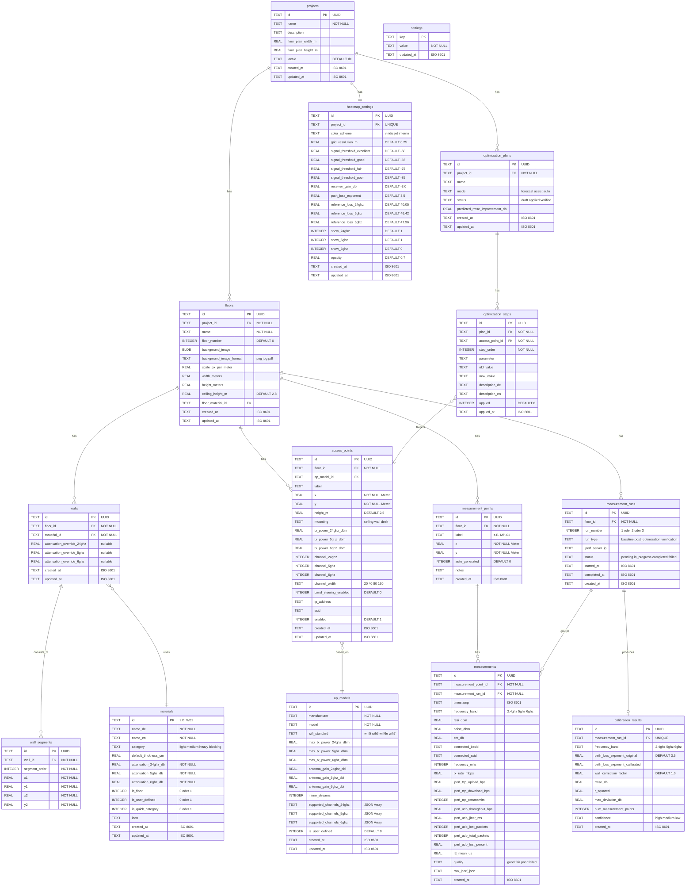

# Datenmodell: WLAN-Optimizer

> **Phase 5 Deliverable** | **Datum:** 2026-02-27 | **Status:** Entwurf
>
> Vollstaendiges Datenmodell fuer SQLite (rusqlite), TypeScript-Interfaces
> und Rust-Structs. Dient als Referenz fuer die Implementierung in Phase 8.
>
> **Entscheidungsgrundlage:**
> - D-04: SQLite via rusqlite
> - D-07: 10-12 Kernmaterialien + 3 Quick-Kategorien, user-editierbar
> - D-08: Multi-Floor in Datenstruktur, UI nur 1 Stockwerk im MVP
> - D-09: 6 GHz Felder in Datenstruktur, UI nur 2.4+5 GHz im MVP
> - D-10: DAP-X2810 + Custom AP-Profil
> - D-17: 3 Heatmap-Farbschemata (Viridis Default)

---

## Inhaltsverzeichnis

1. [ER-Diagramm](#1-er-diagramm)
2. [SQLite Schema (vollstaendig)](#2-sqlite-schema-vollstaendig)
3. [Seed-Daten](#3-seed-daten)
4. [TypeScript Interfaces](#4-typescript-interfaces)
5. [Rust Structs](#5-rust-structs)
6. [Migrations-Strategie](#6-migrations-strategie)
7. [Undo/Redo Pattern](#7-undoredo-pattern)
8. [Datenfluss](#8-datenfluss)

---

## 1. ER-Diagramm



---

## 2. SQLite Schema (vollstaendig)

### 2.1 Einstellungen & Metadaten

```sql
-- Globale Einstellungen (Key-Value Store)
CREATE TABLE IF NOT EXISTS settings (
    key        TEXT PRIMARY KEY,
    value      TEXT NOT NULL,
    updated_at TEXT NOT NULL DEFAULT (strftime('%Y-%m-%dT%H:%M:%fZ', 'now'))
);
```

### 2.2 Projekte

```sql
CREATE TABLE IF NOT EXISTS projects (
    id                  TEXT PRIMARY KEY,
    name                TEXT NOT NULL,
    description         TEXT,
    floor_plan_width_m  REAL,
    floor_plan_height_m REAL,
    locale              TEXT NOT NULL DEFAULT 'de'
                        CHECK (locale IN ('de', 'en')),
    created_at          TEXT NOT NULL DEFAULT (strftime('%Y-%m-%dT%H:%M:%fZ', 'now')),
    updated_at          TEXT NOT NULL DEFAULT (strftime('%Y-%m-%dT%H:%M:%fZ', 'now'))
);

CREATE INDEX IF NOT EXISTS idx_projects_updated ON projects(updated_at DESC);
```

### 2.3 Stockwerke

```sql
CREATE TABLE IF NOT EXISTS floors (
    id                      TEXT PRIMARY KEY,
    project_id              TEXT NOT NULL REFERENCES projects(id) ON DELETE CASCADE,
    name                    TEXT NOT NULL,
    floor_number            INTEGER NOT NULL DEFAULT 0,
    background_image        BLOB,
    background_image_format TEXT CHECK (background_image_format IN ('png', 'jpg', 'pdf')),
    scale_px_per_meter      REAL CHECK (scale_px_per_meter IS NULL OR scale_px_per_meter > 0),
    width_meters            REAL CHECK (width_meters IS NULL OR width_meters > 0),
    height_meters           REAL CHECK (height_meters IS NULL OR height_meters > 0),
    ceiling_height_m        REAL NOT NULL DEFAULT 2.8
                            CHECK (ceiling_height_m > 0 AND ceiling_height_m < 10),
    floor_material_id       TEXT REFERENCES materials(id) ON DELETE SET NULL,
    created_at              TEXT NOT NULL DEFAULT (strftime('%Y-%m-%dT%H:%M:%fZ', 'now')),
    updated_at              TEXT NOT NULL DEFAULT (strftime('%Y-%m-%dT%H:%M:%fZ', 'now')),
    UNIQUE(project_id, floor_number)
);

CREATE INDEX IF NOT EXISTS idx_floors_project ON floors(project_id);
```

### 2.4 Materialien

```sql
CREATE TABLE IF NOT EXISTS materials (
    id                   TEXT PRIMARY KEY,
    name_de              TEXT NOT NULL,
    name_en              TEXT NOT NULL,
    category             TEXT NOT NULL
                         CHECK (category IN ('light', 'medium', 'heavy', 'blocking')),
    default_thickness_cm REAL CHECK (default_thickness_cm IS NULL OR default_thickness_cm >= 0),
    attenuation_24ghz_db REAL NOT NULL CHECK (attenuation_24ghz_db >= 0),
    attenuation_5ghz_db  REAL NOT NULL CHECK (attenuation_5ghz_db >= 0),
    attenuation_6ghz_db  REAL NOT NULL CHECK (attenuation_6ghz_db >= 0),
    is_floor             INTEGER NOT NULL DEFAULT 0 CHECK (is_floor IN (0, 1)),
    is_user_defined      INTEGER NOT NULL DEFAULT 0 CHECK (is_user_defined IN (0, 1)),
    is_quick_category    INTEGER NOT NULL DEFAULT 0 CHECK (is_quick_category IN (0, 1)),
    icon                 TEXT,
    created_at           TEXT NOT NULL DEFAULT (strftime('%Y-%m-%dT%H:%M:%fZ', 'now')),
    updated_at           TEXT NOT NULL DEFAULT (strftime('%Y-%m-%dT%H:%M:%fZ', 'now'))
);

CREATE INDEX IF NOT EXISTS idx_materials_category ON materials(category);
CREATE INDEX IF NOT EXISTS idx_materials_is_floor ON materials(is_floor);
```

### 2.5 Waende & Wandsegmente

```sql
CREATE TABLE IF NOT EXISTS walls (
    id                         TEXT PRIMARY KEY,
    floor_id                   TEXT NOT NULL REFERENCES floors(id) ON DELETE CASCADE,
    material_id                TEXT NOT NULL REFERENCES materials(id) ON DELETE RESTRICT,
    attenuation_override_24ghz REAL CHECK (attenuation_override_24ghz IS NULL
                                           OR attenuation_override_24ghz >= 0),
    attenuation_override_5ghz  REAL CHECK (attenuation_override_5ghz IS NULL
                                           OR attenuation_override_5ghz >= 0),
    attenuation_override_6ghz  REAL CHECK (attenuation_override_6ghz IS NULL
                                           OR attenuation_override_6ghz >= 0),
    created_at                 TEXT NOT NULL DEFAULT (strftime('%Y-%m-%dT%H:%M:%fZ', 'now')),
    updated_at                 TEXT NOT NULL DEFAULT (strftime('%Y-%m-%dT%H:%M:%fZ', 'now'))
);

CREATE INDEX IF NOT EXISTS idx_walls_floor ON walls(floor_id);
CREATE INDEX IF NOT EXISTS idx_walls_material ON walls(material_id);

CREATE TABLE IF NOT EXISTS wall_segments (
    id            TEXT PRIMARY KEY,
    wall_id       TEXT NOT NULL REFERENCES walls(id) ON DELETE CASCADE,
    segment_order INTEGER NOT NULL CHECK (segment_order >= 0),
    x1            REAL NOT NULL,
    y1            REAL NOT NULL,
    x2            REAL NOT NULL,
    y2            REAL NOT NULL,
    UNIQUE(wall_id, segment_order)
);

CREATE INDEX IF NOT EXISTS idx_wall_segments_wall ON wall_segments(wall_id);
```

### 2.6 AP-Modelle & Access Points

```sql
CREATE TABLE IF NOT EXISTS ap_models (
    id                       TEXT PRIMARY KEY,
    manufacturer             TEXT NOT NULL,
    model                    TEXT NOT NULL,
    wifi_standard            TEXT CHECK (wifi_standard IN ('wifi5', 'wifi6', 'wifi6e', 'wifi7')),
    max_tx_power_24ghz_dbm   REAL CHECK (max_tx_power_24ghz_dbm IS NULL
                                         OR (max_tx_power_24ghz_dbm >= 0
                                             AND max_tx_power_24ghz_dbm <= 30)),
    max_tx_power_5ghz_dbm    REAL CHECK (max_tx_power_5ghz_dbm IS NULL
                                         OR (max_tx_power_5ghz_dbm >= 0
                                             AND max_tx_power_5ghz_dbm <= 36)),
    max_tx_power_6ghz_dbm    REAL CHECK (max_tx_power_6ghz_dbm IS NULL
                                         OR (max_tx_power_6ghz_dbm >= 0
                                             AND max_tx_power_6ghz_dbm <= 36)),
    antenna_gain_24ghz_dbi   REAL CHECK (antenna_gain_24ghz_dbi IS NULL
                                         OR (antenna_gain_24ghz_dbi >= -5
                                             AND antenna_gain_24ghz_dbi <= 20)),
    antenna_gain_5ghz_dbi    REAL CHECK (antenna_gain_5ghz_dbi IS NULL
                                         OR (antenna_gain_5ghz_dbi >= -5
                                             AND antenna_gain_5ghz_dbi <= 20)),
    antenna_gain_6ghz_dbi    REAL CHECK (antenna_gain_6ghz_dbi IS NULL
                                         OR (antenna_gain_6ghz_dbi >= -5
                                             AND antenna_gain_6ghz_dbi <= 20)),
    mimo_streams             INTEGER CHECK (mimo_streams IS NULL
                                           OR (mimo_streams >= 1 AND mimo_streams <= 16)),
    supported_channels_24ghz TEXT, -- JSON Array, z.B. [1,6,11]
    supported_channels_5ghz  TEXT, -- JSON Array
    supported_channels_6ghz  TEXT, -- JSON Array
    is_user_defined          INTEGER NOT NULL DEFAULT 0 CHECK (is_user_defined IN (0, 1)),
    created_at               TEXT NOT NULL DEFAULT (strftime('%Y-%m-%dT%H:%M:%fZ', 'now')),
    updated_at               TEXT NOT NULL DEFAULT (strftime('%Y-%m-%dT%H:%M:%fZ', 'now')),
    UNIQUE(manufacturer, model)
);

CREATE TABLE IF NOT EXISTS access_points (
    id                    TEXT PRIMARY KEY,
    floor_id              TEXT NOT NULL REFERENCES floors(id) ON DELETE CASCADE,
    ap_model_id           TEXT REFERENCES ap_models(id) ON DELETE SET NULL,
    label                 TEXT,
    x                     REAL NOT NULL,
    y                     REAL NOT NULL,
    height_m              REAL NOT NULL DEFAULT 2.5
                          CHECK (height_m > 0 AND height_m < 10),
    mounting              TEXT NOT NULL DEFAULT 'ceiling'
                          CHECK (mounting IN ('ceiling', 'wall', 'desk')),
    tx_power_24ghz_dbm    REAL CHECK (tx_power_24ghz_dbm IS NULL
                                      OR (tx_power_24ghz_dbm >= 0
                                          AND tx_power_24ghz_dbm <= 30)),
    tx_power_5ghz_dbm     REAL CHECK (tx_power_5ghz_dbm IS NULL
                                      OR (tx_power_5ghz_dbm >= 0
                                          AND tx_power_5ghz_dbm <= 36)),
    tx_power_6ghz_dbm     REAL CHECK (tx_power_6ghz_dbm IS NULL
                                      OR (tx_power_6ghz_dbm >= 0
                                          AND tx_power_6ghz_dbm <= 36)),
    channel_24ghz         INTEGER CHECK (channel_24ghz IS NULL
                                         OR (channel_24ghz >= 1 AND channel_24ghz <= 14)),
    channel_5ghz          INTEGER CHECK (channel_5ghz IS NULL
                                         OR (channel_5ghz >= 36 AND channel_5ghz <= 177)),
    channel_6ghz          INTEGER CHECK (channel_6ghz IS NULL
                                         OR (channel_6ghz >= 1 AND channel_6ghz <= 233)),
    channel_width         TEXT NOT NULL DEFAULT '80'
                          CHECK (channel_width IN ('20', '40', '80', '160')),
    band_steering_enabled INTEGER NOT NULL DEFAULT 0 CHECK (band_steering_enabled IN (0, 1)),
    ip_address            TEXT,
    ssid                  TEXT,
    enabled               INTEGER NOT NULL DEFAULT 1 CHECK (enabled IN (0, 1)),
    created_at            TEXT NOT NULL DEFAULT (strftime('%Y-%m-%dT%H:%M:%fZ', 'now')),
    updated_at            TEXT NOT NULL DEFAULT (strftime('%Y-%m-%dT%H:%M:%fZ', 'now'))
);

CREATE INDEX IF NOT EXISTS idx_access_points_floor ON access_points(floor_id);
CREATE INDEX IF NOT EXISTS idx_access_points_model ON access_points(ap_model_id);
```

### 2.7 Messpunkte, Messlaeufe & Messungen

```sql
CREATE TABLE IF NOT EXISTS measurement_points (
    id             TEXT PRIMARY KEY,
    floor_id       TEXT NOT NULL REFERENCES floors(id) ON DELETE CASCADE,
    label          TEXT NOT NULL,
    x              REAL NOT NULL,
    y              REAL NOT NULL,
    auto_generated INTEGER NOT NULL DEFAULT 0 CHECK (auto_generated IN (0, 1)),
    notes          TEXT,
    created_at     TEXT NOT NULL DEFAULT (strftime('%Y-%m-%dT%H:%M:%fZ', 'now'))
);

CREATE INDEX IF NOT EXISTS idx_mpoints_floor ON measurement_points(floor_id);

CREATE TABLE IF NOT EXISTS measurement_runs (
    id              TEXT PRIMARY KEY,
    floor_id        TEXT NOT NULL REFERENCES floors(id) ON DELETE CASCADE,
    run_number      INTEGER NOT NULL CHECK (run_number >= 1 AND run_number <= 3),
    run_type        TEXT NOT NULL
                    CHECK (run_type IN ('baseline', 'post_optimization', 'verification')),
    iperf_server_ip TEXT,
    status          TEXT NOT NULL DEFAULT 'pending'
                    CHECK (status IN ('pending', 'in_progress', 'completed', 'failed')),
    started_at      TEXT,
    completed_at    TEXT,
    created_at      TEXT NOT NULL DEFAULT (strftime('%Y-%m-%dT%H:%M:%fZ', 'now'))
);

CREATE INDEX IF NOT EXISTS idx_mruns_floor ON measurement_runs(floor_id);
CREATE INDEX IF NOT EXISTS idx_mruns_status ON measurement_runs(status);

CREATE TABLE IF NOT EXISTS measurements (
    id                       TEXT PRIMARY KEY,
    measurement_point_id     TEXT NOT NULL
                             REFERENCES measurement_points(id) ON DELETE CASCADE,
    measurement_run_id       TEXT NOT NULL
                             REFERENCES measurement_runs(id) ON DELETE CASCADE,
    timestamp                TEXT NOT NULL
                             DEFAULT (strftime('%Y-%m-%dT%H:%M:%fZ', 'now')),
    frequency_band           TEXT NOT NULL
                             CHECK (frequency_band IN ('2.4ghz', '5ghz', '6ghz')),
    rssi_dbm                 REAL CHECK (rssi_dbm IS NULL
                                         OR (rssi_dbm >= -120 AND rssi_dbm <= 0)),
    noise_dbm                REAL CHECK (noise_dbm IS NULL
                                         OR (noise_dbm >= -120 AND noise_dbm <= 0)),
    snr_db                   REAL CHECK (snr_db IS NULL
                                         OR (snr_db >= 0 AND snr_db <= 100)),
    connected_bssid          TEXT,
    connected_ssid           TEXT,
    frequency_mhz            INTEGER CHECK (frequency_mhz IS NULL
                                            OR (frequency_mhz >= 2400
                                                AND frequency_mhz <= 7200)),
    tx_rate_mbps             REAL CHECK (tx_rate_mbps IS NULL OR tx_rate_mbps >= 0),
    iperf_tcp_upload_bps     REAL CHECK (iperf_tcp_upload_bps IS NULL
                                         OR iperf_tcp_upload_bps >= 0),
    iperf_tcp_download_bps   REAL CHECK (iperf_tcp_download_bps IS NULL
                                         OR iperf_tcp_download_bps >= 0),
    iperf_tcp_retransmits    INTEGER CHECK (iperf_tcp_retransmits IS NULL
                                           OR iperf_tcp_retransmits >= 0),
    iperf_udp_throughput_bps REAL CHECK (iperf_udp_throughput_bps IS NULL
                                         OR iperf_udp_throughput_bps >= 0),
    iperf_udp_jitter_ms      REAL CHECK (iperf_udp_jitter_ms IS NULL
                                         OR iperf_udp_jitter_ms >= 0),
    iperf_udp_lost_packets   INTEGER CHECK (iperf_udp_lost_packets IS NULL
                                           OR iperf_udp_lost_packets >= 0),
    iperf_udp_total_packets  INTEGER CHECK (iperf_udp_total_packets IS NULL
                                           OR iperf_udp_total_packets >= 0),
    iperf_udp_lost_percent   REAL CHECK (iperf_udp_lost_percent IS NULL
                                         OR (iperf_udp_lost_percent >= 0
                                             AND iperf_udp_lost_percent <= 100)),
    rtt_mean_us              REAL CHECK (rtt_mean_us IS NULL OR rtt_mean_us >= 0),
    quality                  TEXT NOT NULL DEFAULT 'good'
                             CHECK (quality IN ('good', 'fair', 'poor', 'failed')),
    raw_iperf_json           TEXT,
    created_at               TEXT NOT NULL DEFAULT (strftime('%Y-%m-%dT%H:%M:%fZ', 'now'))
);

CREATE INDEX IF NOT EXISTS idx_measurements_point ON measurements(measurement_point_id);
CREATE INDEX IF NOT EXISTS idx_measurements_run ON measurements(measurement_run_id);
CREATE INDEX IF NOT EXISTS idx_measurements_band ON measurements(frequency_band);
```

### 2.8 Kalibrierung

```sql
CREATE TABLE IF NOT EXISTS calibration_results (
    id                            TEXT PRIMARY KEY,
    measurement_run_id            TEXT NOT NULL UNIQUE
                                  REFERENCES measurement_runs(id) ON DELETE CASCADE,
    frequency_band                TEXT NOT NULL
                                  CHECK (frequency_band IN ('2.4ghz', '5ghz', '6ghz')),
    path_loss_exponent_original   REAL NOT NULL DEFAULT 3.5,
    path_loss_exponent_calibrated REAL CHECK (path_loss_exponent_calibrated IS NULL
                                              OR (path_loss_exponent_calibrated >= 1.5
                                                  AND path_loss_exponent_calibrated <= 6.0)),
    wall_correction_factor        REAL NOT NULL DEFAULT 1.0
                                  CHECK (wall_correction_factor >= 0.1
                                         AND wall_correction_factor <= 3.0),
    rmse_db                       REAL CHECK (rmse_db IS NULL OR rmse_db >= 0),
    r_squared                     REAL CHECK (r_squared IS NULL
                                              OR (r_squared >= 0 AND r_squared <= 1.0)),
    max_deviation_db              REAL CHECK (max_deviation_db IS NULL OR max_deviation_db >= 0),
    num_measurement_points        INTEGER NOT NULL CHECK (num_measurement_points >= 1),
    confidence                    TEXT NOT NULL DEFAULT 'low'
                                  CHECK (confidence IN ('high', 'medium', 'low')),
    created_at                    TEXT NOT NULL
                                  DEFAULT (strftime('%Y-%m-%dT%H:%M:%fZ', 'now'))
);

CREATE INDEX IF NOT EXISTS idx_calibration_run ON calibration_results(measurement_run_id);
```

### 2.9 Heatmap-Einstellungen

```sql
CREATE TABLE IF NOT EXISTS heatmap_settings (
    id                         TEXT PRIMARY KEY,
    project_id                 TEXT NOT NULL UNIQUE
                               REFERENCES projects(id) ON DELETE CASCADE,
    color_scheme               TEXT NOT NULL DEFAULT 'viridis'
                               CHECK (color_scheme IN ('viridis', 'jet', 'inferno')),
    grid_resolution_m          REAL NOT NULL DEFAULT 0.25
                               CHECK (grid_resolution_m >= 0.1
                                      AND grid_resolution_m <= 2.0),
    signal_threshold_excellent REAL NOT NULL DEFAULT -50.0,
    signal_threshold_good      REAL NOT NULL DEFAULT -65.0,
    signal_threshold_fair      REAL NOT NULL DEFAULT -75.0,
    signal_threshold_poor      REAL NOT NULL DEFAULT -85.0,
    receiver_gain_dbi          REAL NOT NULL DEFAULT -3.0,
    path_loss_exponent         REAL NOT NULL DEFAULT 3.5
                               CHECK (path_loss_exponent >= 1.5
                                      AND path_loss_exponent <= 6.0),
    reference_loss_24ghz       REAL NOT NULL DEFAULT 40.05,
    reference_loss_5ghz        REAL NOT NULL DEFAULT 46.42,
    reference_loss_6ghz        REAL NOT NULL DEFAULT 47.96,
    show_24ghz                 INTEGER NOT NULL DEFAULT 1 CHECK (show_24ghz IN (0, 1)),
    show_5ghz                  INTEGER NOT NULL DEFAULT 1 CHECK (show_5ghz IN (0, 1)),
    show_6ghz                  INTEGER NOT NULL DEFAULT 0 CHECK (show_6ghz IN (0, 1)),
    opacity                    REAL NOT NULL DEFAULT 0.7
                               CHECK (opacity >= 0.0 AND opacity <= 1.0),
    created_at                 TEXT NOT NULL DEFAULT (strftime('%Y-%m-%dT%H:%M:%fZ', 'now')),
    updated_at                 TEXT NOT NULL DEFAULT (strftime('%Y-%m-%dT%H:%M:%fZ', 'now'))
);
```

### 2.10 Optimierung

```sql
CREATE TABLE IF NOT EXISTS optimization_plans (
    id                            TEXT PRIMARY KEY,
    project_id                    TEXT NOT NULL
                                  REFERENCES projects(id) ON DELETE CASCADE,
    name                          TEXT,
    mode                          TEXT NOT NULL DEFAULT 'forecast'
                                  CHECK (mode IN ('forecast', 'assist', 'auto')),
    status                        TEXT NOT NULL DEFAULT 'draft'
                                  CHECK (status IN ('draft', 'applied', 'verified')),
    predicted_rmse_improvement_db REAL,
    created_at                    TEXT NOT NULL
                                  DEFAULT (strftime('%Y-%m-%dT%H:%M:%fZ', 'now')),
    updated_at                    TEXT NOT NULL
                                  DEFAULT (strftime('%Y-%m-%dT%H:%M:%fZ', 'now'))
);

CREATE INDEX IF NOT EXISTS idx_optplans_project ON optimization_plans(project_id);

CREATE TABLE IF NOT EXISTS optimization_steps (
    id              TEXT PRIMARY KEY,
    plan_id         TEXT NOT NULL
                    REFERENCES optimization_plans(id) ON DELETE CASCADE,
    access_point_id TEXT NOT NULL
                    REFERENCES access_points(id) ON DELETE CASCADE,
    step_order      INTEGER NOT NULL CHECK (step_order >= 0),
    parameter       TEXT NOT NULL
                    CHECK (parameter IN (
                        'tx_power_24ghz', 'tx_power_5ghz', 'tx_power_6ghz',
                        'channel_24ghz', 'channel_5ghz', 'channel_6ghz',
                        'channel_width', 'band_steering', 'enabled'
                    )),
    old_value       TEXT,
    new_value       TEXT,
    description_de  TEXT,
    description_en  TEXT,
    applied         INTEGER NOT NULL DEFAULT 0 CHECK (applied IN (0, 1)),
    applied_at      TEXT,
    UNIQUE(plan_id, step_order)
);

CREATE INDEX IF NOT EXISTS idx_optsteps_plan ON optimization_steps(plan_id);
CREATE INDEX IF NOT EXISTS idx_optsteps_ap ON optimization_steps(access_point_id);
```

### 2.11 Undo-History

```sql
CREATE TABLE IF NOT EXISTS undo_history (
    id           INTEGER PRIMARY KEY AUTOINCREMENT,
    project_id   TEXT NOT NULL REFERENCES projects(id) ON DELETE CASCADE,
    command_type TEXT NOT NULL, -- 'create', 'update', 'delete'
    entity_type  TEXT NOT NULL, -- 'wall', 'access_point', 'material', ...
    entity_id    TEXT NOT NULL,
    old_data     TEXT NOT NULL, -- JSON-Snapshot vor Aenderung
    new_data     TEXT NOT NULL, -- JSON-Snapshot nach Aenderung
    description  TEXT,
    created_at   TEXT NOT NULL DEFAULT (strftime('%Y-%m-%dT%H:%M:%fZ', 'now'))
);

CREATE INDEX IF NOT EXISTS idx_undo_project ON undo_history(project_id, id DESC);
```

---

## 3. Seed-Daten

### 3.1 Schema-Version

```sql
INSERT INTO settings (key, value) VALUES
    ('schema_version', '1'),
    ('app_version', '0.1.0'),
    ('default_locale', 'de');
```

### 3.2 Kernmaterialien (12 Wandmaterialien)

Werte aus `docs/research/RF-Materialien.md`, Tabelle 2.1 (konservative Defaults).
Auswahl gemaess D-07: 10-12 Kernmaterialien fuer den MVP.

```sql
INSERT INTO materials (id, name_de, name_en, category, default_thickness_cm,
    attenuation_24ghz_db, attenuation_5ghz_db, attenuation_6ghz_db,
    is_floor, is_user_defined, is_quick_category, icon) VALUES
-- Leichte Materialien
('W01', 'Gipskarton (einfach)',  'Drywall (single)',  'light',  1.25,
     2,   3,   4, 0, 0, 0, 'drywall'),
('W02', 'Gipskarton (doppelt)',  'Drywall (double)',  'light', 10.0,
     5,   7,   9, 0, 0, 0, 'drywall-double'),
('W04', 'Holzstaenderwand',      'Wood stud wall',    'light', 12.0,
     5,   8,  10, 0, 0, 0, 'wood'),
('W05', 'Holztuere (innen)',     'Interior door',     'light',  4.0,
     4,   6,   7, 0, 0, 0, 'door'),
-- Mittlere Materialien
('W08', 'Doppelverglasung',      'Double glazing',    'medium', 2.4,
     5,   9,  11, 0, 0, 0, 'window'),
('W11', 'Ziegelwand duenn',      'Thin brick wall',   'medium', 11.5,
     8,  16,  19, 0, 0, 0, 'brick'),
('W12', 'Ziegelwand mittel',     'Medium brick wall', 'medium', 17.5,
    10,  20,  24, 0, 0, 0, 'brick-medium'),
('W14', 'Porenbeton (Ytong)',    'AAC (Ytong)',       'medium', 17.5,
    10,  18,  22, 0, 0, 0, 'aac'),
-- Schwere Materialien
('W18', 'Beton duenn',           'Thin concrete',     'heavy',  10.0,
    15,  25,  30, 0, 0, 0, 'concrete'),
('W19', 'Beton mittel',          'Medium concrete',   'heavy',  15.0,
    20,  35,  42, 0, 0, 0, 'concrete-medium'),
('W21', 'Stahlbeton',            'Reinforced concrete','heavy', 20.0,
    35,  55,  62, 0, 0, 0, 'concrete-reinforced'),
('W22', 'Metalltuer',            'Metal door',        'heavy',   5.0,
    18,  22,  25, 0, 0, 0, 'metal-door');
```

### 3.3 Quick-Kategorien (3 Schnellauswahl)

Gemaess D-07 und RF-Materialien.md Tabelle 2.3.

```sql
INSERT INTO materials (id, name_de, name_en, category, default_thickness_cm,
    attenuation_24ghz_db, attenuation_5ghz_db, attenuation_6ghz_db,
    is_floor, is_user_defined, is_quick_category, icon) VALUES
('Q01', 'Leichte Wand',  'Light wall',  'light',  10.0,
     4,   6,   8, 0, 0, 1, 'category-light'),
('Q02', 'Mittlere Wand', 'Medium wall', 'medium', 17.5,
    12,  20,  24, 0, 0, 1, 'category-medium'),
('Q03', 'Schwere Wand',  'Heavy wall',  'heavy',  20.0,
    25,  45,  52, 0, 0, 1, 'category-heavy');
```

### 3.4 Geschossdecken (4 Deckenmaterialien)

Werte aus RF-Materialien.md Tabelle 2.2. Relevant fuer Multi-Floor (D-08).

```sql
INSERT INTO materials (id, name_de, name_en, category, default_thickness_cm,
    attenuation_24ghz_db, attenuation_5ghz_db, attenuation_6ghz_db,
    is_floor, is_user_defined, is_quick_category, icon) VALUES
('F01', 'Stahlbetondecke (Standard)',    'RC ceiling (standard)',           'heavy', 20.0,
    25,  40,  48, 1, 0, 0, 'floor-concrete'),
('F02', 'Stahlbetondecke + FBH',         'RC ceiling + underfloor heating', 'heavy', 25.0,
    32,  48,  55, 1, 0, 0, 'floor-concrete-fbh'),
('F03', 'Holzbalkendecke',               'Wooden beam ceiling',             'medium', 25.0,
    15,  22,  26, 1, 0, 0, 'floor-wood'),
('F04', 'Stahlbetondecke (komplett)',     'RC ceiling (full buildup)',       'heavy', 30.0,
    35,  55,  62, 1, 0, 0, 'floor-concrete-full');
```

### 3.5 AP-Modell: D-Link DAP-X2810

Werte aus Hardware-Kontext (CLAUDE.md) und AP-Steuerung.md (D-10).

```sql
INSERT INTO ap_models (id, manufacturer, model, wifi_standard,
    max_tx_power_24ghz_dbm, max_tx_power_5ghz_dbm, max_tx_power_6ghz_dbm,
    antenna_gain_24ghz_dbi, antenna_gain_5ghz_dbi, antenna_gain_6ghz_dbi,
    mimo_streams,
    supported_channels_24ghz, supported_channels_5ghz, supported_channels_6ghz,
    is_user_defined) VALUES
('dap-x2810', 'D-Link', 'DAP-X2810', 'wifi6',
    23.0, 26.0, NULL,
    3.2, 4.3, NULL,
    2,
    '[1,2,3,4,5,6,7,8,9,10,11,12,13]',
    '[36,40,44,48,52,56,60,64,100,104,108,112,116,120,124,128,132,136,140,149,153,157,161,165]',
    NULL,
    0);
```

### 3.6 Custom AP-Profil (Template)

Gemaess D-10: Benutzer kann eigene APs mit manueller Parametereingabe verwenden.

```sql
INSERT INTO ap_models (id, manufacturer, model, wifi_standard,
    max_tx_power_24ghz_dbm, max_tx_power_5ghz_dbm, max_tx_power_6ghz_dbm,
    antenna_gain_24ghz_dbi, antenna_gain_5ghz_dbi, antenna_gain_6ghz_dbi,
    mimo_streams,
    supported_channels_24ghz, supported_channels_5ghz, supported_channels_6ghz,
    is_user_defined) VALUES
('custom-ap', 'Custom', 'Benutzerdefiniert', 'wifi6',
    20.0, 23.0, NULL,
    2.0, 3.0, NULL,
    2,
    '[1,6,11]',
    '[36,40,44,48]',
    NULL,
    1);
```

### 3.7 Default Heatmap-Einstellungen (Referenz)

Werden beim Erstellen eines neuen Projekts automatisch mit diesen Werten angelegt.
Quellen: rf-modell.md (Signal-Schwellen, FSPL-Werte), D-17 (Viridis).

| Parameter | Default | Quelle |
|-----------|---------|--------|
| color_scheme | viridis | D-17 |
| grid_resolution_m | 0.25 | D-04 PoC-Benchmark |
| signal_threshold_excellent | -50 dBm | rf-modell.md |
| signal_threshold_good | -65 dBm | rf-modell.md |
| signal_threshold_fair | -75 dBm | rf-modell.md |
| signal_threshold_poor | -85 dBm | rf-modell.md |
| receiver_gain_dbi | -3.0 dBi | rf-modell.md (Smartphone) |
| path_loss_exponent | 3.5 | rf-modell.md (Wohngebaeude) |
| reference_loss_24ghz | 40.05 dB | FSPL @ 1m, 2.4 GHz |
| reference_loss_5ghz | 46.42 dB | FSPL @ 1m, 5 GHz |
| reference_loss_6ghz | 47.96 dB | FSPL @ 1m, 6 GHz |
| show_24ghz | true | MVP |
| show_5ghz | true | MVP |
| show_6ghz | false | D-09: erst spaeter |
| opacity | 0.7 | Heatmap halbtransparent |

---

## 4. TypeScript Interfaces

### 4.1 Basis-Typen

```typescript
/** Position in Metern relativ zum Grundriss-Ursprung (links oben) */
export interface Position {
  x: number;
  y: number;
}

/** Abmessungen in Metern */
export interface Dimensions {
  width: number;
  height: number;
}

/** Liniensegment mit Start- und Endpunkt */
export interface LineSegment {
  x1: number;
  y1: number;
  x2: number;
  y2: number;
}

export type FrequencyBand = '2.4ghz' | '5ghz' | '6ghz';
export type MaterialCategory = 'light' | 'medium' | 'heavy' | 'blocking';
export type MountingType = 'ceiling' | 'wall' | 'desk';
export type ChannelWidth = '20' | '40' | '80' | '160';
export type WifiStandard = 'wifi5' | 'wifi6' | 'wifi6e' | 'wifi7';
export type ColorScheme = 'viridis' | 'jet' | 'inferno';
export type RunType = 'baseline' | 'post_optimization' | 'verification';
export type MeasurementQuality = 'good' | 'fair' | 'poor' | 'failed';
export type ConfidenceLevel = 'high' | 'medium' | 'low';
export type OptimizationMode = 'forecast' | 'assist' | 'auto';

/** Daempfungswerte pro Frequenzband */
export interface AttenuationPerBand {
  '2.4ghz': number;
  '5ghz': number;
  '6ghz': number;
}
```

### 4.2 Entitaets-Interfaces

```typescript
export interface Project {
  id: string;
  name: string;
  description: string | null;
  floorPlanWidthM: number | null;
  floorPlanHeightM: number | null;
  locale: 'de' | 'en';
  createdAt: string;
  updatedAt: string;
}

export interface Floor {
  id: string;
  projectId: string;
  name: string;
  floorNumber: number;
  backgroundImage: ArrayBuffer | null;
  backgroundImageFormat: 'png' | 'jpg' | 'pdf' | null;
  scalePxPerMeter: number | null;
  widthMeters: number | null;
  heightMeters: number | null;
  ceilingHeightM: number;
  floorMaterialId: string | null;
  createdAt: string;
  updatedAt: string;
}

export interface Material {
  id: string;
  nameDe: string;
  nameEn: string;
  category: MaterialCategory;
  defaultThicknessCm: number | null;
  attenuation24ghzDb: number;
  attenuation5ghzDb: number;
  attenuation6ghzDb: number;
  isFloor: boolean;
  isUserDefined: boolean;
  isQuickCategory: boolean;
  icon: string | null;
  createdAt: string;
  updatedAt: string;
}

export interface Wall {
  id: string;
  floorId: string;
  materialId: string;
  attenuationOverride24ghz: number | null;
  attenuationOverride5ghz: number | null;
  attenuationOverride6ghz: number | null;
  createdAt: string;
  updatedAt: string;
}

export interface WallSegment {
  id: string;
  wallId: string;
  segmentOrder: number;
  x1: number;
  y1: number;
  x2: number;
  y2: number;
}

/** Wand mit aufgeloestem Material und Segmenten */
export interface WallWithDetails extends Wall {
  material: Material;
  segments: WallSegment[];
}

export interface ApModel {
  id: string;
  manufacturer: string;
  model: string;
  wifiStandard: WifiStandard | null;
  maxTxPower24ghzDbm: number | null;
  maxTxPower5ghzDbm: number | null;
  maxTxPower6ghzDbm: number | null;
  antennaGain24ghzDbi: number | null;
  antennaGain5ghzDbi: number | null;
  antennaGain6ghzDbi: number | null;
  mimoStreams: number | null;
  supportedChannels24ghz: number[] | null;
  supportedChannels5ghz: number[] | null;
  supportedChannels6ghz: number[] | null;
  isUserDefined: boolean;
  createdAt: string;
  updatedAt: string;
}

export interface AccessPoint {
  id: string;
  floorId: string;
  apModelId: string | null;
  label: string | null;
  x: number;
  y: number;
  heightM: number;
  mounting: MountingType;
  txPower24ghzDbm: number | null;
  txPower5ghzDbm: number | null;
  txPower6ghzDbm: number | null;
  channel24ghz: number | null;
  channel5ghz: number | null;
  channel6ghz: number | null;
  channelWidth: ChannelWidth;
  bandSteeringEnabled: boolean;
  ipAddress: string | null;
  ssid: string | null;
  enabled: boolean;
  createdAt: string;
  updatedAt: string;
}

/** Access Point mit aufgeloestem Modell */
export interface AccessPointWithModel extends AccessPoint {
  apModel: ApModel | null;
}

export interface MeasurementPoint {
  id: string;
  floorId: string;
  label: string;
  x: number;
  y: number;
  autoGenerated: boolean;
  notes: string | null;
  createdAt: string;
}

export interface MeasurementRun {
  id: string;
  floorId: string;
  runNumber: 1 | 2 | 3;
  runType: RunType;
  iperfServerIp: string | null;
  status: 'pending' | 'in_progress' | 'completed' | 'failed';
  startedAt: string | null;
  completedAt: string | null;
  createdAt: string;
}

export interface Measurement {
  id: string;
  measurementPointId: string;
  measurementRunId: string;
  timestamp: string;
  frequencyBand: FrequencyBand;
  rssiDbm: number | null;
  noiseDbm: number | null;
  snrDb: number | null;
  connectedBssid: string | null;
  connectedSsid: string | null;
  frequencyMhz: number | null;
  txRateMbps: number | null;
  iperfTcpUploadBps: number | null;
  iperfTcpDownloadBps: number | null;
  iperfTcpRetransmits: number | null;
  iperfUdpThroughputBps: number | null;
  iperfUdpJitterMs: number | null;
  iperfUdpLostPackets: number | null;
  iperfUdpTotalPackets: number | null;
  iperfUdpLostPercent: number | null;
  rttMeanUs: number | null;
  quality: MeasurementQuality;
  rawIperfJson: string | null;
  createdAt: string;
}

export interface CalibrationResult {
  id: string;
  measurementRunId: string;
  frequencyBand: FrequencyBand;
  pathLossExponentOriginal: number;
  pathLossExponentCalibrated: number | null;
  wallCorrectionFactor: number;
  rmseDb: number | null;
  rSquared: number | null;
  maxDeviationDb: number | null;
  numMeasurementPoints: number;
  confidence: ConfidenceLevel;
  createdAt: string;
}

export interface HeatmapSettings {
  id: string;
  projectId: string;
  colorScheme: ColorScheme;
  gridResolutionM: number;
  signalThresholdExcellent: number;
  signalThresholdGood: number;
  signalThresholdFair: number;
  signalThresholdPoor: number;
  receiverGainDbi: number;
  pathLossExponent: number;
  referenceLoss24ghz: number;
  referenceLoss5ghz: number;
  referenceLoss6ghz: number;
  show24ghz: boolean;
  show5ghz: boolean;
  show6ghz: boolean;
  opacity: number;
  createdAt: string;
  updatedAt: string;
}

export interface OptimizationPlan {
  id: string;
  projectId: string;
  name: string | null;
  mode: OptimizationMode;
  status: 'draft' | 'applied' | 'verified';
  predictedRmseImprovementDb: number | null;
  createdAt: string;
  updatedAt: string;
}

export interface OptimizationStep {
  id: string;
  planId: string;
  accessPointId: string;
  stepOrder: number;
  parameter: string;
  oldValue: string | null;
  newValue: string | null;
  descriptionDe: string | null;
  descriptionEn: string | null;
  applied: boolean;
  appliedAt: string | null;
}
```

### 4.3 Canvas-spezifische Typen

```typescript
/** Visuelle Erweiterung fuer Wand auf dem Konva-Canvas */
export interface CanvasWall extends WallWithDetails {
  strokeColor: string;
  strokeWidth: number;
  selected: boolean;
  hovered: boolean;
}

/** Visuelle Erweiterung fuer AP auf dem Konva-Canvas */
export interface CanvasAccessPoint extends AccessPointWithModel {
  iconSrc: string;
  selected: boolean;
  dragging: boolean;
  influenceRadiusPx: number | null;
}

/** Visueller Messpunkt auf dem Canvas */
export interface CanvasMeasurementPoint extends MeasurementPoint {
  statusColor: string;
  measuring: boolean;
  completed: boolean;
}
```

### 4.4 Heatmap-Worker-Typen

```typescript
/** Anfrage an den Heatmap-Berechnungs-Worker */
export interface HeatmapWorkerRequest {
  type: 'calculate';
  payload: {
    dimensions: Dimensions;
    gridResolutionM: number;
    accessPoints: AccessPointForCalculation[];
    walls: WallForCalculation[];
    rfParams: RfModelParams;
    band: FrequencyBand;
    calibration: CalibrationResult | null;
  };
}

/** Antwort vom Heatmap-Worker */
export type HeatmapWorkerResponse =
  | { type: 'progress'; payload: HeatmapProgress }
  | { type: 'result'; payload: HeatmapResult }
  | { type: 'error'; payload: HeatmapError };

export interface HeatmapProgress {
  progress: number; // 0.0 - 1.0
  phase: 'coarse' | 'fine';
}

export interface HeatmapResult {
  rssiGrid: Float32Array; // RSSI-Werte row-major
  gridWidth: number;
  gridHeight: number;
  calculationTimeMs: number;
}

export interface HeatmapError {
  message: string;
  code: string;
}

/** Reduzierter AP fuer den Worker (ohne visuelle Eigenschaften) */
export interface AccessPointForCalculation {
  id: string;
  x: number;
  y: number;
  txPowerDbm: number;
  antennaGainDbi: number;
  enabled: boolean;
}

/** Reduzierte Wand fuer den Worker (nur Geometrie + Daempfung) */
export interface WallForCalculation {
  segments: LineSegment[];
  attenuationDb: number;
}

/** RF-Modell-Parameter fuer die Berechnung */
export interface RfModelParams {
  pathLossExponent: number;
  referenceLossDb: number;
  receiverGainDbi: number;
}
```

### 4.5 IPC-Typen (Tauri Commands)

```typescript
/** Payload fuer Projekt-Erstellung */
export interface CreateProjectPayload {
  name: string;
  description?: string;
  locale?: 'de' | 'en';
}

/** Payload fuer Wand-Erstellung */
export interface CreateWallPayload {
  floorId: string;
  materialId: string;
  segments: Omit<WallSegment, 'id' | 'wallId'>[];
}

/** Payload fuer Wand-Aktualisierung */
export interface UpdateWallPayload {
  wallId: string;
  materialId?: string;
  segments?: Omit<WallSegment, 'id' | 'wallId'>[];
  attenuationOverride24ghz?: number | null;
  attenuationOverride5ghz?: number | null;
  attenuationOverride6ghz?: number | null;
}

/** Payload fuer AP-Erstellung */
export interface CreateAccessPointPayload {
  floorId: string;
  apModelId?: string;
  label?: string;
  x: number;
  y: number;
  heightM?: number;
  mounting?: MountingType;
}

/** Payload fuer AP-Aktualisierung */
export interface UpdateAccessPointPayload {
  accessPointId: string;
  x?: number;
  y?: number;
  heightM?: number;
  mounting?: MountingType;
  txPower24ghzDbm?: number;
  txPower5ghzDbm?: number;
  channel24ghz?: number;
  channel5ghz?: number;
  channelWidth?: ChannelWidth;
  enabled?: boolean;
}

/** Payload fuer Heatmap-Einstellungen */
export interface UpdateHeatmapSettingsPayload {
  projectId: string;
  colorScheme?: ColorScheme;
  gridResolutionM?: number;
  pathLossExponent?: number;
  opacity?: number;
  show24ghz?: boolean;
  show5ghz?: boolean;
}

/** Payload fuer Messung speichern */
export interface SaveMeasurementPayload {
  measurementPointId: string;
  measurementRunId: string;
  frequencyBand: FrequencyBand;
  rssiDbm?: number;
  noiseDbm?: number;
  iperfTcpUploadBps?: number;
  iperfTcpDownloadBps?: number;
  iperfTcpRetransmits?: number;
  iperfUdpThroughputBps?: number;
  iperfUdpJitterMs?: number;
  iperfUdpLostPackets?: number;
  iperfUdpTotalPackets?: number;
  rawIperfJson?: string;
}

/** Payload fuer Kalibrierung starten */
export interface RunCalibrationPayload {
  measurementRunId: string;
  frequencyBand: FrequencyBand;
}
```

---

## 5. Rust Structs

### 5.1 Kern-Entitaeten

```rust
use serde::{Deserialize, Serialize};
use rusqlite::{Row, Result as SqlResult};

#[derive(Debug, Clone, Serialize, Deserialize)]
pub struct Project {
    pub id: String,
    pub name: String,
    pub description: Option<String>,
    pub floor_plan_width_m: Option<f64>,
    pub floor_plan_height_m: Option<f64>,
    pub locale: String,
    pub created_at: String,
    pub updated_at: String,
}

impl Project {
    pub fn from_row(row: &Row<'_>) -> SqlResult<Self> {
        Ok(Self {
            id: row.get("id")?,
            name: row.get("name")?,
            description: row.get("description")?,
            floor_plan_width_m: row.get("floor_plan_width_m")?,
            floor_plan_height_m: row.get("floor_plan_height_m")?,
            locale: row.get("locale")?,
            created_at: row.get("created_at")?,
            updated_at: row.get("updated_at")?,
        })
    }
}

#[derive(Debug, Clone, Serialize, Deserialize)]
pub struct Floor {
    pub id: String,
    pub project_id: String,
    pub name: String,
    pub floor_number: i32,
    #[serde(skip)]
    pub background_image: Option<Vec<u8>>,
    pub background_image_format: Option<String>,
    pub scale_px_per_meter: Option<f64>,
    pub width_meters: Option<f64>,
    pub height_meters: Option<f64>,
    pub ceiling_height_m: f64,
    pub floor_material_id: Option<String>,
    pub created_at: String,
    pub updated_at: String,
}

#[derive(Debug, Clone, Serialize, Deserialize)]
pub struct Material {
    pub id: String,
    pub name_de: String,
    pub name_en: String,
    pub category: String,
    pub default_thickness_cm: Option<f64>,
    pub attenuation_24ghz_db: f64,
    pub attenuation_5ghz_db: f64,
    pub attenuation_6ghz_db: f64,
    pub is_floor: bool,
    pub is_user_defined: bool,
    pub is_quick_category: bool,
    pub icon: Option<String>,
    pub created_at: String,
    pub updated_at: String,
}

impl Material {
    pub fn from_row(row: &Row<'_>) -> SqlResult<Self> {
        Ok(Self {
            id: row.get("id")?,
            name_de: row.get("name_de")?,
            name_en: row.get("name_en")?,
            category: row.get("category")?,
            default_thickness_cm: row.get("default_thickness_cm")?,
            attenuation_24ghz_db: row.get("attenuation_24ghz_db")?,
            attenuation_5ghz_db: row.get("attenuation_5ghz_db")?,
            attenuation_6ghz_db: row.get("attenuation_6ghz_db")?,
            is_floor: row.get::<_, i32>("is_floor")? != 0,
            is_user_defined: row.get::<_, i32>("is_user_defined")? != 0,
            is_quick_category: row.get::<_, i32>("is_quick_category")? != 0,
            icon: row.get("icon")?,
            created_at: row.get("created_at")?,
            updated_at: row.get("updated_at")?,
        })
    }

    /// Gibt Daempfung fuer das angefragte Band zurueck
    pub fn attenuation_for_band(&self, band: &str) -> f64 {
        match band {
            "2.4ghz" => self.attenuation_24ghz_db,
            "5ghz" => self.attenuation_5ghz_db,
            "6ghz" => self.attenuation_6ghz_db,
            _ => self.attenuation_5ghz_db,
        }
    }
}

#[derive(Debug, Clone, Serialize, Deserialize)]
pub struct Wall {
    pub id: String,
    pub floor_id: String,
    pub material_id: String,
    pub attenuation_override_24ghz: Option<f64>,
    pub attenuation_override_5ghz: Option<f64>,
    pub attenuation_override_6ghz: Option<f64>,
    pub created_at: String,
    pub updated_at: String,
}

#[derive(Debug, Clone, Serialize, Deserialize)]
pub struct WallSegment {
    pub id: String,
    pub wall_id: String,
    pub segment_order: i32,
    pub x1: f64,
    pub y1: f64,
    pub x2: f64,
    pub y2: f64,
}

#[derive(Debug, Clone, Serialize, Deserialize)]
pub struct AccessPoint {
    pub id: String,
    pub floor_id: String,
    pub ap_model_id: Option<String>,
    pub label: Option<String>,
    pub x: f64,
    pub y: f64,
    pub height_m: f64,
    pub mounting: String,
    pub tx_power_24ghz_dbm: Option<f64>,
    pub tx_power_5ghz_dbm: Option<f64>,
    pub tx_power_6ghz_dbm: Option<f64>,
    pub channel_24ghz: Option<i32>,
    pub channel_5ghz: Option<i32>,
    pub channel_6ghz: Option<i32>,
    pub channel_width: String,
    pub band_steering_enabled: bool,
    pub ip_address: Option<String>,
    pub ssid: Option<String>,
    pub enabled: bool,
    pub created_at: String,
    pub updated_at: String,
}

#[derive(Debug, Clone, Serialize, Deserialize)]
pub struct ApModel {
    pub id: String,
    pub manufacturer: String,
    pub model: String,
    pub wifi_standard: Option<String>,
    pub max_tx_power_24ghz_dbm: Option<f64>,
    pub max_tx_power_5ghz_dbm: Option<f64>,
    pub max_tx_power_6ghz_dbm: Option<f64>,
    pub antenna_gain_24ghz_dbi: Option<f64>,
    pub antenna_gain_5ghz_dbi: Option<f64>,
    pub antenna_gain_6ghz_dbi: Option<f64>,
    pub mimo_streams: Option<i32>,
    pub supported_channels_24ghz: Option<String>,
    pub supported_channels_5ghz: Option<String>,
    pub supported_channels_6ghz: Option<String>,
    pub is_user_defined: bool,
    pub created_at: String,
    pub updated_at: String,
}

#[derive(Debug, Clone, Serialize, Deserialize)]
pub struct CalibrationResult {
    pub id: String,
    pub measurement_run_id: String,
    pub frequency_band: String,
    pub path_loss_exponent_original: f64,
    pub path_loss_exponent_calibrated: Option<f64>,
    pub wall_correction_factor: f64,
    pub rmse_db: Option<f64>,
    pub r_squared: Option<f64>,
    pub max_deviation_db: Option<f64>,
    pub num_measurement_points: i32,
    pub confidence: String,
    pub created_at: String,
}
```

### 5.2 Error Types

```rust
use thiserror::Error;

#[derive(Debug, Error, Serialize)]
pub enum DbError {
    #[error("Datensatz nicht gefunden: {entity} mit ID {id}")]
    NotFound { entity: String, id: String },

    #[error("Fremdschluessel-Verletzung: {message}")]
    ForeignKeyViolation { message: String },

    #[error("Eindeutigkeits-Verletzung: {message}")]
    UniqueViolation { message: String },

    #[error("Validierungsfehler: {message}")]
    ValidationError { message: String },

    #[error("Datenbankfehler: {message}")]
    InternalError { message: String },

    #[error("Migration fehlgeschlagen: {version} - {message}")]
    MigrationError { version: String, message: String },
}

impl From<rusqlite::Error> for DbError {
    fn from(err: rusqlite::Error) -> Self {
        match err {
            rusqlite::Error::QueryReturnedNoRows => DbError::NotFound {
                entity: "unknown".into(),
                id: "unknown".into(),
            },
            _ => DbError::InternalError {
                message: err.to_string(),
            },
        }
    }
}
```

### 5.3 Tauri Command Parameter Structs

```rust
#[derive(Debug, Deserialize)]
pub struct CreateProjectParams {
    pub name: String,
    pub description: Option<String>,
    pub locale: Option<String>,
}

#[derive(Debug, Deserialize)]
pub struct CreateWallParams {
    pub floor_id: String,
    pub material_id: String,
    pub segments: Vec<SegmentParams>,
}

#[derive(Debug, Deserialize)]
pub struct SegmentParams {
    pub segment_order: i32,
    pub x1: f64,
    pub y1: f64,
    pub x2: f64,
    pub y2: f64,
}

#[derive(Debug, Deserialize)]
pub struct UpdateWallParams {
    pub wall_id: String,
    pub material_id: Option<String>,
    pub segments: Option<Vec<SegmentParams>>,
    pub attenuation_override_24ghz: Option<f64>,
    pub attenuation_override_5ghz: Option<f64>,
    pub attenuation_override_6ghz: Option<f64>,
}

#[derive(Debug, Deserialize)]
pub struct CreateAccessPointParams {
    pub floor_id: String,
    pub ap_model_id: Option<String>,
    pub label: Option<String>,
    pub x: f64,
    pub y: f64,
    pub height_m: Option<f64>,
    pub mounting: Option<String>,
}

#[derive(Debug, Deserialize)]
pub struct UpdateAccessPointParams {
    pub access_point_id: String,
    pub x: Option<f64>,
    pub y: Option<f64>,
    pub height_m: Option<f64>,
    pub mounting: Option<String>,
    pub tx_power_24ghz_dbm: Option<f64>,
    pub tx_power_5ghz_dbm: Option<f64>,
    pub channel_24ghz: Option<i32>,
    pub channel_5ghz: Option<i32>,
    pub channel_width: Option<String>,
    pub enabled: Option<bool>,
}

#[derive(Debug, Deserialize)]
pub struct UpdateHeatmapSettingsParams {
    pub project_id: String,
    pub color_scheme: Option<String>,
    pub grid_resolution_m: Option<f64>,
    pub path_loss_exponent: Option<f64>,
    pub opacity: Option<f64>,
    pub show_24ghz: Option<bool>,
    pub show_5ghz: Option<bool>,
}

#[derive(Debug, Deserialize)]
pub struct SaveMeasurementParams {
    pub measurement_point_id: String,
    pub measurement_run_id: String,
    pub frequency_band: String,
    pub rssi_dbm: Option<f64>,
    pub noise_dbm: Option<f64>,
    pub iperf_tcp_upload_bps: Option<f64>,
    pub iperf_tcp_download_bps: Option<f64>,
    pub iperf_tcp_retransmits: Option<i32>,
    pub iperf_udp_throughput_bps: Option<f64>,
    pub iperf_udp_jitter_ms: Option<f64>,
    pub iperf_udp_lost_packets: Option<i32>,
    pub iperf_udp_total_packets: Option<i32>,
    pub raw_iperf_json: Option<String>,
}
```

---

## 6. Migrations-Strategie

### 6.1 Dateistruktur

Migrationen werden als SQL-Dateien im Rust-Binary eingebettet (`include_str!`).

```
src-tauri/
  migrations/
    001_initial_schema.sql    -- Alle CREATE TABLE Statements (Abschnitt 2)
    002_seed_materials.sql    -- Materialien (Abschnitt 3.2 - 3.4)
    003_seed_ap_models.sql    -- AP-Modelle (Abschnitt 3.5 - 3.6)
    004_seed_settings.sql     -- Settings (Abschnitt 3.1)
```

### 6.2 Migrations-Runner (App-Start)

```rust
const MIGRATIONS: &[(&str, &str)] = &[
    ("001", include_str!("../migrations/001_initial_schema.sql")),
    ("002", include_str!("../migrations/002_seed_materials.sql")),
    ("003", include_str!("../migrations/003_seed_ap_models.sql")),
    ("004", include_str!("../migrations/004_seed_settings.sql")),
];

pub fn run_migrations(conn: &rusqlite::Connection) -> Result<(), DbError> {
    // Migrations-Tracking-Tabelle erstellen
    conn.execute_batch(
        "CREATE TABLE IF NOT EXISTS _migrations (
            version    TEXT PRIMARY KEY,
            applied_at TEXT NOT NULL
                       DEFAULT (strftime('%Y-%m-%dT%H:%M:%fZ', 'now'))
        );"
    )?;

    // PRAGMAs setzen
    conn.execute_batch("PRAGMA foreign_keys = ON;")?;
    conn.execute_batch("PRAGMA journal_mode = WAL;")?;

    for (version, sql) in MIGRATIONS {
        let applied: bool = conn.query_row(
            "SELECT COUNT(*) > 0 FROM _migrations WHERE version = ?1",
            [version],
            |row| row.get(0),
        )?;

        if !applied {
            conn.execute_batch(sql).map_err(|e| DbError::MigrationError {
                version: version.to_string(),
                message: e.to_string(),
            })?;

            conn.execute(
                "INSERT INTO _migrations (version) VALUES (?1)",
                [version],
            )?;

            log::info!("Migration {} angewendet", version);
        }
    }

    Ok(())
}
```

### 6.3 Spaetere Migrationen

Neue Migrationen werden als weitere Eintraege angehaengt. Die Reihenfolge
ist durch die Versionsnummer garantiert.

```
005_add_remaining_materials.sql   -- V1.1: Alle 27 Materialien
006_add_svg_import_fields.sql     -- V1.1: SVG-Import
007_enable_6ghz_ui.sql            -- 6 GHz UI-Felder
008_add_multi_floor_relations.sql -- Multi-Floor-Querverweise
```

---

## 7. Undo/Redo Pattern

### 7.1 Ansatz: Command-Log

Jede reversible Aktion wird als Eintrag in `undo_history` gespeichert.
Der Eintrag enthaelt JSON-Snapshots des Zustands **vor** und **nach**
der Aenderung. Damit kann sowohl Undo (old_data wiederherstellen) als
auch Redo (new_data wiederherstellen) durchgefuehrt werden.

**Vorteile gegenueber State-Snapshots:**
- Speichereffizient (nur Delta, nicht gesamter Zustand)
- Granular (einzelne Operationen rueckgaengig machbar)
- Serialisierbar (JSON in SQLite)

### 7.2 Unterstuetzte Operationen

| Operation | entity_type | command_type | Undo-Aktion |
|-----------|-------------|-------------|-------------|
| Wand hinzufuegen | `wall` | `create` | Wand + Segmente loeschen |
| Wand verschieben | `wall` | `update` | Segmente zuruecksetzen |
| Wand loeschen | `wall` | `delete` | Wand + Segmente wiederherstellen |
| Wand-Material aendern | `wall` | `update` | Material-ID zuruecksetzen |
| AP hinzufuegen | `access_point` | `create` | AP loeschen |
| AP verschieben | `access_point` | `update` | Position zuruecksetzen |
| AP loeschen | `access_point` | `delete` | AP wiederherstellen |
| AP konfigurieren | `access_point` | `update` | Parameter zuruecksetzen |
| Material-Wert aendern | `material` | `update` | Daempfungswerte zuruecksetzen |

### 7.3 Implementierung

```rust
#[derive(Debug, Clone, Serialize, Deserialize)]
pub struct UndoEntry {
    pub id: i64,
    pub project_id: String,
    pub command_type: String,
    pub entity_type: String,
    pub entity_id: String,
    pub old_data: String,  // JSON
    pub new_data: String,  // JSON
    pub description: Option<String>,
    pub created_at: String,
}

pub struct UndoManager {
    /// Aktuelle Position im Undo-Stack
    current_position: i64,
    /// Maximale History-Groesse
    max_history: usize,
}

impl UndoManager {
    pub fn new(max_history: usize) -> Self {
        Self { current_position: 0, max_history }
    }

    /// Registriert eine neue Aktion. Verwirft den Redo-Zweig.
    pub fn push(
        &mut self,
        conn: &rusqlite::Connection,
        project_id: &str,
        command_type: &str,
        entity_type: &str,
        entity_id: &str,
        old_data: &str,
        new_data: &str,
        description: Option<&str>,
    ) -> Result<(), DbError> {
        // Redo-Eintraege loeschen
        conn.execute(
            "DELETE FROM undo_history WHERE project_id = ?1 AND id > ?2",
            rusqlite::params![project_id, self.current_position],
        )?;

        conn.execute(
            "INSERT INTO undo_history
             (project_id, command_type, entity_type, entity_id,
              old_data, new_data, description)
             VALUES (?1, ?2, ?3, ?4, ?5, ?6, ?7)",
            rusqlite::params![
                project_id, command_type, entity_type, entity_id,
                old_data, new_data, description
            ],
        )?;

        self.current_position = conn.last_insert_rowid();

        // History begrenzen
        conn.execute(
            "DELETE FROM undo_history WHERE project_id = ?1
             AND id NOT IN (
                SELECT id FROM undo_history
                WHERE project_id = ?1 ORDER BY id DESC LIMIT ?2
             )",
            rusqlite::params![project_id, self.max_history],
        )?;

        Ok(())
    }

    /// Fuehrt Undo durch: Stellt old_data des aktuellen Eintrags her.
    pub fn undo(
        &mut self,
        conn: &rusqlite::Connection,
        project_id: &str,
    ) -> Result<Option<UndoEntry>, DbError> {
        // Hole aktuellen Eintrag
        let entry = self.get_entry(conn, project_id, self.current_position)?;
        if let Some(ref e) = entry {
            self.apply_state(conn, e, true)?; // true = Undo (old_data)
            self.current_position = e.id - 1;
        }
        Ok(entry)
    }

    /// Fuehrt Redo durch: Stellt new_data des naechsten Eintrags her.
    pub fn redo(
        &mut self,
        conn: &rusqlite::Connection,
        project_id: &str,
    ) -> Result<Option<UndoEntry>, DbError> {
        let entry = self.get_entry(conn, project_id, self.current_position + 1)?;
        if let Some(ref e) = entry {
            self.apply_state(conn, e, false)?; // false = Redo (new_data)
            self.current_position = e.id;
        }
        Ok(entry)
    }

    fn get_entry(
        &self,
        conn: &rusqlite::Connection,
        project_id: &str,
        position: i64,
    ) -> Result<Option<UndoEntry>, DbError> {
        conn.query_row(
            "SELECT * FROM undo_history WHERE project_id = ?1 AND id = ?2",
            rusqlite::params![project_id, position],
            |row| Ok(UndoEntry {
                id: row.get("id")?,
                project_id: row.get("project_id")?,
                command_type: row.get("command_type")?,
                entity_type: row.get("entity_type")?,
                entity_id: row.get("entity_id")?,
                old_data: row.get("old_data")?,
                new_data: row.get("new_data")?,
                description: row.get("description")?,
                created_at: row.get("created_at")?,
            }),
        ).optional().map_err(Into::into)
    }

    fn apply_state(
        &self,
        conn: &rusqlite::Connection,
        entry: &UndoEntry,
        is_undo: bool,
    ) -> Result<(), DbError> {
        let data = if is_undo { &entry.old_data } else { &entry.new_data };
        // Entitaets-spezifische Wiederherstellung
        // (Deserialisierung und INSERT/UPDATE/DELETE je nach command_type)
        match entry.command_type.as_str() {
            "create" if is_undo => {
                // Undo Create = Delete
                let table = entity_type_to_table(&entry.entity_type);
                conn.execute(
                    &format!("DELETE FROM {} WHERE id = ?1", table),
                    [&entry.entity_id],
                )?;
            }
            "delete" if is_undo => {
                // Undo Delete = Re-Insert aus old_data
                self.insert_from_json(conn, &entry.entity_type, data)?;
            }
            "update" => {
                // Undo/Redo Update = Daten ueberschreiben
                self.update_from_json(conn, &entry.entity_type, &entry.entity_id, data)?;
            }
            "create" => {
                // Redo Create = Re-Insert
                self.insert_from_json(conn, &entry.entity_type, data)?;
            }
            "delete" => {
                // Redo Delete = Delete
                let table = entity_type_to_table(&entry.entity_type);
                conn.execute(
                    &format!("DELETE FROM {} WHERE id = ?1", table),
                    [&entry.entity_id],
                )?;
            }
            _ => {}
        }
        Ok(())
    }

    fn insert_from_json(&self, _conn: &rusqlite::Connection, _entity_type: &str, _json: &str)
        -> Result<(), DbError> {
        // Implementierung pro Entity-Typ (JSON -> INSERT)
        todo!()
    }

    fn update_from_json(&self, _conn: &rusqlite::Connection, _entity_type: &str, _id: &str, _json: &str)
        -> Result<(), DbError> {
        // Implementierung pro Entity-Typ (JSON -> UPDATE)
        todo!()
    }
}

fn entity_type_to_table(entity_type: &str) -> &str {
    match entity_type {
        "wall" => "walls",
        "wall_segment" => "wall_segments",
        "access_point" => "access_points",
        "material" => "materials",
        "measurement_point" => "measurement_points",
        _ => entity_type,
    }
}
```

### 7.4 Undo-Limit und Lebenszyklus

- **Maximum:** 50 Undo-Schritte pro Projekt (konfigurierbar)
- **Loeschung:** Aelteste Eintraege werden automatisch entfernt (FIFO)
- **Persistenz:** Undo-History ueberlebt App-Neustart
- **Export:** Undo-History wird beim Projektexport NICHT mitgenommen

---

## 8. Datenfluss

### 8.1 Architektur-Uebersicht

```
 Svelte 5 Frontend
 ==========================================
  Svelte Stores ($state)        Konva Canvas           Heatmap Worker
  - project                     Layer 1: Grundriss     (Web Worker)
  - walls[]          ---------> Layer 2: Heatmap  <--- Berechnet RSSI-Grid
  - accessPoints[]   ---------> Layer 3: UI/Tools      als Float32Array
  - materials[]
  - heatmapSettings
       |
       | invoke() / Tauri IPC
       v
 Rust Backend (Tauri 2)
 ==========================================
  DB Service          UndoManager        iPerf Sidecar
  (rusqlite)          push/undo/redo     (Shell Plugin)
  CRUD, Migrations,                      TCP/UDP Tests
  Transactions                           JSON Parsing
       |
       v
  SQLite Datei (project.db)
```

### 8.2 Wann DB lesen vs. Frontend-Cache?

| Szenario | Datenquelle | Begruendung |
|----------|-------------|-------------|
| App-Start / Projekt oeffnen | DB | Alle Daten initial laden |
| Wand/AP hinzufuegen/aendern | DB-Write + Store-Update | Store sofort aktualisieren |
| Heatmap-Neuberechnung | Frontend-Store | Worker nutzt In-Memory-Daten |
| Materialien laden | DB (einmalig, dann Cache) | Aendern sich selten |
| AP-Modelle laden | DB (einmalig, dann Cache) | Statische Referenzdaten |
| Messung speichern | DB-Write | Persistent, Store-Update optional |
| Kalibrierung berechnen | DB-Read + Backend | Messdaten aus DB holen |
| Undo/Redo | DB (undo_history) | Backend stellt her, Frontend laedt neu |
| Projekt exportieren | DB | Alle Daten serialisieren |

### 8.3 Batch-Operationen

Beim Oeffnen eines Stockwerks werden alle zugehoerigen Daten in einem
einzigen IPC-Aufruf geladen, um Roundtrips zu minimieren:

```rust
#[tauri::command]
pub fn get_floor_data(
    floor_id: String,
    db: tauri::State<DbConnection>,
) -> Result<FloorData, DbError> {
    let conn = db.lock().unwrap();
    Ok(FloorData {
        floor: Floor::get_by_id(&conn, &floor_id)?,
        walls: Wall::get_all_with_segments(&conn, &floor_id)?,
        access_points: AccessPoint::get_all_with_models(&conn, &floor_id)?,
        measurement_points: MeasurementPoint::get_all(&conn, &floor_id)?,
    })
}

#[derive(Serialize)]
pub struct FloorData {
    pub floor: Floor,
    pub walls: Vec<WallWithSegments>,
    pub access_points: Vec<AccessPointWithModel>,
    pub measurement_points: Vec<MeasurementPoint>,
}

#[derive(Serialize)]
pub struct WallWithSegments {
    #[serde(flatten)]
    pub wall: Wall,
    pub material: Material,
    pub segments: Vec<WallSegment>,
}

#[derive(Serialize)]
pub struct AccessPointWithModel {
    #[serde(flatten)]
    pub access_point: AccessPoint,
    pub ap_model: Option<ApModel>,
}
```

### 8.4 Datenfluss bei Heatmap-Berechnung

Die Heatmap-Berechnung erfolgt vollstaendig im Frontend (D-06):

```
1. Benutzer aendert Parameter (AP verschieben, TX-Power Slider)
2. Svelte Store wird aktualisiert ($state)
3. $effect() erkennt Aenderung
4. Debounce (100ms) verhindert Worker-Ueberlastung
5. Worker-Request wird aus Store-Daten erstellt:
   - APs → AccessPointForCalculation[]
   - Waende → WallForCalculation[]
   - RF-Parameter aus HeatmapSettings
6. postMessage() an Heatmap Web Worker
7. Worker berechnet RSSI-Grid:
   a. Phase 1: Grobes Raster (1m) → schnelle Vorschau
   b. Phase 2: Feines Raster (0.25m) → exakte Heatmap
8. Worker sendet Ergebnis zurueck (HeatmapResult)
9. RSSI-Werte → Farbmapping (ColorScheme)
10. ImageData → Konva.Image auf Heatmap-Layer
11. Canvas wird gerendert
```

### 8.5 Datenfluss bei Messung

```
1. Benutzer navigiert zu Messpunkt auf Canvas
2. Frontend prueft via IPC:
   - check_wifi_status → WLAN verbunden?
   - ping_iperf_server → Server erreichbar?
3. Benutzer startet Messung (Button-Klick)
4. IPC: start_measurement → Rust Backend
5. Backend fuehrt sequenziell aus:
   a. RSSI + Noise auslesen (CoreWLAN)
   b. iPerf3 TCP Upload (10s, Sidecar)
   c. iPerf3 TCP Download (10s, Sidecar)
   d. iPerf3 UDP Test (5s, Sidecar)
   e. JSON-Ergebnisse parsen
   f. Qualitaetsbewertung berechnen
   g. Messung in DB speichern
6. Backend sendet Ergebnis via Tauri Event
7. Frontend aktualisiert:
   - Messpunkt-Status auf Canvas
   - Ergebnis-Anzeige
   - Fortschritt (x/n Messpunkte)
```

---

## Anhang: Konventionen

### Namenskonventionen

| Bereich | Konvention | Beispiel |
|---------|------------|---------|
| SQL Tabellen | snake_case, Plural | `wall_segments` |
| SQL Spalten | snake_case | `floor_plan_width_m` |
| TypeScript Interfaces | PascalCase | `WallSegment` |
| TypeScript Properties | camelCase | `floorPlanWidthM` |
| Rust Structs | PascalCase | `WallSegment` |
| Rust Felder | snake_case | `floor_plan_width_m` |
| IDs | UUID v4 (Text) | `"a1b2c3d4-..."` |
| Timestamps | ISO 8601 UTC | `"2026-02-27T10:30:00.000Z"` |
| Material-IDs | Wxx / Fxx / Qxx | `"W01"`, `"F01"`, `"Q02"` |

### Einheiten

| Wert | Einheit | Beispiel |
|------|---------|---------|
| Position (x, y) | Meter | `x: 5.25` |
| Daempfung | dB | `attenuation_24ghz_db: 12.0` |
| Sendeleistung | dBm | `tx_power_24ghz_dbm: 23.0` |
| Antennengewinn | dBi | `antenna_gain_24ghz_dbi: 3.2` |
| Signalstaerke | dBm | `rssi_dbm: -58.0` |
| Throughput | bps | `iperf_tcp_upload_bps: 419430400` |
| Latenz (RTT) | Mikrosekunden | `rtt_mean_us: 1500.0` |
| Jitter | Millisekunden | `iperf_udp_jitter_ms: 0.45` |
| Wanddicke | Zentimeter | `default_thickness_cm: 17.5` |
| Rasteraufloesung | Meter | `grid_resolution_m: 0.25` |
| Deckenhoehe | Meter | `ceiling_height_m: 2.8` |

---

## Quellen

- **Materialwerte:** `docs/research/RF-Materialien.md` (27 Wand + 4 Decken)
- **AP-Spezifikationen:** `docs/research/AP-Steuerung.md`, `.claude/rules/rf-modell.md`
- **Messdatenstrukturen:** `docs/research/Messung-Kalibrierung.md`
- **Canvas-Datenstrukturen:** `docs/research/Canvas-Heatmap.md`
- **Entscheidungen D-01 bis D-19:** `docs/architecture/Entscheidungen.md`
- **Tech-Stack:** `docs/research/Tech-Stack-Evaluation.md`
