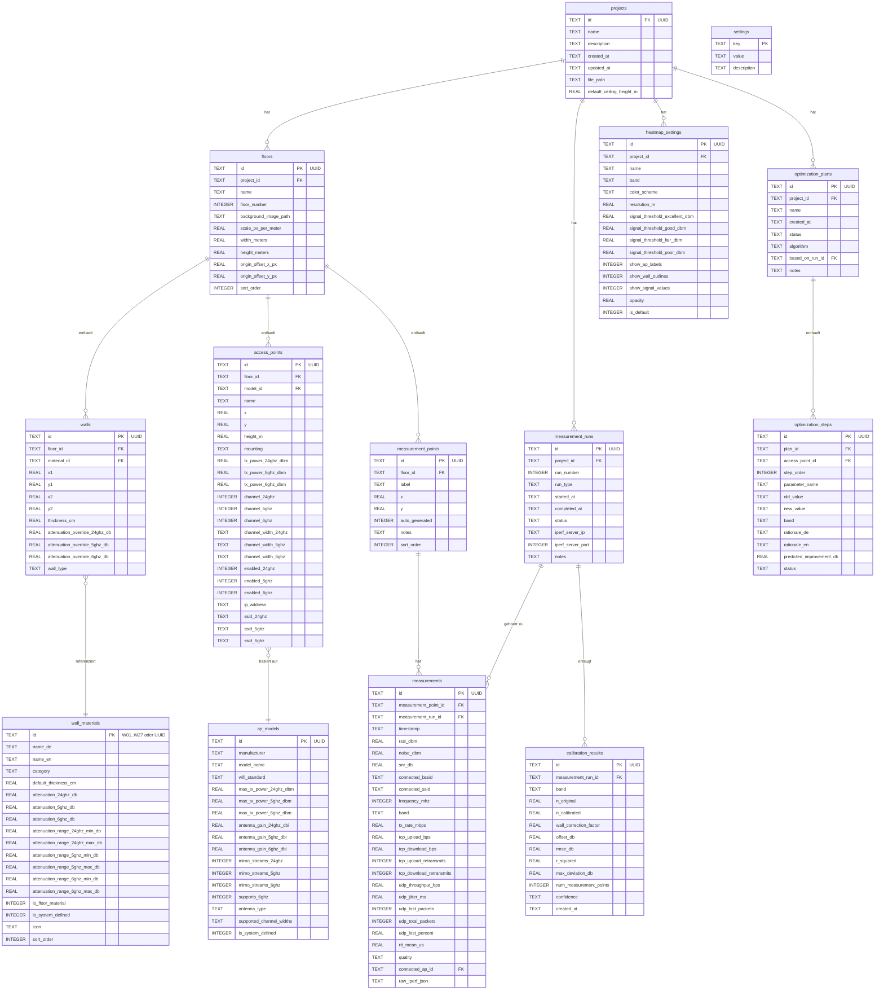

# Datenmodell & SQLite-Schema: WLAN-Optimizer

> **Phase 5 Deliverable** | **Datum:** 2026-02-27 | **Status:** Entwurf
>
> Vollstaendiges Datenmodell fuer den WLAN-Optimizer.
> Basis: Entscheidungen D-04 bis D-10, RF-Materialien.md, Messung-Kalibrierung.md, AP-Steuerung.md

---

## Inhaltsverzeichnis

1. [Entity-Relationship-Diagramm](#1-entity-relationship-diagramm)
2. [SQLite-Schema](#2-sqlite-schema)
3. [Seed-Daten](#3-seed-daten)
4. [TypeScript-Typen](#4-typescript-typen)
5. [Rust-Structs](#5-rust-structs)
6. [Migrations-Strategie](#6-migrations-strategie)
7. [Undo/Redo](#7-undoredo)

---

## 1. Entity-Relationship-Diagramm



---

## 2. SQLite-Schema

### 2.1 projects

```sql
-- Projektmetadaten: Ein Projekt = ein Grundriss-Planungsprojekt
CREATE TABLE projects (
    id                      TEXT PRIMARY KEY,               -- UUID v4
    name                    TEXT NOT NULL,                   -- Anzeigename des Projekts
    description             TEXT DEFAULT '',                 -- Optionale Beschreibung
    created_at              TEXT NOT NULL DEFAULT (strftime('%Y-%m-%dT%H:%M:%SZ', 'now')),
    updated_at              TEXT NOT NULL DEFAULT (strftime('%Y-%m-%dT%H:%M:%SZ', 'now')),
    file_path               TEXT,                           -- Pfad zur Projektdatei auf der Festplatte
    default_ceiling_height_m REAL NOT NULL DEFAULT 2.5      -- Default-Deckenhoehe in Metern
);

CREATE INDEX idx_projects_updated_at ON projects(updated_at);
```

### 2.2 floors

```sql
-- Stockwerke / Etagen eines Projekts (Multi-Floor-faehig, D-08)
-- MVP zeigt nur 1 Stockwerk in der UI, Datenstruktur ist aber Multi-Floor-ready
CREATE TABLE floors (
    id                      TEXT PRIMARY KEY,               -- UUID v4
    project_id              TEXT NOT NULL REFERENCES projects(id) ON DELETE CASCADE,
    name                    TEXT NOT NULL DEFAULT 'Erdgeschoss',  -- z.B. "Erdgeschoss", "1. OG"
    floor_number            INTEGER NOT NULL DEFAULT 0,     -- 0 = EG, 1 = 1.OG, -1 = Keller
    background_image_path   TEXT,                           -- Relativer Pfad zum Grundrissbild
    scale_px_per_meter      REAL,                           -- Massstab: Pixel pro Meter
    width_meters            REAL,                           -- Grundrissbreite in Metern (berechnet)
    height_meters           REAL,                           -- Grundrisshoehe in Metern (berechnet)
    origin_offset_x_px      REAL NOT NULL DEFAULT 0.0,      -- Offset des Koordinatenursprungs X (Pixel)
    origin_offset_y_px      REAL NOT NULL DEFAULT 0.0,      -- Offset des Koordinatenursprungs Y (Pixel)
    sort_order              INTEGER NOT NULL DEFAULT 0,      -- Reihenfolge der Anzeige
    floor_material_id       TEXT REFERENCES wall_materials(id), -- Deckenmaterial (fuer Multi-Floor-Daempfung)

    UNIQUE(project_id, floor_number)
);

CREATE INDEX idx_floors_project_id ON floors(project_id);
```

### 2.3 wall_materials

```sql
-- Materialdatenbank fuer Waende und Decken
-- System-Materialien (is_system_defined=1) koennen vom Benutzer nicht geloescht werden
-- Benutzer kann eigene Materialien anlegen (is_system_defined=0)
-- Benutzer kann Defaults pro Wand ueberschreiben (attenuation_override in walls-Tabelle)
-- D-07: Materialwerte user-editierbar, D-09: 6 GHz in Datenstruktur
CREATE TABLE wall_materials (
    id                              TEXT PRIMARY KEY,       -- W01..W27 (System) oder UUID (User)
    name_de                         TEXT NOT NULL,          -- Deutscher Name
    name_en                         TEXT NOT NULL,          -- Englischer Name
    category                        TEXT NOT NULL CHECK (category IN ('light', 'medium', 'heavy', 'blocking')),
    default_thickness_cm            REAL NOT NULL,          -- Typische Dicke in cm
    attenuation_24ghz_db            REAL NOT NULL,          -- Konservative Daempfung bei 2.4 GHz
    attenuation_5ghz_db             REAL NOT NULL,          -- Konservative Daempfung bei 5 GHz
    attenuation_6ghz_db             REAL NOT NULL DEFAULT 0.0,  -- Daempfung bei 6 GHz (D-09)
    attenuation_range_24ghz_min_db  REAL,                   -- Bereich Min bei 2.4 GHz
    attenuation_range_24ghz_max_db  REAL,                   -- Bereich Max bei 2.4 GHz
    attenuation_range_5ghz_min_db   REAL,                   -- Bereich Min bei 5 GHz
    attenuation_range_5ghz_max_db   REAL,                   -- Bereich Max bei 5 GHz
    attenuation_range_6ghz_min_db   REAL,                   -- Bereich Min bei 6 GHz
    attenuation_range_6ghz_max_db   REAL,                   -- Bereich Max bei 6 GHz
    is_floor_material               INTEGER NOT NULL DEFAULT 0,  -- 1 = Deckenmaterial, 0 = Wandmaterial
    is_system_defined               INTEGER NOT NULL DEFAULT 0,  -- 1 = Systemvorgabe, 0 = Benutzerdefiniert
    icon                            TEXT,                   -- Icon-Name fuer UI (z.B. "brick", "concrete")
    sort_order                      INTEGER NOT NULL DEFAULT 0   -- Reihenfolge in der Auswahlliste
);

CREATE INDEX idx_wall_materials_category ON wall_materials(category);
CREATE INDEX idx_wall_materials_system ON wall_materials(is_system_defined);
CREATE INDEX idx_wall_materials_floor ON wall_materials(is_floor_material);
```

### 2.4 walls

```sql
-- Waende auf einem Stockwerk, definiert als Liniensegment (x1,y1) -> (x2,y2) in Metern
-- Koordinaten relativ zum Grundriss-Ursprung (links oben)
CREATE TABLE walls (
    id                              TEXT PRIMARY KEY,       -- UUID v4
    floor_id                        TEXT NOT NULL REFERENCES floors(id) ON DELETE CASCADE,
    material_id                     TEXT NOT NULL REFERENCES wall_materials(id),
    x1                              REAL NOT NULL,          -- Startpunkt X in Metern
    y1                              REAL NOT NULL,          -- Startpunkt Y in Metern
    x2                              REAL NOT NULL,          -- Endpunkt X in Metern
    y2                              REAL NOT NULL,          -- Endpunkt Y in Metern
    thickness_cm                    REAL NOT NULL,          -- Tatsaechliche Dicke (kann von Material-Default abweichen)
    -- Optionale Pro-Wand-Ueberschreibung der Materialwerte (D-07)
    attenuation_override_24ghz_db   REAL,                   -- NULL = Material-Default verwenden
    attenuation_override_5ghz_db    REAL,                   -- NULL = Material-Default verwenden
    attenuation_override_6ghz_db    REAL,                   -- NULL = Material-Default verwenden
    wall_type                       TEXT NOT NULL DEFAULT 'wall'
        CHECK (wall_type IN ('wall', 'door', 'window', 'opening')),
    label                           TEXT                    -- Optionale Bezeichnung ("Badezimmerwand")
);

CREATE INDEX idx_walls_floor_id ON walls(floor_id);
CREATE INDEX idx_walls_material_id ON walls(material_id);
```

### 2.5 ap_models

```sql
-- AP-Modell-Katalog: Vordefinierte und benutzerdefinierte AP-Profile
-- D-10: DAP-X2810 als Referenz + Custom AP
-- D-09: 6 GHz Felder vorbereitet
CREATE TABLE ap_models (
    id                              TEXT PRIMARY KEY,       -- UUID v4
    manufacturer                    TEXT NOT NULL,          -- z.B. "D-Link", "Custom"
    model_name                      TEXT NOT NULL,          -- z.B. "DAP-X2810", "Benutzerdefiniert"
    wifi_standard                   TEXT NOT NULL DEFAULT 'wifi6'
        CHECK (wifi_standard IN ('wifi4', 'wifi5', 'wifi6', 'wifi6e', 'wifi7')),
    -- Maximale Sendeleistung pro Band
    max_tx_power_24ghz_dbm          REAL,                   -- Max TX Power 2.4 GHz in dBm
    max_tx_power_5ghz_dbm           REAL,                   -- Max TX Power 5 GHz in dBm
    max_tx_power_6ghz_dbm           REAL,                   -- Max TX Power 6 GHz in dBm (D-09)
    -- Antennengewinn pro Band
    antenna_gain_24ghz_dbi          REAL,                   -- Antennengewinn 2.4 GHz in dBi
    antenna_gain_5ghz_dbi           REAL,                   -- Antennengewinn 5 GHz in dBi
    antenna_gain_6ghz_dbi           REAL,                   -- Antennengewinn 6 GHz in dBi
    -- MIMO-Streams pro Band
    mimo_streams_24ghz              INTEGER DEFAULT 2,      -- Anzahl Spatial Streams 2.4 GHz
    mimo_streams_5ghz               INTEGER DEFAULT 2,      -- Anzahl Spatial Streams 5 GHz
    mimo_streams_6ghz               INTEGER,                -- Anzahl Spatial Streams 6 GHz
    -- Faehigkeiten
    supports_6ghz                   INTEGER NOT NULL DEFAULT 0,  -- 1 = WiFi 6E / 7 faehig
    antenna_type                    TEXT NOT NULL DEFAULT 'internal_omni'
        CHECK (antenna_type IN ('internal_omni', 'internal_directional', 'external_omni', 'external_directional')),
    -- Unterstuetzte Kanalbreiten als JSON-Array, z.B. '["20","40","80"]'
    supported_channel_widths_24ghz  TEXT NOT NULL DEFAULT '["20","40"]',
    supported_channel_widths_5ghz   TEXT NOT NULL DEFAULT '["20","40","80"]',
    supported_channel_widths_6ghz   TEXT DEFAULT '["20","40","80","160"]',
    -- Meta
    is_system_defined               INTEGER NOT NULL DEFAULT 0,  -- 1 = Vorinstalliert, 0 = Benutzerdefiniert
    notes                           TEXT,                   -- Zusatzinformationen
    datasheet_url                   TEXT                    -- Link zum Datenblatt
);

CREATE INDEX idx_ap_models_manufacturer ON ap_models(manufacturer);
CREATE INDEX idx_ap_models_system ON ap_models(is_system_defined);
```

### 2.6 access_points

```sql
-- Platzierte Access Points auf einem Stockwerk
-- Position in Metern relativ zum Grundriss-Ursprung
CREATE TABLE access_points (
    id                      TEXT PRIMARY KEY,               -- UUID v4
    floor_id                TEXT NOT NULL REFERENCES floors(id) ON DELETE CASCADE,
    model_id                TEXT NOT NULL REFERENCES ap_models(id),
    name                    TEXT NOT NULL DEFAULT '',       -- Benutzerdefinierter Name ("Wohnzimmer-AP")
    -- Position
    x                       REAL NOT NULL,                  -- Position X in Metern
    y                       REAL NOT NULL,                  -- Position Y in Metern
    height_m                REAL NOT NULL DEFAULT 2.5,      -- Montagehoehe ueber Boden in Metern
    mounting                TEXT NOT NULL DEFAULT 'ceiling'
        CHECK (mounting IN ('ceiling', 'wall', 'desk', 'floor')),
    -- Aktuelle Konfiguration pro Band (kann vom Model-Max abweichen)
    tx_power_24ghz_dbm      REAL,                           -- Aktuelle TX Power 2.4 GHz
    tx_power_5ghz_dbm       REAL,                           -- Aktuelle TX Power 5 GHz
    tx_power_6ghz_dbm       REAL,                           -- Aktuelle TX Power 6 GHz (D-09)
    channel_24ghz           INTEGER,                        -- Aktueller Kanal 2.4 GHz (1-14)
    channel_5ghz            INTEGER,                        -- Aktueller Kanal 5 GHz (36-165)
    channel_6ghz            INTEGER,                        -- Aktueller Kanal 6 GHz
    channel_width_24ghz     TEXT DEFAULT '20'
        CHECK (channel_width_24ghz IN ('20', '40')),
    channel_width_5ghz      TEXT DEFAULT '80'
        CHECK (channel_width_5ghz IN ('20', '40', '80', '160')),
    channel_width_6ghz      TEXT DEFAULT '80'
        CHECK (channel_width_6ghz IN ('20', '40', '80', '160', '320')),
    -- Aktivierungsstatus pro Band
    enabled_24ghz           INTEGER NOT NULL DEFAULT 1,     -- 1 = Band aktiv
    enabled_5ghz            INTEGER NOT NULL DEFAULT 1,
    enabled_6ghz            INTEGER NOT NULL DEFAULT 0,     -- MVP: 6 GHz deaktiviert
    -- Netzwerk-Identifikation
    ip_address              TEXT,                           -- IP des AP (fuer Steuerung/Monitoring)
    mac_address             TEXT,                           -- MAC-Adresse des AP
    ssid_24ghz              TEXT,                           -- SSID auf 2.4 GHz
    ssid_5ghz               TEXT,                           -- SSID auf 5 GHz
    ssid_6ghz               TEXT,                           -- SSID auf 6 GHz
    -- Rotation (fuer direktionale Antennen)
    rotation_deg            REAL NOT NULL DEFAULT 0.0       -- Drehwinkel in Grad (0 = Nord)
);

CREATE INDEX idx_access_points_floor_id ON access_points(floor_id);
CREATE INDEX idx_access_points_model_id ON access_points(model_id);
```

### 2.7 measurement_points

```sql
-- Definierte Messpunkte auf einem Stockwerk
-- Position in Metern relativ zum Grundriss-Ursprung
CREATE TABLE measurement_points (
    id                      TEXT PRIMARY KEY,               -- UUID v4
    floor_id                TEXT NOT NULL REFERENCES floors(id) ON DELETE CASCADE,
    label                   TEXT NOT NULL,                  -- Automatisch: "MP-01", "MP-02" etc.
    x                       REAL NOT NULL,                  -- Position X in Metern
    y                       REAL NOT NULL,                  -- Position Y in Metern
    auto_generated          INTEGER NOT NULL DEFAULT 0,     -- 1 = Automatisch generiert, 0 = Manuell platziert
    notes                   TEXT,                           -- Benutzernotizen ("Im Flur", "Hinter Regal")
    sort_order              INTEGER NOT NULL DEFAULT 0      -- Messreihenfolge
);

CREATE INDEX idx_measurement_points_floor_id ON measurement_points(floor_id);
```

### 2.8 measurement_runs

```sql
-- Metadaten eines Messdurchlaufs (Run 1 = Baseline, Run 2 = Post-Optimierung, Run 3 = Verifikation)
CREATE TABLE measurement_runs (
    id                      TEXT PRIMARY KEY,               -- UUID v4
    project_id              TEXT NOT NULL REFERENCES projects(id) ON DELETE CASCADE,
    run_number              INTEGER NOT NULL CHECK (run_number BETWEEN 1 AND 3),
    run_type                TEXT NOT NULL CHECK (run_type IN ('baseline', 'post_optimization', 'verification')),
    started_at              TEXT NOT NULL DEFAULT (strftime('%Y-%m-%dT%H:%M:%SZ', 'now')),
    completed_at            TEXT,                           -- NULL = noch nicht abgeschlossen
    status                  TEXT NOT NULL DEFAULT 'in_progress'
        CHECK (status IN ('in_progress', 'completed', 'aborted')),
    iperf_server_ip         TEXT,                           -- IP des iPerf3-Servers
    iperf_server_port       INTEGER DEFAULT 5201,           -- Port des iPerf3-Servers
    notes                   TEXT                            -- Benutzernotizen zum Run
);

CREATE INDEX idx_measurement_runs_project_id ON measurement_runs(project_id);
CREATE INDEX idx_measurement_runs_type ON measurement_runs(run_type);
```

### 2.9 measurements

```sql
-- Einzelmessungen an einem Messpunkt waehrend eines Runs
-- Enthaelt RSSI-Daten und iPerf3-Ergebnisse
CREATE TABLE measurements (
    id                      TEXT PRIMARY KEY,               -- UUID v4
    measurement_point_id    TEXT NOT NULL REFERENCES measurement_points(id) ON DELETE CASCADE,
    measurement_run_id      TEXT NOT NULL REFERENCES measurement_runs(id) ON DELETE CASCADE,
    timestamp               TEXT NOT NULL DEFAULT (strftime('%Y-%m-%dT%H:%M:%SZ', 'now')),

    -- WLAN-Signalwerte (vom OS/CoreWLAN/WlanApi)
    rssi_dbm                REAL,                           -- Empfangssignalstaerke in dBm (z.B. -55)
    noise_dbm               REAL,                           -- Umgebungsrauschen in dBm (z.B. -90)
    snr_db                  REAL,                           -- Signal-Rausch-Verhaeltnis (berechnet: RSSI - Noise)
    connected_bssid         TEXT,                           -- MAC des verbundenen AP
    connected_ssid          TEXT,                           -- SSID des verbundenen Netzwerks
    frequency_mhz           INTEGER,                        -- Frequenz in MHz (z.B. 5180)
    band                    TEXT CHECK (band IN ('2.4ghz', '5ghz', '6ghz')),
    tx_rate_mbps            REAL,                           -- Aktuelle Uebertragungsrate in Mbps

    -- iPerf3 TCP-Ergebnisse
    tcp_upload_bps          REAL,                           -- TCP Upload Throughput in Bits/Sekunde
    tcp_download_bps        REAL,                           -- TCP Download Throughput in Bits/Sekunde
    tcp_upload_retransmits  INTEGER,                        -- TCP Upload Retransmits (Indikator fuer WLAN-Probleme)
    tcp_download_retransmits INTEGER,                       -- TCP Download Retransmits

    -- iPerf3 UDP-Ergebnisse
    udp_throughput_bps      REAL,                           -- UDP Throughput in Bits/Sekunde
    udp_jitter_ms           REAL,                           -- UDP Jitter in Millisekunden
    udp_lost_packets        INTEGER,                        -- Verlorene UDP-Pakete
    udp_total_packets       INTEGER,                        -- Gesamt gesendete UDP-Pakete
    udp_lost_percent        REAL,                           -- Verlorene Pakete in Prozent

    -- Latenz
    rtt_mean_us             REAL,                           -- Mittlere Round-Trip-Time in Mikrosekunden

    -- Qualitaetsbewertung
    quality                 TEXT NOT NULL DEFAULT 'unknown'
        CHECK (quality IN ('good', 'fair', 'poor', 'failed', 'unknown')),

    -- Referenz auf verbundenen AP (falls identifizierbar)
    connected_ap_id         TEXT REFERENCES access_points(id),

    -- Rohdaten fuer Debugging/Analyse
    raw_iperf_json          TEXT                            -- Vollstaendiger iPerf3 JSON-Output
);

CREATE INDEX idx_measurements_point_id ON measurements(measurement_point_id);
CREATE INDEX idx_measurements_run_id ON measurements(measurement_run_id);
CREATE INDEX idx_measurements_band ON measurements(band);
CREATE INDEX idx_measurements_connected_ap ON measurements(connected_ap_id);
```

### 2.10 calibration_results

```sql
-- Kalibrierungsergebnisse nach einem Messdurchlauf
-- Least-Squares-Fitting des Path-Loss-Exponenten n und optionaler Wand-Korrekturfaktor
CREATE TABLE calibration_results (
    id                      TEXT PRIMARY KEY,               -- UUID v4
    measurement_run_id      TEXT NOT NULL REFERENCES measurement_runs(id) ON DELETE CASCADE,
    band                    TEXT NOT NULL CHECK (band IN ('2.4ghz', '5ghz', '6ghz')),
    -- Kalibrierte Parameter
    n_original              REAL NOT NULL DEFAULT 3.5,      -- Urspruenglicher Path-Loss-Exponent
    n_calibrated            REAL NOT NULL,                  -- Kalibrierter n-Wert (2.0 - 5.0)
    wall_correction_factor  REAL NOT NULL DEFAULT 1.0,      -- Korrekturfaktor fuer Wanddaempfung (k)
    offset_db               REAL NOT NULL DEFAULT 0.0,      -- Globaler Offset in dB
    -- Qualitaetsmetriken
    rmse_db                 REAL NOT NULL,                  -- Root Mean Square Error in dB
    r_squared               REAL,                           -- Bestimmtheitsmass (0-1)
    max_deviation_db        REAL,                           -- Maximale Abweichung in dB
    num_measurement_points  INTEGER NOT NULL,               -- Anzahl verwendeter Messpunkte
    confidence              TEXT NOT NULL DEFAULT 'low'
        CHECK (confidence IN ('high', 'medium', 'low')),
    created_at              TEXT NOT NULL DEFAULT (strftime('%Y-%m-%dT%H:%M:%SZ', 'now')),

    UNIQUE(measurement_run_id, band)
);

CREATE INDEX idx_calibration_run_id ON calibration_results(measurement_run_id);
```

### 2.11 heatmap_settings

```sql
-- Heatmap-Konfigurationsprofile
-- D-17: 3 Farbschemata (Viridis default, Jet, Inferno)
CREATE TABLE heatmap_settings (
    id                              TEXT PRIMARY KEY,       -- UUID v4
    project_id                      TEXT NOT NULL REFERENCES projects(id) ON DELETE CASCADE,
    name                            TEXT NOT NULL DEFAULT 'Standard',
    -- Darstellungsoptionen
    band                            TEXT NOT NULL DEFAULT '5ghz'
        CHECK (band IN ('2.4ghz', '5ghz', '6ghz')),
    color_scheme                    TEXT NOT NULL DEFAULT 'viridis'
        CHECK (color_scheme IN ('viridis', 'jet', 'inferno')),
    resolution_m                    REAL NOT NULL DEFAULT 0.25,     -- Grid-Aufloesung in Metern
    -- Signalschwellen in dBm (bestimmen Farbgrenzen)
    signal_threshold_excellent_dbm  REAL NOT NULL DEFAULT -50.0,
    signal_threshold_good_dbm       REAL NOT NULL DEFAULT -65.0,
    signal_threshold_fair_dbm       REAL NOT NULL DEFAULT -75.0,
    signal_threshold_poor_dbm       REAL NOT NULL DEFAULT -85.0,
    -- Overlay-Optionen
    show_ap_labels                  INTEGER NOT NULL DEFAULT 1,
    show_wall_outlines              INTEGER NOT NULL DEFAULT 1,
    show_signal_values              INTEGER NOT NULL DEFAULT 0,
    opacity                         REAL NOT NULL DEFAULT 0.7
        CHECK (opacity >= 0.0 AND opacity <= 1.0),
    -- Default-Profil fuer dieses Projekt
    is_default                      INTEGER NOT NULL DEFAULT 0
);

CREATE INDEX idx_heatmap_settings_project_id ON heatmap_settings(project_id);
```

### 2.12 optimization_plans

```sql
-- Optimierungsvorschlaege der Mixing Console / des regelbasierten Algorithmus
-- D-14: Regelbasierter Optimierungsalgorithmus
CREATE TABLE optimization_plans (
    id                      TEXT PRIMARY KEY,               -- UUID v4
    project_id              TEXT NOT NULL REFERENCES projects(id) ON DELETE CASCADE,
    name                    TEXT NOT NULL,                  -- z.B. "Optimierung 2026-02-27 - Sendeleistung"
    created_at              TEXT NOT NULL DEFAULT (strftime('%Y-%m-%dT%H:%M:%SZ', 'now')),
    status                  TEXT NOT NULL DEFAULT 'draft'
        CHECK (status IN ('draft', 'ready', 'partially_applied', 'applied', 'verified', 'discarded')),
    algorithm               TEXT NOT NULL DEFAULT 'rule_based'
        CHECK (algorithm IN ('rule_based', 'manual', 'greedy')),
    based_on_run_id         TEXT REFERENCES measurement_runs(id),   -- Auf welchem Run basiert der Plan?
    notes                   TEXT
);

CREATE INDEX idx_optimization_plans_project_id ON optimization_plans(project_id);
CREATE INDEX idx_optimization_plans_status ON optimization_plans(status);
```

### 2.13 optimization_steps

```sql
-- Einzelne Schritte eines Optimierungsplans
-- Jeder Schritt aendert einen Parameter an einem AP
CREATE TABLE optimization_steps (
    id                      TEXT PRIMARY KEY,               -- UUID v4
    plan_id                 TEXT NOT NULL REFERENCES optimization_plans(id) ON DELETE CASCADE,
    access_point_id         TEXT NOT NULL REFERENCES access_points(id),
    step_order              INTEGER NOT NULL,               -- Reihenfolge der Ausfuehrung
    -- Was wird geaendert?
    parameter_name          TEXT NOT NULL
        CHECK (parameter_name IN (
            'tx_power_24ghz', 'tx_power_5ghz', 'tx_power_6ghz',
            'channel_24ghz', 'channel_5ghz', 'channel_6ghz',
            'channel_width_24ghz', 'channel_width_5ghz', 'channel_width_6ghz',
            'enabled_24ghz', 'enabled_5ghz', 'enabled_6ghz',
            'position_x', 'position_y', 'height_m', 'mounting'
        )),
    old_value               TEXT NOT NULL,                  -- Vorheriger Wert (als Text, wird beim Lesen konvertiert)
    new_value               TEXT NOT NULL,                  -- Neuer Wert
    band                    TEXT CHECK (band IN ('2.4ghz', '5ghz', '6ghz', NULL)),
    -- Benutzeranleitung (D-02: Assist-Mode)
    rationale_de            TEXT,                           -- Begruendung auf Deutsch
    rationale_en            TEXT,                           -- Begruendung auf Englisch
    predicted_improvement_db REAL,                          -- Erwartete Verbesserung in dB
    -- Status
    status                  TEXT NOT NULL DEFAULT 'pending'
        CHECK (status IN ('pending', 'applied', 'skipped', 'reverted'))
);

CREATE INDEX idx_optimization_steps_plan_id ON optimization_steps(plan_id);
CREATE INDEX idx_optimization_steps_ap_id ON optimization_steps(access_point_id);
```

### 2.14 settings

```sql
-- App-weite Einstellungen (Key-Value Store)
-- D-18: System-Sprache erkennen
CREATE TABLE settings (
    key                     TEXT PRIMARY KEY,               -- Eindeutiger Schluessel
    value                   TEXT NOT NULL,                  -- Wert als Text (wird beim Lesen konvertiert)
    description             TEXT                            -- Beschreibung der Einstellung
);
```

### 2.15 undo_history

```sql
-- Undo/Redo-Stack (Command-Pattern)
-- Speichert alle undoable Operationen pro Projekt
CREATE TABLE undo_history (
    id                      INTEGER PRIMARY KEY AUTOINCREMENT,
    project_id              TEXT NOT NULL REFERENCES projects(id) ON DELETE CASCADE,
    timestamp               TEXT NOT NULL DEFAULT (strftime('%Y-%m-%dT%H:%M:%SZ', 'now')),
    command_type            TEXT NOT NULL,                  -- z.B. 'add_wall', 'move_ap', 'change_material'
    table_name              TEXT NOT NULL,                  -- Betroffene Tabelle
    record_id               TEXT NOT NULL,                  -- ID des betroffenen Datensatzes
    old_data                TEXT,                           -- JSON: Zustand VOR der Aenderung (NULL bei INSERT)
    new_data                TEXT,                           -- JSON: Zustand NACH der Aenderung (NULL bei DELETE)
    is_undone               INTEGER NOT NULL DEFAULT 0,     -- 1 = wurde rueckgaengig gemacht
    batch_id                TEXT                            -- Gruppiert zusammengehoerige Operationen
);

CREATE INDEX idx_undo_history_project_id ON undo_history(project_id);
CREATE INDEX idx_undo_history_batch_id ON undo_history(batch_id);
CREATE INDEX idx_undo_history_undone ON undo_history(project_id, is_undone);
```

### 2.16 schema_migrations

```sql
-- Schema-Versionierung (eigene Migrationslogik)
CREATE TABLE schema_migrations (
    version                 INTEGER PRIMARY KEY,            -- Aufsteigende Versionsnummer
    name                    TEXT NOT NULL,                  -- Migrationname (z.B. "001_initial_schema")
    applied_at              TEXT NOT NULL DEFAULT (strftime('%Y-%m-%dT%H:%M:%SZ', 'now')),
    checksum                TEXT                            -- SHA256 des Migrations-SQL (Integritaetspruefung)
);
```

---

## 3. Seed-Daten

### 3.1 Wandmaterialien (27 Materialien aus RF-Materialien.md)

```sql
-- ============================================================
-- WANDMATERIALIEN: Alle 27 Materialien aus RF-Materialien.md
-- Konservative Defaults (oberer Wert des typischen Bereichs)
-- ============================================================

-- Spaltenreihenfolge: id, name_de, name_en, category, default_thickness_cm,
--   attenuation_24ghz_db, attenuation_5ghz_db, attenuation_6ghz_db,
--   attenuation_range_24ghz_min_db, attenuation_range_24ghz_max_db,
--   attenuation_range_5ghz_min_db, attenuation_range_5ghz_max_db,
--   attenuation_range_6ghz_min_db, attenuation_range_6ghz_max_db,
--   is_floor_material, is_system_defined, icon, sort_order

-- Leichtbau / Trockenbau
INSERT INTO wall_materials VALUES ('W01', 'Gipskarton (einfach)', 'Drywall (single)', 'light', 1.25, 2, 3, 4, 0.5, 3, 1, 4, 1, 5, 0, 1, 'drywall', 1);
INSERT INTO wall_materials VALUES ('W02', 'Gipskarton (doppelt)', 'Drywall (double)', 'light', 10, 5, 7, 9, 2, 5, 3, 7, 4, 9, 0, 1, 'drywall_double', 2);
INSERT INTO wall_materials VALUES ('W03', 'Leichtbauwand (Buero)', 'Office partition', 'light', 10, 5, 8, 10, 2, 6, 4, 10, 5, 12, 0, 1, 'partition', 3);
INSERT INTO wall_materials VALUES ('W04', 'Holzstaenderwand', 'Wood stud wall', 'light', 12, 5, 8, 10, 2, 6, 4, 10, 5, 12, 0, 1, 'wood_frame', 4);
INSERT INTO wall_materials VALUES ('W05', 'Holztuere (innen)', 'Interior door', 'light', 4, 4, 6, 7, 2, 5, 3, 7, 4, 9, 0, 1, 'door_wood', 5);
INSERT INTO wall_materials VALUES ('W06', 'Glaswand (innen)', 'Interior glass wall', 'light', 1, 3, 5, 7, 1, 5, 2, 8, 3, 10, 0, 1, 'glass', 6);
INSERT INTO wall_materials VALUES ('W07', 'Einfachverglasung', 'Single glazing', 'light', 0.6, 2, 2, 3, 0.5, 3, 0.5, 3, 1, 4, 0, 1, 'window_single', 7);

-- Mittel
INSERT INTO wall_materials VALUES ('W08', 'Doppelverglasung', 'Double glazing', 'medium', 2.4, 5, 9, 11, 2, 6, 4, 10, 5, 14, 0, 1, 'window_double', 8);
INSERT INTO wall_materials VALUES ('W09', 'Dreifachverglasung', 'Triple glazing', 'medium', 4, 7, 12, 15, 3, 8, 5, 14, 6, 18, 0, 1, 'window_triple', 9);
INSERT INTO wall_materials VALUES ('W11', 'Ziegelwand duenn', 'Thin brick wall', 'medium', 11.5, 8, 16, 19, 4, 10, 8, 18, 10, 22, 0, 1, 'brick', 11);
INSERT INTO wall_materials VALUES ('W12', 'Ziegelwand mittel', 'Medium brick wall', 'medium', 17.5, 10, 20, 24, 5, 12, 10, 22, 12, 27, 0, 1, 'brick', 12);
INSERT INTO wall_materials VALUES ('W14', 'Porenbeton (Ytong)', 'AAC (Ytong)', 'medium', 17.5, 10, 18, 22, 4, 12, 8, 20, 10, 24, 0, 1, 'aac', 14);
INSERT INTO wall_materials VALUES ('W15', 'Porenbeton Aussenwand', 'AAC exterior wall', 'medium', 24, 15, 25, 30, 6, 18, 12, 28, 14, 34, 0, 1, 'aac', 15);
INSERT INTO wall_materials VALUES ('W16', 'Kalksandstein', 'Sand-lime brick', 'medium', 17.5, 12, 20, 24, 5, 14, 10, 22, 12, 27, 0, 1, 'sandlime', 16);
INSERT INTO wall_materials VALUES ('W24', 'Haustuere (isoliert)', 'Front door (insulated)', 'medium', 8, 10, 14, 17, 5, 12, 8, 16, 10, 20, 0, 1, 'door_front', 24);
INSERT INTO wall_materials VALUES ('W25', 'Massivholzwand', 'Solid wood wall', 'medium', 12, 8, 15, 18, 3, 10, 6, 18, 7, 22, 0, 1, 'wood_solid', 25);
INSERT INTO wall_materials VALUES ('W26', 'Fachwerk', 'Half-timber', 'medium', 20, 10, 16, 19, 4, 12, 6, 20, 7, 24, 0, 1, 'timber_frame', 26);

-- Schwer
INSERT INTO wall_materials VALUES ('W10', 'Low-E Fenster', 'Low-E window', 'heavy', 2.4, 22, 28, 32, 12, 30, 18, 35, 21, 40, 0, 1, 'window_lowe', 10);
INSERT INTO wall_materials VALUES ('W13', 'Ziegelwand dick', 'Thick brick wall', 'heavy', 24, 14, 25, 30, 7, 16, 12, 28, 14, 34, 0, 1, 'brick', 13);
INSERT INTO wall_materials VALUES ('W17', 'Kalksandstein dick', 'Sand-lime brick thick', 'heavy', 24, 16, 28, 33, 7, 18, 14, 30, 16, 36, 0, 1, 'sandlime', 17);
INSERT INTO wall_materials VALUES ('W18', 'Beton duenn', 'Thin concrete', 'heavy', 10, 15, 25, 30, 8, 18, 15, 30, 18, 36, 0, 1, 'concrete', 18);
INSERT INTO wall_materials VALUES ('W19', 'Beton mittel', 'Medium concrete', 'heavy', 15, 20, 35, 42, 12, 23, 20, 40, 24, 48, 0, 1, 'concrete', 19);
INSERT INTO wall_materials VALUES ('W20', 'Beton dick', 'Thick concrete', 'heavy', 20, 25, 48, 55, 15, 29, 25, 55, 30, 62, 0, 1, 'concrete', 20);
INSERT INTO wall_materials VALUES ('W21', 'Stahlbeton', 'Reinforced concrete', 'heavy', 20, 35, 55, 62, 20, 38, 35, 60, 42, 68, 0, 1, 'concrete_reinforced', 21);
INSERT INTO wall_materials VALUES ('W22', 'Metalltuer', 'Metal door', 'heavy', 5, 18, 22, 25, 8, 25, 12, 30, 14, 34, 0, 1, 'door_metal', 22);
INSERT INTO wall_materials VALUES ('W23', 'Brandschutztuere (T30)', 'Fire door (T30)', 'heavy', 6, 15, 20, 23, 6, 18, 10, 25, 12, 30, 0, 1, 'door_fire', 23);

-- Blockierend
INSERT INTO wall_materials VALUES ('W27', 'Aufzugschacht', 'Elevator shaft', 'blocking', 0, 40, 50, 55, 20, 45, 30, 55, 35, 60, 0, 1, 'elevator', 27);
```

### 3.2 Geschossdecken-Materialien (4 aus RF-Materialien.md)

```sql
-- ============================================================
-- GESCHOSSDECKEN: 4 Deckenmaterialien (F01-F04)
-- ============================================================
-- Spaltenreihenfolge wie bei Wandmaterialien (is_floor_material=1, is_system_defined=1)
INSERT INTO wall_materials VALUES ('F01', 'Stahlbetondecke (Standard)', 'RC ceiling (standard)', 'heavy', 20, 25, 40, 48, 18, 35, 28, 55, 33, 60, 1, 1, 'ceiling_concrete', 101);
INSERT INTO wall_materials VALUES ('F02', 'Stahlbetondecke + FBH', 'RC ceiling + underfloor heating', 'heavy', 25, 32, 48, 55, 20, 42, 30, 60, 36, 66, 1, 1, 'ceiling_fbh', 102);
INSERT INTO wall_materials VALUES ('F03', 'Holzbalkendecke', 'Wooden beam ceiling', 'medium', 25, 15, 22, 26, 6, 18, 10, 25, 12, 30, 1, 1, 'ceiling_wood', 103);
INSERT INTO wall_materials VALUES ('F04', 'Stahlbetondecke (komplett)', 'RC ceiling (full buildup)', 'heavy', 30, 35, 55, 62, 25, 45, 35, 65, 42, 70, 1, 1, 'ceiling_full', 104);
```

### 3.3 AP-Modelle

```sql
-- ============================================================
-- AP-MODELLE: DAP-X2810 als Referenz + Custom AP Template (D-10)
-- ============================================================

-- D-Link DAP-X2810 (Referenz-AP)
-- Quelle: Datasheet + RF-Modell-Regeln
INSERT INTO ap_models VALUES (
    'dap-x2810',                    -- id
    'D-Link',                       -- manufacturer
    'DAP-X2810',                    -- model_name
    'wifi6',                        -- wifi_standard (Wi-Fi 6 = 802.11ax)
    23.0,                           -- max_tx_power_24ghz_dbm
    26.0,                           -- max_tx_power_5ghz_dbm
    NULL,                           -- max_tx_power_6ghz_dbm (kein 6 GHz)
    3.2,                            -- antenna_gain_24ghz_dbi
    4.3,                            -- antenna_gain_5ghz_dbi
    NULL,                           -- antenna_gain_6ghz_dbi
    2,                              -- mimo_streams_24ghz (2x2)
    2,                              -- mimo_streams_5ghz (2x2)
    NULL,                           -- mimo_streams_6ghz
    0,                              -- supports_6ghz (nein)
    'internal_omni',                -- antenna_type
    '["20","40"]',                  -- supported_channel_widths_24ghz
    '["20","40","80"]',             -- supported_channel_widths_5ghz
    NULL,                           -- supported_channel_widths_6ghz
    1,                              -- is_system_defined
    'AX1800 Dual-Band PoE Access Point. 2x2 MU-MIMO. Firmware: v1.25.053.',
    'https://support.dlink.com/resource/products/DAP-X2810/REVA/DAP-X2810_REVA_DATASHEET_v1.02_US.pdf'
);

-- Custom AP Template (Benutzer gibt Werte manuell ein)
INSERT INTO ap_models VALUES (
    'custom-ap',                    -- id
    'Custom',                       -- manufacturer
    'Benutzerdefiniert',            -- model_name
    'wifi6',                        -- wifi_standard
    20.0,                           -- max_tx_power_24ghz_dbm (sinnvoller Default)
    23.0,                           -- max_tx_power_5ghz_dbm
    23.0,                           -- max_tx_power_6ghz_dbm
    2.0,                            -- antenna_gain_24ghz_dbi
    3.0,                            -- antenna_gain_5ghz_dbi
    3.0,                            -- antenna_gain_6ghz_dbi
    2,                              -- mimo_streams_24ghz
    2,                              -- mimo_streams_5ghz
    2,                              -- mimo_streams_6ghz
    0,                              -- supports_6ghz
    'internal_omni',                -- antenna_type
    '["20","40"]',                  -- supported_channel_widths_24ghz
    '["20","40","80","160"]',       -- supported_channel_widths_5ghz
    '["20","40","80","160"]',       -- supported_channel_widths_6ghz
    1,                              -- is_system_defined
    'Benutzerdefiniertes AP-Profil. Alle Werte koennen manuell angepasst werden.',
    NULL
);
```

### 3.4 Default-Settings

```sql
-- ============================================================
-- APP-EINSTELLUNGEN
-- D-18: System-Sprache erkennen
-- ============================================================
INSERT INTO settings VALUES ('language', 'auto', 'Sprache: auto = System-Erkennung, de = Deutsch, en = Englisch');
INSERT INTO settings VALUES ('theme', 'system', 'Design: system = OS-Erkennung, light, dark');
INSERT INTO settings VALUES ('last_opened_project_id', '', 'Zuletzt geoeffnetes Projekt');
INSERT INTO settings VALUES ('default_band', '5ghz', 'Standard-Frequenzband fuer Heatmap');
INSERT INTO settings VALUES ('default_resolution_m', '0.25', 'Standard-Grid-Aufloesung in Metern');
INSERT INTO settings VALUES ('default_color_scheme', 'viridis', 'Standard-Farbschema: viridis, jet, inferno');
INSERT INTO settings VALUES ('iperf_server_ip', '', 'Letzte bekannte iPerf3-Server-IP');
INSERT INTO settings VALUES ('iperf_server_port', '5201', 'iPerf3-Server-Port');
INSERT INTO settings VALUES ('receiver_sensitivity_dbi', '-3', 'Smartphone-Empfaenger-Empfindlichkeit in dBi');
INSERT INTO settings VALUES ('path_loss_exponent_default', '3.5', 'Standard Path-Loss-Exponent n');
INSERT INTO settings VALUES ('show_advanced_materials', '0', 'Erweiterte Materialauswahl (alle 27) anzeigen');
INSERT INTO settings VALUES ('auto_save_interval_seconds', '60', 'Auto-Speichern Intervall in Sekunden (0 = deaktiviert)');
INSERT INTO settings VALUES ('schema_version', '1', 'Aktuelle Schema-Version');
```

### 3.5 Schema-Migration Eintrag

```sql
-- ============================================================
-- INITIALE MIGRATION
-- ============================================================
INSERT INTO schema_migrations VALUES (1, '001_initial_schema', strftime('%Y-%m-%dT%H:%M:%SZ', 'now'), NULL);
```

---

## 4. TypeScript-Typen

Die folgenden Interfaces werden im Frontend (Svelte 5) verwendet.
Sie korrespondieren 1:1 mit den Datenbank-Tabellen und werden ueber Tauri-Commands vom Rust-Backend geliefert.

```typescript
// ============================================================
// Projekt
// ============================================================
interface Project {
  id: string;
  name: string;
  description: string;
  created_at: string;          // ISO 8601
  updated_at: string;          // ISO 8601
  file_path: string | null;
  default_ceiling_height_m: number;
}

// ============================================================
// Stockwerk
// ============================================================
interface Floor {
  id: string;
  project_id: string;
  name: string;
  floor_number: number;
  background_image_path: string | null;
  scale_px_per_meter: number | null;
  width_meters: number | null;
  height_meters: number | null;
  origin_offset_x_px: number;
  origin_offset_y_px: number;
  sort_order: number;
  floor_material_id: string | null;
}

// ============================================================
// Wandmaterial
// ============================================================
type MaterialCategory = 'light' | 'medium' | 'heavy' | 'blocking';

interface WallMaterial {
  id: string;
  name_de: string;
  name_en: string;
  category: MaterialCategory;
  default_thickness_cm: number;
  attenuation_24ghz_db: number;
  attenuation_5ghz_db: number;
  attenuation_6ghz_db: number;
  attenuation_range_24ghz_min_db: number | null;
  attenuation_range_24ghz_max_db: number | null;
  attenuation_range_5ghz_min_db: number | null;
  attenuation_range_5ghz_max_db: number | null;
  attenuation_range_6ghz_min_db: number | null;
  attenuation_range_6ghz_max_db: number | null;
  is_floor_material: boolean;
  is_system_defined: boolean;
  icon: string | null;
  sort_order: number;
}

// ============================================================
// Wand
// ============================================================
type WallType = 'wall' | 'door' | 'window' | 'opening';

interface Wall {
  id: string;
  floor_id: string;
  material_id: string;
  x1: number;                  // Meter
  y1: number;
  x2: number;
  y2: number;
  thickness_cm: number;
  attenuation_override_24ghz_db: number | null;
  attenuation_override_5ghz_db: number | null;
  attenuation_override_6ghz_db: number | null;
  wall_type: WallType;
  label: string | null;
}

// ============================================================
// AP-Modell
// ============================================================
type WifiStandard = 'wifi4' | 'wifi5' | 'wifi6' | 'wifi6e' | 'wifi7';
type AntennaType = 'internal_omni' | 'internal_directional' | 'external_omni' | 'external_directional';

interface ApModel {
  id: string;
  manufacturer: string;
  model_name: string;
  wifi_standard: WifiStandard;
  max_tx_power_24ghz_dbm: number | null;
  max_tx_power_5ghz_dbm: number | null;
  max_tx_power_6ghz_dbm: number | null;
  antenna_gain_24ghz_dbi: number | null;
  antenna_gain_5ghz_dbi: number | null;
  antenna_gain_6ghz_dbi: number | null;
  mimo_streams_24ghz: number;
  mimo_streams_5ghz: number;
  mimo_streams_6ghz: number | null;
  supports_6ghz: boolean;
  antenna_type: AntennaType;
  supported_channel_widths_24ghz: string[];  // Parsed aus JSON
  supported_channel_widths_5ghz: string[];
  supported_channel_widths_6ghz: string[] | null;
  is_system_defined: boolean;
  notes: string | null;
  datasheet_url: string | null;
}

// ============================================================
// Access Point (platziert)
// ============================================================
type Mounting = 'ceiling' | 'wall' | 'desk' | 'floor';

interface AccessPoint {
  id: string;
  floor_id: string;
  model_id: string;
  name: string;
  x: number;                   // Meter
  y: number;
  height_m: number;
  mounting: Mounting;
  tx_power_24ghz_dbm: number | null;
  tx_power_5ghz_dbm: number | null;
  tx_power_6ghz_dbm: number | null;
  channel_24ghz: number | null;
  channel_5ghz: number | null;
  channel_6ghz: number | null;
  channel_width_24ghz: string;
  channel_width_5ghz: string;
  channel_width_6ghz: string;
  enabled_24ghz: boolean;
  enabled_5ghz: boolean;
  enabled_6ghz: boolean;
  ip_address: string | null;
  mac_address: string | null;
  ssid_24ghz: string | null;
  ssid_5ghz: string | null;
  ssid_6ghz: string | null;
  rotation_deg: number;
}

// ============================================================
// Messpunkt
// ============================================================
interface MeasurementPoint {
  id: string;
  floor_id: string;
  label: string;
  x: number;
  y: number;
  auto_generated: boolean;
  notes: string | null;
  sort_order: number;
}

// ============================================================
// Mess-Durchlauf
// ============================================================
type RunType = 'baseline' | 'post_optimization' | 'verification';
type RunStatus = 'in_progress' | 'completed' | 'aborted';

interface MeasurementRun {
  id: string;
  project_id: string;
  run_number: number;          // 1, 2 oder 3
  run_type: RunType;
  started_at: string;
  completed_at: string | null;
  status: RunStatus;
  iperf_server_ip: string | null;
  iperf_server_port: number;
  notes: string | null;
}

// ============================================================
// Einzelmessung
// ============================================================
type MeasurementQuality = 'good' | 'fair' | 'poor' | 'failed' | 'unknown';
type Band = '2.4ghz' | '5ghz' | '6ghz';

interface Measurement {
  id: string;
  measurement_point_id: string;
  measurement_run_id: string;
  timestamp: string;
  // WLAN-Signal
  rssi_dbm: number | null;
  noise_dbm: number | null;
  snr_db: number | null;
  connected_bssid: string | null;
  connected_ssid: string | null;
  frequency_mhz: number | null;
  band: Band | null;
  tx_rate_mbps: number | null;
  // TCP
  tcp_upload_bps: number | null;
  tcp_download_bps: number | null;
  tcp_upload_retransmits: number | null;
  tcp_download_retransmits: number | null;
  // UDP
  udp_throughput_bps: number | null;
  udp_jitter_ms: number | null;
  udp_lost_packets: number | null;
  udp_total_packets: number | null;
  udp_lost_percent: number | null;
  // Latenz
  rtt_mean_us: number | null;
  // Meta
  quality: MeasurementQuality;
  connected_ap_id: string | null;
  raw_iperf_json: string | null;
}

// ============================================================
// Kalibrierung
// ============================================================
type CalibrationConfidence = 'high' | 'medium' | 'low';

interface CalibrationResult {
  id: string;
  measurement_run_id: string;
  band: Band;
  n_original: number;
  n_calibrated: number;
  wall_correction_factor: number;
  offset_db: number;
  rmse_db: number;
  r_squared: number | null;
  max_deviation_db: number | null;
  num_measurement_points: number;
  confidence: CalibrationConfidence;
  created_at: string;
}

// ============================================================
// Heatmap-Einstellungen
// ============================================================
type ColorScheme = 'viridis' | 'jet' | 'inferno';

interface HeatmapSettings {
  id: string;
  project_id: string;
  name: string;
  band: Band;
  color_scheme: ColorScheme;
  resolution_m: number;
  signal_threshold_excellent_dbm: number;
  signal_threshold_good_dbm: number;
  signal_threshold_fair_dbm: number;
  signal_threshold_poor_dbm: number;
  show_ap_labels: boolean;
  show_wall_outlines: boolean;
  show_signal_values: boolean;
  opacity: number;
  is_default: boolean;
}

// ============================================================
// Optimierungsplan
// ============================================================
type PlanStatus = 'draft' | 'ready' | 'partially_applied' | 'applied' | 'verified' | 'discarded';
type Algorithm = 'rule_based' | 'manual' | 'greedy';

interface OptimizationPlan {
  id: string;
  project_id: string;
  name: string;
  created_at: string;
  status: PlanStatus;
  algorithm: Algorithm;
  based_on_run_id: string | null;
  notes: string | null;
}

// ============================================================
// Optimierungsschritt
// ============================================================
type ParameterName =
  | 'tx_power_24ghz' | 'tx_power_5ghz' | 'tx_power_6ghz'
  | 'channel_24ghz' | 'channel_5ghz' | 'channel_6ghz'
  | 'channel_width_24ghz' | 'channel_width_5ghz' | 'channel_width_6ghz'
  | 'enabled_24ghz' | 'enabled_5ghz' | 'enabled_6ghz'
  | 'position_x' | 'position_y' | 'height_m' | 'mounting';

type StepStatus = 'pending' | 'applied' | 'skipped' | 'reverted';

interface OptimizationStep {
  id: string;
  plan_id: string;
  access_point_id: string;
  step_order: number;
  parameter_name: ParameterName;
  old_value: string;
  new_value: string;
  band: Band | null;
  rationale_de: string | null;
  rationale_en: string | null;
  predicted_improvement_db: number | null;
  status: StepStatus;
}

// ============================================================
// Einstellungen
// ============================================================
interface Setting {
  key: string;
  value: string;
  description: string | null;
}

// ============================================================
// Undo-History
// ============================================================
interface UndoEntry {
  id: number;
  project_id: string;
  timestamp: string;
  command_type: string;
  table_name: string;
  record_id: string;
  old_data: Record<string, unknown> | null;  // Parsed JSON
  new_data: Record<string, unknown> | null;
  is_undone: boolean;
  batch_id: string | null;
}
```

---

## 5. Rust-Structs

Die folgenden Structs werden im Tauri-Backend (rusqlite) verwendet.
Sie implementieren `Serialize` und `Deserialize` fuer die IPC-Kommunikation mit dem Frontend.

```rust
use serde::{Deserialize, Serialize};

// ============================================================
// Projekt
// ============================================================
#[derive(Debug, Clone, Serialize, Deserialize)]
pub struct Project {
    pub id: String,
    pub name: String,
    pub description: String,
    pub created_at: String,
    pub updated_at: String,
    pub file_path: Option<String>,
    pub default_ceiling_height_m: f64,
}

// ============================================================
// Stockwerk
// ============================================================
#[derive(Debug, Clone, Serialize, Deserialize)]
pub struct Floor {
    pub id: String,
    pub project_id: String,
    pub name: String,
    pub floor_number: i32,
    pub background_image_path: Option<String>,
    pub scale_px_per_meter: Option<f64>,
    pub width_meters: Option<f64>,
    pub height_meters: Option<f64>,
    pub origin_offset_x_px: f64,
    pub origin_offset_y_px: f64,
    pub sort_order: i32,
    pub floor_material_id: Option<String>,
}

// ============================================================
// Wandmaterial
// ============================================================
#[derive(Debug, Clone, Serialize, Deserialize)]
pub struct WallMaterial {
    pub id: String,
    pub name_de: String,
    pub name_en: String,
    pub category: MaterialCategory,
    pub default_thickness_cm: f64,
    pub attenuation_24ghz_db: f64,
    pub attenuation_5ghz_db: f64,
    pub attenuation_6ghz_db: f64,
    pub attenuation_range_24ghz_min_db: Option<f64>,
    pub attenuation_range_24ghz_max_db: Option<f64>,
    pub attenuation_range_5ghz_min_db: Option<f64>,
    pub attenuation_range_5ghz_max_db: Option<f64>,
    pub attenuation_range_6ghz_min_db: Option<f64>,
    pub attenuation_range_6ghz_max_db: Option<f64>,
    pub is_floor_material: bool,
    pub is_system_defined: bool,
    pub icon: Option<String>,
    pub sort_order: i32,
}

#[derive(Debug, Clone, Serialize, Deserialize)]
#[serde(rename_all = "snake_case")]
pub enum MaterialCategory {
    Light,
    Medium,
    Heavy,
    Blocking,
}

// ============================================================
// Wand
// ============================================================
#[derive(Debug, Clone, Serialize, Deserialize)]
pub struct Wall {
    pub id: String,
    pub floor_id: String,
    pub material_id: String,
    pub x1: f64,
    pub y1: f64,
    pub x2: f64,
    pub y2: f64,
    pub thickness_cm: f64,
    pub attenuation_override_24ghz_db: Option<f64>,
    pub attenuation_override_5ghz_db: Option<f64>,
    pub attenuation_override_6ghz_db: Option<f64>,
    pub wall_type: WallType,
    pub label: Option<String>,
}

#[derive(Debug, Clone, Serialize, Deserialize)]
#[serde(rename_all = "snake_case")]
pub enum WallType {
    Wall,
    Door,
    Window,
    Opening,
}

// ============================================================
// AP-Modell
// ============================================================
#[derive(Debug, Clone, Serialize, Deserialize)]
pub struct ApModel {
    pub id: String,
    pub manufacturer: String,
    pub model_name: String,
    pub wifi_standard: WifiStandard,
    pub max_tx_power_24ghz_dbm: Option<f64>,
    pub max_tx_power_5ghz_dbm: Option<f64>,
    pub max_tx_power_6ghz_dbm: Option<f64>,
    pub antenna_gain_24ghz_dbi: Option<f64>,
    pub antenna_gain_5ghz_dbi: Option<f64>,
    pub antenna_gain_6ghz_dbi: Option<f64>,
    pub mimo_streams_24ghz: i32,
    pub mimo_streams_5ghz: i32,
    pub mimo_streams_6ghz: Option<i32>,
    pub supports_6ghz: bool,
    pub antenna_type: AntennaType,
    pub supported_channel_widths_24ghz: String, // JSON-String
    pub supported_channel_widths_5ghz: String,
    pub supported_channel_widths_6ghz: Option<String>,
    pub is_system_defined: bool,
    pub notes: Option<String>,
    pub datasheet_url: Option<String>,
}

#[derive(Debug, Clone, Serialize, Deserialize)]
#[serde(rename_all = "snake_case")]
pub enum WifiStandard {
    Wifi4,
    Wifi5,
    Wifi6,
    Wifi6e,
    Wifi7,
}

#[derive(Debug, Clone, Serialize, Deserialize)]
#[serde(rename_all = "snake_case")]
pub enum AntennaType {
    InternalOmni,
    InternalDirectional,
    ExternalOmni,
    ExternalDirectional,
}

// ============================================================
// Access Point (platziert)
// ============================================================
#[derive(Debug, Clone, Serialize, Deserialize)]
pub struct AccessPoint {
    pub id: String,
    pub floor_id: String,
    pub model_id: String,
    pub name: String,
    pub x: f64,
    pub y: f64,
    pub height_m: f64,
    pub mounting: Mounting,
    pub tx_power_24ghz_dbm: Option<f64>,
    pub tx_power_5ghz_dbm: Option<f64>,
    pub tx_power_6ghz_dbm: Option<f64>,
    pub channel_24ghz: Option<i32>,
    pub channel_5ghz: Option<i32>,
    pub channel_6ghz: Option<i32>,
    pub channel_width_24ghz: String,
    pub channel_width_5ghz: String,
    pub channel_width_6ghz: String,
    pub enabled_24ghz: bool,
    pub enabled_5ghz: bool,
    pub enabled_6ghz: bool,
    pub ip_address: Option<String>,
    pub mac_address: Option<String>,
    pub ssid_24ghz: Option<String>,
    pub ssid_5ghz: Option<String>,
    pub ssid_6ghz: Option<String>,
    pub rotation_deg: f64,
}

#[derive(Debug, Clone, Serialize, Deserialize)]
#[serde(rename_all = "snake_case")]
pub enum Mounting {
    Ceiling,
    Wall,
    Desk,
    Floor,
}

// ============================================================
// Messpunkt
// ============================================================
#[derive(Debug, Clone, Serialize, Deserialize)]
pub struct MeasurementPoint {
    pub id: String,
    pub floor_id: String,
    pub label: String,
    pub x: f64,
    pub y: f64,
    pub auto_generated: bool,
    pub notes: Option<String>,
    pub sort_order: i32,
}

// ============================================================
// Mess-Durchlauf
// ============================================================
#[derive(Debug, Clone, Serialize, Deserialize)]
pub struct MeasurementRun {
    pub id: String,
    pub project_id: String,
    pub run_number: i32,
    pub run_type: RunType,
    pub started_at: String,
    pub completed_at: Option<String>,
    pub status: RunStatus,
    pub iperf_server_ip: Option<String>,
    pub iperf_server_port: i32,
    pub notes: Option<String>,
}

#[derive(Debug, Clone, Serialize, Deserialize)]
#[serde(rename_all = "snake_case")]
pub enum RunType {
    Baseline,
    PostOptimization,
    Verification,
}

#[derive(Debug, Clone, Serialize, Deserialize)]
#[serde(rename_all = "snake_case")]
pub enum RunStatus {
    InProgress,
    Completed,
    Aborted,
}

// ============================================================
// Einzelmessung
// ============================================================
#[derive(Debug, Clone, Serialize, Deserialize)]
pub struct Measurement {
    pub id: String,
    pub measurement_point_id: String,
    pub measurement_run_id: String,
    pub timestamp: String,
    // WLAN-Signal
    pub rssi_dbm: Option<f64>,
    pub noise_dbm: Option<f64>,
    pub snr_db: Option<f64>,
    pub connected_bssid: Option<String>,
    pub connected_ssid: Option<String>,
    pub frequency_mhz: Option<i32>,
    pub band: Option<Band>,
    pub tx_rate_mbps: Option<f64>,
    // TCP
    pub tcp_upload_bps: Option<f64>,
    pub tcp_download_bps: Option<f64>,
    pub tcp_upload_retransmits: Option<i32>,
    pub tcp_download_retransmits: Option<i32>,
    // UDP
    pub udp_throughput_bps: Option<f64>,
    pub udp_jitter_ms: Option<f64>,
    pub udp_lost_packets: Option<i32>,
    pub udp_total_packets: Option<i32>,
    pub udp_lost_percent: Option<f64>,
    // Latenz
    pub rtt_mean_us: Option<f64>,
    // Meta
    pub quality: MeasurementQuality,
    pub connected_ap_id: Option<String>,
    pub raw_iperf_json: Option<String>,
}

#[derive(Debug, Clone, Serialize, Deserialize)]
#[serde(rename_all = "lowercase")]
pub enum Band {
    #[serde(rename = "2.4ghz")]
    Band24Ghz,
    #[serde(rename = "5ghz")]
    Band5Ghz,
    #[serde(rename = "6ghz")]
    Band6Ghz,
}

#[derive(Debug, Clone, Serialize, Deserialize)]
#[serde(rename_all = "snake_case")]
pub enum MeasurementQuality {
    Good,
    Fair,
    Poor,
    Failed,
    Unknown,
}

// ============================================================
// Kalibrierung
// ============================================================
#[derive(Debug, Clone, Serialize, Deserialize)]
pub struct CalibrationResult {
    pub id: String,
    pub measurement_run_id: String,
    pub band: Band,
    pub n_original: f64,
    pub n_calibrated: f64,
    pub wall_correction_factor: f64,
    pub offset_db: f64,
    pub rmse_db: f64,
    pub r_squared: Option<f64>,
    pub max_deviation_db: Option<f64>,
    pub num_measurement_points: i32,
    pub confidence: CalibrationConfidence,
    pub created_at: String,
}

#[derive(Debug, Clone, Serialize, Deserialize)]
#[serde(rename_all = "snake_case")]
pub enum CalibrationConfidence {
    High,
    Medium,
    Low,
}

// ============================================================
// Heatmap-Einstellungen
// ============================================================
#[derive(Debug, Clone, Serialize, Deserialize)]
pub struct HeatmapSettings {
    pub id: String,
    pub project_id: String,
    pub name: String,
    pub band: Band,
    pub color_scheme: ColorScheme,
    pub resolution_m: f64,
    pub signal_threshold_excellent_dbm: f64,
    pub signal_threshold_good_dbm: f64,
    pub signal_threshold_fair_dbm: f64,
    pub signal_threshold_poor_dbm: f64,
    pub show_ap_labels: bool,
    pub show_wall_outlines: bool,
    pub show_signal_values: bool,
    pub opacity: f64,
    pub is_default: bool,
}

#[derive(Debug, Clone, Serialize, Deserialize)]
#[serde(rename_all = "snake_case")]
pub enum ColorScheme {
    Viridis,
    Jet,
    Inferno,
}

// ============================================================
// Optimierungsplan
// ============================================================
#[derive(Debug, Clone, Serialize, Deserialize)]
pub struct OptimizationPlan {
    pub id: String,
    pub project_id: String,
    pub name: String,
    pub created_at: String,
    pub status: PlanStatus,
    pub algorithm: Algorithm,
    pub based_on_run_id: Option<String>,
    pub notes: Option<String>,
}

#[derive(Debug, Clone, Serialize, Deserialize)]
#[serde(rename_all = "snake_case")]
pub enum PlanStatus {
    Draft,
    Ready,
    PartiallyApplied,
    Applied,
    Verified,
    Discarded,
}

#[derive(Debug, Clone, Serialize, Deserialize)]
#[serde(rename_all = "snake_case")]
pub enum Algorithm {
    RuleBased,
    Manual,
    Greedy,
}

// ============================================================
// Optimierungsschritt
// ============================================================
#[derive(Debug, Clone, Serialize, Deserialize)]
pub struct OptimizationStep {
    pub id: String,
    pub plan_id: String,
    pub access_point_id: String,
    pub step_order: i32,
    pub parameter_name: String,
    pub old_value: String,
    pub new_value: String,
    pub band: Option<Band>,
    pub rationale_de: Option<String>,
    pub rationale_en: Option<String>,
    pub predicted_improvement_db: Option<f64>,
    pub status: StepStatus,
}

#[derive(Debug, Clone, Serialize, Deserialize)]
#[serde(rename_all = "snake_case")]
pub enum StepStatus {
    Pending,
    Applied,
    Skipped,
    Reverted,
}

// ============================================================
// Einstellungen
// ============================================================
#[derive(Debug, Clone, Serialize, Deserialize)]
pub struct Setting {
    pub key: String,
    pub value: String,
    pub description: Option<String>,
}

// ============================================================
// Undo-History
// ============================================================
#[derive(Debug, Clone, Serialize, Deserialize)]
pub struct UndoEntry {
    pub id: i64,
    pub project_id: String,
    pub timestamp: String,
    pub command_type: String,
    pub table_name: String,
    pub record_id: String,
    pub old_data: Option<String>,   // JSON-String
    pub new_data: Option<String>,   // JSON-String
    pub is_undone: bool,
    pub batch_id: Option<String>,
}
```

---

## 6. Migrations-Strategie

### 6.1 Versionierung

Das Schema wird ueber die Tabelle `schema_migrations` versioniert.
Jede Migration hat eine aufsteigende Ganzzahl als Version.

```
migrations/
├── 001_initial_schema.sql      -- Alle Tabellen + Seed-Daten
├── 002_add_6ghz_fields.sql     -- Beispiel: 6 GHz UI-Freischaltung
├── 003_add_floor_openings.sql  -- Beispiel: Bodenoefffnungen fuer Treppenhaeuser
└── ...
```

### 6.2 Ablauf beim App-Start

```rust
/// Ablauf der Datenbankinitialisierung beim App-Start
fn initialize_database(conn: &Connection) -> Result<()> {
    // 1. schema_migrations Tabelle anlegen falls nicht vorhanden
    conn.execute_batch("
        CREATE TABLE IF NOT EXISTS schema_migrations (
            version INTEGER PRIMARY KEY,
            name TEXT NOT NULL,
            applied_at TEXT NOT NULL DEFAULT (strftime('%Y-%m-%dT%H:%M:%SZ', 'now')),
            checksum TEXT
        );
    ")?;

    // 2. Aktuelle Schema-Version lesen
    let current_version: i64 = conn
        .query_row("SELECT COALESCE(MAX(version), 0) FROM schema_migrations", [], |row| row.get(0))
        .unwrap_or(0);

    // 3. Alle ausstehenden Migrationen anwenden (aufsteigend)
    let migrations = load_embedded_migrations(); // Eingebettet in Binary
    for migration in migrations.iter().filter(|m| m.version > current_version) {
        conn.execute_batch(&migration.sql)?;
        conn.execute(
            "INSERT INTO schema_migrations (version, name, checksum) VALUES (?1, ?2, ?3)",
            params![migration.version, migration.name, migration.checksum],
        )?;
    }

    Ok(())
}
```

### 6.3 Migrationen sind eingebettet

Migrationen werden als SQL-Dateien im Quellcode gespeichert und zur Kompilierzeit
in die Binary eingebettet (z.B. via `include_str!` oder dem `rust-embed` Crate).
Das vermeidet Abhaengigkeiten von externen Dateien zur Laufzeit.

### 6.4 Rollback-Strategie

SQLite unterstuetzt kein `ALTER TABLE DROP COLUMN` (erst ab 3.35.0).
Daher ist ein Rollback in der Praxis schwierig.

**Strategie:**
1. **Kein automatisches Rollback** - Migrationen sind vorwaerts-only
2. **Backup vor Migration** - Die App erstellt vor jeder Migration eine Kopie der DB-Datei
3. **Manueller Rollback** - Benutzer kann die Backup-Datei wiederherstellen
4. **Additive Migrationen** - Neue Spalten mit `DEFAULT` hinzufuegen, alte Spalten nicht loeschen

```rust
/// Backup der Datenbank vor Migration
fn backup_database(db_path: &Path) -> Result<PathBuf> {
    let backup_path = db_path.with_extension(
        format!("db.backup.{}", chrono::Utc::now().format("%Y%m%d_%H%M%S"))
    );
    std::fs::copy(db_path, &backup_path)?;
    Ok(backup_path)
}
```

### 6.5 Datenbankpfad

```
macOS:   ~/Library/Application Support/com.wlan-optimizer.app/data.db
Windows: %APPDATA%/wlan-optimizer/data.db
Linux:   ~/.local/share/wlan-optimizer/data.db
```

Projektdateien (Grundrissbilder etc.) werden neben der DB im gleichen Verzeichnis gespeichert,
in einem Unterordner pro Projekt-ID.

---

## 7. Undo/Redo

### 7.1 Command-Pattern

Jede undoable Operation wird als Command in der `undo_history`-Tabelle gespeichert.
Der Zustand VOR und NACH der Aenderung wird als JSON serialisiert.

```rust
/// Generisches Command fuer Undo/Redo
pub struct UndoCommand {
    pub command_type: String,       // z.B. "add_wall", "move_ap"
    pub table_name: String,         // z.B. "walls", "access_points"
    pub record_id: String,          // ID des betroffenen Datensatzes
    pub old_data: Option<String>,   // JSON vor Aenderung (NULL bei INSERT)
    pub new_data: Option<String>,   // JSON nach Aenderung (NULL bei DELETE)
}

impl UndoCommand {
    /// Undo: old_data wiederherstellen oder Record loeschen
    pub fn undo(&self, conn: &Connection) -> Result<()> {
        match (&self.old_data, &self.new_data) {
            // INSERT rueckgaengig machen -> DELETE
            (None, Some(_)) => {
                conn.execute(
                    &format!("DELETE FROM {} WHERE id = ?1", self.table_name),
                    params![self.record_id],
                )?;
            }
            // DELETE rueckgaengig machen -> INSERT
            (Some(old), None) => {
                self.restore_record(conn, old)?;
            }
            // UPDATE rueckgaengig machen -> UPDATE mit old_data
            (Some(old), Some(_)) => {
                self.restore_record(conn, old)?;
            }
            _ => {}
        }
        Ok(())
    }

    /// Redo: new_data erneut anwenden
    pub fn redo(&self, conn: &Connection) -> Result<()> {
        match (&self.old_data, &self.new_data) {
            // INSERT erneut ausfuehren
            (None, Some(new)) => {
                self.restore_record(conn, new)?;
            }
            // DELETE erneut ausfuehren
            (Some(_), None) => {
                conn.execute(
                    &format!("DELETE FROM {} WHERE id = ?1", self.table_name),
                    params![self.record_id],
                )?;
            }
            // UPDATE erneut ausfuehren
            (Some(_), Some(new)) => {
                self.restore_record(conn, new)?;
            }
            _ => {}
        }
        Ok(())
    }
}
```

### 7.2 Undoable Operationen

| Operation | command_type | table_name | old_data | new_data |
|-----------|-------------|------------|----------|----------|
| Wand hinzufuegen | `add_wall` | `walls` | NULL | JSON der neuen Wand |
| Wand loeschen | `delete_wall` | `walls` | JSON der alten Wand | NULL |
| Wand verschieben | `move_wall` | `walls` | JSON vorher | JSON nachher |
| Wand-Material aendern | `change_wall_material` | `walls` | JSON vorher | JSON nachher |
| AP hinzufuegen | `add_ap` | `access_points` | NULL | JSON des neuen AP |
| AP loeschen | `delete_ap` | `access_points` | JSON des alten AP | NULL |
| AP verschieben | `move_ap` | `access_points` | JSON vorher | JSON nachher |
| AP-Parameter aendern | `change_ap_config` | `access_points` | JSON vorher | JSON nachher |
| Messpunkt hinzufuegen | `add_measurement_point` | `measurement_points` | NULL | JSON |
| Messpunkt loeschen | `delete_measurement_point` | `measurement_points` | JSON | NULL |
| Messpunkt verschieben | `move_measurement_point` | `measurement_points` | JSON vorher | JSON nachher |
| Material-Werte aendern | `change_material` | `wall_materials` | JSON vorher | JSON nachher |
| Heatmap-Settings aendern | `change_heatmap_settings` | `heatmap_settings` | JSON vorher | JSON nachher |

**Nicht undoable** (bewusst ausgeschlossen):
- Messungen (Messdaten sind faktenbasiert, kein Rueckgaengig moeglich)
- Kalibrierungsergebnisse (berechnet aus Messungen)
- App-Settings (global, kein Undo noetig)
- Projekt erstellen/loeschen (separate Bestaetigung)

### 7.3 Undo-Stack-Management

```rust
/// Undo-Manager pro Projekt
pub struct UndoManager {
    project_id: String,
    max_history_size: usize,   // Default: 100 Eintraege
}

impl UndoManager {
    /// Aenderung aufzeichnen
    pub fn record(&self, conn: &Connection, cmd: UndoCommand) -> Result<()> {
        // 1. Alle "undone" Eintraege loeschen (Redo-Stack invalidieren)
        conn.execute(
            "DELETE FROM undo_history WHERE project_id = ?1 AND is_undone = 1",
            params![self.project_id],
        )?;

        // 2. Neuen Eintrag hinzufuegen
        conn.execute(
            "INSERT INTO undo_history (project_id, command_type, table_name, record_id, old_data, new_data)
             VALUES (?1, ?2, ?3, ?4, ?5, ?6)",
            params![self.project_id, cmd.command_type, cmd.table_name, cmd.record_id, cmd.old_data, cmd.new_data],
        )?;

        // 3. Alte Eintraege beschneiden
        conn.execute(
            "DELETE FROM undo_history WHERE project_id = ?1 AND id NOT IN (
                SELECT id FROM undo_history WHERE project_id = ?1
                ORDER BY id DESC LIMIT ?2
            )",
            params![self.project_id, self.max_history_size],
        )?;

        Ok(())
    }

    /// Undo: Letzte nicht-rueckgaengig-gemachte Operation zuruecknehmen
    pub fn undo(&self, conn: &Connection) -> Result<Option<String>> {
        let entry: Option<UndoEntry> = conn.query_row(
            "SELECT * FROM undo_history WHERE project_id = ?1 AND is_undone = 0
             ORDER BY id DESC LIMIT 1",
            params![self.project_id],
            |row| Ok(parse_undo_entry(row)),
        ).optional()?;

        if let Some(entry) = entry {
            let cmd = UndoCommand::from_entry(&entry);
            cmd.undo(conn)?;
            conn.execute(
                "UPDATE undo_history SET is_undone = 1 WHERE id = ?1",
                params![entry.id],
            )?;
            Ok(Some(entry.command_type))
        } else {
            Ok(None) // Nichts zum Undo
        }
    }

    /// Redo: Letzte rueckgaengig-gemachte Operation wiederherstellen
    pub fn redo(&self, conn: &Connection) -> Result<Option<String>> {
        let entry: Option<UndoEntry> = conn.query_row(
            "SELECT * FROM undo_history WHERE project_id = ?1 AND is_undone = 1
             ORDER BY id ASC LIMIT 1",
            params![self.project_id],
            |row| Ok(parse_undo_entry(row)),
        ).optional()?;

        if let Some(entry) = entry {
            let cmd = UndoCommand::from_entry(&entry);
            cmd.redo(conn)?;
            conn.execute(
                "UPDATE undo_history SET is_undone = 0 WHERE id = ?1",
                params![entry.id],
            )?;
            Ok(Some(entry.command_type))
        } else {
            Ok(None) // Nichts zum Redo
        }
    }
}
```

### 7.4 Batch-Operationen

Zusammengehoerige Operationen (z.B. "Wand mit 3 Segmenten loeschen") erhalten die gleiche
`batch_id`. Beim Undo/Redo werden alle Eintraege einer Batch gemeinsam zurueckgenommen.

```rust
/// Batch: Mehrere Operationen als eine Einheit
pub fn undo_batch(&self, conn: &Connection) -> Result<()> {
    // Finde die batch_id der letzten Operation
    let batch_id: Option<String> = conn.query_row(
        "SELECT batch_id FROM undo_history WHERE project_id = ?1 AND is_undone = 0
         ORDER BY id DESC LIMIT 1",
        params![self.project_id],
        |row| row.get(0),
    ).optional()?;

    if let Some(batch_id) = batch_id {
        // Alle Eintraege dieser Batch rueckgaengig machen (in umgekehrter Reihenfolge)
        let entries: Vec<UndoEntry> = /* query batch entries DESC */;
        for entry in entries {
            UndoCommand::from_entry(&entry).undo(conn)?;
        }
        conn.execute(
            "UPDATE undo_history SET is_undone = 1 WHERE batch_id = ?1",
            params![batch_id],
        )?;
    }
    Ok(())
}
```

### 7.5 Speicherlimit

- Maximale Undo-History: **100 Eintraege pro Projekt** (konfigurierbar)
- Aeltere Eintraege werden automatisch geloescht (FIFO)
- Undo-History wird beim Schliessen des Projekts NICHT geloescht (persistent)
- Beim Export/Import wird die Undo-History NICHT mitgenommen

---

## Quellen

- **Materialwerte:** `docs/research/RF-Materialien.md` (27 Wand + 4 Decken, konservative Defaults)
- **AP-Spezifikationen:** `docs/research/AP-Steuerung.md`, `.claude/rules/rf-modell.md`
- **Messdatenstrukturen:** `docs/research/Messung-Kalibrierung.md`
- **Canvas/Grundriss:** `docs/research/Canvas-Heatmap.md`
- **Entscheidungen D-04 bis D-19:** `docs/architecture/Entscheidungen.md`
- **Tech-Stack (rusqlite):** `docs/research/Tech-Stack-Evaluation.md`
