# Implementierungsplan: WLAN-Optimizer

> **Phase 7 Deliverable** | **Datum:** 2026-02-27 | **Status:** Abgeschlossen
>
> Konkrete, ausfuehrbare Task-Liste fuer Phase 8-11. Jeder Task hat ID, Titel,
> Beschreibung, Dateien, Abhaengigkeiten, Aufwand und Zustaendigkeit.
>
> **Quellen:** Architektur.md, Datenmodell.md, Orchestrierung.md, Entscheidungen D-01 bis D-19

---

## Inhaltsverzeichnis

1. [Legende](#legende)
2. [Phase 8a: Scaffolding + PoC-Benchmarks](#phase-8a-scaffolding--poc-benchmarks)
3. [Phase 8b: Kernmodul Planung](#phase-8b-kernmodul-planung)
4. [Phase 8c: Kernmodul Heatmap](#phase-8c-kernmodul-heatmap)
5. [Phase 8d: Modul Messung](#phase-8d-modul-messung)
6. [Phase 8e: Modul Optimierung](#phase-8e-modul-optimierung)
7. [Phase 8f: UI/UX und i18n](#phase-8f-uiux-und-i18n)
8. [Phase 8g: Integration](#phase-8g-integration)
9. [Phase 9: Qualitaetskontrolle](#phase-9-qualitaetskontrolle)
10. [Phase 10: Produktverbesserungen](#phase-10-produktverbesserungen)
11. [Phase 11: Dokumentation und Uebergabe](#phase-11-dokumentation-und-uebergabe)
12. [Abhaengigkeitsgraph](#abhaengigkeitsgraph)
13. [Kritischer Pfad](#kritischer-pfad)

---

## Legende

| Feld | Bedeutung |
|------|-----------|
| **ID** | `T-[Phase]-[Nr]`, z.B. `T-8a-01` |
| **Aufwand** | S = 1-2 Dateien, M = 3-5 Dateien, L = 5-10 Dateien |
| **Zustaendigkeit** | team-lead, frontend-dev, backend-dev, heatmap-dev, reviewer, tester |
| **Abhaengigkeit** | Task-IDs die vorher abgeschlossen sein muessen |

---

## Phase 8a: Scaffolding + PoC-Benchmarks

**Team:** team-lead allein | **Dauer:** ~20 Turns | **Git-Tag:** `v0.1.0-scaffold`

### T-8a-01: Tauri 2 Projekt initialisieren

| Feld | Wert |
|------|------|
| **Beschreibung** | `cargo create-tauri-app` mit Svelte-Template ausfuehren. Tauri 2 + Svelte 5 Grundgeruest erstellen. `tauri.conf.json` konfigurieren: App-Name "WLAN-Optimizer", Identifier "com.wlan-optimizer.app", Fenstergroesse 1280x800. |
| **Dateien** | `src-tauri/Cargo.toml`, `src-tauri/tauri.conf.json`, `src-tauri/src/main.rs`, `package.json`, `src/App.svelte`, `src/main.ts` |
| **Abhaengigkeiten** | Keine |
| **Aufwand** | M |
| **Zustaendigkeit** | team-lead |

### T-8a-02: Svelte 5 + SvelteKit konfigurieren

| Feld | Wert |
|------|------|
| **Beschreibung** | SvelteKit mit `@sveltejs/adapter-static` fuer Tauri konfigurieren. `vite.config.ts` mit Tauri-spezifischen Einstellungen (Host, Port). `tsconfig.json` mit strict-Mode. `svelte.config.js` anlegen. |
| **Dateien** | `vite.config.ts`, `tsconfig.json`, `svelte.config.js`, `package.json` |
| **Abhaengigkeiten** | T-8a-01 |
| **Aufwand** | S |
| **Zustaendigkeit** | team-lead |

### T-8a-03: Biome + ESLint konfigurieren

| Feld | Wert |
|------|------|
| **Beschreibung** | `biome.json` mit Formatter + Linter-Regeln anlegen. `eslint-plugin-svelte` fuer `.svelte`-Dateien konfigurieren. `.editorconfig` erstellen. npm-Scripts: `lint`, `format`, `check`. |
| **Dateien** | `biome.json`, `.eslintrc.cjs`, `.editorconfig`, `package.json` (Scripts) |
| **Abhaengigkeiten** | T-8a-01 |
| **Aufwand** | S |
| **Zustaendigkeit** | team-lead |

### T-8a-04: Vitest Setup + erste Dummy-Tests

| Feld | Wert |
|------|------|
| **Beschreibung** | Vitest installieren und konfigurieren (`vitest.config.ts`). Workspace-Config fuer Unit- und Component-Tests. Einen Dummy-Test schreiben der bestaetig dass das Setup funktioniert. npm-Script: `test`, `test:watch`. |
| **Dateien** | `vitest.config.ts`, `src/lib/__tests__/setup.test.ts`, `package.json` (Scripts) |
| **Abhaengigkeiten** | T-8a-02 |
| **Aufwand** | S |
| **Zustaendigkeit** | team-lead |

### T-8a-05: Verzeichnisstruktur nach Architektur.md anlegen

| Feld | Wert |
|------|------|
| **Beschreibung** | Vollstaendige Verzeichnisstruktur gemaess Architektur.md Abschnitt 4 anlegen. Leere `index.ts`-Dateien als Modul-Einstiegspunkte. Frontend: `components/`, `canvas/`, `heatmap/`, `stores/`, `models/`, `i18n/`, `utils/`, `api/`, `routes/`. Backend: `db/`, `ap_control/`, `measurement/`, `export/`, `platform/`. |
| **Dateien** | Alle Verzeichnisse + leere Index-Dateien (ca. 30 Dateien) |
| **Abhaengigkeiten** | T-8a-01 |
| **Aufwand** | M |
| **Zustaendigkeit** | team-lead |

### T-8a-06: Rust-Dependencies + Modul-Stubs

| Feld | Wert |
|------|------|
| **Beschreibung** | `Cargo.toml` mit allen Dependencies: rusqlite (bundled), reqwest, serde/serde_json, thiserror, async-trait, uuid, chrono, tauri-plugin-shell, tauri-plugin-dialog. Leere Rust-Module mit `mod.rs` + `todo!()` Stubs in `db/`, `ap_control/`, `measurement/`, `export/`, `platform/`. `lib.rs` mit Modul-Deklarationen. |
| **Dateien** | `src-tauri/Cargo.toml`, `src-tauri/src/lib.rs`, alle `mod.rs` Stubs |
| **Abhaengigkeiten** | T-8a-05 |
| **Aufwand** | M |
| **Zustaendigkeit** | team-lead |

### T-8a-07: Basis-DB-Schema (Migration 001)

| Feld | Wert |
|------|------|
| **Beschreibung** | SQL-Datei `001_initial_schema.sql` mit allen 16 Tabellen aus Datenmodell.md erstellen: projects, floors, walls, wall_segments, materials, access_points, ap_models, measurement_points, measurement_runs, measurements, calibration_results, heatmap_settings, optimization_plans, optimization_steps, app_settings, undo_log. Foreign Keys, Indizes, Constraints. Migration-Runner in `db/connection.rs`. |
| **Dateien** | `src-tauri/src/db/migrations/001_initial_schema.sql`, `src-tauri/src/db/connection.rs`, `src-tauri/src/db/mod.rs` |
| **Abhaengigkeiten** | T-8a-06 |
| **Aufwand** | M |
| **Zustaendigkeit** | team-lead |

### T-8a-08: Seed-Daten (Migration 002 + 003)

| Feld | Wert |
|------|------|
| **Beschreibung** | Migration 002: 12 Kernmaterialien (W01-W12) + 3 Quick-Kategorien aus RF-Materialien.md mit Daempfungswerten fuer 2.4/5/6 GHz. Migration 003: DAP-X2810 AP-Modell mit TX-Power, Antennengewinn, unterstuetzten Kanaelen. Custom-AP-Template. |
| **Dateien** | `src-tauri/src/db/migrations/002_materials_seed.sql`, `src-tauri/src/db/migrations/003_ap_models_seed.sql` |
| **Abhaengigkeiten** | T-8a-07 |
| **Aufwand** | M |
| **Zustaendigkeit** | team-lead |

### T-8a-09: TypeScript-Typen aus Schema generieren

| Feld | Wert |
|------|------|
| **Beschreibung** | TypeScript Interfaces fuer alle Datenmodell-Entitaeten in `src/lib/models/` anlegen. Exakte Abbildung des DB-Schemas: Project, Floor, Wall, WallSegment, Material, AccessPoint, APModel, MeasurementPoint, MeasurementRun, Measurement, CalibrationResult, HeatmapSettings. Rust-Structs in `src-tauri/src/models.rs` fuer Serde-Serialisierung. |
| **Dateien** | `src/lib/models/project.ts`, `floor.ts`, `wall.ts`, `access-point.ts`, `measurement.ts`, `material.ts`, `heatmap.ts`, `mixing.ts`, `src-tauri/src/models.rs` |
| **Abhaengigkeiten** | T-8a-07 |
| **Aufwand** | L |
| **Zustaendigkeit** | team-lead |

### T-8a-10: Konva.js + svelte-konva installieren + Canvas PoC

| Feld | Wert |
|------|------|
| **Beschreibung** | Konva.js und svelte-konva installieren. PoC-Komponente erstellen die ein Canvas mit Stage, Layer, Zoom/Pan-Steuerung und einem draggable Objekt zeigt. Verifizieren dass svelte-konva mit Svelte 5 Runes funktioniert. |
| **Dateien** | `package.json`, `src/lib/canvas/CanvasEditor.svelte` (PoC-Version) |
| **Abhaengigkeiten** | T-8a-02 |
| **Aufwand** | M |
| **Zustaendigkeit** | team-lead |

### T-8a-11: Web Worker PoC (Heatmap-Berechnung)

| Feld | Wert |
|------|------|
| **Beschreibung** | Minimalen Web Worker erstellen der eine Heatmap-Berechnung simuliert. Worker empfaengt Grid-Parameter via `postMessage`, berechnet ein RGBA-Array, sendet es als Transferable zurueck. Vite Worker-Config (`?worker` Import) verifizieren. |
| **Dateien** | `src/lib/heatmap/heatmap-worker.ts` (PoC), `src/lib/heatmap/types.ts` |
| **Abhaengigkeiten** | T-8a-02 |
| **Aufwand** | S |
| **Zustaendigkeit** | team-lead |

### T-8a-12: PoC-Benchmark: Heatmap < 500ms

| Feld | Wert |
|------|------|
| **Beschreibung** | Benchmark-Test der die Heatmap-Berechnung fuer den Referenz-Fall misst: 0.25m Grid, 3-5 APs, 50-80 Waende, 100m2 Grundriss. Einfaches Path-Loss-Modell im Worker. MUSS unter 500ms bleiben (D-04). Ergebnis in Konsole loggen. |
| **Dateien** | `src/lib/heatmap/__tests__/benchmark.test.ts` |
| **Abhaengigkeiten** | T-8a-11 |
| **Aufwand** | S |
| **Zustaendigkeit** | team-lead |

### T-8a-13: PoC-Benchmark: Canvas Zoom/Pan fluessig

| Feld | Wert |
|------|------|
| **Beschreibung** | Canvas PoC mit 100 Linien (Waende), 5 draggable Gruppen (APs), einem Hintergrundbild (2000x2000px) und einem Heatmap-Image-Layer befuellen. Zoom/Pan mit Mausrad + Drag testen. FPS muss ueber 30 bleiben. |
| **Dateien** | `src/lib/canvas/__tests__/canvas-performance.test.ts` |
| **Abhaengigkeiten** | T-8a-10 |
| **Aufwand** | S |
| **Zustaendigkeit** | team-lead |

### T-8a-14: Paraglide-js i18n Setup

| Feld | Wert |
|------|------|
| **Beschreibung** | `@inlang/paraglide-js` installieren. `project.inlang/settings.json` mit DE + EN konfigurieren. Initiale Message-Dateien `en.json` und `de.json` mit 5 Test-Strings anlegen. Sprachauswahl-Logik: System-Sprache erkennen, Fallback DE wenn `de*`, sonst EN (D-18). |
| **Dateien** | `project.inlang/settings.json`, `src/lib/i18n/messages/en.json`, `src/lib/i18n/messages/de.json`, `package.json` |
| **Abhaengigkeiten** | T-8a-02 |
| **Aufwand** | S |
| **Zustaendigkeit** | team-lead |

### T-8a-15: Tauri IPC Basis-Commands

| Feld | Wert |
|------|------|
| **Beschreibung** | AppState-Struct in `state.rs` (DB-Connection, Config). AppError-Enum in `error.rs` mit Serde-Serialisierung. Basis-Commands registrieren: `get_app_version`, `get_settings`, `save_settings`. Commands in `main.rs` registrieren. Frontend-seitige API-Wrapper in `src/lib/api/settings.ts`. |
| **Dateien** | `src-tauri/src/state.rs`, `src-tauri/src/error.rs`, `src-tauri/src/commands/settings.rs`, `src-tauri/src/main.rs`, `src/lib/api/settings.ts` |
| **Abhaengigkeiten** | T-8a-07 |
| **Aufwand** | M |
| **Zustaendigkeit** | team-lead |

### T-8a-16: AppError + Error-Handling Setup

| Feld | Wert |
|------|------|
| **Beschreibung** | Vollstaendiges `AppError`-Enum mit Varianten: DatabaseError, IoError, SerializationError, IpcError, MeasurementError, ApControlError, ValidationError, NotFoundError. `thiserror`-Derive fuer Display. Serialisierung zu JSON fuer Tauri IPC. Frontend-seitige Fehlertypen in `src/lib/models/error.ts`. |
| **Dateien** | `src-tauri/src/error.rs` (erweitert), `src/lib/models/error.ts` |
| **Abhaengigkeiten** | T-8a-06 |
| **Aufwand** | S |
| **Zustaendigkeit** | team-lead |

### T-8a-17: iPerf3 Sidecar vorbereiten

| Feld | Wert |
|------|------|
| **Beschreibung** | iPerf3 Binary fuer macOS (universal) in `src-tauri/binaries/` ablegen. Tauri Sidecar-Konfiguration in `tauri.conf.json` (externalBin). Shell-Plugin Permissions in `capabilities/default.json`. Einfachen Sidecar-Start-Test schreiben der `iperf3 --version` aufruft (D-13). |
| **Dateien** | `src-tauri/binaries/iperf3-aarch64-apple-darwin`, `src-tauri/binaries/iperf3-x86_64-apple-darwin`, `src-tauri/tauri.conf.json` (externalBin), `src-tauri/capabilities/default.json` |
| **Abhaengigkeiten** | T-8a-01 |
| **Aufwand** | M |
| **Zustaendigkeit** | team-lead |

### T-8a-18: Build-Verifizierung + Git-Tag

| Feld | Wert |
|------|------|
| **Beschreibung** | `npm run build` + `cargo build` muessen fehlerfrei durchlaufen. `npx biome check .` clean. `cargo clippy -- -D warnings` clean. Vitest Dummy-Tests bestehen. Git-Commit und Tag `v0.1.0-scaffold`. |
| **Dateien** | Keine neuen Dateien (Verifizierung bestehender) |
| **Abhaengigkeiten** | T-8a-01 bis T-8a-17 (alle) |
| **Aufwand** | S |
| **Zustaendigkeit** | team-lead |

**Quality Gate 8a:** Build erfolgreich, Lint clean, PoC-Benchmarks bestanden, Git-Tag gesetzt.

---

## Phase 8b: Kernmodul Planung

**Team:** frontend-dev + backend-dev + reviewer | **Dauer:** ~80 Turns | **Git-Tag:** `v0.2.0-floorplan`

### T-8b-01: DB-Schema implementieren + Migrations ausfuehren

| Feld | Wert |
|------|------|
| **Beschreibung** | `db/connection.rs` fertigstellen: DB-Datei oeffnen/erstellen, WAL-Modus aktivieren, alle Migrations (001-003) ausfuehren. Connection-Pool-Logik (ein Connection pro Thread). Testbare `init_db()`-Funktion. |
| **Dateien** | `src-tauri/src/db/connection.rs`, `src-tauri/src/db/mod.rs` |
| **Abhaengigkeiten** | T-8a-07, T-8a-08 |
| **Aufwand** | M |
| **Zustaendigkeit** | backend-dev |

### T-8b-02: Projekt-CRUD Commands

| Feld | Wert |
|------|------|
| **Beschreibung** | Tauri Commands: `create_project`, `get_project`, `list_projects`, `update_project`, `delete_project`. DB-Queries in `db/project.rs`. Rust-Structs fuer CreateProjectRequest, ProjectResponse. UUID-Generierung, Timestamps. |
| **Dateien** | `src-tauri/src/commands/project.rs`, `src-tauri/src/db/project.rs`, `src-tauri/src/main.rs` (Command-Registry) |
| **Abhaengigkeiten** | T-8b-01 |
| **Aufwand** | M |
| **Zustaendigkeit** | backend-dev |

### T-8b-03: Floor + Grundriss-Import Commands

| Feld | Wert |
|------|------|
| **Beschreibung** | Commands: `create_floor`, `get_floor`, `get_floors_by_project`, `import_floor_image`, `set_floor_scale`. Bild als BLOB speichern (PNG, JPG). PDF-zu-Bild-Konvertierung (erste Seite). Massstab-Berechnung: Benutzer setzt Referenzlinie → px_per_meter. D-16: PNG, JPG, PDF im MVP. |
| **Dateien** | `src-tauri/src/commands/floor.rs`, `src-tauri/src/db/floor.rs` |
| **Abhaengigkeiten** | T-8b-01 |
| **Aufwand** | M |
| **Zustaendigkeit** | backend-dev |

### T-8b-04: Wand-CRUD Commands + Batch-Create

| Feld | Wert |
|------|------|
| **Beschreibung** | Commands: `create_wall`, `create_walls_batch`, `get_walls_by_floor`, `update_wall`, `delete_wall`. Wand besteht aus Wall + WallSegments (Polyline). Material-Zuweisung. Optionaler Daempfungs-Override pro Wand. Batch-Create fuer Performance beim Zeichnen. |
| **Dateien** | `src-tauri/src/commands/wall.rs`, `src-tauri/src/db/wall.rs` |
| **Abhaengigkeiten** | T-8b-01 |
| **Aufwand** | M |
| **Zustaendigkeit** | backend-dev |

### T-8b-05: AP-CRUD Commands + AP-Modelle

| Feld | Wert |
|------|------|
| **Beschreibung** | Commands: `create_access_point`, `get_access_points_by_floor`, `update_access_point`, `delete_access_point`, `get_ap_models`, `create_custom_ap_model`. AP-Position in Metern. Modell-Referenz (DAP-X2810 oder Custom). TX-Power, Kanal, Kanalbreite. D-10: Custom AP-Profil mit manuellen Parametern. |
| **Dateien** | `src-tauri/src/commands/access_point.rs`, `src-tauri/src/db/access_point.rs`, `src-tauri/src/db/ap_model.rs` |
| **Abhaengigkeiten** | T-8b-01 |
| **Aufwand** | M |
| **Zustaendigkeit** | backend-dev |

### T-8b-06: Material-Queries + Seed-Verifizierung

| Feld | Wert |
|------|------|
| **Beschreibung** | Commands: `get_materials`, `get_materials_by_category`, `get_material`, `create_user_material`, `update_material`. Kategorien: light, medium, heavy, blocking. Quick-Kategorien-Flag. D-07: user-editierbar, Daempfungswerte pro Band. Verifizieren dass alle 12+3 Seed-Materialien korrekt geladen werden. |
| **Dateien** | `src-tauri/src/commands/material.rs`, `src-tauri/src/db/material.rs` |
| **Abhaengigkeiten** | T-8b-01 |
| **Aufwand** | M |
| **Zustaendigkeit** | backend-dev |

### T-8b-07: Layout-Grundgeruest + Navigation

| Feld | Wert |
|------|------|
| **Beschreibung** | Hauptlayout mit Sidebar (einklappbar), Toolbar (oben), StatusBar (unten), MainArea (zentral). SvelteKit-Routing: `/` (Projektliste), `/project/[id]/editor`, `/project/[id]/measure`, `/project/[id]/mixing`, `/project/[id]/results`, `/settings`. Tab-basierte Navigation innerhalb eines Projekts. shadcn-svelte Basis-Komponenten. |
| **Dateien** | `src/routes/+layout.svelte`, `src/routes/+page.svelte`, `src/routes/project/[id]/+layout.svelte`, `src/lib/components/layout/Layout.svelte`, `Sidebar.svelte`, `Toolbar.svelte`, `StatusBar.svelte` |
| **Abhaengigkeiten** | T-8a-05 |
| **Aufwand** | L |
| **Zustaendigkeit** | frontend-dev |

### T-8b-08: ProjectStore + Projektliste

| Feld | Wert |
|------|------|
| **Beschreibung** | `projectStore.svelte.ts` mit Svelte 5 Runes: currentProject, floors, activeFloorId, isDirty. Methoden: loadProject, createProject, saveProject, deleteProject. Projektliste-View: Alle Projekte anzeigen, neues Projekt erstellen, Projekt loeschen. Tauri IPC Wrapper in `api/project.ts`. |
| **Dateien** | `src/lib/stores/projectStore.svelte.ts`, `src/lib/api/project.ts`, `src/lib/components/project/ProjectList.svelte`, `src/lib/components/project/NewProjectDialog.svelte` |
| **Abhaengigkeiten** | T-8b-02, T-8b-07 |
| **Aufwand** | M |
| **Zustaendigkeit** | frontend-dev |

### T-8b-09: CanvasEditor + Konva Stage Setup

| Feld | Wert |
|------|------|
| **Beschreibung** | `CanvasEditor.svelte` als zentrale Canvas-Komponente. Konva Stage mit 5 Layern (Background, Walls, Heatmap, Measurements, UI Overlay) gemaess Architektur.md Abschnitt 2.4. Zoom/Pan via Mausrad + mittlerer Maustaste. `canvasStore.svelte.ts` mit scale, offset, activeTool, selectedIds. Viewport-Management (Fit-to-Screen). |
| **Dateien** | `src/lib/canvas/CanvasEditor.svelte`, `src/lib/stores/canvasStore.svelte.ts`, `src/routes/project/[id]/editor/+page.svelte` |
| **Abhaengigkeiten** | T-8a-10, T-8b-07 |
| **Aufwand** | M |
| **Zustaendigkeit** | frontend-dev |

### T-8b-10: BackgroundImage + Massstab setzen

| Feld | Wert |
|------|------|
| **Beschreibung** | `BackgroundImage.svelte`: Grundriss-Bild als Konva.Image auf Background-Layer. Bild laden von Backend (BLOB → Base64 → Image). `ScaleIndicator.svelte`: Referenzlinie zeichnen, reale Laenge eingeben → px_per_meter berechnen. Massstabs-Leiste anzeigen. IPC-Wrapper `api/floor.ts`. |
| **Dateien** | `src/lib/canvas/BackgroundImage.svelte`, `src/lib/canvas/ScaleIndicator.svelte`, `src/lib/api/floor.ts` |
| **Abhaengigkeiten** | T-8b-03, T-8b-09 |
| **Aufwand** | M |
| **Zustaendigkeit** | frontend-dev |

### T-8b-11: WallDrawingTool (Zeichnen, Snap, Material)

| Feld | Wert |
|------|------|
| **Beschreibung** | `WallDrawingTool.svelte`: Waende als Polylines zeichnen. Klick setzt Punkt, Doppelklick beendet Wand. Snap an bestehende Endpunkte (Magnetismus, 10px Radius). Material-Zuweisung beim Zeichnen oder nachtraeglich. Wand-Segmente als Konva.Line auf Walls-Layer. Hit-Detection mit `hitStrokeWidth: 20`. Wand loeschen (Entf-Taste). IPC-Wrapper `api/wall.ts`. |
| **Dateien** | `src/lib/canvas/WallDrawingTool.svelte`, `src/lib/api/wall.ts`, `src/lib/utils/geometry.ts` (Snap-Logik) |
| **Abhaengigkeiten** | T-8b-04, T-8b-09 |
| **Aufwand** | L |
| **Zustaendigkeit** | frontend-dev |

### T-8b-12: AccessPointMarker (Drag & Drop, Modell-Auswahl)

| Feld | Wert |
|------|------|
| **Beschreibung** | `AccessPointMarker.svelte`: AP-Symbol als draggable Konva.Group auf UI-Layer. WiFi-Icon + Label. Drag & Drop zum Platzieren. Position in Metern (Pixel → Meter ueber Scale). AP-Bibliothek-Panel: DAP-X2810 + Custom AP. Neuen AP erstellen per Klick auf Canvas. IPC-Wrapper `api/accessPoint.ts`. |
| **Dateien** | `src/lib/canvas/AccessPointMarker.svelte`, `src/lib/components/editor/APLibraryPanel.svelte`, `src/lib/api/accessPoint.ts` |
| **Abhaengigkeiten** | T-8b-05, T-8b-09 |
| **Aufwand** | M |
| **Zustaendigkeit** | frontend-dev |

### T-8b-13: MaterialPicker + Quick-Kategorien

| Feld | Wert |
|------|------|
| **Beschreibung** | `MaterialPicker.svelte`: Dropdown/Panel mit 3 Quick-Kategorien (leicht/mittel/schwer) und 12 Detail-Materialien. Farb-Kodierung pro Kategorie. Daempfungswert anzeigen (dB @ 2.4/5 GHz). Gewaehltes Material wird beim Wand-Zeichnen automatisch zugewiesen. Material-Icons. |
| **Dateien** | `src/lib/components/editor/MaterialPicker.svelte`, `src/lib/api/material.ts` |
| **Abhaengigkeiten** | T-8b-06, T-8b-07 |
| **Aufwand** | S |
| **Zustaendigkeit** | frontend-dev |

### T-8b-14: Projekt-Persistenz (Auto-Save)

| Feld | Wert |
|------|------|
| **Beschreibung** | Auto-Save bei Aenderungen (Debounce 2s). Dirty-Flag im ProjectStore. Speichern: Alle Waende, APs, Floor-Daten via IPC an Backend. Laden: Beim Projekt-Oeffnen alle Daten laden und in Stores schreiben. Unsaved-Changes-Warnung beim Schliessen. |
| **Dateien** | `src/lib/stores/projectStore.svelte.ts` (erweitert), `src/lib/utils/debounce.ts` |
| **Abhaengigkeiten** | T-8b-08, T-8b-11, T-8b-12 |
| **Aufwand** | S |
| **Zustaendigkeit** | frontend-dev |

### T-8b-15: GridOverlay + Koordinatenanzeige

| Feld | Wert |
|------|------|
| **Beschreibung** | `GridOverlay.svelte`: Optionales Raster auf Background-Layer. Grid-Abstand konfigurierbar (0.5m, 1m, 2m). Koordinaten-Anzeige in StatusBar (Mausposition in Metern). Ein/Ausblenden via Toolbar-Toggle. |
| **Dateien** | `src/lib/canvas/GridOverlay.svelte`, `src/lib/components/layout/StatusBar.svelte` (erweitert) |
| **Abhaengigkeiten** | T-8b-09 |
| **Aufwand** | S |
| **Zustaendigkeit** | frontend-dev |

### T-8b-16: Code-Review Phase 8b

| Feld | Wert |
|------|------|
| **Beschreibung** | Alle neuen/geaenderten Dateien der Phase 8b reviewen. Checkliste: Correctness, Security (kein XSS, kein unsicheres IPC), Performance (kein Main-Thread-Blocking), TypeScript strict (kein `any`), Code-Style (englische Namen), Tauri IPC korrekt. Ergebnis: PASS oder NEEDS CHANGES mit Issue-Liste. |
| **Dateien** | Alle Dateien aus T-8b-01 bis T-8b-15 |
| **Abhaengigkeiten** | T-8b-01 bis T-8b-15 (alle) |
| **Aufwand** | M |
| **Zustaendigkeit** | reviewer |

**Quality Gate 8b:** Projekt CRUD, Grundriss-Import, Waende zeichnen/loeschen, AP platzieren/verschieben, Review PASS.

---

## Phase 8c: Kernmodul Heatmap

**Team:** heatmap-dev + backend-dev + tester | **Dauer:** ~60 Turns | **Git-Tag:** `v0.3.0-heatmap`

### T-8c-01: RF-Engine: ITU-R P.1238 Path-Loss

| Feld | Wert |
|------|------|
| **Beschreibung** | `rf-engine.ts`: Vollstaendige Implementierung der ITU-R P.1238 Indoor-Path-Loss-Formel. `PL(d) = PL(1m) + 10 * n * log10(d) + Sum(L_Waende)`. Referenzwerte: PL(1m) @ 2.4 GHz = 40.05 dB, @ 5 GHz = 46.42 dB. Default n = 3.5. Empfaenger-Gain = -3 dBi. RSSI = TX_Power + Antenna_Gain - PL(d) + Receiver_Gain. Konservativ-Prinzip: oberen Daempfungswert verwenden. |
| **Dateien** | `src/lib/heatmap/rf-engine.ts` |
| **Abhaengigkeiten** | T-8a-09 |
| **Aufwand** | M |
| **Zustaendigkeit** | heatmap-dev |

### T-8c-02: Spatial Grid fuer Wall-Intersection

| Feld | Wert |
|------|------|
| **Beschreibung** | `spatial-grid.ts`: Uniform Grid (Zellgroesse 1-2m) fuer schnelle Wand-Lookup. Fuer jeden Grid-Punkt nur Waende pruefen die in den durchquerten Zellen liegen. Linien-Segment-Schnitt mit `@flatten-js/core`. Zaehlt Anzahl und Typ der durchquerten Waende zwischen AP und Messpunkt. Kumulierte Daempfung berechnen. |
| **Dateien** | `src/lib/heatmap/spatial-grid.ts`, `package.json` (`@flatten-js/core`) |
| **Abhaengigkeiten** | T-8c-01 |
| **Aufwand** | M |
| **Zustaendigkeit** | heatmap-dev |

### T-8c-03: Farbschemata (Viridis, Jet, Inferno)

| Feld | Wert |
|------|------|
| **Beschreibung** | `color-schemes.ts`: 3 Farbschemata als `Uint32Array[256]` Lookup-Tables (D-17). RSSI-Range -30 dBm bis -100 dBm auf 256 Farben mappen. Viridis als Default (farbenblind-freundlich). Jet fuer klassischen WLAN-Look. Inferno fuer Praesentationen. Signal-Schwellen aus `heatmap_settings` (Excellent > -50, Good > -65, Fair > -75, Poor > -85). |
| **Dateien** | `src/lib/heatmap/color-schemes.ts` |
| **Abhaengigkeiten** | Keine (parallel zu T-8c-01) |
| **Aufwand** | S |
| **Zustaendigkeit** | heatmap-dev |

### T-8c-04: Web Worker vollstaendig implementieren

| Feld | Wert |
|------|------|
| **Beschreibung** | `heatmap-worker.ts`: Vollstaendiger Worker der CalculateRequest empfaengt und CalculateResponse zurueckgibt. Grid erzeugen, fuer jeden Punkt RSSI berechnen (RF-Engine + Spatial Grid), Farbwert aus LUT, RGBA in ArrayBuffer schreiben. Buffer als Transferable senden. Stats berechnen (min/max/avg RSSI, Rechenzeit). Multi-AP: beste RSSI pro Punkt (Max ueber alle APs). |
| **Dateien** | `src/lib/heatmap/heatmap-worker.ts`, `src/lib/heatmap/types.ts` (erweitert) |
| **Abhaengigkeiten** | T-8c-01, T-8c-02, T-8c-03 |
| **Aufwand** | L |
| **Zustaendigkeit** | heatmap-dev |

### T-8c-05: Progressive Rendering (grob nach fein)

| Feld | Wert |
|------|------|
| **Beschreibung** | 4-stufiges LOD-System: Waehrend Drag (20cm, <15ms), Drag-Ende (10cm, <50ms, 150ms Debounce), Idle (5cm, <200ms, 300ms Debounce), Maximale Qualitaet (2.5cm, <500ms, Export). Worker bricht vorherige Berechnung ab wenn neue angefordert wird (Request-ID-Matching). Heatmap-Manager-Klasse fuer Debounce/LOD-Steuerung. |
| **Dateien** | `src/lib/heatmap/heatmap-manager.ts`, `src/lib/heatmap/heatmap-worker.ts` (erweitert) |
| **Abhaengigkeiten** | T-8c-04 |
| **Aufwand** | M |
| **Zustaendigkeit** | heatmap-dev |

### T-8c-06: HeatmapOverlay auf Canvas

| Feld | Wert |
|------|------|
| **Beschreibung** | `HeatmapOverlay.svelte`: Konva.Image auf Heatmap-Layer. Empfaengt ImageData vom Worker, konvertiert zu Canvas ImageData, zeigt als Konva.Image. Opacity steuerbar (Default 0.65). Band-Toggle (2.4 GHz / 5 GHz). Farbschema-Wechsel. Sichtbarkeit ein/aus. Triggert Neuberechnung bei AP-/Wand-Aenderungen. |
| **Dateien** | `src/lib/canvas/HeatmapOverlay.svelte`, `src/lib/components/editor/HeatmapControls.svelte` |
| **Abhaengigkeiten** | T-8c-05, T-8b-09 |
| **Aufwand** | M |
| **Zustaendigkeit** | heatmap-dev |

### T-8c-07: Signal-Legende + Statistiken

| Feld | Wert |
|------|------|
| **Beschreibung** | Farbskala-Legende in HeatmapControls anzeigen (Excellent bis No Signal mit dBm-Werten und Farben). Statistik-Anzeige: Min/Max/Avg RSSI, Berechnungszeit, Abdeckung in %. Abdeckung = Anteil der Grid-Punkte ueber -85 dBm. |
| **Dateien** | `src/lib/components/editor/HeatmapControls.svelte` (erweitert), `src/lib/components/editor/SignalLegend.svelte` |
| **Abhaengigkeiten** | T-8c-06 |
| **Aufwand** | S |
| **Zustaendigkeit** | heatmap-dev |

### T-8c-08: Kalibrierungs-Parameter Commands

| Feld | Wert |
|------|------|
| **Beschreibung** | Commands: `get_heatmap_settings`, `update_heatmap_settings`, `calibrate_model`. HeatmapSettings speichern: Farbschema, Grid-Aufloesung, Signal-Schwellen, Path-Loss-Exponent, Referenz-Loss-Werte. Kalibrierungsergebnis (N, Wall-Correction) an Frontend zurueckgeben. |
| **Dateien** | `src-tauri/src/commands/heatmap.rs`, `src-tauri/src/db/heatmap_settings.rs` |
| **Abhaengigkeiten** | T-8b-01 |
| **Aufwand** | M |
| **Zustaendigkeit** | backend-dev |

### T-8c-09: RF-Engine Unit Tests

| Feld | Wert |
|------|------|
| **Beschreibung** | Umfassende Unit Tests fuer RF-Engine: Freiraum-Daempfung bei bekannten Distanzen, Wanddurchgang (1, 2, 5 Waende), verschiedene Materialien, Edge Cases (d=0, d=0.1m, d=50m), 2.4 GHz vs. 5 GHz Vergleich, Referenzwerte aus rf-modell.md pruefen. RSSI-Berechnung Ende-zu-Ende. |
| **Dateien** | `src/lib/heatmap/__tests__/rf-engine.test.ts` |
| **Abhaengigkeiten** | T-8c-01 |
| **Aufwand** | M |
| **Zustaendigkeit** | tester |

### T-8c-10: Wall-Intersection + Farbschema Tests

| Feld | Wert |
|------|------|
| **Beschreibung** | Tests fuer Spatial Grid: Korrekte Wand-Erkennung bei verschiedenen Winkeln, parallele Waende, T-Kreuzungen, Wand an Grid-Zellengrenze. Farbschema-Tests: Korrekte RSSI-zu-Farb-Zuordnung, Randbereiche (-30, -100 dBm), alle 3 Schemata. |
| **Dateien** | `src/lib/heatmap/__tests__/spatial-grid.test.ts`, `src/lib/heatmap/__tests__/color-schemes.test.ts` |
| **Abhaengigkeiten** | T-8c-02, T-8c-03 |
| **Aufwand** | M |
| **Zustaendigkeit** | tester |

### T-8c-11: Performance-Benchmark

| Feld | Wert |
|------|------|
| **Beschreibung** | Automatisierter Benchmark-Test: 100m2 Grundriss, 0.25m Grid (400x250 Punkte), 3-5 APs, 50-80 Waende. Muss unter 500ms bleiben (D-04). Zusaetzlich: LOD-Stufen-Benchmarks (20cm <15ms, 10cm <50ms, 5cm <200ms). Ergebnis als Tabelle loggen. |
| **Dateien** | `src/lib/heatmap/__tests__/performance-benchmark.test.ts` |
| **Abhaengigkeiten** | T-8c-05 |
| **Aufwand** | S |
| **Zustaendigkeit** | tester |

### T-8c-12: Code-Review Phase 8c

| Feld | Wert |
|------|------|
| **Beschreibung** | Review aller Heatmap-Dateien. Besonderer Fokus: RF-Modell gegen `rf-modell.md` verifizieren, Performance (kein Main-Thread-Blocking), Worker-Kommunikation (Transferable korrekt), Farbschemata korrekt implementiert, TypeScript strikt. |
| **Dateien** | Alle Dateien aus T-8c-01 bis T-8c-11 |
| **Abhaengigkeiten** | T-8c-01 bis T-8c-11 (alle) |
| **Aufwand** | M |
| **Zustaendigkeit** | reviewer |

**Quality Gate 8c:** Heatmap rendert korrekt (2.4 + 5 GHz), Performance < 500ms, Progressive Render funktioniert, RF-Werte korrekt, Tests bestanden, Review PASS.

---

## Phase 8d: Modul Messung

**Team:** backend-dev + frontend-dev + tester | **Dauer:** ~60 Turns | **Git-Tag:** `v0.4.0-measurement`

### T-8d-01: iPerf3 Sidecar Integration

| Feld | Wert |
|------|------|
| **Beschreibung** | `iperf.rs`: IperfManager implementieren. TCP-Upload (10s, 4 Streams), TCP-Download (Reverse), UDP-Quality (5s). JSON-Output parsen (serde). Server-Erreichbarkeitscheck (`iperf3 -c IP -t 1`). Tauri Shell Plugin Sidecar-Aufruf. Fehlerbehandlung: Timeout, Verbindungsfehler, Parse-Fehler. D-13: BSD-3-Clause kompatibel. |
| **Dateien** | `src-tauri/src/measurement/iperf.rs`, `src-tauri/src/measurement/mod.rs` |
| **Abhaengigkeiten** | T-8a-17 |
| **Aufwand** | L |
| **Zustaendigkeit** | backend-dev |

### T-8d-02: WiFi-Scanner (macOS CoreWLAN)

| Feld | Wert |
|------|------|
| **Beschreibung** | `rssi.rs`: WifiMeasurementTrait definieren (get_rssi, get_noise, get_ssid, get_bssid, get_tx_rate, get_frequency, scan_networks). macOS-Implementierung via CoreWLAN (`objc2-core-wlan` oder `objc` Crate). RSSI in dBm, Noise Floor, SNR berechnen. D-05: macOS-First. |
| **Dateien** | `src-tauri/src/measurement/rssi.rs`, `src-tauri/src/platform/mod.rs`, `src-tauri/src/platform/macos.rs` |
| **Abhaengigkeiten** | T-8a-06 |
| **Aufwand** | L |
| **Zustaendigkeit** | backend-dev |

### T-8d-03: Measurement Commands + DB

| Feld | Wert |
|------|------|
| **Beschreibung** | Commands: `create_measurement_run`, `create_measurement_point`, `start_measurement`, `cancel_measurement`, `get_measurements_by_run`, `get_measurement_runs`. DB-Queries fuer measurement_points, measurement_runs, measurements. Measurement-Sequenz: RSSI messen → TCP Up → TCP Down → UDP → Ergebnis speichern. Run-Status Tracking (pending → in_progress → completed/failed). |
| **Dateien** | `src-tauri/src/commands/measurement.rs`, `src-tauri/src/db/measurement.rs`, `src-tauri/src/measurement/types.rs` |
| **Abhaengigkeiten** | T-8d-01, T-8d-02, T-8b-01 |
| **Aufwand** | L |
| **Zustaendigkeit** | backend-dev |

### T-8d-04: RF-Modell Kalibrierung (Least Squares)

| Feld | Wert |
|------|------|
| **Beschreibung** | `calibration.rs`: Least-Squares-Fit fuer Path-Loss-Exponent N und Wall-Correction-Factor. Eingabe: Gemessene RSSI-Werte an bekannten Punkten + berechnete Distanzen + Wanddurchgaenge. RMSE berechnen. Confidence-Einstufung: high (<5 dB RMSE), medium (5-8 dB), low (>8 dB). Mindestens 5 Messpunkte fuer sinnvolle Kalibrierung (D-15: empfehlen, nicht erzwingen). |
| **Dateien** | `src-tauri/src/measurement/calibration.rs` |
| **Abhaengigkeiten** | T-8d-03 |
| **Aufwand** | M |
| **Zustaendigkeit** | backend-dev |

### T-8d-05: MeasurementStore + iPerf-Server Setup

| Feld | Wert |
|------|------|
| **Beschreibung** | `measurementStore.svelte.ts`: currentRun, runStatus, iperfServerIp, iperfServerReachable, isMeasuring, measurementProgress, calibratedN, calibrationRMSE, calibrationConfidence. Server-Setup-Dialog: IP eingeben, Erreichbarkeit testen, Setup-Anleitung anzeigen (D-12). IPC-Wrapper `api/measurement.ts`. |
| **Dateien** | `src/lib/stores/measurementStore.svelte.ts`, `src/lib/api/measurement.ts`, `src/lib/components/measurement/ServerSetupWizard.svelte` |
| **Abhaengigkeiten** | T-8b-08, T-8d-03 |
| **Aufwand** | M |
| **Zustaendigkeit** | frontend-dev |

### T-8d-06: MeasurementWizard UI

| Feld | Wert |
|------|------|
| **Beschreibung** | `MeasurementWizardView.svelte`: Schrittweiser Mess-Assistent. Run-Uebersicht (Run 1: Baseline, Run 2: Post-Optimierung, Run 3: Verifikation). Messpunkt auf Canvas klicken → Messung starten. Fortschrittsbalken pro Messpunkt. Ergebnis-Cards mit RSSI, Throughput, Qualitaet (good/fair/poor). Messpunkt-Empfehlung basierend auf Grundrissgroesse (D-15). |
| **Dateien** | `src/routes/project/[id]/measure/+page.svelte`, `src/lib/components/measurement/MeasurementWizard.svelte`, `src/lib/components/measurement/RunOverview.svelte`, `src/lib/components/measurement/MeasurementProgress.svelte`, `src/lib/components/measurement/ResultCard.svelte` |
| **Abhaengigkeiten** | T-8d-05, T-8b-09 |
| **Aufwand** | L |
| **Zustaendigkeit** | frontend-dev |

### T-8d-07: MeasurementPoints auf Canvas

| Feld | Wert |
|------|------|
| **Beschreibung** | `MeasurementPoints.svelte`: Messpunkt-Marker als Konva.Circle auf Measurements-Layer. Farb-Kodierung nach Qualitaet (gruen/gelb/orange/rot). Label mit RSSI-Wert. Klick zeigt Detail-Popup. Messpunkte pro Run unterscheidbar (Form oder Farbe). |
| **Dateien** | `src/lib/canvas/MeasurementPoints.svelte` |
| **Abhaengigkeiten** | T-8d-06, T-8b-09 |
| **Aufwand** | S |
| **Zustaendigkeit** | frontend-dev |

### T-8d-08: Kalibrierungsanzeige + Heatmap-Update

| Feld | Wert |
|------|------|
| **Beschreibung** | Nach Run 1 (Baseline): Kalibrierung ausfuehren, RMSE und Confidence anzeigen. Kalibrierten Path-Loss-Exponent an Heatmap-Worker uebergeben. Heatmap automatisch neu berechnen mit kalibrierten Werten. Vorher/Nachher Vergleich der Heatmap-Genauigkeit. |
| **Dateien** | `src/lib/components/measurement/CalibrationResult.svelte`, `src/lib/stores/measurementStore.svelte.ts` (erweitert) |
| **Abhaengigkeiten** | T-8d-04, T-8c-06 |
| **Aufwand** | M |
| **Zustaendigkeit** | frontend-dev |

### T-8d-09: iPerf-Parsing + Measurement Tests

| Feld | Wert |
|------|------|
| **Beschreibung** | Backend-Tests: iPerf3 JSON-Parsing (TCP Upload/Download/UDP), Fehlerfaelle (ungueltige JSON, Timeout), WiFi-Scanner Mock-Tests, Measurement-Sequenz, Kalibrierung (RMSE-Berechnung mit bekannten Werten), DB-Persistenz von Messergebnissen. |
| **Dateien** | `src-tauri/src/measurement/tests.rs`, `src/lib/__tests__/measurement-store.test.ts` |
| **Abhaengigkeiten** | T-8d-01, T-8d-04 |
| **Aufwand** | M |
| **Zustaendigkeit** | tester |

### T-8d-10: Code-Review Phase 8d

| Feld | Wert |
|------|------|
| **Beschreibung** | Review: Sidecar-Integration sicher (keine Shell-Injection), RSSI-Trait korrekt (plattformabhaengiger Code isoliert), Measurement-Commands vollstaendig, Kalibrierung mathematisch korrekt, Frontend-Wizard benutzbar. |
| **Dateien** | Alle Dateien aus T-8d-01 bis T-8d-09 |
| **Abhaengigkeiten** | T-8d-01 bis T-8d-09 (alle) |
| **Aufwand** | M |
| **Zustaendigkeit** | reviewer |

**Quality Gate 8d:** iPerf3 Sidecar laeuft, RSSI auf macOS funktioniert, Wizard fuehrt durch 3 Runs, Kalibrierung berechnet RMSE, Tests bestanden, Review PASS.

---

## Phase 8e: Modul Optimierung

**Team:** frontend-dev + backend-dev + tester | **Dauer:** ~50 Turns | **Git-Tag:** `v0.5.0-optimizer`

### T-8e-01: Regelbasierter Optimierungsalgorithmus

| Feld | Wert |
|------|------|
| **Beschreibung** | `src-tauri/src/optimizer/`: Regelbasierte Heuristiken (D-14). Regeln: Kanalzuweisung (geringste Ueberlappung), TX-Power-Anpassung (Abdeckung vs. Interferenz), Kanalbreite-Optimierung (80→40 bei Interferenz). Input: Aktuelle AP-Konfig + Messdaten + Heatmap-Stats. Output: OptimizationPlan mit ParameterChanges. |
| **Dateien** | `src-tauri/src/optimizer/mod.rs`, `src-tauri/src/optimizer/rules.rs`, `src-tauri/src/optimizer/types.rs` |
| **Abhaengigkeiten** | T-8d-03 |
| **Aufwand** | L |
| **Zustaendigkeit** | backend-dev |

### T-8e-02: Optimization Commands + DB

| Feld | Wert |
|------|------|
| **Beschreibung** | Commands: `generate_optimization_plan`, `get_optimization_plan`, `update_optimization_step`. DB-Schema fuer optimization_plans und optimization_steps. Optimierungsplan speichern mit Steps (AP, Parameter, alter Wert, neuer Wert, Status). |
| **Dateien** | `src-tauri/src/commands/optimization.rs`, `src-tauri/src/db/optimization.rs` |
| **Abhaengigkeiten** | T-8e-01 |
| **Aufwand** | M |
| **Zustaendigkeit** | backend-dev |

### T-8e-03: AP-Control Generic Adapter (Assist-Steps)

| Feld | Wert |
|------|------|
| **Beschreibung** | `custom_adapter.rs`: CustomAPAdapter der verstaendliche Schritt-fuer-Schritt-Anleitungen generiert. "Oeffnen Sie die Web-Oberflaeche Ihres APs...", "Navigieren Sie zu WLAN-Einstellungen...", "Setzen Sie die Sendeleistung auf X dBm...". Generisch fuer jeden AP-Typ. D-02: Assist-Mode als MVP-Default. |
| **Dateien** | `src-tauri/src/ap_control/mod.rs`, `src-tauri/src/ap_control/custom_adapter.rs`, `src-tauri/src/ap_control/types.rs` |
| **Abhaengigkeiten** | T-8e-01 |
| **Aufwand** | M |
| **Zustaendigkeit** | backend-dev |

### T-8e-04: MixingConsoleStore + Slider-Logik

| Feld | Wert |
|------|------|
| **Beschreibung** | `mixingStore.svelte.ts`: apConfigs (pro AP: aktuelle + angepasste Werte), changeList (Diff), forecastMode. Methoden: applyChange, resetAll, getChangeSummary. Slider-Bereiche: TX-Power (1-23 dBm @ 2.4 GHz, 1-26 dBm @ 5 GHz), Channel (Dropdown), Width (20/40/80/160 MHz). |
| **Dateien** | `src/lib/stores/mixingStore.svelte.ts`, `src/lib/api/optimization.ts` |
| **Abhaengigkeiten** | T-8b-08 |
| **Aufwand** | M |
| **Zustaendigkeit** | frontend-dev |

### T-8e-05: MixingConsole UI (Slider pro AP/Band)

| Feld | Wert |
|------|------|
| **Beschreibung** | `MixingConsoleView.svelte` + `MixingSliders.svelte`: Pro AP eine Slider-Gruppe (TX-Power 2.4 GHz, TX-Power 5 GHz, Channel 2.4/5, Width). Visuelles Feedback bei Aenderung (Wert-Highlight). Reset-Button pro AP und global. Canvas mit Forecast-Heatmap daneben. |
| **Dateien** | `src/routes/project/[id]/mixing/+page.svelte`, `src/lib/components/mixing/MixingConsole.svelte`, `src/lib/components/mixing/MixingSliders.svelte`, `src/lib/components/mixing/APSliderGroup.svelte` |
| **Abhaengigkeiten** | T-8e-04, T-8b-09 |
| **Aufwand** | L |
| **Zustaendigkeit** | frontend-dev |

### T-8e-06: Forecast-Heatmap bei Slider-Aenderung

| Feld | Wert |
|------|------|
| **Beschreibung** | Bei jeder Slider-Aenderung (Debounce 200ms) neue Heatmap mit geaenderten AP-Parametern berechnen. Angepasste TX-Power/Channel/Width an Heatmap-Worker uebergeben. Vorher/Nachher-Vergleich: Original-Heatmap semi-transparent hinter Forecast. Delta-Anzeige (verbessert/verschlechtert). |
| **Dateien** | `src/lib/components/mixing/ForecastHeatmap.svelte` |
| **Abhaengigkeiten** | T-8e-05, T-8c-05 |
| **Aufwand** | M |
| **Zustaendigkeit** | frontend-dev |

### T-8e-07: ChangeList + AssistSteps

| Feld | Wert |
|------|------|
| **Beschreibung** | `ChangeList.svelte`: Tabelle mit allen Aenderungen (AP, Parameter, alter Wert → neuer Wert). `AssistSteps.svelte`: Schritt-fuer-Schritt-Anleitung aus dem Generic Adapter. Jeder Schritt mit Checkbox zum Abhaken. "Anwenden"-Button startet Assist-Mode. Run 2 nach Anwendung empfehlen. |
| **Dateien** | `src/lib/components/mixing/ChangeList.svelte`, `src/lib/components/mixing/AssistSteps.svelte` |
| **Abhaengigkeiten** | T-8e-03, T-8e-04 |
| **Aufwand** | M |
| **Zustaendigkeit** | frontend-dev |

### T-8e-08: Optimierungsheuristik-Tests

| Feld | Wert |
|------|------|
| **Beschreibung** | Tests fuer regelbasierten Algorithmus: Kanalzuweisung bei 2 APs auf gleichem Kanal, TX-Power-Reduktion bei Ueberabdeckung, Kanalbreite-Anpassung. Edge Cases: Nur 1 AP, alle APs auf bestem Kanal, keine Messdaten vorhanden. |
| **Dateien** | `src-tauri/src/optimizer/tests.rs`, `src/lib/__tests__/mixing-store.test.ts` |
| **Abhaengigkeiten** | T-8e-01, T-8e-04 |
| **Aufwand** | M |
| **Zustaendigkeit** | tester |

### T-8e-09: Code-Review Phase 8e

| Feld | Wert |
|------|------|
| **Beschreibung** | Review: Optimierungs-Heuristiken sinnvoll, Assist-Steps verstaendlich (DE+EN), Mixing Console UX, Forecast-Heatmap korrekt getriggert, keine hardcodierten Strings. |
| **Dateien** | Alle Dateien aus T-8e-01 bis T-8e-08 |
| **Abhaengigkeiten** | T-8e-01 bis T-8e-08 (alle) |
| **Aufwand** | M |
| **Zustaendigkeit** | reviewer |

**Quality Gate 8e:** Slider aendern Forecast-Heatmap, ChangeList korrekt, AssistSteps generiert, Optimierungsheuristiken getestet, Review PASS.

---

## Phase 8f: UI/UX und i18n

**Team:** frontend-dev + reviewer | **Dauer:** ~40 Turns | **Git-Tag:** `v0.6.0-ui`

### T-8f-01: Paraglide-js Integration + Sprachstruktur

| Feld | Wert |
|------|------|
| **Beschreibung** | Paraglide-js vollstaendig in Build-Pipeline integrieren. Message-Dateien strukturieren: common, layout, editor, measurement, mixing, settings. Sprachauswahl-Logik: System-Sprache erkennen (`navigator.language`), DE wenn `de*`, sonst EN (D-18). Sprachwechsel-Dialog im Settings-View. |
| **Dateien** | `project.inlang/settings.json` (erweitert), `src/lib/i18n/messages/en.json`, `src/lib/i18n/messages/de.json`, `src/lib/i18n/setup.ts` |
| **Abhaengigkeiten** | T-8a-14 |
| **Aufwand** | M |
| **Zustaendigkeit** | frontend-dev |

### T-8f-02: Alle Strings durch i18n-Keys ersetzen

| Feld | Wert |
|------|------|
| **Beschreibung** | Systematisch alle hardcodierten Strings in Svelte-Komponenten durch Paraglide-js Translation-Keys ersetzen. Betrifft: Labels, Buttons, Tooltips, Fehlermeldungen, Platzhalter, Dialog-Texte, StatusBar-Texte. Schaeztungsweise 200-300 Strings. |
| **Dateien** | Alle `.svelte`-Dateien, `en.json` (erweitert), `de.json` (erweitert) |
| **Abhaengigkeiten** | T-8f-01 |
| **Aufwand** | L |
| **Zustaendigkeit** | frontend-dev |

### T-8f-03: Dark/Light Theme

| Feld | Wert |
|------|------|
| **Beschreibung** | CSS Custom Properties fuer Light und Dark Theme. System-Praeferenz erkennen (`prefers-color-scheme`). Manueller Toggle in Toolbar. Theme-Persistenz in App-Settings. Variablen: --bg-primary, --bg-secondary, --text-primary, --text-muted, --border, --accent. Canvas-Hintergrund anpassen. |
| **Dateien** | `src/lib/styles/themes/light.css`, `src/lib/styles/themes/dark.css`, `src/lib/styles/variables.css`, `src/lib/stores/settingsStore.svelte.ts` |
| **Abhaengigkeiten** | T-8b-07 |
| **Aufwand** | M |
| **Zustaendigkeit** | frontend-dev |

### T-8f-04: Responsive Sidebar (einklappbar)

| Feld | Wert |
|------|------|
| **Beschreibung** | Sidebar einklappbar auf Icon-Breite (48px). Tooltip bei Hover im eingeklappten Zustand. Toggle-Button (Hamburger). Breakpoint-basiert: Bei < 1024px automatisch einklappen. Sidebar-State in canvasStore persistieren. Smooth CSS-Transition. |
| **Dateien** | `src/lib/components/layout/Sidebar.svelte` (erweitert), `src/lib/components/layout/Layout.svelte` (erweitert) |
| **Abhaengigkeiten** | T-8b-07 |
| **Aufwand** | S |
| **Zustaendigkeit** | frontend-dev |

### T-8f-05: Keyboard Shortcuts

| Feld | Wert |
|------|------|
| **Beschreibung** | Globale Keyboard Shortcuts registrieren: Ctrl+Z (Undo), Ctrl+Shift+Z (Redo), Delete/Backspace (Auswahl loeschen), Ctrl+S (Speichern), Escape (Tool abwaehlen), W (Wand-Tool), A (AP-Tool), M (Mess-Tool), S (Select-Tool), G (Grid Toggle), H (Heatmap Toggle). Shortcut-Referenz in Help-Dialog. |
| **Dateien** | `src/lib/utils/keyboard.ts`, `src/lib/components/common/ShortcutHelp.svelte` |
| **Abhaengigkeiten** | T-8b-07 |
| **Aufwand** | M |
| **Zustaendigkeit** | frontend-dev |

### T-8f-06: PropertiesPanel (Wand/AP-Eigenschaften)

| Feld | Wert |
|------|------|
| **Beschreibung** | `PropertiesPanel.svelte`: Kontextabhaengiges Panel in der Sidebar. Bei Wand-Auswahl: Material aendern, Daempfungs-Override setzen, Laenge anzeigen, loeschen. Bei AP-Auswahl: Modell, TX-Power, Kanal, Kanalbreite, Hoehe, Mounting, Label, IP-Adresse. `MaterialSelector.svelte` als Dropdown mit Farb-Kodierung. |
| **Dateien** | `src/lib/components/editor/PropertiesPanel.svelte`, `src/lib/components/editor/WallProperties.svelte`, `src/lib/components/editor/APProperties.svelte`, `src/lib/components/editor/MaterialSelector.svelte` |
| **Abhaengigkeiten** | T-8b-11, T-8b-12, T-8b-13 |
| **Aufwand** | L |
| **Zustaendigkeit** | frontend-dev |

### T-8f-07: Toast-Notifications + Onboarding

| Feld | Wert |
|------|------|
| **Beschreibung** | Toast-System fuer Benachrichtigungen: Success (gruen), Warning (gelb), Error (rot), Info (blau). Auto-Dismiss nach 5s. Erststart-Dialog: Sprache waehlen, Kurzanleitung (3 Schritte: Grundriss → Waende/APs → Heatmap). |
| **Dateien** | `src/lib/components/common/Toast.svelte`, `src/lib/components/common/ToastContainer.svelte`, `src/lib/components/common/OnboardingDialog.svelte` |
| **Abhaengigkeiten** | T-8b-07 |
| **Aufwand** | M |
| **Zustaendigkeit** | frontend-dev |

### T-8f-08: ResultsDashboard + Export

| Feld | Wert |
|------|------|
| **Beschreibung** | `ResultsDashboardView.svelte`: Vorher/Nachher-Vergleich (Run 1 vs. Run 3 Heatmaps nebeneinander). Tabelle mit Verbesserungen pro Messpunkt. Abdeckungs-Statistik. Export: Projekt als JSON, Heatmap als PNG. Commands: `export_project_json`, `export_heatmap_image`. |
| **Dateien** | `src/routes/project/[id]/results/+page.svelte`, `src/lib/components/results/ComparisonChart.svelte`, `src/lib/components/results/ExportDialog.svelte`, `src-tauri/src/commands/export.rs`, `src-tauri/src/export/` |
| **Abhaengigkeiten** | T-8d-06, T-8e-05 |
| **Aufwand** | L |
| **Zustaendigkeit** | frontend-dev |

### T-8f-09: SettingsView

| Feld | Wert |
|------|------|
| **Beschreibung** | `SettingsView.svelte`: Sprache (DE/EN), Theme (Light/Dark/System), Heatmap-Defaults (Farbschema, Grid-Aufloesung, Signal-Schwellen), Material-Editor (Daempfungswerte anpassen), AP-Modelle verwalten, iPerf-Server Konfiguration. |
| **Dateien** | `src/routes/settings/+page.svelte`, `src/lib/components/settings/LanguageSettings.svelte`, `src/lib/components/settings/MaterialEditor.svelte`, `src/lib/components/settings/APModelEditor.svelte` |
| **Abhaengigkeiten** | T-8f-01, T-8f-03 |
| **Aufwand** | L |
| **Zustaendigkeit** | frontend-dev |

### T-8f-10: Code-Review Phase 8f

| Feld | Wert |
|------|------|
| **Beschreibung** | Review: Keine hardcodierten Strings (alle i18n), DE+EN vollstaendig, Theme korrekt, Keyboard Shortcuts registriert, PropertiesPanel funktional, Responsive Layout. |
| **Dateien** | Alle Dateien aus T-8f-01 bis T-8f-09 |
| **Abhaengigkeiten** | T-8f-01 bis T-8f-09 (alle) |
| **Aufwand** | M |
| **Zustaendigkeit** | reviewer |

**Quality Gate 8f:** Alle Strings nutzen i18n-Keys, DE+EN komplett, Dark/Light funktioniert, Shortcuts aktiv, Review PASS.

---

## Phase 8g: Integration

**Team:** frontend-dev + backend-dev + heatmap-dev + tester | **Dauer:** ~40 Turns | **Git-Tag:** `v0.7.0-integration`

### T-8g-01: IPC-Verbindung End-to-End verifizieren

| Feld | Wert |
|------|------|
| **Beschreibung** | Alle Tauri IPC Commands systematisch testen: Frontend ruft jeden Command auf und verifiziert korrekte Response. Fehlerbehandlung: Backend-Fehler werden korrekt im Frontend angezeigt. Serialisierung/Deserialisierung aller Datentypen pruefen. |
| **Dateien** | `src/lib/api/` (alle Wrapper-Dateien pruefen) |
| **Abhaengigkeiten** | T-8b bis T-8f (alle Phasen) |
| **Aufwand** | M |
| **Zustaendigkeit** | frontend-dev, backend-dev |

### T-8g-02: E2E-Test: Projekt-Lifecycle

| Feld | Wert |
|------|------|
| **Beschreibung** | WebdriverIO + tauri-driver Setup. E2E-Test: Projekt erstellen → Grundriss importieren → Massstab setzen → Waende zeichnen → APs platzieren → Heatmap anzeigen → Projekt speichern → Projekt laden → Alle Daten noch da. |
| **Dateien** | `tests/e2e/setup.ts`, `tests/e2e/project-lifecycle.test.ts` |
| **Abhaengigkeiten** | T-8g-01 |
| **Aufwand** | L |
| **Zustaendigkeit** | tester |

### T-8g-03: E2E-Test: Messung + Optimierung

| Feld | Wert |
|------|------|
| **Beschreibung** | E2E-Test: iPerf-Server konfigurieren → Messpunkte setzen → Run 1 (simuliert) → Kalibrierung → Mixing Console oeffnen → Slider aendern → Forecast pruefen → AssistSteps ansehen. Hinweis: iPerf-Aufruf wird gemockt da kein Server verfuegbar. |
| **Dateien** | `tests/e2e/measurement-pipeline.test.ts`, `tests/e2e/optimization-pipeline.test.ts` |
| **Abhaengigkeiten** | T-8g-01 |
| **Aufwand** | L |
| **Zustaendigkeit** | tester |

### T-8g-04: Performance-Tests

| Feld | Wert |
|------|------|
| **Beschreibung** | Performance-Benchmarks automatisiert: Heatmap-Berechnung (alle LOD-Stufen), Canvas Zoom/Pan FPS, Projekt-Laden (groesses Projekt: 200 Waende, 10 APs), DB-Queries (Latenz). Ergebnisse loggen und gegen Schwellwerte pruefen (D-04). |
| **Dateien** | `tests/performance/heatmap-benchmark.test.ts`, `tests/performance/canvas-benchmark.test.ts` |
| **Abhaengigkeiten** | T-8g-01 |
| **Aufwand** | M |
| **Zustaendigkeit** | tester |

### T-8g-05: Cross-Module Integration Tests

| Feld | Wert |
|------|------|
| **Beschreibung** | Integration-Tests fuer Modul-Interaktionen: Canvas + Heatmap (Wand aendern → Heatmap update), Measurement + Calibration (Messung → Kalibrierung → Heatmap-Werte), Mixing Console + Forecast (Slider → neue Heatmap), Project Save/Load Roundtrip (alle Daten konsistent). |
| **Dateien** | `tests/integration/canvas-heatmap.test.ts`, `tests/integration/measurement-calibration.test.ts`, `tests/integration/mixing-forecast.test.ts` |
| **Abhaengigkeiten** | T-8g-01 |
| **Aufwand** | M |
| **Zustaendigkeit** | tester |

### T-8g-06: Bug-Fixing Pass

| Feld | Wert |
|------|------|
| **Beschreibung** | Systematisches Bug-Fixing basierend auf E2E-Test-Ergebnissen und Code-Review-Findings. Priorisierung: CRITICAL zuerst, dann WARNING. Regression-Tests nach jedem Fix. Ziel: Alle E2E-Tests gruen. |
| **Dateien** | Variabel (abhaengig von gefundenen Bugs) |
| **Abhaengigkeiten** | T-8g-02, T-8g-03, T-8g-04, T-8g-05 |
| **Aufwand** | L |
| **Zustaendigkeit** | frontend-dev, backend-dev, heatmap-dev |

### T-8g-07: Finaler Build + Lint + Code-Review

| Feld | Wert |
|------|------|
| **Beschreibung** | `npm run build` + `cargo build --release` erfolgreich. `npx biome check .` clean. `cargo clippy -- -D warnings` clean. Finaler Code-Review ueber alle Module. Alle Tests bestehen. Performance-Benchmarks eingehalten. Git-Tag `v0.7.0-integration`. |
| **Dateien** | Keine neuen (Verifizierung) |
| **Abhaengigkeiten** | T-8g-06 |
| **Aufwand** | M |
| **Zustaendigkeit** | reviewer |

### T-8g-08: Tauri Permissions + Security Audit

| Feld | Wert |
|------|------|
| **Beschreibung** | `capabilities/default.json` pruefen: Nur benoetigte Permissions (shell:execute fuer iPerf, dialog:open fuer Datei-Import, fs:read/write fuer Projekt-Export). Keine ueberfluessigen Netzwerk-Permissions. IPC-Commands pruefen: Keine sensitiven Daten im Frontend. |
| **Dateien** | `src-tauri/capabilities/default.json` |
| **Abhaengigkeiten** | T-8g-01 |
| **Aufwand** | S |
| **Zustaendigkeit** | reviewer |

**Quality Gate 8g:** Alle E2E-Tests gruen, Build Release erfolgreich, Lint clean, Benchmarks eingehalten, Code-Review PASS.

---

## Phase 9: Qualitaetskontrolle

**Team:** tester + reviewer | **Dauer:** 1-2 Sessions | **Gate:** Test-Report + Verbesserungen.md

### T-9-01: Vollstaendiger Test-Report erstellen

| Feld | Wert |
|------|------|
| **Beschreibung** | `docs/plans/Test-Report.md` erstellen: Auflistung aller Tests (Unit, Integration, E2E, Performance), Ergebnisse, Abdeckung. Tabellarisch: Test-Name, Kategorie, Status (pass/fail), Dauer. |
| **Dateien** | `docs/plans/Test-Report.md` |
| **Abhaengigkeiten** | T-8g-07 |
| **Aufwand** | M |
| **Zustaendigkeit** | tester |

### T-9-02: Code-Coverage-Analyse

| Feld | Wert |
|------|------|
| **Beschreibung** | Vitest Coverage (`--coverage`) ausfuehren. Cargo `tarpaulin` oder `llvm-cov` fuer Rust. Kritische Module identifizieren mit niedriger Abdeckung: RF-Engine, Kalibrierung, DB-Queries, IPC-Commands. Fehlende Tests schreiben. |
| **Dateien** | Neue Test-Dateien je nach Ergebnis |
| **Abhaengigkeiten** | T-9-01 |
| **Aufwand** | M |
| **Zustaendigkeit** | tester |

### T-9-03: Performance-Benchmarks dokumentieren

| Feld | Wert |
|------|------|
| **Beschreibung** | Alle Performance-Metriken sammeln und dokumentieren: Heatmap-Renderzeiten (alle LOD-Stufen, verschiedene Szenarien), Canvas-FPS, App-Startzeit, Projekt-Ladezeit, DB-Query-Latenzen. Vergleich mit Anforderungen (D-04). |
| **Dateien** | `docs/plans/Test-Report.md` (Abschnitt Performance) |
| **Abhaengigkeiten** | T-9-01 |
| **Aufwand** | S |
| **Zustaendigkeit** | tester |

### T-9-04: Security-Audit (OWASP + Tauri)

| Feld | Wert |
|------|------|
| **Beschreibung** | Security-Checkliste: Tauri Permissions minimal, kein XSS (Svelte escaping), keine Shell-Injection (iPerf-Args geprueft), keine Credential-Leaks im Frontend, DB-Queries parametrisiert (kein SQL-Injection), File-Path-Validation (kein Path Traversal). |
| **Dateien** | `docs/plans/Test-Report.md` (Abschnitt Security) |
| **Abhaengigkeiten** | T-8g-08 |
| **Aufwand** | M |
| **Zustaendigkeit** | reviewer |

### T-9-05: UX-Review (alle Ablaeufe durchgehen)

| Feld | Wert |
|------|------|
| **Beschreibung** | Jeden Benutzer-Workflow manuell durchgehen: Projekt erstellen, Grundriss importieren, Waende zeichnen, APs platzieren, Heatmap pruefen, Messung durchfuehren, Mixing Console nutzen, Ergebnisse vergleichen, Export. Notizen zu UX-Problemen, fehlenden Hilfe-Texten, unklaren Ablaeufen. |
| **Dateien** | `docs/plans/Verbesserungen.md` (Abschnitt UX) |
| **Abhaengigkeiten** | T-8g-07 |
| **Aufwand** | M |
| **Zustaendigkeit** | reviewer |

### T-9-06: Verbesserungsliste erstellen

| Feld | Wert |
|------|------|
| **Beschreibung** | `docs/plans/Verbesserungen.md` erstellen mit kategorisierten Verbesserungen: UX-Verbesserungen, Performance-Optimierungen, Robustheit (Error-Recovery, Edge Cases), fehlende Features, technische Schulden. Priorisierung: Hoch/Mittel/Niedrig. |
| **Dateien** | `docs/plans/Verbesserungen.md` |
| **Abhaengigkeiten** | T-9-01 bis T-9-05 |
| **Aufwand** | M |
| **Zustaendigkeit** | reviewer |

### T-9-07: Regressions-Fixes

| Feld | Wert |
|------|------|
| **Beschreibung** | Kritische Bugs aus Phase 9 Tests beheben. Nur CRITICAL und HIGH Priority. Regressions-Tests nach jedem Fix. Alle Tests muessen am Ende gruen sein. |
| **Dateien** | Variabel |
| **Abhaengigkeiten** | T-9-06 |
| **Aufwand** | M |
| **Zustaendigkeit** | frontend-dev, backend-dev |

### T-9-08: Test-Report finalisieren

| Feld | Wert |
|------|------|
| **Beschreibung** | Test-Report mit finalen Ergebnissen aktualisieren. Coverage-Zahlen, Performance-Metriken, Security-Status, bekannte Einschraenkungen. Git-Commit + Push. |
| **Dateien** | `docs/plans/Test-Report.md` (finalisiert) |
| **Abhaengigkeiten** | T-9-07 |
| **Aufwand** | S |
| **Zustaendigkeit** | tester |

**Quality Gate 9:** Test-Report vollstaendig, Verbesserungsliste erstellt, alle CRITICAL Bugs behoben.

---

## Phase 10: Produktverbesserungen

**Team:** frontend-dev + backend-dev + heatmap-dev | **Dauer:** 2-3 Sessions | **Gate:** Verbesserungen umgesetzt

> Tasks werden in Phase 9 identifiziert und priorisiert. Dieser Abschnitt enthaelt
> Platzhalter-Kategorien mit typischen Aufgaben.

### T-10-01: UX-Verbesserungen umsetzen

| Feld | Wert |
|------|------|
| **Beschreibung** | Basierend auf `docs/plans/Verbesserungen.md` Abschnitt UX: Fehlende Tooltips, verbesserte Dialoge, besseres visuelles Feedback, Undo/Redo fuer Canvas-Aktionen, verbesserte Fehlermeldungen. |
| **Dateien** | Variabel (aus Verbesserungen.md) |
| **Abhaengigkeiten** | T-9-06 |
| **Aufwand** | L |
| **Zustaendigkeit** | frontend-dev |

### T-10-02: Performance-Optimierungen

| Feld | Wert |
|------|------|
| **Beschreibung** | Heatmap-Worker-Optimierungen (SIMD-aehnliche Batch-Operationen, Grid-Cache), Canvas-Rendering (Layer-Caching, Batch-Draw), DB-Query-Optimierung (Indizes, Prepared Statements), App-Startzeit reduzieren. |
| **Dateien** | Variabel (aus Verbesserungen.md) |
| **Abhaengigkeiten** | T-9-06 |
| **Aufwand** | M |
| **Zustaendigkeit** | heatmap-dev, backend-dev |

### T-10-03: Robustheit (Error-Recovery, Edge Cases)

| Feld | Wert |
|------|------|
| **Beschreibung** | Fehlerbehandlung verbessern: Graceful Degradation bei iPerf-Timeout, DB-Korruption Recovery, ungueltige Grundriss-Bilder abfangen, leere Projekte korrekt behandeln, Netzwerk-Fehler bei AP-Verbindung. Edge Cases: Sehr grosse Grundrisse, viele APs (>10), minimale Waende. |
| **Dateien** | Variabel (aus Verbesserungen.md) |
| **Abhaengigkeiten** | T-9-06 |
| **Aufwand** | M |
| **Zustaendigkeit** | backend-dev, frontend-dev |

### T-10-04: Provider-Pattern verfeinern

| Feld | Wert |
|------|------|
| **Beschreibung** | APControllerTrait um Capability-Abfrage erweitern. WebGUI-Adapter fuer DAP-X2810 vorbereiten (Login, Seiten-Parsing). SNMP-Adapter Grundgeruest. Adapter-Registry fuer dynamische AP-Erkennung. Dokumentation: Wie neue Adapter erstellt werden. |
| **Dateien** | `src-tauri/src/ap_control/webgui_adapter.rs`, `src-tauri/src/ap_control/snmp_adapter.rs` |
| **Abhaengigkeiten** | T-8e-03 |
| **Aufwand** | L |
| **Zustaendigkeit** | backend-dev |

### T-10-05: Fehlende Features identifizieren und umsetzen

| Feld | Wert |
|------|------|
| **Beschreibung** | Aus Verbesserungsliste: Projekt-Import (JSON), Undo/Redo vollstaendig, Mehrfachauswahl von Waenden/APs, Kopieren/Einfuegen, Zoom-to-Selection, Heatmap-Export in hoher Aufloesung. Priorisierung nach Nutzen. |
| **Dateien** | Variabel (aus Verbesserungen.md) |
| **Abhaengigkeiten** | T-9-06 |
| **Aufwand** | L |
| **Zustaendigkeit** | frontend-dev, backend-dev |

### T-10-06: Finaler Integrations-Test nach Verbesserungen

| Feld | Wert |
|------|------|
| **Beschreibung** | Alle E2E-Tests erneut ausfuehren. Neue Tests fuer umgesetzte Verbesserungen. Performance-Benchmarks erneut messen. Sicherstellen dass keine Regressionen durch Verbesserungen entstanden sind. |
| **Dateien** | `tests/` (erweitert) |
| **Abhaengigkeiten** | T-10-01 bis T-10-05 |
| **Aufwand** | M |
| **Zustaendigkeit** | tester |

**Quality Gate 10:** Priorisierte Verbesserungen umgesetzt, alle Tests gruen, keine Regressionen.

---

## Phase 11: Dokumentation und Uebergabe

**Team:** team-lead | **Dauer:** 1 Session | **Gate:** Dokumentation komplett, Release vorbereitet

### T-11-01: README.md mit Screenshots

| Feld | Wert |
|------|------|
| **Beschreibung** | Vollstaendige README.md: Projektbeschreibung, Features, Screenshots (Editor, Heatmap, Messung, Mixing Console), Installation, Quick-Start, Tech-Stack, Architektur-Uebersicht, Lizenz (MIT). |
| **Dateien** | `README.md` |
| **Abhaengigkeiten** | T-10-06 |
| **Aufwand** | M |
| **Zustaendigkeit** | team-lead |

### T-11-02: Contributing Guide

| Feld | Wert |
|------|------|
| **Beschreibung** | `CONTRIBUTING.md`: Code-Style (Biome-Config), Branch-Strategie, Commit-Konventionen, PR-Prozess, Test-Anforderungen, neue AP-Adapter erstellen, Materialien hinzufuegen, Uebersetzungen beisteuern. |
| **Dateien** | `CONTRIBUTING.md` |
| **Abhaengigkeiten** | T-10-06 |
| **Aufwand** | M |
| **Zustaendigkeit** | team-lead |

### T-11-03: Setup-Anleitung (Development + Build)

| Feld | Wert |
|------|------|
| **Beschreibung** | Entwickler-Setup: Voraussetzungen (Rust, Node.js, Xcode CLT), Repository klonen, Dependencies installieren, Dev-Server starten, Tests ausfuehren. Release-Build: `cargo tauri build`, DMG/App-Bundle erstellen. Troubleshooting-Sektion. |
| **Dateien** | `docs/SETUP.md` |
| **Abhaengigkeiten** | T-10-06 |
| **Aufwand** | M |
| **Zustaendigkeit** | team-lead |

### T-11-04: Benutzer-Handbuch

| Feld | Wert |
|------|------|
| **Beschreibung** | Schritt-fuer-Schritt Benutzer-Anleitung (DE + EN): Projekt erstellen, Grundriss importieren, Waende zeichnen, APs platzieren, Heatmap verstehen, Messungen durchfuehren, Mixing Console nutzen, Ergebnisse interpretieren, Export. FAQ. |
| **Dateien** | `docs/BENUTZERHANDBUCH.md` |
| **Abhaengigkeiten** | T-10-06 |
| **Aufwand** | L |
| **Zustaendigkeit** | team-lead |

### T-11-05: GitHub Release vorbereiten

| Feld | Wert |
|------|------|
| **Beschreibung** | CHANGELOG.md erstellen (alle Aenderungen nach Phase). Release-Tag `v1.0.0` vorbereiten. GitHub Release mit Release-Notes, DMG-Anhang (macOS). Installationsanleitung fuer unsigned App (D-19). |
| **Dateien** | `CHANGELOG.md`, GitHub Release Draft |
| **Abhaengigkeiten** | T-11-01 bis T-11-04 |
| **Aufwand** | M |
| **Zustaendigkeit** | team-lead |

### T-11-06: Projekt-Uebergabe

| Feld | Wert |
|------|------|
| **Beschreibung** | progress.json finalisieren (alle Phasen completed). MEMORY.md aktualisieren. Offene Issues in GitHub Issues eintragen. V1.1-Roadmap dokumentieren (Windows-Support, 6 GHz, Multi-Floor UI, SVG-Import, Greedy-Optimierung). Finaler Git-Push. |
| **Dateien** | `docs/plans/progress.json`, `docs/plans/ROADMAP.md` |
| **Abhaengigkeiten** | T-11-05 |
| **Aufwand** | S |
| **Zustaendigkeit** | team-lead |

**Quality Gate 11:** README komplett, Setup-Anleitung funktioniert, Handbuch vorhanden, Release vorbereitet.

---

## Abhaengigkeitsgraph

```mermaid
graph TD
    subgraph Phase8a["Phase 8a: Scaffolding"]
        T8a01["T-8a-01<br/>Tauri Init"]
        T8a02["T-8a-02<br/>SvelteKit Config"]
        T8a03["T-8a-03<br/>Biome/ESLint"]
        T8a04["T-8a-04<br/>Vitest Setup"]
        T8a05["T-8a-05<br/>Verzeichnisse"]
        T8a06["T-8a-06<br/>Rust Deps"]
        T8a07["T-8a-07<br/>DB Schema"]
        T8a08["T-8a-08<br/>Seed-Daten"]
        T8a09["T-8a-09<br/>TS-Typen"]
        T8a10["T-8a-10<br/>Canvas PoC"]
        T8a11["T-8a-11<br/>Worker PoC"]
        T8a12["T-8a-12<br/>Bench Heatmap"]
        T8a13["T-8a-13<br/>Bench Canvas"]
        T8a14["T-8a-14<br/>i18n Setup"]
        T8a15["T-8a-15<br/>IPC Basis"]
        T8a16["T-8a-16<br/>AppError"]
        T8a17["T-8a-17<br/>iPerf Sidecar"]
        T8a18["T-8a-18<br/>Build Verify"]

        T8a01 --> T8a02 --> T8a04
        T8a01 --> T8a03
        T8a01 --> T8a05 --> T8a06 --> T8a07 --> T8a08
        T8a07 --> T8a09
        T8a07 --> T8a15
        T8a06 --> T8a16
        T8a02 --> T8a10 --> T8a13
        T8a02 --> T8a11 --> T8a12
        T8a02 --> T8a14
        T8a01 --> T8a17
    end

    subgraph Phase8b["Phase 8b: Kernmodul Planung"]
        T8b01["T-8b-01<br/>DB Init"]
        T8b02["T-8b-02<br/>Projekt CRUD"]
        T8b03["T-8b-03<br/>Floor Import"]
        T8b04["T-8b-04<br/>Wand CRUD"]
        T8b05["T-8b-05<br/>AP CRUD"]
        T8b06["T-8b-06<br/>Materialien"]
        T8b07["T-8b-07<br/>Layout"]
        T8b08["T-8b-08<br/>ProjectStore"]
        T8b09["T-8b-09<br/>Canvas Setup"]
        T8b10["T-8b-10<br/>Background"]
        T8b11["T-8b-11<br/>WallTool"]
        T8b12["T-8b-12<br/>AP Marker"]
        T8b13["T-8b-13<br/>MaterialPicker"]
        T8b14["T-8b-14<br/>Auto-Save"]
        T8b15["T-8b-15<br/>Grid"]
        T8b16["T-8b-16<br/>Review 8b"]

        T8b01 --> T8b02 & T8b03 & T8b04 & T8b05 & T8b06
        T8b07 --> T8b08
        T8b07 --> T8b09 --> T8b10 & T8b11 & T8b12 & T8b15
        T8b02 --> T8b08
        T8b03 --> T8b10
        T8b04 --> T8b11
        T8b05 --> T8b12
        T8b06 --> T8b13
        T8b08 & T8b11 & T8b12 --> T8b14
    end

    subgraph Phase8c["Phase 8c: Kernmodul Heatmap"]
        T8c01["T-8c-01<br/>RF Engine"]
        T8c02["T-8c-02<br/>Spatial Grid"]
        T8c03["T-8c-03<br/>Farbschemata"]
        T8c04["T-8c-04<br/>Worker"]
        T8c05["T-8c-05<br/>Progressive"]
        T8c06["T-8c-06<br/>Overlay"]
        T8c07["T-8c-07<br/>Legende"]
        T8c08["T-8c-08<br/>Kalibr. Cmds"]
        T8c09["T-8c-09<br/>RF Tests"]
        T8c10["T-8c-10<br/>Grid Tests"]
        T8c11["T-8c-11<br/>Perf Bench"]
        T8c12["T-8c-12<br/>Review 8c"]

        T8c01 --> T8c02 --> T8c04
        T8c03 --> T8c04 --> T8c05 --> T8c06 --> T8c07
        T8c01 --> T8c09
        T8c02 & T8c03 --> T8c10
        T8c05 --> T8c11
    end

    subgraph Phase8d["Phase 8d: Modul Messung"]
        T8d01["T-8d-01<br/>iPerf Sidecar"]
        T8d02["T-8d-02<br/>WiFi Scanner"]
        T8d03["T-8d-03<br/>Meas. Cmds"]
        T8d04["T-8d-04<br/>Kalibrierung"]
        T8d05["T-8d-05<br/>MeasStore"]
        T8d06["T-8d-06<br/>Wizard UI"]
        T8d07["T-8d-07<br/>MeasPoints"]
        T8d08["T-8d-08<br/>Kalibr. UI"]
        T8d09["T-8d-09<br/>Tests"]
        T8d10["T-8d-10<br/>Review 8d"]

        T8d01 & T8d02 --> T8d03 --> T8d04
        T8d03 --> T8d05 --> T8d06 --> T8d07
        T8d04 --> T8d08
        T8d01 & T8d04 --> T8d09
    end

    subgraph Phase8e["Phase 8e: Modul Optimierung"]
        T8e01["T-8e-01<br/>Optimizer"]
        T8e02["T-8e-02<br/>Opt. Cmds"]
        T8e03["T-8e-03<br/>AP Adapter"]
        T8e04["T-8e-04<br/>MixingStore"]
        T8e05["T-8e-05<br/>Console UI"]
        T8e06["T-8e-06<br/>Forecast"]
        T8e07["T-8e-07<br/>AssistSteps"]
        T8e08["T-8e-08<br/>Tests"]
        T8e09["T-8e-09<br/>Review 8e"]

        T8e01 --> T8e02 & T8e03
        T8e04 --> T8e05 --> T8e06
        T8e03 & T8e04 --> T8e07
        T8e01 & T8e04 --> T8e08
    end

    subgraph Phase8f["Phase 8f: UI/UX + i18n"]
        T8f01["T-8f-01<br/>i18n Setup"]
        T8f02["T-8f-02<br/>Strings"]
        T8f03["T-8f-03<br/>Themes"]
        T8f04["T-8f-04<br/>Sidebar"]
        T8f05["T-8f-05<br/>Shortcuts"]
        T8f06["T-8f-06<br/>Properties"]
        T8f07["T-8f-07<br/>Toast"]
        T8f08["T-8f-08<br/>Results"]
        T8f09["T-8f-09<br/>Settings"]
        T8f10["T-8f-10<br/>Review 8f"]

        T8f01 --> T8f02
        T8f01 --> T8f09
        T8f03 --> T8f09
    end

    subgraph Phase8g["Phase 8g: Integration"]
        T8g01["T-8g-01<br/>IPC Verify"]
        T8g02["T-8g-02<br/>E2E Projekt"]
        T8g03["T-8g-03<br/>E2E Messung"]
        T8g04["T-8g-04<br/>Perf Tests"]
        T8g05["T-8g-05<br/>Integ Tests"]
        T8g06["T-8g-06<br/>Bug Fixes"]
        T8g07["T-8g-07<br/>Final Review"]
        T8g08["T-8g-08<br/>Security"]

        T8g01 --> T8g02 & T8g03 & T8g04 & T8g05 & T8g08
        T8g02 & T8g03 & T8g04 & T8g05 --> T8g06 --> T8g07
    end

    %% Cross-Phase Dependencies
    T8a18 --> T8b01 & T8b07
    T8a10 --> T8b09
    T8a09 --> T8c01
    T8a17 --> T8d01

    T8b01 --> T8c08
    T8b09 --> T8c06
    T8b16 --> T8c01

    T8b01 --> T8d03
    T8b08 --> T8d05
    T8b09 --> T8d07

    T8d03 --> T8e01
    T8b08 --> T8e04
    T8c05 --> T8e06

    T8a14 --> T8f01
    T8b07 --> T8f03 & T8f04 & T8f05 & T8f07
    T8b11 & T8b12 --> T8f06
    T8d06 & T8e05 --> T8f08

    T8b16 & T8c12 & T8d10 & T8e09 & T8f10 --> T8g01

    style Phase8a fill:#e8f0fe
    style Phase8b fill:#fce8e8
    style Phase8c fill:#e8fce8
    style Phase8d fill:#fef8e0
    style Phase8e fill:#f0e8fe
    style Phase8f fill:#e8fcf4
    style Phase8g fill:#f4e8fc
```



---

## Kritischer Pfad

Der kritische Pfad bestimmt die minimale Gesamtdauer des Projekts. Tasks auf dem kritischen Pfad duerfen keine Verzoegerung haben.

### Primaerer kritischer Pfad

```
T-8a-01 → T-8a-05 → T-8a-06 → T-8a-07 → T-8a-08 → T-8a-18
    → T-8b-01 → T-8b-04 → T-8b-11 (WallTool, laengster FE-Task)
    → T-8b-14 → T-8b-16 (Review)
    → T-8c-01 → T-8c-02 → T-8c-04 → T-8c-05 → T-8c-06 → T-8c-12 (Review)
    → T-8e-01 → T-8e-02 → T-8e-05 → T-8e-06 → T-8e-09 (Review)
    → T-8g-01 → T-8g-02 → T-8g-06 → T-8g-07
    → T-9-01 → T-9-06 → T-9-07 → T-9-08
    → T-10-01 → T-10-06
    → T-11-01 → T-11-05 → T-11-06
```

### Parallelisierbare Pfade (nicht auf dem kritischen Pfad)

| Pfad | Kann parallel zu | Einsparung |
|------|-------------------|------------|
| 8d (Messung) | 8c (Heatmap) | 8d startet nach 8b, braucht 8c nicht |
| 8f (UI/UX) | 8c, 8d, 8e | 8f startet nach 8b (ausser T-8f-08) |
| T-8c-03 (Farbschemata) | T-8c-01, T-8c-02 | Keine Abhaengigkeit |
| T-8d-02 (WiFi Scanner) | T-8d-01 (iPerf) | Unabhaengige Module |
| Backend-Tasks (Bx) | Frontend-Tasks (Fx) in 8b | src-tauri/ vs. src/ |

### Geschaetzte Gesamtdauer

| Phase | Turns (kritischer Pfad) | Parallelisierung |
|-------|-------------------------|-------------------|
| 8a | ~20 | Keine (sequentiell) |
| 8b | ~80 | FE/BE parallel → ~50 effektiv |
| 8c | ~60 | Worker/Tests parallel → ~45 effektiv |
| 8d | ~0 (parallel zu 8c) | Vollstaendig parallel |
| 8e | ~50 | FE/BE teilweise parallel → ~35 effektiv |
| 8f | ~0 (parallel zu 8c-8e) | Grossteils parallel |
| 8g | ~40 | Sequentiell (Integration) |
| 9 | ~30 | Tests/Review parallel |
| 10 | ~60 | FE/BE parallel |
| 11 | ~20 | Sequentiell |
| **Gesamt** | **~300 Turns** | **Mit Parallelisierung** |

### Risiko-Hotspots auf dem kritischen Pfad

| Task | Risiko | Mitigation |
|------|--------|------------|
| T-8a-12 (Heatmap Benchmark) | PoC faellt durch → Architektur-Aenderung | Fallback: Grid-Aufloesung reduzieren, WASM evaluieren |
| T-8c-04 (Worker vollstaendig) | Komplexitaet der RF-Engine im Worker | Schrittweises Testen, RF-Engine zuerst isoliert |
| T-8d-01 (iPerf Sidecar) | Plattform-spezifische Probleme | Frueh testen (in 8a-17), Fallback dokumentieren |
| T-8e-01 (Optimizer) | Heuristiken liefern keine sinnvollen Vorschlaege | Einfach starten (Kanal-Optimierung), iterativ erweitern |
| T-8g-06 (Bug Fixes) | Unvorhersehbarer Aufwand | Puffer einplanen, nur CRITICAL/HIGH beheben |

---

## Task-Zusammenfassung

| Phase | Anzahl Tasks | Davon S | Davon M | Davon L |
|-------|-------------|---------|---------|---------|
| 8a | 18 | 7 | 9 | 2 |
| 8b | 16 | 3 | 10 | 3 |
| 8c | 12 | 3 | 7 | 2 |
| 8d | 10 | 1 | 5 | 4 |
| 8e | 9 | 0 | 6 | 3 |
| 8f | 10 | 1 | 5 | 4 |
| 8g | 8 | 1 | 4 | 3 |
| 9 | 8 | 2 | 5 | 1 |
| 10 | 6 | 0 | 3 | 3 |
| 11 | 6 | 1 | 4 | 1 |
| **Gesamt** | **103** | **19** | **58** | **26** |
