# Orchestrierungsstrategie: Phase 8 - Autonome Entwicklung

> **Phase 6 Deliverable** | **Datum:** 2026-02-27 | **Status:** Entwurf
>
> Definiert wie Phase 8 (Autonome Entwicklung) mit Claude Code Agent Teams
> durchgefuehrt wird. Basierend auf: Claude-Code-Recherche, Architektur.md,
> Datenmodell.md, Entscheidungen D-01 bis D-19, bestehende Agents und Skills.

---

## Inhaltsverzeichnis

1. [Uebersicht](#1-uebersicht)
2. [Modell-Matrix](#2-modell-matrix)
3. [Agenten-Rollen](#3-agenten-rollen)
4. [Phase 8 Sub-Phasen Plan](#4-phase-8-sub-phasen-plan)
5. [Task-Granularitaet](#5-task-granularitaet)
6. [Quality Gates pro Sub-Phase](#6-quality-gates-pro-sub-phase)
7. [Kommunikations-Muster](#7-kommunikations-muster)
8. [Risiken & Mitigationen](#8-risiken--mitigationen)
9. [Geschaetzte Team-Groesse pro Sub-Phase](#9-geschaetzte-team-groesse-pro-sub-phase)

---

## 1. Uebersicht

### Ziel

Phase 8 implementiert den WLAN-Optimizer vollstaendig autonom mit Claude Code
Agent Teams. Kein menschliches Eingreifen erforderlich, ausser bei expliziten
Blockern (z.B. Hardware-Zugriff, Apple Developer Account).

### Kernprinzipien

1. **Opus 4.6 als Orchestrator** -- Koordiniert Teams, trifft Architektur-Entscheidungen,
   prueft Quality Gates. Agent Teams sind nur mit Opus moeglich.
2. **Sonnet 4.6 fuer Implementierung** -- 66% guenstiger als Opus bei nahezu
   gleicher Code-Qualitaet (SWE-bench nur 1,2% Differenz). Standard fuer alle
   Coding-Tasks.
3. **Haiku 4.5 fuer Exploration** -- Schnellste und guenstigste Option fuer
   Read-only-Aufgaben wie Codebase-Suche und Recherche.
4. **Qualitaetssicherung nach jedem Modul** -- Code-Reviewer und Tester Agents
   pruefen jeden Abschnitt bevor der naechste beginnt.
5. **progress.json als Single Source of Truth** -- Fortschritt, Blocker und
   Entscheidungen werden zentral in `docs/plans/progress.json` getrackt.

### Voraussetzungen

Vor Start von Phase 8 muessen Phase 7 (Detailplanung) und die PoC-Benchmarks
(D-04) bestanden sein:

- Heatmap-Render < 500ms (0.25m Grid, 3-5 APs, 50-80 Waende)
- Canvas-Editor: Fluessiges Zoom/Pan + Wand-Editing ohne Lag
- Worker-Offload: UI bleibt immer responsiv

---

## 2. Modell-Matrix

Zuordnung jedes Aufgabentyps zum optimalen Modell mit Begruendung und
Kosten-Referenz:

| Aufgabe | Modell | Kosten (Input/Output) | Begruendung |
|---|---|---|---|
| Orchestrierung / Planung | Opus 4.6 | $15/$75 pro 1M Tokens | Komplexes Reasoning, Architektur-Entscheidungen, Agent Teams nur mit Opus |
| Code-Implementierung | Sonnet 4.6 | $3/$15 pro 1M Tokens | Schnell, kosteneffizient, nahezu gleiche Codequalitaet wie Opus |
| Code-Review | Sonnet 4.6 | $3/$15 pro 1M Tokens | Mustererkennung, Standards-Pruefung, Read-only Agent |
| Tests schreiben | Sonnet 4.6 | $3/$15 pro 1M Tokens | Testlogik, Edge Cases, braucht Write-Zugriff |
| Codebase-Exploration | Haiku 4.5 | Niedrigste Kosten | Schnellste Suche, Read-only genuegt |
| Recherche (Web/Docs) | Sonnet 4.6 | $3/$15 pro 1M Tokens | Verstaendnis, Zusammenfassung, WebFetch/WebSearch |
| RF-Algorithmen | Opus 4.6 | $15/$75 pro 1M Tokens | Mathematik, wissenschaftliches Reasoning (ITU-R P.1238) |

### Kostenoptimierung

- Opus nur fuer team-lead und RF-kritische Algorithmen verwenden
- Sonnet fuer alle Standard-Implementierungen (ca. 80% der Arbeit)
- Haiku fuer Codebase-Navigation und Dateisuche
- Geschaetzte Kostenverteilung: ~15% Opus, ~75% Sonnet, ~10% Haiku

---

## 3. Agenten-Rollen

### 3.1 team-lead (Orchestrator)

| Eigenschaft | Wert |
|---|---|
| **subagent_type** | Hauptsession (kein Subagent) |
| **Modell** | Opus 4.6 |
| **Verantwortung** | Team erstellen, Tasks zuweisen, Quality Gates pruefen, Architektur-Entscheidungen |
| **Tools** | Alle (Read, Write, Edit, Bash, Glob, Grep, Task, WebFetch, WebSearch) |
| **Input** | `docs/plans/Implementierungsplan.md`, `docs/plans/progress.json` |
| **Output** | TaskList, progress.json Updates, Git Commits |

Der team-lead ist die Opus-4.6-Hauptsession, die das Agent Team erstellt und
koordiniert. Er arbeitet nicht selbst an Implementierungen (ausser 8a Scaffolding),
sondern delegiert an Teammates und prueft deren Ergebnisse.

**Workflow pro Sub-Phase:**
1. Team erstellen via `TeamCreate`
2. Tasks erstellen via `TaskCreate` mit Abhaengigkeiten
3. Tasks an Teammates zuweisen via `TaskUpdate`
4. Fortschritt ueberwachen, Blocker loesen
5. Quality Gate pruefen nach Abschluss aller Tasks
6. progress.json aktualisieren, Git Commit + Push
7. Team aufraeumen via `SendMessage` (shutdown_request) + `TeamDelete`

### 3.2 frontend-dev (Frontend-Entwickler)

| Eigenschaft | Wert |
|---|---|
| **subagent_type** | general-purpose |
| **Modell** | Sonnet 4.6 (erbt von Hauptsession oder explizit) |
| **Verantwortung** | Svelte 5 Komponenten, Konva Canvas, Stores, i18n, UI-Logik |
| **Tools** | Alle (Read, Write, Edit, Bash, Glob, Grep) |
| **Arbeitsbereich** | `src/` (Frontend-Verzeichnis) |

**Zustaendige Dateien (aus Architektur.md):**
- `src/lib/components/` -- Alle Svelte-Komponenten (Layout, Sidebar, Canvas, Wizard, MixingConsole)
- `src/lib/stores/` -- project.svelte.ts, canvas.svelte.ts, measurement.svelte.ts, mixing-console.svelte.ts
- `src/lib/types/` -- TypeScript-Typen und Interfaces
- `src/lib/i18n/messages/` -- en.json, de.json (Paraglide-js)
- `src/lib/utils/` -- Geometrie-Helfer, Konvertierungen
- `src/App.svelte`, `src/main.ts`

### 3.3 backend-dev (Backend-Entwickler)

| Eigenschaft | Wert |
|---|---|
| **subagent_type** | general-purpose |
| **Modell** | Sonnet 4.6 |
| **Verantwortung** | Rust-Module, Tauri Commands, DB-Schema, Migrations, AP-Control, Measurement |
| **Tools** | Alle (Read, Write, Edit, Bash, Glob, Grep) |
| **Arbeitsbereich** | `src-tauri/` (Backend-Verzeichnis) |

**Zustaendige Dateien (aus Architektur.md Abschnitt 3):**
- `src-tauri/src/commands/` -- project.rs, floor.rs, wall.rs, access_point.rs, heatmap.rs, measurement.rs, ap_control.rs, settings.rs, export.rs
- `src-tauri/src/db/` -- mod.rs, schema.rs, project.rs, floor.rs, wall.rs, access_point.rs, measurement.rs, material.rs, ap_model.rs
- `src-tauri/src/ap_control/` -- mod.rs (APControllerTrait), webgui_adapter.rs, snmp_adapter.rs, generic_adapter.rs, types.rs
- `src-tauri/src/measurement/` -- mod.rs, iperf.rs, wifi_scanner.rs, macos.rs, calibration.rs, types.rs
- `src-tauri/src/export/` -- mod.rs, json.rs, image.rs
- `src-tauri/src/models.rs`, `error.rs`, `state.rs`, `main.rs`, `lib.rs`

### 3.4 heatmap-dev (Heatmap-Spezialist)

| Eigenschaft | Wert |
|---|---|
| **subagent_type** | general-purpose |
| **Modell** | Sonnet 4.6 (Opus fuer RF-Kernalgorithmus) |
| **Verantwortung** | Web Worker, RF-Engine (ITU-R P.1238), Farbschemata, Progressive Render |
| **Tools** | Alle (Read, Write, Edit, Bash, Glob, Grep) |
| **Arbeitsbereich** | `src/workers/`, `src/lib/heatmap/` |

**Zustaendige Dateien:**
- `src/workers/heatmap.worker.ts` -- Web Worker Hauptdatei
- `src/lib/heatmap/rf-engine.ts` -- ITU-R P.1238 Path-Loss-Berechnung
- `src/lib/heatmap/wall-intersection.ts` -- Linien-Segment-Schnitt (flatten-js)
- `src/lib/heatmap/color-maps.ts` -- Viridis, Jet, Inferno LUTs (D-17)
- `src/lib/heatmap/grid.ts` -- Grid-Erzeugung und Pixel-Mapping
- `src/lib/heatmap/types.ts` -- HeatmapRequest, HeatmapResponse Interfaces
- `src/lib/components/canvas/HeatmapLayer.svelte` -- Konva.Image Integration

**Referenzen:** `.claude/rules/rf-modell.md`, `docs/research/RF-Materialien.md`

### 3.5 reviewer (Code-Reviewer)

| Eigenschaft | Wert |
|---|---|
| **subagent_type** | code-reviewer (Custom Agent) |
| **Modell** | Sonnet 4.6 |
| **Verantwortung** | Code-Review aller neuen Dateien nach jeder Sub-Phase |
| **Tools** | Read, Grep, Glob, Bash (kein Write/Edit -- Read-only) |
| **Agent-Spec** | `.claude/agents/code-reviewer.md` |

**Review-Checkliste (aus Agent-Spec):**
1. Correctness: Macht der Code was er soll?
2. Security: Kein XSS, Injection, Credential-Leaks, unsicheres IPC
3. Performance: Kein Blocking auf Main Thread, effizientes Canvas/Heatmap-Rendering
4. TypeScript: Strikte Typen, kein `any`, korrekte Fehlerbehandlung
5. Code Style: Englische Variablen-/Funktionsnamen, konsistente Formatierung
6. i18n: Alle user-facing Strings verwenden Translation Keys
7. RF Model: Heatmap/RF-Code gegen `.claude/rules/rf-modell.md` verifizieren
8. Tauri IPC: Korrekte Command-Definitionen, keine sensitiven Daten im Frontend

**Output-Format:** PASS / NEEDS CHANGES mit Issues (CRITICAL / WARNING / INFO)

### 3.6 tester (Test-Ingenieur)

| Eigenschaft | Wert |
|---|---|
| **subagent_type** | tester (Custom Agent) |
| **Modell** | Sonnet 4.6 |
| **Verantwortung** | Tests schreiben und ausfuehren nach jeder Sub-Phase |
| **Tools** | Read, Grep, Glob, Bash, Write, Edit |
| **Agent-Spec** | `.claude/agents/tester.md` |

**Test-Kategorien (aus Agent-Spec):**
1. Unit Tests: Einzelfunktionen (RF-Berechnungen, Geometrie, Datenmodelle)
2. Integration Tests: Modul-Interaktionen (Canvas + Heatmap, IPC + Backend)
3. RF-Modell-Tests: Verifizierung gegen ITU-R P.1238 Referenzwerte
4. Component Tests: UI-Rendering, Benutzer-Interaktionen, i18n

**Test-Standards:**
- Edge Cases: Leere Grundrisse, null Waende, ueberlappende APs
- Grenzwerte: Min/Max TX-Power, extreme Distanzen, sehr dicke Waende
- Fehlerbedingungen: Fehlende Daten, ungueltige Eingaben, korrupte Speicherstaende
- Performance: Heatmap-Berechnung unter Schwellwert

---

## 4. Phase 8 Sub-Phasen Plan

### 4.1 Phase 8a: Scaffolding

**Team:** team-lead allein (kein Agent Team noetig)
**Dauer:** ~20 Agent-Turns
**Parallelisierbar:** Nein (sequentielle Abhaengigkeiten)

**Ziel:** Projekt-Grundgeruest erstellen, Build-Kette verifizieren, CI konfigurieren.

| # | Task | Dateien | Abhaengigkeit |
|---|---|---|---|
| 1 | Tauri 2 Projekt initialisieren | `cargo init`, `npm create` | - |
| 2 | Verzeichnisstruktur anlegen | Alle Ordner aus Architektur.md Abschnitt 4 | Task 1 |
| 3 | Dependencies installieren | `Cargo.toml`: rusqlite, reqwest, serde, thiserror, async-trait, uuid, chrono; `package.json`: svelte, konva, svelte-konva, @inlang/paraglide-js, @flatten-js/core | Task 2 |
| 4 | Konfigurationsdateien erstellen | `biome.json`, `vite.config.ts`, `tsconfig.json`, `tauri.conf.json`, `.editorconfig` | Task 3 |
| 5 | Leere Modulstruktur anlegen | Rust-Module mit `mod.rs`, `todo!()` Stubs; TS-Dateien mit Type-Exports | Task 4 |
| 6 | Build verifizieren | `npm run build` + `cargo build` muessen erfolgreich sein | Task 5 |

**Quality Gate 8a:**
- `npm run build` erfolgreich
- `cargo build` erfolgreich
- `cargo test` laeuft (auch wenn noch keine Tests)
- Biome lint clean (`npx biome check .`)
- Git Commit mit Tag `v0.1.0-scaffold`

### 4.2 Phase 8b: Kernmodul Planung (Grundriss, Waende, APs)

**Team:** frontend-dev + backend-dev + reviewer
**Dauer:** ~80 Agent-Turns
**Parallelisierbar:** Ja (Frontend und Backend koennen parallel arbeiten)

**Ziel:** Grundriss-Editor mit Wand-Zeichnung, AP-Platzierung und Projekt-Persistenz.

#### backend-dev Tasks:

| # | Task | Dateien | Abhaengigkeit |
|---|---|---|---|
| B1 | DB-Schema + Migrations implementieren | `src-tauri/src/db/schema.rs`, `mod.rs` | 8a fertig |
| B2 | Projekt-CRUD Commands | `src-tauri/src/commands/project.rs`, `db/project.rs` | B1 |
| B3 | Floor + Grundriss-Import Commands | `src-tauri/src/commands/floor.rs`, `db/floor.rs` | B1 |
| B4 | Wand-CRUD Commands + Batch-Create | `src-tauri/src/commands/wall.rs`, `db/wall.rs` | B1 |
| B5 | AP-CRUD Commands + AP-Modelle | `src-tauri/src/commands/access_point.rs`, `db/access_point.rs`, `db/ap_model.rs` | B1 |
| B6 | Material-Queries + Seed-Daten | `src-tauri/src/db/material.rs`, Seed-SQL | B1 |

#### frontend-dev Tasks:

| # | Task | Dateien | Abhaengigkeit |
|---|---|---|---|
| F1 | Layout-Grundgeruest + Navigation | `Layout.svelte`, `Sidebar.svelte`, `MainArea.svelte`, `TabBar.svelte`, `StatusBar.svelte` | 8a fertig |
| F2 | ProjectStore + ProjectPanel | `stores/project.svelte.ts`, `ProjectPanel.svelte` | F1 |
| F3 | CanvasView + Konva Stage Setup | `CanvasView.svelte`, `KonvaStage`, `stores/canvas.svelte.ts` | F1 |
| F4 | FloorplanLayer (Hintergrundbild, Waende) | `FloorplanLayer.svelte`, `BackgroundImage.svelte`, `WallGroup.svelte` | F3 |
| F5 | UILayer (AP-Marker, Grid, Selection) | `UILayer.svelte`, `APMarker.svelte`, `GridOverlay.svelte`, `SelectionRect.svelte` | F3 |
| F6 | ToolPanel (Wand-Zeichnen, AP-Platzieren, Skalierung) | `ToolPanel.svelte`, `DrawWallTool.svelte`, `PlaceAPTool.svelte`, `ScaleTool.svelte` | F4, F5 |

**Dateikonflikte vermeiden:** Frontend-dev arbeitet in `src/`, backend-dev in `src-tauri/`.
Gemeinsame Typen werden zuerst vom backend-dev in `src-tauri/src/models.rs` definiert,
frontend-dev erstellt parallele TypeScript-Typen in `src/lib/types/`.

**Quality Gate 8b:**
- Projekt erstellen/laden/speichern funktioniert
- Grundriss-Import (PNG, JPG) moeglich
- Waende zeichnen und loeschen
- AP platzieren, verschieben (Drag-and-Drop), loeschen
- Alle Backend-Commands via Vitest/cargo test getestet
- Code-Review PASS

### 4.3 Phase 8c: Kernmodul Heatmap (RF-Modell, Rendering)

**Team:** heatmap-dev + backend-dev + tester
**Dauer:** ~60 Agent-Turns
**Parallelisierbar:** Ja (Worker-Logik und Renderer koennen parallel entstehen)

**Ziel:** Funktionierende Heatmap-Berechnung mit ITU-R P.1238 und Progressive Render.

#### heatmap-dev Tasks:

| # | Task | Dateien | Abhaengigkeit |
|---|---|---|---|
| H1 | RF-Engine: ITU-R P.1238 Path-Loss | `src/lib/heatmap/rf-engine.ts` | 8b fertig |
| H2 | Wand-Intersection mit flatten-js | `src/lib/heatmap/wall-intersection.ts` | H1 |
| H3 | Farbschemata (Viridis, Jet, Inferno) | `src/lib/heatmap/color-maps.ts` | - |
| H4 | Web Worker implementieren | `src/workers/heatmap.worker.ts` | H1, H2, H3 |
| H5 | Progressive Render (grob → fein) | Erweiterung von H4 (10cm → 5cm Grid) | H4 |
| H6 | HeatmapLayer Konva Integration | `src/lib/components/canvas/HeatmapLayer.svelte` | H4, 8b-F3 |

#### backend-dev Tasks:

| # | Task | Dateien | Abhaengigkeit |
|---|---|---|---|
| H-B1 | Kalibrierungs-Parameter Commands | `src-tauri/src/commands/heatmap.rs` | 8b fertig |
| H-B2 | Kalibrierungs-Logik (Least Squares) | `src-tauri/src/measurement/calibration.rs` | H-B1 |

#### tester Tasks:

| # | Task | Dateien | Abhaengigkeit |
|---|---|---|---|
| H-T1 | RF-Engine Unit Tests | `src/lib/heatmap/__tests__/rf-engine.test.ts` | H1 |
| H-T2 | Wand-Intersection Tests | `src/lib/heatmap/__tests__/wall-intersection.test.ts` | H2 |
| H-T3 | Farbschema Tests | `src/lib/heatmap/__tests__/color-maps.test.ts` | H3 |
| H-T4 | Performance-Benchmark | Benchmark-Script fuer < 500ms Anforderung (D-04) | H5 |

**Referenzen fuer RF-Engine:**
- `.claude/rules/rf-modell.md` -- ITU-R P.1238 Formel, Frequenz-Koeffizienten
- `docs/research/RF-Materialien.md` -- 27 Wandmaterialien mit Daempfungswerten
- D-07: 10-12 Kernmaterialien + 3 Quick-Kategorien

**Quality Gate 8c:**
- Heatmap rendert korrekt fuer 2.4 GHz und 5 GHz (D-09: 6 GHz vorbereitet)
- Performance < 500ms fuer typischen Grundriss (0.25m Grid, 3-5 APs, 50-80 Waende)
- Progressive Render: Schnelle Vorschau < 50ms bei AP-Drag
- RF-Werte stimmen mit Referenzwerten aus rf-modell.md ueberein
- Alle Farbschemata (Viridis, Jet, Inferno) funktionieren (D-17)
- Unit Tests fuer RF-Engine bestanden

### 4.4 Phase 8d: Modul Messung (Messpunkte, iPerf)

**Team:** backend-dev + frontend-dev + tester
**Dauer:** ~60 Agent-Turns
**Parallelisierbar:** Ja (Backend-Messung und Frontend-Wizard parallel)

**Ziel:** Gefuehrte Messungen mit iPerf3 Sidecar und RSSI-Auswertung.

#### backend-dev Tasks:

| # | Task | Dateien | Abhaengigkeit |
|---|---|---|---|
| M-B1 | iPerf3 Sidecar-Integration | `src-tauri/src/measurement/iperf.rs` | 8a (Sidecar-Config) |
| M-B2 | WiFi-Scanner (macOS CoreWLAN) | `src-tauri/src/measurement/macos.rs`, `wifi_scanner.rs` | - |
| M-B3 | Measurement Commands (Start, Cancel, Results) | `src-tauri/src/commands/measurement.rs`, `db/measurement.rs` | M-B1, M-B2 |
| M-B4 | Measurement-Sequenz (TCP Up/Down, UDP) | `src-tauri/src/measurement/mod.rs` | M-B1, M-B2 |
| M-B5 | Kalibrierung (RMSE, Confidence) | `src-tauri/src/measurement/calibration.rs` | M-B4 |

#### frontend-dev Tasks:

| # | Task | Dateien | Abhaengigkeit |
|---|---|---|---|
| M-F1 | MeasurementStore | `stores/measurement.svelte.ts` | 8b-F2 |
| M-F2 | MeasurementWizard UI | `MeasurementWizard.svelte`, `WizardStep.svelte` | M-F1 |
| M-F3 | Messpunkt-Marker auf Canvas | `MeasurementPointMarker.svelte` | 8b-F5 |
| M-F4 | Fortschrittsanzeige + Ergebnis-Cards | `MeasurementProgress.svelte`, `ResultCard.svelte` | M-F2 |
| M-F5 | iPerf-Server Setup-Dialog | Settings-Erweiterung: Server-IP, Erreichbarkeitstest | M-F1 |

**Wichtige Entscheidungen:**
- D-12: iPerf3-Server kabelgebunden ideal, Same-Host-Fallback dokumentieren
- D-13: iPerf3 als Sidecar bundlen (BSD-3-Clause, ~2 MB pro Plattform)
- D-15: Messpunkte empfehlen, nicht erzwingen; RMSE/Confidence transparent anzeigen

**Quality Gate 8d:**
- iPerf3 Sidecar startet und liefert JSON-Ergebnisse
- RSSI-Auswertung funktioniert auf macOS (CoreWLAN)
- Measurement-Wizard fuehrt durch 3 Runs (Baseline, Post-Optimierung, Verifikation)
- Messpunkte werden auf dem Canvas angezeigt
- Kalibrierungsqualitaet (RMSE) wird berechnet und angezeigt
- Backend-Tests fuer iPerf-Parsing und WiFi-Scanner bestanden

### 4.5 Phase 8e: Modul Optimierung (Mixing Console)

**Team:** frontend-dev + backend-dev + tester
**Dauer:** ~50 Agent-Turns
**Parallelisierbar:** Teilweise (Slider-UI und Forecast-Berechnung parallel, Assist-Steps sequentiell)

**Ziel:** Mixing Console mit Forecast-Heatmap und Assist-Mode.

#### frontend-dev Tasks:

| # | Task | Dateien | Abhaengigkeit |
|---|---|---|---|
| O-F1 | MixingConsoleStore | `stores/mixing-console.svelte.ts` | 8c fertig |
| O-F2 | APSliderGroup (TX-Power, Channel, Width) | `APSliderGroup.svelte` | O-F1 |
| O-F3 | ForecastHeatmap (Worker-Neuberechnung bei Slider-Aenderung) | `ForecastHeatmap.svelte` | O-F1, 8c-H4 |
| O-F4 | ChangeList (Diff: Original vs. Forecast) | `ChangeList.svelte` | O-F1 |
| O-F5 | AssistSteps (Schritt-fuer-Schritt-Anleitung) | `AssistSteps.svelte` | O-F4 |

#### backend-dev Tasks:

| # | Task | Dateien | Abhaengigkeit |
|---|---|---|---|
| O-B1 | Regelbasierter Optimierungsalgorithmus | Neues Modul: `src-tauri/src/optimizer/` | 8c, 8d fertig |
| O-B2 | Optimization Plan DB-Schema | `db/optimization.rs`, Erweiterung Schema | O-B1 |
| O-B3 | AP-Control Generic Adapter (Assist-Steps) | `src-tauri/src/ap_control/generic_adapter.rs` | O-B1 |

**Wichtige Entscheidungen:**
- D-02: MVP = Forecast-Only + Assist-Mode Apply (kein Auto-Mode im MVP)
- D-14: Regelbasierter Algorithmus, Greedy-Optimierung erst V1.1
- Mixing Console Modi: Forecast (immer), Assist (MVP-Default fuer Apply), Auto (spaeter)

**Quality Gate 8e:**
- Slider aendern Forecast-Heatmap in Echtzeit
- Aenderungsliste zeigt Diff korrekt an
- Assist-Steps generieren verstaendliche Anleitungen
- Regelbasierter Algorithmus erzeugt sinnvolle Vorschlaege
- Tests fuer Optimierungs-Heuristiken bestanden

### 4.6 Phase 8f: UI/UX & i18n

**Team:** frontend-dev + reviewer
**Dauer:** ~40 Agent-Turns
**Parallelisierbar:** Ja (verschiedene UI-Bereiche unabhaengig)

**Ziel:** Polierte Benutzeroberflaeche mit vollstaendiger Zweisprachigkeit.

#### frontend-dev Tasks:

| # | Task | Dateien | Abhaengigkeit |
|---|---|---|---|
| U1 | Paraglide-js Setup + Sprachstruktur | `src/lib/i18n/`, `project.inlang/settings.json` | 8b-F1 |
| U2 | Alle Strings durch i18n-Keys ersetzen | Alle `.svelte`-Dateien | U1 |
| U3 | Dark/Light Theme (CSS Custom Properties) | `src/styles/themes/`, `App.svelte` | 8b-F1 |
| U4 | Responsive Sidebar (einklappbar) | `Sidebar.svelte`, `Layout.svelte` | 8b-F1 |
| U5 | Keyboard Shortcuts (Ctrl+Z Undo, Del, Ctrl+S) | `src/lib/utils/keyboard.ts`, Event-Handler | 8b-F1 |
| U6 | PropertiesPanel (Wand-/AP-Eigenschaften) | `PropertiesPanel.svelte`, `WallProperties.svelte`, `APProperties.svelte`, `MaterialSelector.svelte` | 8b-F6 |

**Wichtige Entscheidungen:**
- D-18: System-Sprache erkennen, Fallback DE wenn `de*`, sonst EN
- UI-Sprache: Zweisprachig DE/EN, Key-basierte Uebersetzungen (Paraglide-js)
- shadcn-svelte fuer UI-Komponenten (konsistentes Design)

**Quality Gate 8f:**
- Alle user-facing Strings nutzen i18n-Keys (keine Hardcoded-Strings)
- DE und EN vollstaendig uebersetzt
- Dark/Light Theme funktioniert
- Keyboard Shortcuts registriert und dokumentiert
- Reviewer: Kein hardcoded Text gefunden

### 4.7 Phase 8g: Integration

**Team:** Vollstaendiges Team (frontend-dev + backend-dev + heatmap-dev + tester)
**Dauer:** ~40 Agent-Turns
**Parallelisierbar:** Nein (Integration erfordert Koordination)

**Ziel:** Alle Module zusammenfuehren, E2E-Tests, Bug-Fixes, finale Stabilisierung.

#### Gemeinsame Tasks:

| # | Task | Verantwortlich | Abhaengigkeit |
|---|---|---|---|
| I1 | IPC-Verbindung Frontend ↔ Backend verifizieren | frontend-dev + backend-dev | 8b-8e fertig |
| I2 | E2E-Test: Projekt erstellen → Grundriss → Waende → APs → Heatmap | tester | I1 |
| I3 | E2E-Test: Messung durchfuehren → Kalibrierung → Mixing Console | tester | I1 |
| I4 | Export/Import testen (JSON, PNG) | backend-dev | I1 |
| I5 | Bug-Fixes aus E2E-Tests | frontend-dev + backend-dev + heatmap-dev | I2, I3 |
| I6 | Settings-View + Material-Editor | frontend-dev + backend-dev | I1 |

**Integrations-Checkpoints:**
1. Projekt-Lifecycle: Create → Edit → Save → Load → Export → Import
2. Canvas-Pipeline: Background Image → Scale → Walls → APs → Heatmap → Measurements
3. Measurement-Pipeline: Setup → iPerf Check → Run 1 → Calibrate → Heatmap Update
4. Optimization-Pipeline: Mixing Console → Forecast → Assist Steps → Run 2 → Verify → Run 3

**Quality Gate 8g:**
- Alle E2E-Tests bestehen
- Alle vorherigen Quality Gates weiterhin bestanden (Regression)
- `npm run build` + `cargo build --release` erfolgreich
- Performance-Benchmarks eingehalten (D-04)
- Biome lint clean
- `cargo clippy` clean
- Finaler Code-Review PASS

---

## 5. Task-Granularitaet

### Regeln fuer Task-Erstellung

1. **Maximal 5-6 Tasks pro Teammate pro Sub-Phase** -- Haelt den Kontext fokussiert
   und vermeidet Context-Window-Overflow (Performance degradiert ab 60% Auslastung).

2. **Unabhaengigkeit wo moeglich** -- Tasks sollten parallelisierbar sein.
   Abhaengigkeiten explizit via `blockedBy`/`blocks` markieren.

3. **Testbarer Output** -- Jeder Task muss ein ueberpruefbares Ergebnis haben:
   - Datei existiert und kompiliert
   - Funktion gibt erwarteten Wert zurueck
   - UI-Komponente rendert ohne Fehler
   - Test besteht

4. **Task-Groessen** (basierend auf Claude-Code-Recherche):

   | Groesse | Dateien | Erfolgsrate | Einsatz |
   |---------|---------|-------------|---------|
   | Micro (1-2 Dateien) | 1-2 | ~95% | Einzelne Funktionen, einfache Komponenten |
   | Small (3-5 Dateien) | 3-5 | ~90% | Standard-Tasks: Command + DB-Queries |
   | Medium (5-10 Dateien) | 5-10 | ~85% | Komplexe Features mit mehreren Touchpoints |

   **Kein Task groesser als "Medium".** Alles darueber aufteilen.

5. **Naming Convention fuer Tasks:**
   ```
   [SubPhase]-[Rolle]-[Nummer]: Kurzbeschreibung
   Beispiel: 8b-BE-01: Implement project CRUD commands
   ```

### Beispiel: TaskCreate fuer Phase 8b

```json
{
  "subject": "8b-BE-01: Implement DB schema and migrations",
  "description": "Create SQLite schema based on docs/architecture/Datenmodell.md. Tables: projects, floors, walls, wall_materials, access_points, ap_models. Include seed data for 12 wall materials and DAP-X2810 AP model. File: src-tauri/src/db/schema.rs, src-tauri/src/db/mod.rs",
  "activeForm": "Implementing DB schema and migrations"
}
```

```json
{
  "subject": "8b-FE-01: Create layout shell and navigation",
  "description": "Implement Layout.svelte, Sidebar.svelte, MainArea.svelte, TabBar.svelte, StatusBar.svelte. Tab-based SPA navigation (floorplan, measurement, mixing-console, settings). Use shadcn-svelte for components. Reference: docs/architecture/Architektur.md Section 2.1",
  "activeForm": "Creating layout shell and navigation"
}
```

---

## 6. Quality Gates pro Sub-Phase

Nach jeder Sub-Phase (8a-8g) wird ein standardisierter Quality-Gate-Prozess durchgefuehrt:

### Gate-Ablauf

```
┌──────────────┐     ┌──────────────┐     ┌──────────────┐
│ 1. Code       │────▶│ 2. Tests     │────▶│ 3. Lint      │
│    Review     │     │    schreiben  │     │    + Build   │
│    (reviewer) │     │    (tester)   │     │    (auto)    │
└──────────────┘     └──────────────┘     └──────────────┘
       │                    │                    │
       ▼                    ▼                    ▼
  PASS / NEEDS         Alle Tests          biome check .
  CHANGES              bestehen            cargo clippy
                                           npm run build
                                           cargo build

       ┌──────────────┐     ┌──────────────┐
       │ 4. Progress   │────▶│ 5. Git       │
       │    Update     │     │    Commit    │
       │    (lead)     │     │    + Push    │
       └──────────────┘     └──────────────┘
```

### Schritt 1: Code-Review

Der `reviewer` Agent (`.claude/agents/code-reviewer.md`) wird auf alle neuen
und geaenderten Dateien der Sub-Phase angewendet:

```bash
# Geaenderte Dateien seit letztem Sub-Phase-Tag ermitteln
git diff --name-only v0.1.0-scaffold..HEAD
```

**Ergebnis:** PASS oder NEEDS CHANGES. Bei NEEDS CHANGES werden die Issues
als neue Tasks erstellt und zugewiesen.

### Schritt 2: Tests schreiben und ausfuehren

Der `tester` Agent (`.claude/agents/tester.md`) schreibt fehlende Tests und
fuehrt alle aus:

```bash
# Frontend-Tests
npx vitest run --reporter=verbose

# Backend-Tests
cargo test -- --nocapture
```

**Mindest-Coverage:** Keine harte Zahl im MVP, aber alle kritischen Pfade
(RF-Berechnung, DB-Operations, IPC-Commands) muessen Tests haben.

### Schritt 3: Lint + Build

Automatisch via Hooks oder manuell:

```bash
# Biome (TS + Svelte Formatting/Linting)
npx biome check . --write

# Cargo Clippy (Rust Linting)
cargo clippy -- -D warnings

# Build-Verifizierung
npm run build && cargo build
```

### Schritt 4: Progress Update

team-lead aktualisiert `docs/plans/progress.json`:

```json
{
  "8": {
    "name": "Autonome Entwicklung",
    "status": "in_progress",
    "subtasks": {
      "8b": {
        "name": "Kernmodul Planung",
        "status": "completed",
        "gate": "passed",
        "completedAt": "2026-XX-XX",
        "notes": "12 Tasks, 6 FE + 6 BE. Review PASS. 47 Tests."
      }
    }
  }
}
```

### Schritt 5: Git Commit + Push

```bash
git add -A
git commit -m "Phase 8b: Kernmodul Planung - Grundriss, Waende, APs"
git push origin main
git tag v0.2.0-floorplan
git push origin v0.2.0-floorplan
```

### Tagging-Schema

| Sub-Phase | Git Tag | Beschreibung |
|---|---|---|
| 8a | `v0.1.0-scaffold` | Projekt-Grundgeruest |
| 8b | `v0.2.0-floorplan` | Grundriss-Editor |
| 8c | `v0.3.0-heatmap` | Heatmap-Berechnung |
| 8d | `v0.4.0-measurement` | Messung + Kalibrierung |
| 8e | `v0.5.0-optimizer` | Mixing Console |
| 8f | `v0.6.0-ui` | UI/UX + i18n |
| 8g | `v0.7.0-integration` | Integriert + E2E |

---

## 7. Kommunikations-Muster

### 7.1 Team-Erstellung

Pro Sub-Phase erstellt der team-lead ein neues Team:

```
TeamCreate:
  team_name: "wlan-8b-floorplan"
  description: "Phase 8b: Kernmodul Planung (Grundriss, Waende, APs)"
```

Nach Abschluss der Sub-Phase:
1. `SendMessage` (shutdown_request) an alle Teammates
2. `TeamDelete` nach Bestaetigung

### 7.2 Task-Zuweisung

```
TaskCreate → Tasks mit Beschreibung und Abhaengigkeiten
TaskUpdate → owner: "frontend-dev" (Zuweisung)
TaskUpdate → status: "in_progress" (Beginn)
TaskUpdate → status: "completed" (Abschluss)
```

**Regel:** Tasks werden nach ID-Reihenfolge abgearbeitet (niedrigste ID zuerst),
da fruehere Tasks oft Kontext fuer spaetere liefern.

### 7.3 Kommunikationsregeln

| Situation | Aktion | Tool |
|---|---|---|
| Task-Frage (nicht blockierend) | DM an Teammate | `SendMessage` (message) |
| Blockierendes Problem | DM an team-lead | `SendMessage` (message) |
| Kritischer Fehler (alle betrifft) | Broadcast | `SendMessage` (broadcast) -- SPARSAM |
| Task fertig | TaskUpdate + automatische Idle-Notification | `TaskUpdate` |
| Sub-Phase fertig | Team-lead informieren | `SendMessage` (message) |

### 7.4 Worktree-Isolation

Jeder Teammate arbeitet in einem eigenen Git Worktree um Dateikonflikte
zu vermeiden:

```
.claude/worktrees/
├── frontend-dev/    # src/ Aenderungen
├── backend-dev/     # src-tauri/ Aenderungen
└── heatmap-dev/     # src/workers/, src/lib/heatmap/ Aenderungen
```

**Wichtig:** Worktrees nur nutzen wenn Teammates an potenziell gleichen Dateien
arbeiten. Bei klarer Verzeichnis-Trennung (src/ vs. src-tauri/) nicht noetig.

### 7.5 Idle-Management

Teammates gehen nach jedem Turn automatisch idle. Das ist normales Verhalten.

- **Idle nach Task-Abschluss:** Teammate markiert Task als completed, geht idle.
  Team-lead weist naechsten Task zu oder sendet shutdown_request.
- **Idle waehrend Arbeit:** Kein Eingriff noetig, Teammate arbeitet nach Zuweisung weiter.
- **Alle Tasks erledigt, Teammate idle:** Team-lead sendet shutdown_request.

---

## 8. Risiken & Mitigationen

### 8.1 Context-Window-Overflow

| Risiko | Wahrscheinlichkeit | Impact |
|---|---|---|
| Agent ueberschreitet 60% Context | Hoch | Performance-Degradierung |

**Mitigation:**
- Tasks auf 5-6 pro Teammate begrenzen (max. "Medium" Groesse)
- `/clear` zwischen unabhaengigen Tasks empfehlen
- Komplexe Recherche an Explore-Subagents (Haiku) delegieren -- schont Main-Context
- Dateien referenzieren statt inline zitieren
- Nach 2 fehlgeschlagenen Korrekturen: `/clear` + besserer Prompt

### 8.2 Agent-Divergenz

| Risiko | Wahrscheinlichkeit | Mittel | Impact |
|---|---|---|---|
| Agent weicht von Architektur ab | Mittel | Mittel |

**Mitigation:**
- Code-Review nach jeder Sub-Phase (Schritt 1 des Quality Gates)
- Architektur.md und Datenmodell.md als explizite Referenz in Task-Beschreibungen
- Naming Conventions und Verzeichnisstruktur in CLAUDE.md festgeschrieben
- Bei Abweichung: NEEDS CHANGES → Korrektur-Task erstellen

### 8.3 Build-Fehler

| Risiko | Wahrscheinlichkeit | Impact |
|---|---|---|
| Code kompiliert nicht | Mittel | Blockiert naechste Tasks |

**Mitigation:**
- PostEdit-Hook prueft TypeScript-Kompilierung nach jedem Edit
- Stop-Hook erzwingt Build-Verifizierung vor Antwort-Ende
- Konfigurierte Hooks (aus Claude-Code-Recherche):

```json
{
  "hooks": {
    "PostToolUse": [{
      "matcher": "Edit|Write",
      "hooks": [{
        "type": "command",
        "command": "npx tsc --noEmit 2>&1 | head -20",
        "timeout": 30000
      }]
    }],
    "Stop": [{
      "matcher": ".*",
      "hooks": [{
        "type": "prompt",
        "prompt": "QUALITY GATE: Pruefe ob alle geaenderten Dateien kompilieren und Tests bestehen."
      }]
    }]
  }
}
```

### 8.4 Dependency-Konflikte

| Risiko | Wahrscheinlichkeit | Impact |
|---|---|---|
| Inkompatible Paketversionen | Niedrig | Build bricht |

**Mitigation:**
- Lock-Dateien (`package-lock.json`, `Cargo.lock`) committen
- Explizite Versionen in `package.json` und `Cargo.toml` (keine `*` oder `latest`)
- Abhaengigkeiten in 8a fixieren, danach nur bei begruendetem Bedarf aendern
- Pinned Versionen aus Tech-Stack-Evaluation verwenden

### 8.5 iPerf3 Sidecar-Probleme

| Risiko | Wahrscheinlichkeit | Impact |
|---|---|---|
| Sidecar startet nicht / falsches Binary | Mittel | 8d blockiert |

**Mitigation:**
- iPerf3 Binary frueh in 8a konfigurieren (Tauri Sidecar-Config)
- Plattform-spezifisches Binary (macOS universal) bereitstellen
- Fallback-Test: Einfacher TCP-Ping wenn iPerf nicht verfuegbar
- D-12: Same-Host-Fallback als letzte Option

### 8.6 Tauri/Svelte API-Aenderungen

| Risiko | Wahrscheinlichkeit | Impact |
|---|---|---|
| Halluzinierte APIs (veraltete Docs) | Mittel | Laufzeitfehler |

**Mitigation:**
- Context7 MCP fuer aktuelle Bibliotheks-Dokumentation nutzen
- Konkreten Versionen vertrauen, nicht "latest"
- Bei Unsicherheit: WebSearch nach aktueller Tauri 2 / Svelte 5 Dokumentation
- Compile-Checks als fruehe Fehlererkennung

### 8.7 Session-Verlust

| Risiko | Wahrscheinlichkeit | Impact |
|---|---|---|
| Session bricht ab, Teammates verloren | Niedrig | Fortschrittsverlust |

**Mitigation:**
- Git Commit nach jedem abgeschlossenen Task (nicht nur nach Sub-Phase)
- progress.json nach jedem Task aktualisieren
- TaskList in `~/.claude/tasks/` als persistenter State
- Neues Team kann letzte Sub-Phase an dem Punkt fortsetzen wo der Git-Stand ist

---

## 9. Geschaetzte Team-Groesse pro Sub-Phase

### Uebersicht

| Sub-Phase | Beschreibung | Dauer (Turns) | Team-Groesse | Parallelisierbar | Git Tag |
|---|---|---|---|---|---|
| **8a** | Scaffolding | ~20 | 1 (team-lead) | Nein | `v0.1.0-scaffold` |
| **8b** | Kernmodul Planung | ~80 | 3 (FE + BE + Reviewer) | Ja (FE/BE) | `v0.2.0-floorplan` |
| **8c** | Kernmodul Heatmap | ~60 | 3 (Heatmap + BE + Tester) | Ja (Worker/Renderer) | `v0.3.0-heatmap` |
| **8d** | Modul Messung | ~60 | 3 (BE + FE + Tester) | Ja (BE/FE) | `v0.4.0-measurement` |
| **8e** | Modul Optimierung | ~50 | 3 (FE + BE + Tester) | Teilweise | `v0.5.0-optimizer` |
| **8f** | UI/UX & i18n | ~40 | 2 (FE + Reviewer) | Ja | `v0.6.0-ui` |
| **8g** | Integration | ~40 | 4 (FE + BE + Heatmap + Tester) | Nein | `v0.7.0-integration` |
| **Gesamt** | | **~350** | Max 4 gleichzeitig | | |

### Kosten-Schaetzung (grob)

Basierend auf der Modell-Matrix und geschaetzten Turns:

| Modell | Anteil | Turns | Token-Schaetzung | Kosten (grob) |
|---|---|---|---|---|
| Opus 4.6 (team-lead) | ~15% | ~50 | ~5M Input, ~2M Output | ~$225 |
| Sonnet 4.6 (Implementierung) | ~75% | ~260 | ~20M Input, ~8M Output | ~$180 |
| Haiku 4.5 (Exploration) | ~10% | ~40 | ~3M Input, ~1M Output | ~$10 |
| **Gesamt** | | **~350** | | **~$415** |

**Hinweis:** Dies ist eine grobe Schaetzung. Tatsaechliche Kosten haengen von
Context-Groesse, Fehlerbehebungszyklen und Komplexitaet ab.

### Zeitplan-Abhaengigkeiten

```mermaid
gantt
    title Phase 8: Autonome Entwicklung
    dateFormat X
    axisFormat %s

    section Scaffolding
    8a Scaffolding            :8a, 0, 20

    section Kernmodule
    8b Planung (Grundriss)    :8b, after 8a, 80
    8c Heatmap (RF-Engine)    :8c, after 8b, 60

    section Erweiterungen
    8d Messung (iPerf)        :8d, after 8b, 60
    8e Optimierung (Console)  :8e, after 8c, 50

    section Polishing
    8f UI/UX + i18n           :8f, after 8b, 40
    8g Integration            :8g, after 8e, 40
```



**Kritischer Pfad:** 8a → 8b → 8c → 8e → 8g
**Parallel moeglich:** 8d kann parallel zu 8c laufen (nach 8b). 8f kann parallel
zu 8c/8d/8e laufen (nach 8b).

---

## Anhang A: Bestehende Tooling-Referenz

### Agents (`.claude/agents/`)

| Agent | Datei | Modell | Zweck |
|---|---|---|---|
| code-reviewer | `code-reviewer.md` | Sonnet | Code-Review, Read-only |
| tester | `tester.md` | Sonnet | Tests schreiben/ausfuehren |

### Skills (`.claude/skills/`)

| Skill | Datei | Zweck |
|---|---|---|
| /check-gate | `check-gate/SKILL.md` | Quality Gate einer Phase pruefen |
| /update-progress | `update-progress/SKILL.md` | progress.json aktualisieren |
| /review-module | `review-module/SKILL.md` | Code-Review eines Moduls |
| /create-adr | `create-adr/SKILL.md` | ADR-Dokument erstellen |

### MCP-Server (konfiguriert)

| MCP | Zweck | Einsatz in Phase 8 |
|---|---|---|
| Context7 | Aktuelle Library-Docs | Svelte 5, Tauri 2, Konva.js API-Referenz |
| Sequential Thinking | Strukturiertes Problemloesen | RF-Algorithmen, Architektur-Fragen |
| ESLint | Echtzeit-Linting | Waehrend Code-Generierung |
| Vitest MCP | KI-optimierter Test-Runner | Tests in jeder Sub-Phase |

### Hooks (konfiguriert in settings.json)

| Hook | Event | Zweck |
|---|---|---|
| TypeScript Check | PostToolUse (Edit/Write) | Kompilierungsfehler sofort erkennen |
| Quality Gate | Stop | Sicherstellen dass alle Aenderungen kompilieren |
| Task Logging | TaskCompleted | Fortschritt loggen |

---

## Anhang B: Datei-Zuordnung pro Sub-Phase

Uebersicht welche Dateien in welcher Sub-Phase erstellt/geaendert werden.
Basierend auf der Verzeichnisstruktur aus `docs/architecture/Architektur.md` Abschnitt 4.

### Phase 8a (Scaffolding)

```
wlan-optimizer/
├── src-tauri/
│   ├── Cargo.toml
│   ├── tauri.conf.json
│   ├── capabilities/default.json
│   ├── src/
│   │   ├── main.rs              (Tauri Setup)
│   │   ├── lib.rs               (Modul-Deklarationen)
│   │   ├── models.rs            (Shared DTOs -- Stubs)
│   │   ├── error.rs             (AppError -- Stub)
│   │   └── state.rs             (AppState -- Stub)
│   └── binaries/
│       └── iperf3-*             (Sidecar Binaries)
├── src/
│   ├── App.svelte
│   ├── main.ts
│   └── lib/
│       └── types/index.ts       (Type-Exports -- Stubs)
├── package.json
├── vite.config.ts
├── tsconfig.json
├── biome.json
└── .editorconfig
```

### Phase 8b (Grundriss, Waende, APs)

```
src-tauri/src/
├── commands/
│   ├── project.rs, floor.rs, wall.rs, access_point.rs
├── db/
│   ├── mod.rs, schema.rs, project.rs, floor.rs
│   ├── wall.rs, access_point.rs, material.rs, ap_model.rs

src/lib/
├── components/
│   ├── layout/     (Layout, Sidebar, MainArea, TabBar, StatusBar)
│   ├── panels/     (ProjectPanel, ToolPanel, PropertiesPanel)
│   ├── canvas/     (CanvasView, KonvaStage, FloorplanLayer, UILayer)
│   └── tools/      (DrawWallTool, PlaceAPTool, ScaleTool)
├── stores/
│   ├── project.svelte.ts
│   └── canvas.svelte.ts
└── types/          (Project, Floor, Wall, AccessPoint, etc.)
```

### Phase 8c (Heatmap)

```
src/
├── workers/
│   └── heatmap.worker.ts
├── lib/
│   ├── heatmap/
│   │   ├── rf-engine.ts
│   │   ├── wall-intersection.ts
│   │   ├── color-maps.ts
│   │   ├── grid.ts
│   │   ├── types.ts
│   │   └── __tests__/
│   │       ├── rf-engine.test.ts
│   │       ├── wall-intersection.test.ts
│   │       └── color-maps.test.ts
│   └── components/canvas/
│       └── HeatmapLayer.svelte

src-tauri/src/
├── commands/heatmap.rs
└── measurement/calibration.rs
```

### Phase 8d (Messung)

```
src-tauri/src/
├── commands/measurement.rs
├── measurement/
│   ├── mod.rs, iperf.rs, wifi_scanner.rs
│   ├── macos.rs, types.rs
└── db/measurement.rs

src/lib/
├── components/
│   └── measurement/
│       ├── MeasurementWizard.svelte
│       ├── WizardStep.svelte
│       ├── MeasurementProgress.svelte
│       ├── ResultCard.svelte
│       └── MeasurementPointMarker.svelte
└── stores/measurement.svelte.ts
```

### Phase 8e (Optimierung)

```
src-tauri/src/
├── optimizer/              (NEU)
│   ├── mod.rs
│   ├── rules.rs           (Heuristiken)
│   └── types.rs
├── commands/ap_control.rs
├── ap_control/
│   ├── mod.rs, webgui_adapter.rs, snmp_adapter.rs
│   ├── generic_adapter.rs, types.rs
└── db/optimization.rs

src/lib/
├── components/
│   └── mixing-console/
│       ├── MixingConsole.svelte
│       ├── APSliderGroup.svelte
│       ├── ForecastHeatmap.svelte
│       ├── ChangeList.svelte
│       └── AssistSteps.svelte
└── stores/mixing-console.svelte.ts
```

### Phase 8f (UI/UX & i18n)

```
src/lib/
├── i18n/
│   ├── messages/en.json
│   └── messages/de.json
├── styles/
│   └── themes/
│       ├── light.css
│       └── dark.css
├── utils/
│   └── keyboard.ts
└── components/panels/
    ├── PropertiesPanel.svelte
    ├── WallProperties.svelte
    ├── APProperties.svelte
    └── MaterialSelector.svelte

project.inlang/settings.json
```

### Phase 8g (Integration)

```
tests/
├── e2e/
│   ├── project-lifecycle.test.ts
│   ├── canvas-pipeline.test.ts
│   ├── measurement-pipeline.test.ts
│   └── optimization-pipeline.test.ts

src-tauri/src/
├── commands/export.rs, settings.rs
├── export/
│   ├── mod.rs, json.rs, image.rs
└── db/settings.rs (falls noetig)
```
